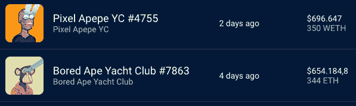

# 像素阿佩佩 YC，无聊的猿和加密朋克-NFT 销售亮点

> 原文：<https://web.archive.org/web/https://dappradar.com/blog/pixel-apepe-yc-bored-apes-and-cryptopunks-nft-sales-highlights>

## 查看 8 月 8 日至 8 月 14 日之间的 NFT 销售亮点排名

本周 NFT 的销售亮点是一个像素 Apepe YC #4755 和几个来自[crypto 朋克](https://web.archive.org/web/20220926000050/https://dappradar.com/hub/nft-explorer/collection/cryptopunks)和 [BAYC](https://web.archive.org/web/20220926000050/https://dappradar.com/hub/nft-explorer/collection/bored-ape-yacht-club) 系列的 NFT。和前一周一样，CryptoPunks 和 Bored Ape 游艇俱乐部 NFTs 主导了销量。

在过去的七天里，NFT 拍卖的最高价值是 Pixel Apepe YC #4755，成交价为 350 WETH，约合 696.647 美元。进一步打开它的主人的钱包，发现了一件 NFT 收藏，估计价值 153 万美元。

其次，售价为 344 ETH，约合 654.184 美元的《无聊猿游艇俱乐部#7863》，其中有一只黑毛无聊猿，长着一双亮眼，穿着皮条客外套。失主的钱包展示了一个 NFT 的收藏，估计价值 142 万美元，主要是白鲸、无聊的猿类化学物质，以及其他非功能性动物的其他行为。

一批神秘朋克和无聊猿游艇俱乐部收藏品正在易手。更有意思的是， [CryptoPunks](https://web.archive.org/web/20220926000050/https://dappradar.com/ethereum/collectibles/cryptopunks) 的底价涨幅超过 14%，而 [BAYC 在过去七天里上涨了 16%](https://web.archive.org/web/20220926000050/https://dappradar.com/hub/nft-explorer/collection/bored-ape-yacht-club) ，CryptoPunks 和 Bored Ape 游艇俱乐部的平均价格分别上涨了 17%和 25 %。

[*Pixel Apepe 和 Bored Ape 游艇俱乐部位居前两位*](https://web.archive.org/web/20220926000050/https://dappradar.com/hub/nft-explorer/sales-activity?period=week&order-by=priceInFiat&search=SUREAL)

这篇文章是使用 [NFT 收藏浏览器](https://web.archive.org/web/20220926000050/https://www.youtube.com/watch?v=fkEaXYLOW-s)制作的。这个工具使得查找、分析和购买 NFT 变得简单。从一个中心，DappRadar 用户可以使用最准确的市场数据来探索即将到来的和可用的 NFT，并采取行动。

## 分散的土地上真正的 Aethereian 邻居

除了更成熟的 [BAYC 和 CryptoPunk collection 销售](https://web.archive.org/web/20220926000050/https://dappradar.com/nft/sales)之外，NFT 的各种销售亮点都值得一探究竟。也许 T2 的邻居分散 NFT 的土地拍卖是最有趣的。

自 7 月 18 日以来，分散土地的销售已经上升，占沙盒和分散土地所有销售的 37.1%。据[沙丘](https://web.archive.org/web/20220926000050/https://dune.com/home)报道，人气[元宇宙](https://web.archive.org/web/20220926000050/https://dappradar.com/blog/what-is-the-metaverse)已经积累了大约。虚拟房地产销售额为 444，540，170 美元，仅次于宇迦实验室的 Otherside，排名第一，约为。$815,204,820.

### **查看以下 NFT 销售亮点的完整列表:**

*   –[Pixel Apepe YC**# 4755**350 WETH/696.647 $–](https://web.archive.org/web/20220926000050/https://dappradar.com/hub/assets/eth/0x91c8b5c50a35e461dc7d7ffbc301c365b83f01f8/4755)[买家钱包](https://web.archive.org/web/20220926000050/https://dappradar.com/hub/wallet/0xcf75bd79bc19c41f83a7c35eb276d830064ae85f)
*   –[无聊猿游艇俱乐部**# 7863**](https://web.archive.org/web/20220926000050/https://dappradar.com/hub/assets/eth/0xbc4ca0eda7647a8ab7c2061c2e118a18a936f13d/7863)**344 ETH/654.164 $–[买家钱包](https://web.archive.org/web/20220926000050/https://dappradar.com/hub/wallet/0x019ffbf2cbeec4b6fc8934498f3fc12072fed360)**
*   **–[密码朋克**# 9400**](https://web.archive.org/web/20220926000050/https://dappradar.com/hub/assets/eth/0xb47e3cd837ddf8e4c57f05d70ab865de6e193bbb/9400)**300 ETH/591.999 $–[买家钱包](https://web.archive.org/web/20220926000050/https://dappradar.com/hub/wallet/0x1ec6b58eb53291c05d4979f2d5f180f6ec04854b)****
*   ****–[密码朋克**# 8576**](https://web.archive.org/web/20220926000050/https://dappradar.com/hub/assets/eth/0xb47e3cd837ddf8e4c57f05d70ab865de6e193bbb/8576)199 ETH/339.341 $–[买家钱包](https://web.archive.org/web/20220926000050/https://dappradar.com/hub/wallet/0x10bfa7524cbc676895434995a5c0ae7215453758)****
*   ****–[隐朋克**# 8374**165 ETH/322.000 美元——](https://web.archive.org/web/20220926000050/https://dappradar.com/hub/assets/eth/0xb47e3cd837ddf8e4c57f05d70ab865de6e193bbb/8374)[买家钱包](https://web.archive.org/web/20220926000050/https://dappradar.com/hub/wallet/0x1ec6b58eb53291c05d4979f2d5f180f6ec04854b)****
*   ****–[隐朋克**# 1703**](https://web.archive.org/web/20220926000050/https://dappradar.com/hub/assets/eth/0xb47e3cd837ddf8e4c57f05d70ab865de6e193bbb/1703)**165 ETH/312.988 $–[买家钱包](https://web.archive.org/web/20220926000050/https://dappradar.com/hub/wallet/0xec0f63b46049f65440a7477af0f73534ec2269f7)******
*   ******–[隐朋克**# 608**165 ETH/312.000 $–](https://web.archive.org/web/20220926000050/https://dappradar.com/hub/assets/eth/0xb47e3cd837ddf8e4c57f05d70ab865de6e193bbb/608)[买家钱包](https://web.archive.org/web/20220926000050/https://dappradar.com/hub/nft-explorer/sales-activity?period=week&order-by=priceInFiat&search=SUREAL#:~:text=0x538...66bc-,0x242...57d1,-9)******
*   ****–[无聊猿游艇俱乐部**# 1833**150 ETH/289.156 $–](https://web.archive.org/web/20220926000050/https://dappradar.com/hub/assets/eth/0xbc4ca0eda7647a8ab7c2061c2e118a18a936f13d/1833)[买家钱包](https://web.archive.org/web/20220926000050/https://dappradar.com/hub/wallet/0xdf8c6f93385fb3fa8dde90ce1c0f9c2f8cd5a9f3)****
*   ****–[SUREAL Aetherian Neighbors**# 940**](https://web.archive.org/web/20220926000050/https://dappradar.com/hub/assets/eth/0x959e104e1a4db6317fa58f8295f586e1a978c297/940)189k MANA/207.900 美元——[买家钱包](https://web.archive.org/web/20220926000050/https://dappradar.com/hub/wallet/0x926001c10e691d69b2c6be5f6190bc0d24ed6296)****

 ****## **尽管熊市，NFT 仍在扩张**

作为熊市趋势的结果，许多用户已经决定清算他们在 T2 NFT 市场的投资，直到这只野熊最终被驯服。

以美元衡量的交易量显示市场正在收缩，环比下降 25%。此外，自 2021 年 7 月以来，交易者的数量比上月减少了 8%,但仍增加了 40%。

然而，期待已久的以太坊合并可能会给加密社区带来一些热情，这可能会积极影响 NFT 市场。

此外，NFT 市场的格局正在随着新的进入者而扩大。例如， [Gamestop NFT 市场](https://web.archive.org/web/20220926000050/https://nft.gamestop.com/)， [Nickelodeon 的 NFT 市场](https://web.archive.org/web/20220926000050/https://nickelodeon.xyz/marketplace/)，Uniswap 收购[Genie](https://web.archive.org/web/20220926000050/https://www.genie.xyz/)——第一家 NFT 市场聚合商，将 DeFi 与 NFTs 结合，最有趣的是，[采用 NFTs 的社交媒体平台](https://web.archive.org/web/20220926000050/https://dappradar.com/blog/social-media-platforms-are-jumping-into-web3)。

阅读我们 2022 年 7 月的[区块链行业报告](https://web.archive.org/web/20220926000050/https://dappradar.com/blog/dappradar-blockchain-industry-report-july-2022)以获得对 NFT 市场现状的更清晰的描述和分析。

随着像 [BAYC](https://web.archive.org/web/20220926000050/https://dappradar.com/hub/nft-explorer/collection/bored-ape-yacht-club) 、[crypto 朋克](https://web.archive.org/web/20220926000050/https://dappradar.com/hub/nft-explorer/collection/cryptopunks)和 [CloneX](https://web.archive.org/web/20220926000050/https://dappradar.com/hub/nft-explorer/collection/clonex) 这样的化身蓝筹 NFT 集合的爆发，我们只能想象社交媒体能够为 web3 解锁的巨大价值。

要了解更多关于 NFTs 和密码行业的见解，请点击查看我们对 Lunar Strategy 首席执行官 Tim Haldorsson 的最新采访。

 NewsletterUnsubscribe at any time. [T&Cs](https://web.archive.org/web/20220926000050/https://dappradar.com/terms) and [Privacy Policy](https://web.archive.org/web/20220926000050/https://dappradar.com/privacy-policy)****