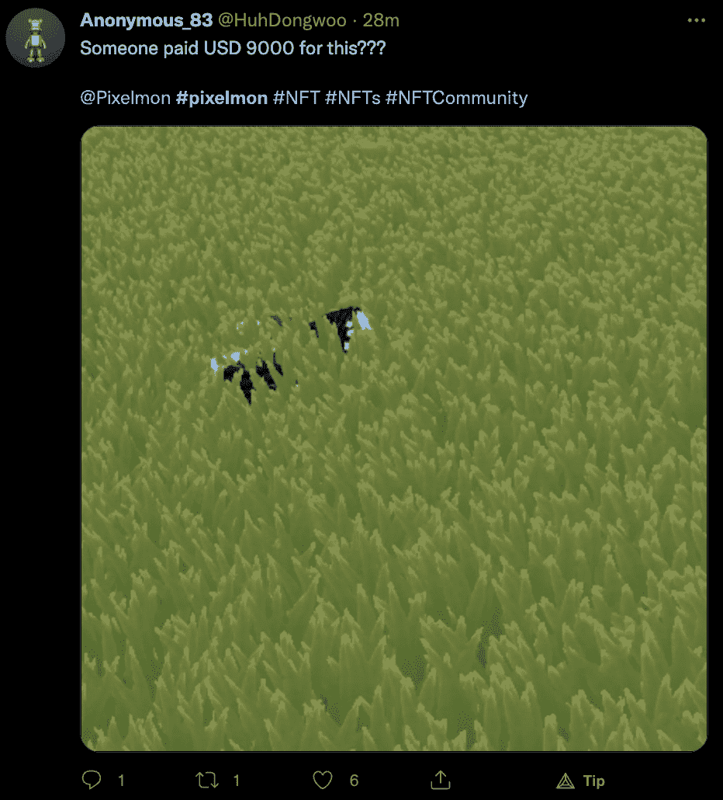
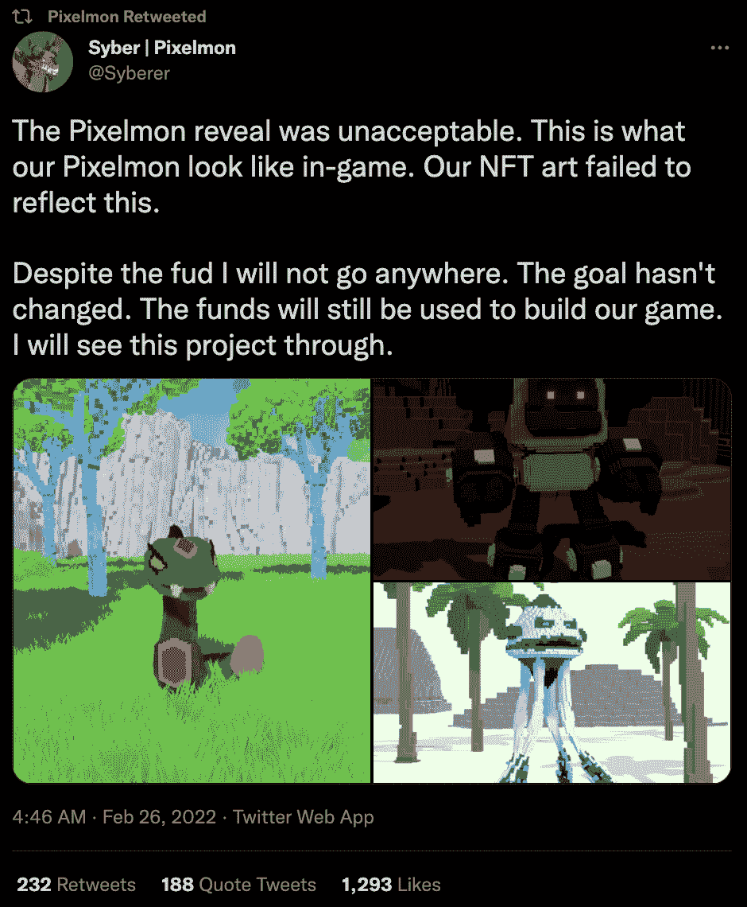

# Pixelmon 收藏家在 Reveal 后用通用图形作弊

> 原文：<https://web.archive.org/web/https://dappradar.com/blog/pixelmon-collectors-cheated-with-generic-graphics-after-reveal>

## Pixelmon NFT 的造币价格从 3 ETH 开始

那些在受神奇宝贝启发的 NFT 游戏《Pixelmon》上投入了 3 ETH 或超过 1 万美元的人现在感觉被骗了。NFT 发布会在周末举行，向投资者展示了设计糟糕的 Pixelmon NFTs。

Pixelmon 在最近几天产生了很多兴趣和活动，继售罄的铸造活动和后期展示活动之后。然而，NFT 的揭露刺激了社区揭开了围绕 Pixelmon 项目的一大堆红旗。据称，该团队使用库存图片和自由设计师来创建模型。

皮克斯蒙·NFT 系列于 2 月 7 日推出，创造了令人印象深刻的 7000 万美元的铸币销售额。根据官方网站，预售旨在帮助资助游戏开发过程，因为 [Pixelmon](https://web.archive.org/web/20221127162601/https://dappradar.com/ethereum/collectibles/pixelmon) 宇宙仍未公开。在荷兰拍卖期间，收藏家有机会铸造一个人物 NFT，起拍价为 3 ETH。价格每十分钟下降 0.1 ETH，因为该团队在活动期间共售出 7，750 个 Pixelmon NFTs。

铸造活动是一个不可否认的成功。然而，当设计的展示被推迟几次后，危险信号开始出现。根据 Pixelmon 创作者 Syberer 的官方声明，为了向收藏家提供最好的艺术品，这一迟来的展示是必要的。不幸的是，收藏家们收到的东西甚至与最初承诺的和预览中透露的相差甚远。

## Pixelmon 揭示了什么？

备受期待的揭晓终于在 2 月 25 日发生了。然而，一旦收藏家们看到他们的设计，他们会感到困惑。Pixelmon 承诺了一个设计完美的身临其境的 3D 环境。你可以在下面看到一些预览照片。

Source: [OKHotshot.eth](https://web.archive.org/web/20221127162601/https://twitter.com/NFTherder/status/1497969911058026497/photo/1)

不幸的是，收藏家们得到的甚至与 [Syberer](https://web.archive.org/web/20221127162601/https://twitter.com/Syberer) 分享的最初设计预览都不接近。很明显，Syberer 并没有为 2 月 17 日的首次发布做好设计准备。

更重要的是，创作者购买了股票 Unity 设计模型，并简单地将其转换为体素资产。重要的是，库存设计的购买价格约为每套 160 美元，比 3 ETH 的起拍价低了数百倍。

更糟糕的是，许多设计在体素转换过程中被破坏，导致了非常奇怪的 NFT。看看下面的图片，更好地了解最终的结果对收藏家来说是多么令人失望。

Source: [Anonymous_83](https://web.archive.org/web/20221127162601/https://twitter.com/HuhDongwoo/status/1498317439133757441)

## 7000 万美元怎么了？

除了对 NFT 的设计有明显的疑虑之外，在造币厂生产的 7000 万美元的使用上也有一些可疑的决定。展示结束后，Syberer 发布了一份声明，承诺从财政部支出约 200 万美元，以完成图形工作并使设计更好。

但是，在以太网扫描交易历史中查找 Pixelmon treasury 地址，没有这样的交易。相反，据 NFT 社区的一些成员说，来自财政部的资金被用来从诸如 BAYC、志那都红豆和 CloneX 等热门收藏中购买大量的 NFT。

此外，对 Pixelmon 合约的交易历史进行更深入的调查显示，约 400 个 ETH 从财政部流向 Uniswap，进行价值 1339420 美元的 USDC 掉期交易。目前，还没有任何关于 NFT 设计或其最终返工的公告。

## Pixelmon 创始人也受到攻击

除了 Pixelmon reveal 这种不光彩的做法，OKHotshot.eth 还决定挖掘这位创始人的背景。Syberer 是 Pixelmon 创始人团队的唯一成员。虽然后来他雇佣了几个人来帮助设计 NFTs，但是 Syberer 是推动这个项目和制定治理决策的唯一力量。

虽然如果项目成功，这可能是一个令人钦佩的壮举，但它也提出了一个问题，即这个人是否只是试图欺骗人们。不幸的是，NFT 社区发现了一些关于 Syberer 以前的商业冒险的细节，这似乎指向第二个。根据研究，Syberer 曾经是一个活跃的 Kickstarter 商人。

他发起了无数次运动，这些运动都得到了资助。不幸的是，他们不得不在最终产品发布给客户之前奇迹般地关闭。这并不意味着有罪，然而，这样的背景无助于建立 Pixelmon 收藏的可信度。

## 下一步是什么？

Pixelmon 是一个被大肆宣传的项目，很快就销售一空。即将到来的游戏引起了 NFT 爱好者和区块链玩家的关注。然而，最近披露的这些情况和设计问题对该项目的整体有效性提出了质疑。

sy berer[宣布](https://web.archive.org/web/20221127162601/https://twitter.com/Syberer/status/1497402570478075907)尽管失败了，Pixelmon NFTs 的设计在未来会看起来更好。此外，在 NFT 造币厂期间产生的资金仍将用于创建一个区块链游戏。

看看 Pixelmon 将何去何从绝对是值得的。请继续关注 DappRadar，在 Twitter 上关注 Pixelmon 传奇和所有相关新闻。此外，您可以查看 [DappRadar PRO](https://web.archive.org/web/20221127162601/https://dappradar.com/token/pro) ，获取最新的 NFT 连锁销售数据。

 NewsletterUnsubscribe at any time. [T&Cs](https://web.archive.org/web/20221127162601/https://dappradar.com/terms) and [Privacy Policy](https://web.archive.org/web/20221127162601/https://dappradar.com/privacy-policy)