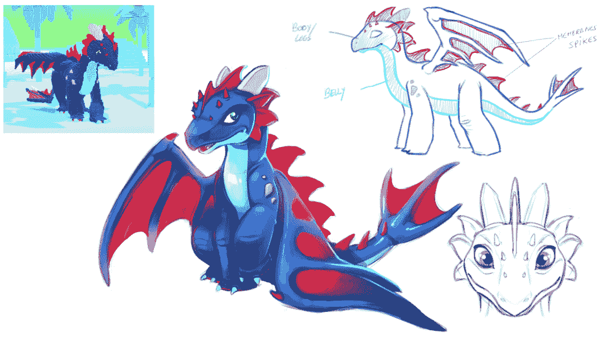
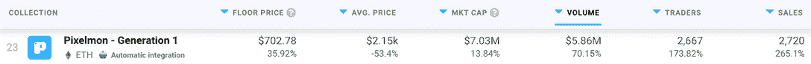
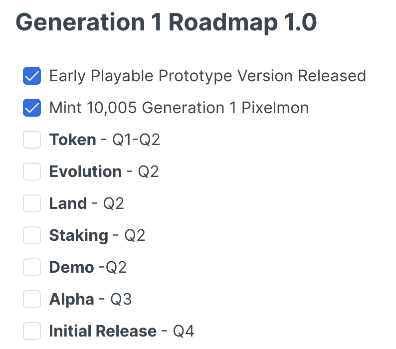

# 皮克斯蒙:从梦想到创造数百万的迷因

> 原文：<https://web.archive.org/web/https://dappradar.com/blog/pixelmon-from-a-dream-to-memes-generating-millions>

## 这件有争议的收藏品在过去的七天里获得了超过 580 万美元的交易量

[**皮克斯蒙**](https://web.archive.org/web/20220924154326/https://dappradar.com/ethereum/collectibles/pixelmon) **是 2022 年最有争议的 NFT 收藏之一。然而，它在 NFT 收藏排行榜** [**上的排名仍然很高。为什么这些令人失望的游戏角色交易量高达数百万？这个项目将走向何方？请继续阅读，了解臭名昭著的 Pixelmon 项目在令人失望的 NFT 坠落事件后的几周内发生了什么。**](https://web.archive.org/web/20220924154326/https://dappradar.com/nft)

Pixelmon 是 2022 年初最热门的游戏和 NFT 项目之一。这款受口袋妖怪启发的游戏今年早些时候放弃了第 1 代 NFT 系列。艺术设计展在二月底举行。

不幸的是，这次展示与其说是一次成功的活动，不如说是一次迷因节。你可以在这篇 DappRadar 报道中读到所有令人失望的作品。出于说明的目的，这里有一个更臭名昭著的设计，它现在已经变成了一个自己的迷因:

Source: [MoonCat2878](https://web.archive.org/web/20220924154326/https://twitter.com/mooncat2878)

## 为什么收藏家还在投资 Pixelmon？

乍一看，似乎虎头蛇尾的 design reveal 要将 Pixelmon 项目完全夷为平地。然而，crypto Twitter 开始拿这些令人失望的设计取乐，让 Pixelmon 的传言继续下去。

与此同时，这款游戏背后的领军人物赛伯(Syber)努力想办法让皮克斯蒙起死回生。创建者正忙于将路线图更新和计划推送到 Pixelmon Discord 服务器。最重要的是，他专注于揭示一些在 Twitter 上被提出的关于财政部支出的问题。

Syber 和 Pixelmon 社区目前最重要的目标之一是彻底重新设计该系列。3 月 21 日，Syber 在 common chat on Discord 上发布了这个重新设计的概念:

Source: [Pixelmon Discord](https://web.archive.org/web/20220924154326/https://discord.com/channels/913918658563149924/913918659167154216/955688213635301376)

似乎这些概念草图在不幸的初步展示后，已经恢复了一些宣传和对项目的信心。因此，交易商希望在价格较低时参与该项目。

## 交易量直线上升

当收藏下降，产生超过 7000 万美元的铸造量，一个 NFT 成本高达 3 ETH，或约 10，000 美元。在撰写本文时，Pixelmon NFT 的底价约为 702 美元。一个相当低的切入点和一个完全重新设计的承诺似乎推动了该项目的活动。

根据 DappRadar 的数据，Pixelmon 第 1 代收藏在过去七天的活动中出现了显著的增长。楼面价涨幅超过 35%，而销售数量暴涨 265%。

最令人印象深刻的是，该系列在过去一周产生了超过 580 万美元的交易量。这是相当大的成就，Pixelmon 在 DappRadar 上追踪的所有[顶级 NFT 系列](https://web.archive.org/web/20220924154326/https://dappradar.com/nft/collections/2)中排名第 23 位。

## Pixelmon 的下一步是什么？

根据该项目的官方路线图，Pixelmon 粉丝应该期待的下一件大事是令牌发布。计划在 2022 年夏天达到这一里程碑。然而，考虑到麻烦的开始，团队可能无法满足这一期限。

目前，Syber 正在组建一个执行团队，帮助他管理和治理 Pixelmon 项目。根据 3 月 11 日发布的[不和谐公告](https://web.archive.org/web/20220924154326/https://discord.com/channels/913918658563149924/916902537045614622/951731602365493259)，该团队现在正致力于建立一个坚实而富有经验的董事会，以填补如此规模的项目所需的关键运营角色(如首席执行官、首席财务官、首席运营官等)。

据推测，当这个团队成立时，Pixelmon 路线图的工作将按预期继续进行。社区正在急切地等待 Pixelmon 令牌的掉落和真实的游戏元素的出现。目前，还不清楚这款游戏是否会在 2022 年推出试玩版或 alpha 版。

DappRadar 将继续监督 Pixelmon 项目，因为它努力离开不幸的 NFT 设计揭示在过去。最近几周交易活动的激增可以被解读为一个积极的信号，但对于许多早期投资者来说，苦涩的味道仍然存在。如果你想密切关注 Pixelmon 的发展，请查看官方 dapp 页面。此外，你可以在[的 Twitter](https://web.archive.org/web/20220924154326/https://twitter.com/dappradar) 上关注 DappRadar，首先获得最新的 NFT 和区块链博彩新闻。

 NewsletterUnsubscribe at any time. [T&Cs](https://web.archive.org/web/20220924154326/https://dappradar.com/terms) and [Privacy Policy](https://web.archive.org/web/20220924154326/https://dappradar.com/privacy-policy)