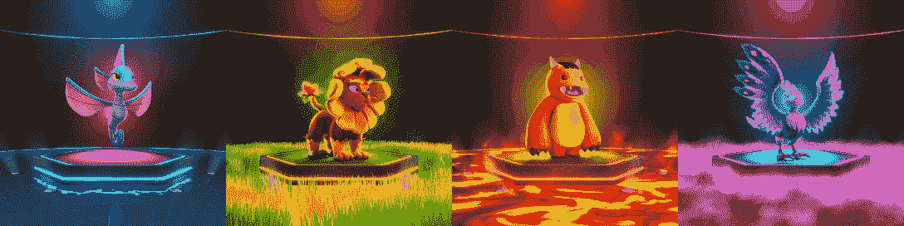
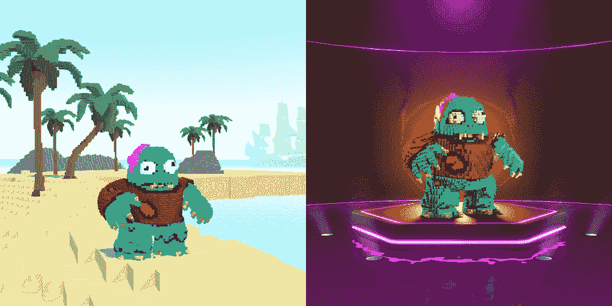

# Pixelmon 回归:凭借高质量的 NFT 艺术品，周销量增长 368%

> 原文：<https://web.archive.org/web/https://dappradar.com/blog/pixelmon-returns-weekly-volume-rises-368-with-quality-nft-artwork>

## 数字很乐观，但 Pixelmon 能挽回声誉吗？还有，凯文怎么了？

在经历了一段丑闻之后，Pixelmon NFTs 重返赛场。现在有了一个全新的面貌，受口袋妖怪启发的游戏化元宇宙拒绝只为它的凯文·梅梅而被设定在历史中。本周关于 DappRadar 的数据显示，公众对该项目的兴趣有所恢复和增加。Pixelmon 回归的背后是什么？让我们深入了解一下。

## 突出

*   Pixelmon 是一款将于 2023 年发布的 RPG 区块链游戏，训练者在元宇宙的虚拟世界中探索并与 NFT 生物战斗。
*   有争议的 NFT 收藏在二月的早期拍卖中在 NFT 排行榜上名列前茅，但当揭露艺术品远不如广告宣传时，引起了混乱和笑声。
*   在过去的七天里，Pixelmon 的 [NFT 收藏量上涨了 368%](https://web.archive.org/web/20230104072523/https://dappradar.com/hub/nft-explorer/collection/pixelmongen1) ，底价达到了 0.645 ETH。这个社区已经忘记这件丑闻了吗？

## 新 NFT 艺术终于兑现了承诺

DappRadar 数据指出，Pixelmon 第 1 代 NFTs 在过去一周的活动中出现了增长。在顶级收藏品排名中达到第 14 位，销售数量暴涨 285.44%。

经历了艰难的一年后，Pixelmon 承诺不仅仅是一个迷因项目。新的负责团队最终为社区带来了他们承诺的艺术品，充分利用了早期 NFTs 销售中筹集的 7000 万美元。

[<picture></picture>](https://web.archive.org/web/20230104072523/https://dappradar.com/hub/nft-explorer/collection/pixelmongen1)

Water, Earth, Fire, and Air Pixelmons | Source: Pixelmon

幸运的是，最初的团队很有信心，并且已经将从 NFT 销售中筹集的资金重新投资到这个项目中。

[Explore Pixelmon Generation 1 NFT Collection](https://web.archive.org/web/20230104072523/https://dappradar.com/hub/nft-explorer/collection/pixelmongen1)

### 凯文呢，这个名垂千古的 NFT 迷因？

在所有这些炒作、期望和彻底失败的历史中，Pixelmon 正在从灰烬中重生。但是当然，如果说这个系列中有一件好事让社区对令人沮丧的原创设计感到愤怒，那就是凯文。

整个 NFT 社区在这个漫画人物身上看到了一些*“糟糕到几乎看起来不错”的东西，凯文在没有提出可行的理由的情况下就卖出了数千美元的 NFTs 历史上留下了印记。*

但是不要害怕，迷因爱好者们，Pixelmon 听到了人们的声音，Kevin 的设计保持了它本来的样子。

[<picture></picture>](https://web.archive.org/web/20230104072523/https://dappradar.com/hub/nft-explorer/collection/pixelmongen1/sales-activity)

Kevin: before and after | Source: Pixelmon

毫不奇怪，凯文 NFT 是整个系列中最昂贵的销售之一。

在撰写本文时，凯文物种的 Pixelmon 生物的市场底价为 3.25 ETH(4310.60 美元)。

远高于整个系列底价的平均 0.645 ETH(856.68 美元)。

[Track Pixelmon NFT Sales](https://web.archive.org/web/20230104072523/https://dappradar.com/hub/nft-explorer/collection/pixelmongen1/sales-activity)

## Pixelmon 复出的背后是什么

好数字不是随机的。Pixelmon 花了一年时间来重建其声誉，因为其最初的创作者寻求专业指导来领导这个被大肆宣传的项目。

在接受来自新西兰的 1news 采访时，Pixelmon 的新任首席执行官 Giulio Xiloyannis 谈到了该项目不断增长的团队，并预测了由 Hamilton man Martin van Blerk 创建的游戏的光明未来。

从用完全不同的设计翻拍和再版整个 NFT 系列开始。

Pixelmon 现在拥有一个 45 人的团队，在游戏和 NFT 行业有着坚实的背景。它的官方 Twitter 账户也不断更新它的社区，包括 3D 动画设计、产品更新以及其他一切。

> 随着我们继续测试各种环境风格，这里是一个以我们自己的博格人为特色的战斗竞技场的早期视图👀请在评论中告诉我们你的想法👇pic.twitter.com/O4HWlAgiXW
> 
> — Pixelmon (@Pixelmon) [September 23, 2022](https://web.archive.org/web/20230104072523/https://twitter.com/Pixelmon/status/1573341423390183424?ref_src=twsrc%5Etfw)

在过去的几个月里，游戏性和游戏概念也得到了改进，同样的，游戏文档更加深入，并且已经回答了更大的问题。

所有这些新闻似乎都指出，Pixelmon 并没有成为过去，但它可能真的有真正的价值。

这款游戏的 Alpha 版本计划于 2023 年 1 月发布，在此之前，DappRadar 将为您提供这个项目的最新信息，这个项目已经有太多值得谈论的内容。

## 用 DappRadar 继续追踪 NFT 的比赛

如果你对 Pixelmon 等次世代游戏感兴趣，你需要发现 [**DappRadar 游戏排名**](https://web.archive.org/web/20230104072523/https://dappradar.com/topic/games) 。我们相信区块链是游戏的未来，因此，我们致力于关注这个令人兴奋的行业中的项目如何发展。

此外，DappRadar 还能帮助你 [**管理你在 NFT 的投资组合**](https://web.archive.org/web/20230104072523/https://dappradar.com/hub/wallet/eth/) ，以及 [**追踪区块链各地最热门的 NFTs**](https://web.archive.org/web/20230104072523/https://dappradar.com/nft) 销售、收藏和市场。

[https://web.archive.org/web/20230104072523if_/https://www.youtube.com/embed/fkEaXYLOW-s?feature=oembed](https://web.archive.org/web/20230104072523if_/https://www.youtube.com/embed/fkEaXYLOW-s?feature=oembed)

[Explore Top Ethereum NFT Collections](https://web.archive.org/web/20230104072523/https://dappradar.com/hub/nft-explorer)

如果你想成为引领 Web3 的社区中的一员，请务必在 [Twitter](https://web.archive.org/web/20230104072523/https://twitter.com/DappRadar) 上关注我们，了解更多趋势，并加入我们的 [Discord](https://web.archive.org/web/20230104072523/https://discord.com/invite/4ybbssrHkm) 服务器。

### 有用的链接

*   [用达普拉达 NFT 探索者追踪 Pixelmon 第 1 代 NFT 系列](https://web.archive.org/web/20230104072523/https://dappradar.com/hub/nft-explorer/collection/pixelmongen1)
*   [Pixelmon:从梦想到产生数百万迷因的迷因](https://web.archive.org/web/20230104072523/https://dappradar.com/blog/pixelmon-from-a-dream-to-memes-generating-millions)
*   [Pixelmon 收藏家揭露后用通用图形作弊](https://web.archive.org/web/20230104072523/https://dappradar.com/blog/pixelmon-collectors-cheated-with-generic-graphics-after-reveal)
*   [概述&DappRadar 上区块链游戏的最新消息](https://web.archive.org/web/20230104072523/https://dappradar.com/topic/games)

***以上不构成投资建议。此处给出的信息仅供参考。请尽职调查并自行研究。***

 NewsletterUnsubscribe at any time. [T&Cs](https://web.archive.org/web/20230104072523/https://dappradar.com/terms) and [Privacy Policy](https://web.archive.org/web/20230104072523/https://dappradar.com/privacy-policy)