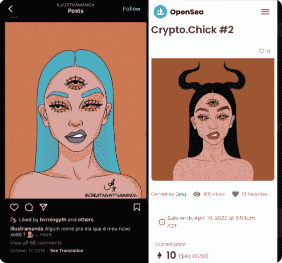

# 剽窃丑闻震撼 Crytpo。小鸡社区

> 原文：<https://web.archive.org/web/https://dappradar.com/blog/plagiarism-scandal-rocks-crytpo-chicks-community>

## 对抄袭图片的指控在 NFT 空间引发了关于抄袭的激烈在线辩论

**丑闻震惊了** [**的 Crypto。小鸡**](https://web.archive.org/web/20220929044239/https://dappradar.com/ethereum/collectibles/crypto-chicks) **社区周末随着互联网指责被称为波利的艺术家剽窃。随着人们翻出关于所有权、透明度和价值的古老争论，这场辩论变得越来越激烈。**

当童年的记忆浮现在即将到来的斥责面前时，我的胃因同情而紧缩。“我们的第一步是波莉一醒来就收到她的消息，因为俄罗斯现在是早上 6 点。”可怜的波利。她天真无邪地睡着了，没有意识到她的周末即将到来。

这个故事很简单:一位年轻的创作者/企业家/艺术家复制了另一位艺术家的作品，并试图将其作为自己的作品来获取物质利益。正如你在下面看到的，左边的画是巴西艺术家阿曼达画的。右边的图像是波利的。

Amanda’s (L) original and Polly’s newer version

密码。小鸡#2 最初在 2021 年 7 月 16 日以 0.04 ETH 的价格出售。随着这个项目越来越受欢迎，NFT 在今年 1 月以 10 ETH(25，696 美元)的价格被转卖。两天前，在丑闻期间，NFT 再次被转卖，这次是亏本，4 ETH(11058 美元)。新主人以 500 ETH(1，360，030 美元)的价格在 OpenSea 上重新刊登了这件物品。如果它以那个价格出售，毫无疑问，它证明了所有的宣传都是好的宣传。

## 抚平裂缝

应该注意的是，Polly [发布了一份声明](https://web.archive.org/web/20220929044239/https://twitter.com/MsPolly11/status/1494918596216168451/photo/1)，声称“她与 Amanda 或其他任何创作出如此原创作品的艺术家都不熟悉。”但这两部作品之间的相似之处无疑是惊人的，波莉已经被正式解除了她在《秘密小鸡》中的职责

全女性的 NFT 集体也发布了她们自己的信息，谴责剽窃，重申她们“诚实和正直的价值观”。声明还向收藏家、投资者和“品牌合作伙伴”保证，尽管道路上出现了不幸的坎坷，但这个 NFT 项目还有一条“前进的道路”。

## 新的 NFT 项目提出了围绕艺术品所有权的古老问题

令人担忧的是。小妞们，这不是第一次有人提出与这张图片相关的剽窃问题了。2021 年 11 月 3 日，有人在推特上[注意到](https://web.archive.org/web/20220929044239/https://twitter.com/HypertonicKitty/status/1456004133459169283/photo/1)波莉的三只眼女孩和阿曼达之前的女孩有相似之处。必须要问为什么要加密。小鸡管理当时没有处理这个问题。

虽然这一特殊事件似乎是一个老生常谈的抄袭例子，但它确实引发了一场围绕区块链艺术品所有权问题的有趣讨论。作为一项法律相对较少的前沿技术，市场力量和群众压力是我们用来控制人们行为的两个最有效的工具。没有什么比一场道德正义的推特群殴更能决定 NFT 收藏的命运了。

自艺术成为商业企业以来，归属、所有权和原创性就一直是激烈争夺的战场。现在，随着涉及的金额越来越大，匿名既是福也是祸的数字世界将不得不面对这个问题。谁来管理这个空间？什么样的法律可以跨越国界？在哪里划分敬意和侵犯，暗示和偷窃呢？