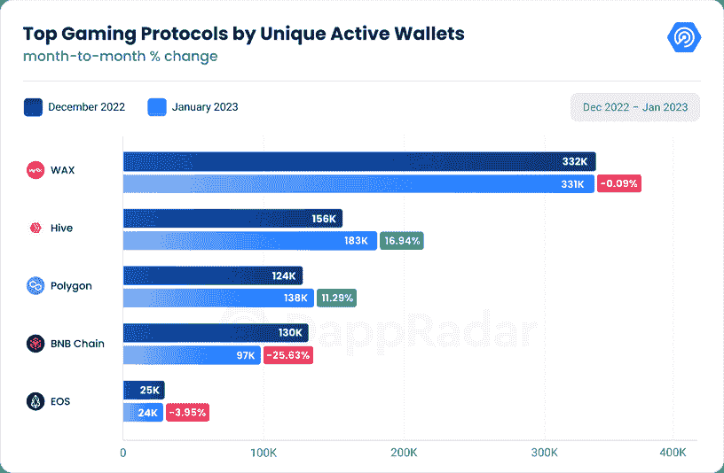
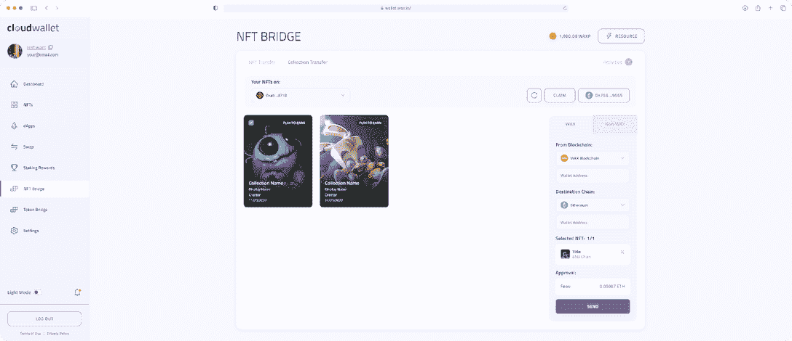
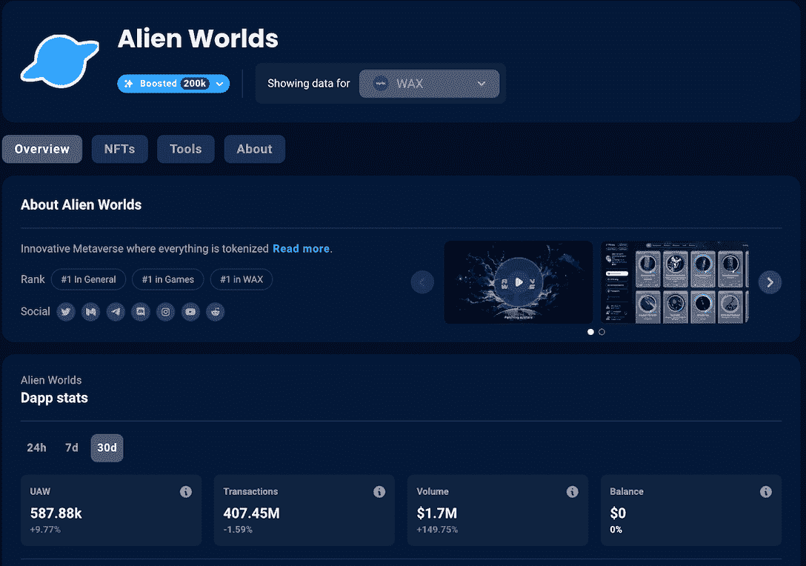
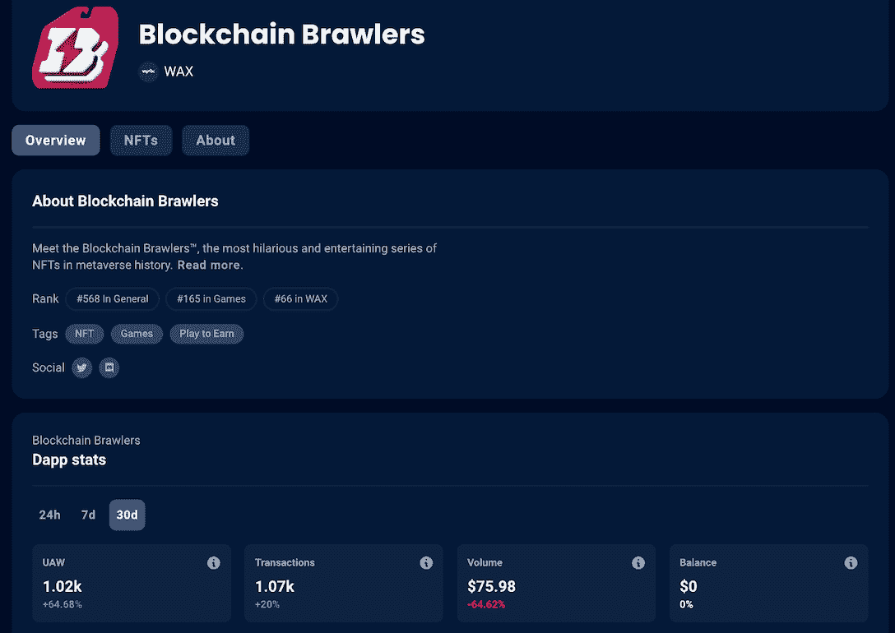
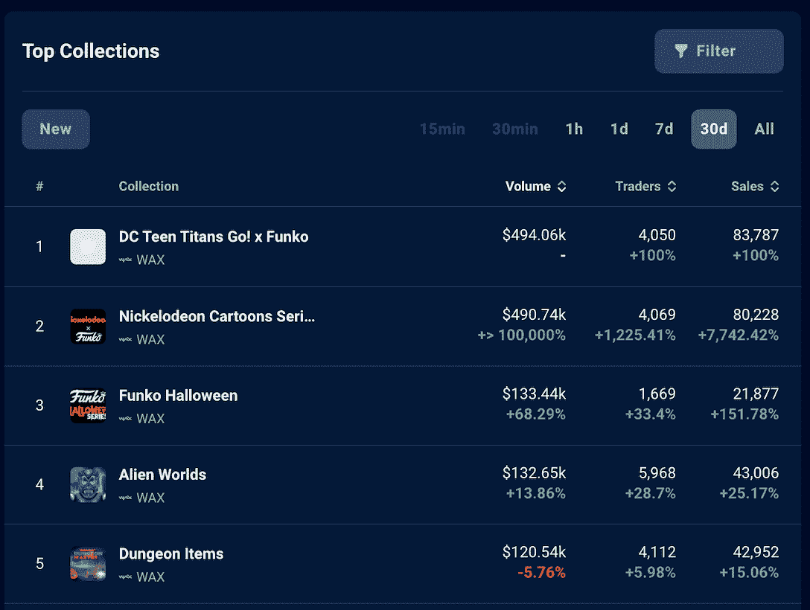

# 在 WAX 上玩区块链游戏，享受以太坊的流动性好处

> 原文：<https://web.archive.org/web/https://dappradar.com/blog/play-blockchain-games-on-wax-and-enjoy-the-liquidity-benefits-of-ethereum>

## WAX 上的内容创作者现在可以很容易地接触到其他区块链生态系统的观众

**WAX 区块链平台一直在努力提高互操作性，这将对 Web3 游戏行业产生重大影响。在本文中，我们将揭示 WAX 在提高互操作性方面的最新成就及其最新的生态系统性能。**

## 内容

*   [Wax 在 Web3 游戏中的统治地位](https://web.archive.org/web/20230307174922/https://dappradar.com/blog/play-blockchain-games-on-wax-and-enjoy-the-liquidity-benefits-of-ethereum/#wax)
*   [Wax 的 NFT 令牌桥延长流动性达到](https://web.archive.org/web/20230307174922/https://dappradar.com/blog/play-blockchain-games-on-wax-and-enjoy-the-liquidity-benefits-of-ethereum/#NFT)
*   [探索 Wax 充满活力的生态系统](https://web.archive.org/web/20230307174922/https://dappradar.com/blog/play-blockchain-games-on-wax-and-enjoy-the-liquidity-benefits-of-ethereum/#explore)
    *   [外星世界](https://web.archive.org/web/20230307174922/https://dappradar.com/blog/play-blockchain-games-on-wax-and-enjoy-the-liquidity-benefits-of-ethereum/#alien)
    *   [区块链格斗家](https://web.archive.org/web/20230307174922/https://dappradar.com/blog/play-blockchain-games-on-wax-and-enjoy-the-liquidity-benefits-of-ethereum/#bb)
    *   [品牌 NFT](https://web.archive.org/web/20230307174922/https://dappradar.com/blog/play-blockchain-games-on-wax-and-enjoy-the-liquidity-benefits-of-ethereum/#br)
*   [有用的链接](https://web.archive.org/web/20230307174922/https://dappradar.com/blog/play-blockchain-games-on-wax-and-enjoy-the-liquidity-benefits-of-ethereum/#links)

## Wax 在 Web3 游戏中的主导地位

区块链游戏正在兴起，WAX 平台处于这一令人兴奋的新行业的最前沿。根据 DappRadar 1 月份的 BGA 报告，WAX 仍然是区块链游戏活动最多的网络，这要归功于 331，000 个每日唯一活动钱包(dUAW)。这些数字清楚地强调了该平台在游戏领域的受欢迎程度和主导地位。

[Read the full Report](https://web.archive.org/web/20230307174922/https://dappradar.com/blog/game-and-metaverse-tokens-rally-with-strong-on-chain-metrics)

WAX 努力将其用户体验提升到一个新的水平，为了实现这一目标，它已经推出了一系列专注于提高互操作性的计划。

[Learn more about Wax’s 2023 Roadmap](https://web.archive.org/web/20230307174922/https://medium.com/wax-io/wax-roadmap-2023-695a5cf73733)

从 2023 年 Q1 奥运会开始，WAX 将把 NFT 大桥整合到钱包中。这意味着用户将能够在 WAX 和 Ethereum 之间顺利地转移他们的 NFT。现在让我们深入了解这座 NFT 大桥的一些令人兴奋的特征。

## Wax 的 NFT 令牌桥扩展了流动性范围

NFT 令牌桥是区块链蜡像馆的新特色，将于下个月上线。该功能将为用户提供 WAX 生态系统之外的流动性，允许更大的灵活性和更广泛的采用 NFTs。

届时，用户将能够通过升级的 WAX Cloud Wallet 从 NFT 令牌桥中受益。

这种创新的双向桥梁使用户能够在 WAX 区块链和其他 EVM 兼容链之间转移他们的 NFT，扩大了流动性，并为 NFT 交易和 DeFi 协议开辟了新的机会。

例如，桥的引入使得用户可以很容易地将他们在蜡上铸造的 NFT 带到以太坊和 BNB 链。然后，用户可以参与 NFTFi 协议和 NFT 贷款，并使用他们的桥接 NFT 在二级市场上进行交易。

如前所述，WAX 生态系统拥有繁荣的游戏和 NFT 社区。如果您想知道哪些原生 NFT 也会吸引其他网络上的用户，请查看趋势项目以获得更好的理解。

## 探索 Wax 充满活力的生态系统

### 外星世界

外星世界是一个 NFT 元宇宙游戏。在这个游戏中，玩家在模拟经济中争夺稀缺资源，包括 NFT 和游戏内令牌。值得注意的是，这款游戏几乎一直坐在 DappRadar 游戏排行榜的首位。

在过去的 30 天里，《外星世界》经历了最近的人气飙升，其 UAW 增长了 9.77%。该游戏还记录了大量的交易，记录了超过 4.0745 亿。此外，销售额也大幅增长，超过 170 万美元，增长了 149.75%。

[Learn more about Alien Worlds](https://web.archive.org/web/20230307174922/https://dappradar.com/wax/games/alien-worlds)

### 区块链斗殴者

区块链格斗家是一个摔跤为主题的战斗游戏，有可玩的 NFT 角色。这些 NFT 有着夸张的服装和独特的个性，每一个都在游戏的游戏赚钱经济中扮演着至关重要的角色。

这款游戏正日益成为 NFT 收藏家和游戏玩家的热门选择。它的 UAW 和交易量都出现了 30 天的增长，前者增长了 65%，后者增长了 20%。

[Learn more about Blockchain Brawlers](https://web.archive.org/web/20230307174922/https://dappradar.com/wax/games/blockchain-brawlers/)

### 品牌 NFT

许多知名品牌都选择在 NFTs 上与 Wax 合作，包括 Funko，这家公司生产授权和限量的流行文化收藏品。Funko 的蜡制 NFT 也很受收藏者欢迎。他们经常在蜡像 NFT 排行榜上名列前茅。

在过去的 30 天里，Funko 的 Nickelodeon 卡通系列已经积累了超过 49 万美元的成交量。此外，它的万圣节系列仍然很受欢迎，交易额超过 133，000 美元。

[Explore the Wax NFT ranking](https://web.archive.org/web/20230307174922/https://dappradar.com/nft/protocol/wax)

这些令人印象深刻的数字只是充满活力的蜡生态系统的一小部分。它目前拥有超过 70 万的每日活跃用户，是许多区块链游戏的所在地。

### 有用的链接

*   [网站](https://web.archive.org/web/20230307174922/https://www.wax.io/)
*   [推特](https://web.archive.org/web/20230307174922/https://twitter.com/WAX_io)
*   [不和](https://web.archive.org/web/20230307174922/https://discord.com/invite/dJtPetMdfb)
*   [中等](https://web.archive.org/web/20230307174922/https://medium.com/@wax-io)

**免责声明** —这是一篇赞助文章。DappRadar 不认可本页面上的任何内容或产品。DappRadar 旨在提供准确的信息，但读者应该在采取行动之前总是自己做研究。DappRadar 的文章不能被认为是投资建议。