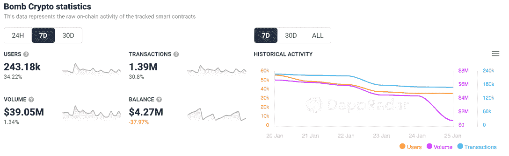
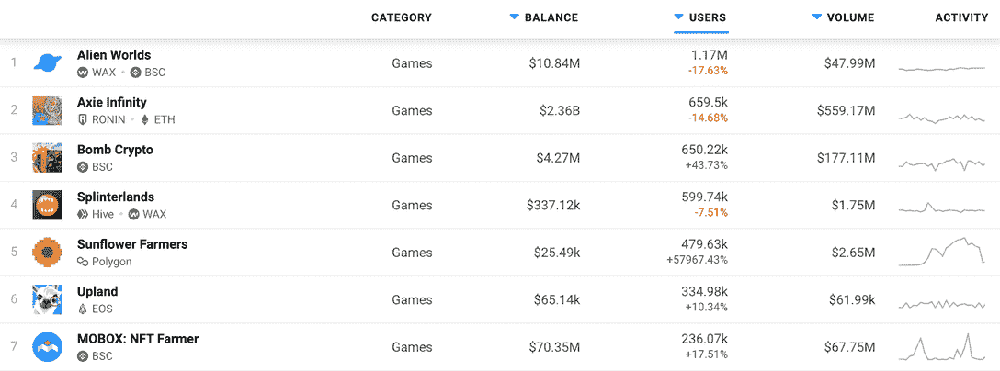
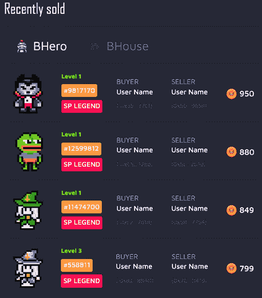
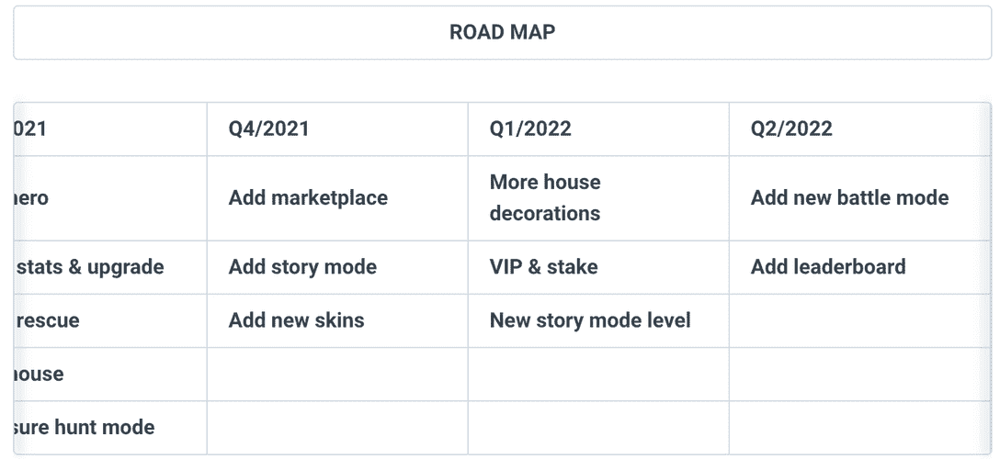

# 游戏赚取炸弹加密爆炸它的方式，以顶部的图表

> 原文：<https://web.archive.org/web/https://dappradar.com/blog/play-to-earn-bomb-crypto-blasts-its-way-to-top-of-the-charts>

## 游戏中的 NFT 市场上线

受炸弹人启发的游戏“炸弹加密”在过去的一周里有了惊人的增长。随着 NFT 市场平台的上线，近 25 万个钱包连接到币安智能链上的 NFT 注入战斗游戏，首次允许玩家交易游戏中的英雄和房屋 NFT。

[基于 BSC 的游戏](https://web.archive.org/web/20221207002252/https://dappradar.com/binance-smart-chain/games/bomb-crypto)已经吸引了超过 243，000 个不同的活动钱包到其平台，完成了超过 130 万次游戏内交易，产生了超过 3，900 万美元的交易量。这些交易中有许多是通过新推出的市场进行的。

此外，Bomb Crypto 在过去 30 天的表现使其稳稳地进入 DappRadar 上的前三名游戏。随着其市场推出刺激了活动，超越了像[夹板地、Mobox 和高地](https://web.archive.org/web/20221207002252/https://dappradar.com/rankings/category/games)这样的中坚力量。在过去的 30 天里，超过 650，000 个钱包连接到炸弹加密，这比 Axie Infinity 同期少了 9，000 个。

Games – Last 30 Days

## 复古魅力

这款游戏让人想起了 80 年代末和 90 年代在世嘉和任天堂游戏机上推出的经典炸弹人游戏。毫不奇怪，它引起了当今男性占多数的 30 岁以上的秘密观众的共鸣。有些人可能花了几个小时玩原来的游戏，从来没有赚到一分钱。

在《炸弹密码》中，玩家管理一群炸弹英雄，他们被编程来寻找炸弹和与怪物战斗。游戏中更多的 NFT 物品是炸弹客用来获取能量的房子。

开发团队来自越南，巧合的是，与 Sky Mavis、Axie Infinity 团队在世界的同一个地方。越南有使用固体设备的历史。再加上一群懂电脑、会说英语、需要在传统职业之外赚钱的人。在这个世界上的一个地方，他们可以通过玩游戏获得比一般工作更多的收入，所以毫不奇怪，游戏赚钱正在流行。

## 投资回报率

我们在 2021 年 10 月初首次强调炸弹加密是一款新游戏，展示了承诺，体面的路线图，最重要的是，吸引了用户。那时，感兴趣的玩家可以花大约 10 BCOIN，大约 4 美元买到一架轰炸机。

看看 1 月 20 日推出的游戏内市场，我们看到超级传奇轰炸机英雄，[目前唯一允许出售的类型](https://web.archive.org/web/20221207002252/https://bombcrypto.medium.com/bomb-crypto-marketplace-bbd8c1597c05)，售价最低 700 BCOIN，最高约 1000。今天，硬币的价格大约是 2.35 美元。制造一架价值 2000 美元的轰炸机。

## 路标

到目前为止，该项目一直严格遵循其路线图。社区中另一个令人兴奋的原因可能是 Q1 2022 中的赌注和新故事模式的到来。赌注将带来另一层游戏，允许代币持有者放弃他们已经持有的硬币，可能还有 NFT 物品。

## 从玩到赚的机会

2021 年不仅仅是 NFTs 年。基于区块链的游戏在途中被广泛采用，代表了当前行业使用的近一半。不同的区块链崛起为有能力举办全面运作的奥运会的替代者。整个行业的生态系统实现了在不影响速度的情况下消除高额交易费用的负担。像 Wax、Ronin、BSC、Immutable 和 Hive 这样的网络成为许多即玩即赚和 GameFi 选项的家园。

就在大约一年前，投资者和密码交易员在令牌和项目上对冲他们的赌注，有时几乎没有可行的产品或服务。路线图和白皮书是我们必须做的事情。如今，投资者可以跳进游戏化的投资平台，如 Bomb Crypto，衡量他们是否认为游戏会成功。最重要的是，使用 DappRadar 来[检查 dapp](https://web.archive.org/web/20221207002252/https://dappradar.com/binance-smart-chain/games/bomb-crypto) ，通过活跃用户和交易的角度来衡量游戏及其令牌的增长。

这种投资者趋势现在在游戏中最为明显，比如和谐的 [DeFi 王国](/web/20221207002252/https://dappradar.com/blog/play-to-earn-defi-kingdoms-rise-to-success/)、雪崩的[Crabada](/web/20221207002252/https://dappradar.com/blog/what-is-crabada-new-play-to-earn-game-on-avalanche/)和蜡像的[农民世界](/web/20221207002252/https://dappradar.com/blog/farmers-world-possibly-on-track-to-become-number-1-game-on-wax/)。此外，play-to-earn 和 GameFi dapp 代币似乎很好地抵御了 BTC 最近的调整。

***以上不构成投资建议。此处给出的信息仅供参考。请行使尽职调查，做你的研究。作者持有 ETH、BTC、AGIX、HEX、LINK、GRT、CRO、OMI、不变 X、ENS、GALA、AVASTR、GMEE、CUBE、RADAR、FLOW、FTM、BNB、SPS、WRLD、ATOM 和 ADA。***