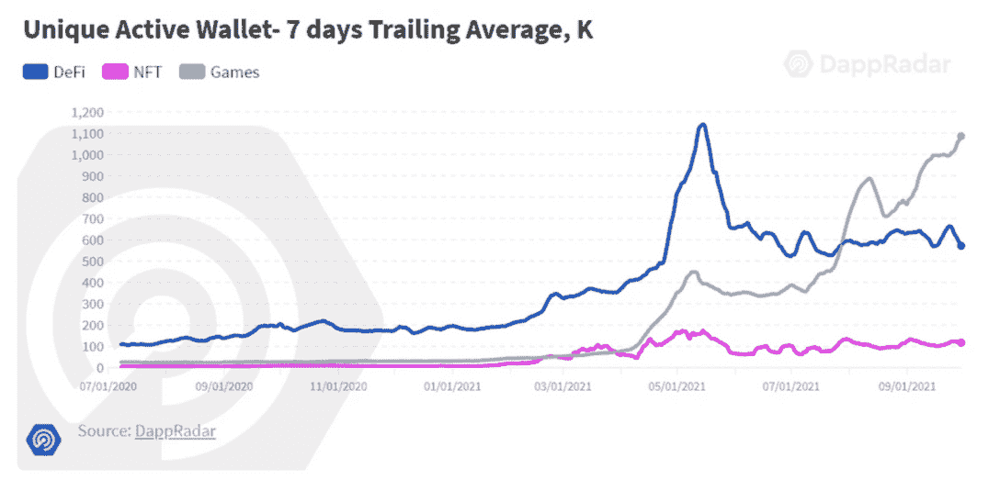
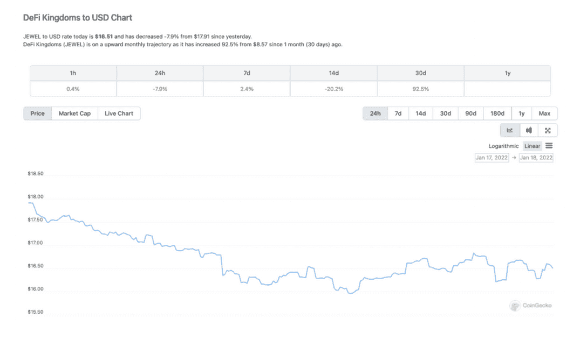
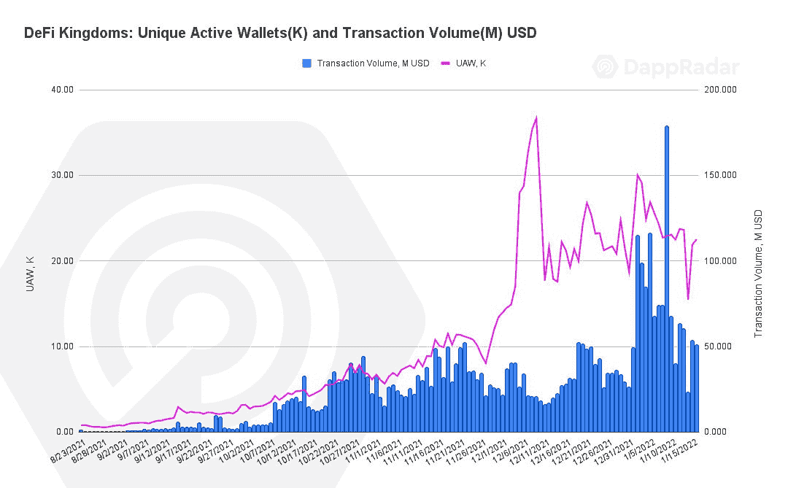
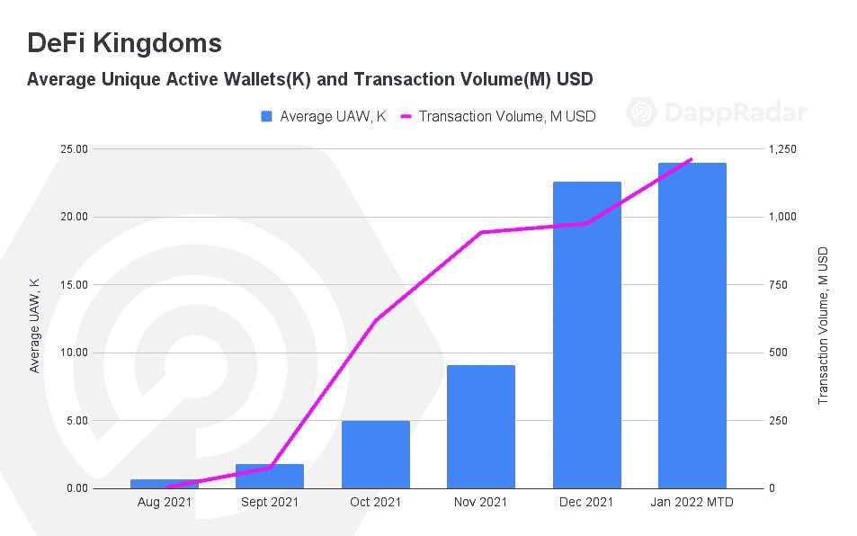
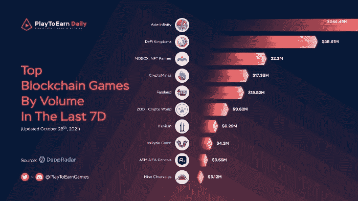

# 游戏赚钱 DeFi 王国成功崛起

> 原文：<https://web.archive.org/web/https://dappradar.com/blog/play-to-earn-defi-kingdoms-rise-to-success>

## 和谐金融游戏化与成功诉求的融合

**玩赚游戏的兴起以及与 DeFi 和 NFT 机制交织在一起的游戏最近变得非常受欢迎，DeFi 王国是冉冉升起的新星之一。这些 dapps 不仅吸引了创纪录的用户数量，还敲开了寻找加密入口的主流客户的大门。**

虽然指出坚定的 Axie Infinity 推动了从游戏到收入的革命是非常准确的，但在这个领域也有无名英雄。这些 dapps 中的许多都在运作。许多人在高层次上默默无闻，攀登值得一提的 DappRadar 排名，并更深入地研究他们取得成功的具体途径。

DeFi 王国于 2021 年 8 月 23 日抵达[和谐区块链](https://web.archive.org/web/20221201195049/https://dappradar.com/rankings/protocol/harmony/category/games)，并将自己描述为一个游戏、一个 DEX、一个流动性池机会和一个罕见的公用事业驱动的 NFT 市场。所有这一切都在幻想像素艺术的怀旧形式和农业的永恒吸引力中无缝地展现出来。

[https://web.archive.org/web/20221201195049if_/https://www.youtube.com/embed/ZXRW8o9XKB0?feature=oembed](https://web.archive.org/web/20221201195049if_/https://www.youtube.com/embed/ZXRW8o9XKB0?feature=oembed)

## 和谐区块链

如前所述，DeFi 王国在[和谐区块链](/web/20221201195049/https://dappradar.com/blog/harmony-embraces-multichain-future-of-blockchain/)上推出。作为一个区块链解决方案，和谐是一个完美的位置，以适应区块链行业的多链未来。Harmony 完全兼容 EVM，这使得以太坊 dapps 很容易移动到他们的生态系统中。以太坊 dapps 在 Harmony 上运行，2 秒钟完成交易，费用低 100 倍。用户可以使用安全的桥梁顺利地将他们的资产从 Harmony 转移到其他区块链，例如以太坊和币安智能链。

## 时机就是一切

DeFi 王国的团队从根本上在 Harmony 上建立了一个分散的交易所，允许用户持有一个货币代币，并拥有一个有价值的可用代币，旨在以有趣的方式回馈代币持有者。比如让玩家建立一个操作，提升它以增加回报，增加每日任务以收集稀有的 NFT。增加和影响奖励和回报的项目。

该游戏于 2021 年 8 月下旬推出，正如 DappRadar 在第三季度报告的 154 万个每日唯一活跃钱包连接到 dapps。此外，玩赚游戏继续推动行业内的使用，与 2021 年第三季度和 2021 年 Q2 相比，连接到游戏 dapps 的独特钱包数量增加了 140%以上。大约在那个时候，Splinterlands 成为了业内使用最多的 dapps 之一，季度环比增长了惊人的 1，376%。而 Axie Infinity 成为有史以来交易量最大的 NFT 收藏，历史交易量超过 20 亿美元。

DeFi 王国发挥影响力的时候到了。

## 入门指南

该项目早期[随着平台站稳脚跟，每日用户数量](/web/20221201195049/https://dappradar.com/blog/defi-kingdoms-brings-gamefi-to-harmony/)和交易量令人印象深刻。然而，没过多久，DeFi 王国就开始了营销攻势，并确定了路线图目标。因此，宝石令牌和 DeFi 王国吸引了那些寻找下一个大型游戏的注意力。

该平台核心的分散式交易所允许玩家互换代币，成为流动性提供者。当任何人交易这些代币时，这些流动性提供者反过来赚取费用。或者，用户可以将他们的 LP 代币押在花园中以赚取更多的宝石。

另一个特点是银行，玩家可以在那里存放珠宝代币，以获得 xJEWEL 股份。该银行将从 DeFi 王国交易所收取费用，并定期在市场上购买更多的珠宝代币，这意味着 xJEWEL 股票的价值将永远高于玩家投入的股票。此外，每笔游戏内的宝石交易都会将一定比例的钱存入银行，以进一步奖励 xJEWEL 持有者。

将 JEWEL 放入花园以接收更多的 JEWEL，提供流动性以赚取费用，银行和其他 DeFi 机制都运转良好，帮助该平台发展到 9 月底持有总价值超过 2800 万美元的锁定资产。然而，当团队想要给这个 DeFi 幻想王国添加一点剑和魔法时，一个游戏改变者来了。

## 第 0 代英雄 NFTs

期待已久的 0 代英雄 NFTs 于 9 月 30 日推出，总供应量为 2000 台。英雄带着他们的属性而来，可以被分配到任务中，为他们赢得经验值和资源。然而，真正有意思的是，玩家也可以使用[英雄来种植庄稼，并为他们赢得珠宝代币](https://web.archive.org/web/20221201195049/https://defikingdoms.medium.com/breaking-down-gen-0-hero-nfts-gameplay-stats-and-more-474a60ba5b90)。11 分钟。这就是 NFT 卖完的时间，因为 0 代英雄给 DeFi 王国带来了更多的 DeFi 效用。

有趣的是，一个英雄的价格从 1000 宝石开始，每购买一个英雄价格增加 0.5 宝石。我们只能推测如何阻止挥金如土的人试图控制销售。当时珠宝的价格约为 1.20 美元，这意味着一个英雄的价格约为 1200 美元。如果今天以 1000 颗宝石价格出售，这位英雄将价值 16，360 美元。英雄 NFT 有许多细微差别，他们不是简单的化身。它们使持有者能够赚取收入，因此是有价值的。

[Source: Coingecko](https://web.archive.org/web/20221201195049/https://www.coingecko.com/en/coins/defi-kingdoms/usd#panel)

他们通过维度之门被召唤，也被称为铸造。每一个新英雄都是独一无二的，几乎有无数的零件组合构成了每一个 NFT。玩家还可以通过组合已有英雄的基因来召唤新的英雄，最终可能得到一个极其稀有、珍贵、可交易的 NFT。

第 0 代 NFTs 的推出将 DeFi 王国上独特的活动钱包从 9 月底推出时的总数略超过 60，000 个增加到仅在 10 月份就超过 154，000 个。随着 [JEWEL token 积聚势头](https://web.archive.org/web/20221201195049/https://www.coingecko.com/en/coins/defi-kingdoms/usd#panel)，该平台继续建立在这一成功的基础上。11 月活跃钱包总数超过 273，000，而 JEWEL 增长到 8.50 美元左右。

NFTs 的引入将 DeFi 王国推向了新的高度。到 10 月底，平台蒸蒸日上。交易量从 9 月份的 7600 万美元飙升至 10 月份的 6.18 亿美元以上，到 11 月底又升至 9.43 亿美元以上。

## 严重增长

随着我们走向 2021 年底，围绕“玩即赚”和区块链游戏的宣传达到了顶峰。与此同时，DeFi 王国宣布他们已经在 Discord 上建立了一个 13，000+成员的社区，在 Twitter 上有 18，000+粉丝，在 Telegram 上有 5，000+成员。此外，在不到两个月的时间里，该平台锁定的总价值突破了 2 亿美元大关。

大约在 10 月底，该团队宣布其 NFT 市场，也称为酒馆，即将上线测试版。将 NFT 交易的力量及其伴随的交易量释放到 DeFi 王国。这将更加支持 DeFi 王国的生态系统。

酒馆被重新设计了，还增加了一些新的英雄卡。可以说，它的细节有助于设定 DeFi 王国的基调，并有助于将平台带入生活。玩家召唤强大、稀有、有潜在价值的卡片的能力也增加了很多价值。

## NFT 市场

到目前为止，DeFi 王国平台正在构建一个对 Harmony 有实际效用的 dapp。用户可以跳进去，DeFi 王国提供代币互换，游戏内 NFT 市场，产量农业和赌注。所有这些都包含在用户友好的 UX 中。

从 10 月底到 12 月初，DeFi Kingdoms 的活跃钱包数量增加了一倍多，活跃用户超过 273，000 人，超过 25 万人。交易额从 10 月底的 6.18 亿美元增加到 12 月的 9.43 亿美元。他们在整个 12 月保持了这一表现，并在我们进入 2022 年时再次上升。

酒馆的推出对 DeFi 王国的成功起到了至关重要的作用。玩家可以买卖和出租英雄，并把他们转让给朋友和其他人。在这里，玩家出租、购买、出售和交易 NFT，这些 NFT 真正代表了 DeFi 的“搜寻”工具——通过屋顶发送活动和交易量——推动 DeFi 王国排名上升，[敲开 Axie Infinity 等领先区块链游戏](https://web.archive.org/web/20221201195049/https://finance.yahoo.com/news/defi-kingdoms-challenges-axie-infinity-184259292.html?guccounter=1&guce_referrer=aHR0cHM6Ly93d3cuZ29vZ2xlLmNvbS8&guce_referrer_sig=AQAAAAnaHdgm7nkI6U_2awq6hYm5QPnur-gaQ7_N3JkkXexZDWV7jt_VB4IRCX8vTOPCSy7rpp-JhTzBoc4WauFBV0-PiQFM3ZsIWRH_fziqfYPtMhgWC7FycMum_lUx49m3z-3rUxIxn4ND5TosWZD6j4pot646VQGVyc0NDPhriqMW)的大门。

该团队还不满足，于 12 月 21 日中旬进一步推出了另一款兼容 EVM 的区块链产品 Avalanche，为 Avalanche 网络用户提供 DeFi 王国平台和新令牌。

## 王国和土地

路线图上的下一个重要标志将是王国和陆地的到来。可供购买的地块将会有限。随着玩家投资升级他们的地块，可以提供更多的资源，增加建筑最终将通过租金创造被动收入。

并非所有的土地都是平等的。有些人会根据附近的森林、石头和其他资源，提供更多的资源。一些会更靠近地图的中心，参与某些任务需要更少的耐力。其他的会离各种地下城和任务更近，需要更少的旅行时间来完成。王国也可以在房地产办公室买卖。此外，拥有土地也允许玩家每天寻找资源。

陆地和王国的到来增加了一个元宇宙层，并进一步增加了平台的收入和创造性效用。路线图的第二个主要阶段将会看到英雄来到 Defi 王国的世界。他们可以被分配任务来获得持有者的经验、NFT 和宝石掉落。

[<picture></picture>](https://web.archive.org/web/20221201195049/https://dappradar.com/rankings/protocol/harmony)[<picture></picture>](https://web.archive.org/web/20221201195049/https://dappradar.com/harmony/games/defi-kingdoms)[<picture></picture>](https://web.archive.org/web/20221201195049/https://dappradar.com/blog/tag/harmony)

## DeFi 王国摘要

迄今为止，DeFi 王国的成功有几个关键因素。如前所述，时机就是一切，可以说这个团队不可能在一个更合适的时间发布这个平台。随着天然气价格飙升，用户开始在其他地方寻找机会，DeFi 王国的定位非常好。

NFT 市场的推出是该平台活跃用户数量和交易量的巨大催化剂，有助于巩固游戏作为一个具有强大路线图和雄心的严肃竞争者。2022 年 1 月初，该团队宣布锁定的总价值达到了具有里程碑意义的 10 亿美元，进一步显示了该平台和游戏赚钱类型的受欢迎程度。

扩张到多个连锁店感觉是不可避免的，因为雪崩生态系统已经迈出了步伐。随着扩张，随着越来越多的人开始理解像 DeFi 王国这样的 dapps 所带来的机会，应该会有更活跃的钱包和交易量。

 NewsletterUnsubscribe at any time. [T&Cs](https://web.archive.org/web/20221201195049/https://dappradar.com/terms) and [Privacy Policy](https://web.archive.org/web/20221201195049/https://dappradar.com/privacy-policy)

***以上不构成投资建议。此处给出的信息仅供参考。请行使尽职调查，做你的研究。作者持有 ETH、BTC、AGIX、HEX、LINK、GRT、CRO、OMI、不变 X、ENS、GALA、AVASTR、GMEE、CUBE、RADAR、FLOW、FTM、BNB、SPS、WRLD、ATOM 和 ADA。***