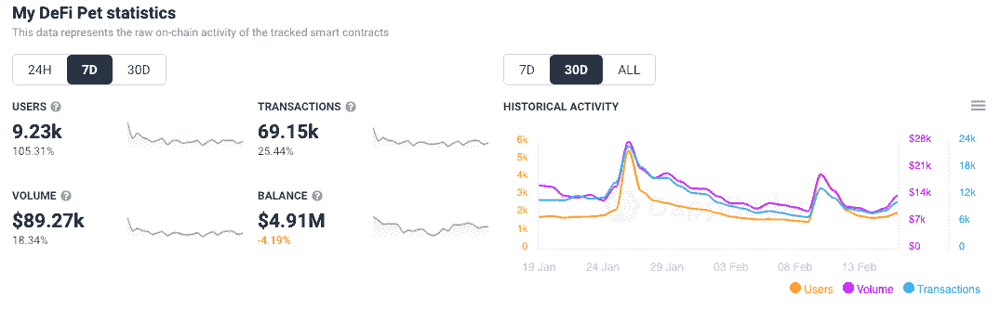
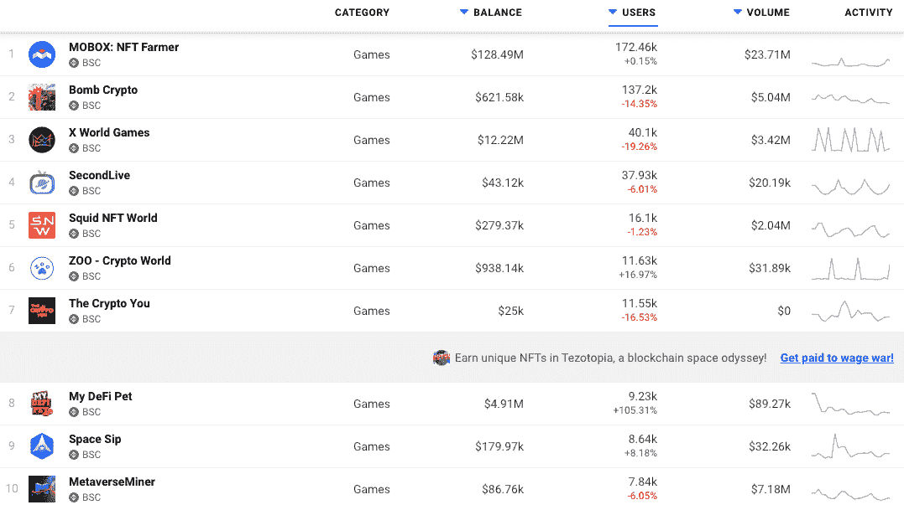
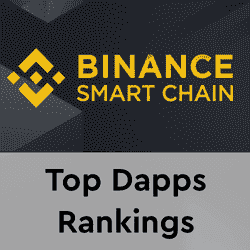

# BSC 上的游戏“我的 DeFi 宠物”的用户数量翻了一番

> 原文：<https://web.archive.org/web/https://dappradar.com/blog/play-to-earn-game-my-defi-pet-on-bsc-doubled-user-base>

## 结合传统游戏架构、NFTs 和 DeFi

虚拟宠物游戏 My DeFi Pet 随着币安智能链上的游戏开始受到更多关注，其用户群的周增长率超过 105%。BSC 上的 NFT 注入式游戏结合了 DeFi、收藏品、繁殖和战斗模式，供玩家赚取 DPET 代币。

在过去的七天里，我的 DeFi 宠物的用户数量翻了一番，达到 9230 个钱包。这些钱包通过游戏的智能合约完成了超过 69，000 笔交易，推动了近 90，000 美元的交易量。

在撰写本文时，它已经成为币安智能链上第八大最受欢迎的区块链游戏，并有望进入前五名。如果它能在未来几周保持增长，它完全有机会超越[的 Crypto You，ZOO 和 NFT 世界的鱿鱼](https://web.archive.org/web/20230118175411/https://dappradar.com/rankings/protocol/binance-smart-chain/category/games)。此外，当在所有游戏和所有连锁店中排名时，它现在在[前 25 名游戏](https://web.archive.org/web/20230118175411/https://dappradar.com/rankings/category/games)之内。

## 我的定义是什么？

[我的 DeFi 宠物](https://web.archive.org/web/20230118175411/https://dappradar.com/binance-smart-chain/games/my-defi-pet)围绕着一个收集、饲养、进化、与宠物战斗和交易的核心循环。游戏被分成不同的季节，分成更小的部分。团队状态补充人类短期回报倾向的一种机制。

玩家有两种方式开始，要么通过消耗一定数量的 DPET 代币召唤宠物，要么在拍卖会上购买一个。拍卖会上每小时都会有一只新宠物诞生，用 DPET 代币竞拍会持续 24 小时。而任意两只宠物的结合会产生一只继承了父母基因的新宠物。此外，每个宠物都有特定的进化等级和能力，这取决于它的稀有程度，玩家可以通过给它们喂食 DPET 代币来升级它们的宠物。

DPET 代币经济学旨在激励和最大化玩家和游戏之间的互动。例如，用户将获得 [DPET 和随机奖励](https://web.archive.org/web/20230118175411/https://dappradar.com/binance-smart-chain/games/my-defi-pet)的奖励，以鼓励他们在系统内促进平台采用的活动上花费，如购买、饲养或进化宠物或花时间玩游戏。

[<picture></picture>](https://web.archive.org/web/20230118175411/https://dappradar.com/rankings/protocol/binance-smart-chain)[<picture></picture>](https://web.archive.org/web/20230118175411/https://dappradar.com/binance-smart-chain/defi/pancakeswap)[<picture></picture>](https://web.archive.org/web/20230118175411/https://dappradar.com/binance-smart-chain/defi/apeswap)

## BSC 上“玩即赚”游戏的增长

公平地说，2021 年见证了 DeFi 的游戏化，也被称为 GameFi，成为币安品牌网络的重要组成部分。BSC 上的[游戏类别在 2021](https://web.archive.org/web/20230118175411/https://dappradar.com/rankings/protocol/binance-smart-chain/category/games) 大幅提升了[，促进了网络和整个行业的使用。](/web/20230118175411/https://dappradar.com/blog/bsc-report-2021-a-year-in-review/)

几款 BSC 游戏脱颖而出。GameFi dapp 的 Mobox 巩固了其作为 BSC 生态系统中顶级 dapp 之一的地位。第二个是 [BombCrypto](https://web.archive.org/web/20230118175411/https://dappradar.com/blog/play-to-earn-bomb-crypto-blasts-its-way-to-top-of-the-charts/) ，这是一个玩到赚的 dapp 游戏，玩家通过战斗获得游戏的货币 BCOIN，成为区块链最常玩的十大游戏之一。如果 BombCrypto、[、X-World Games](https://web.archive.org/web/20230118175411/https://dappradar.com/blog/x-world-games-and-its-xwg-token/) 和其他公司能够跟随 Mobox 的步伐，BSC 可能会变得不那么依赖 DeFi，而更多地参与到日益增长的“以游戏挣钱”运动中。

***以上不构成投资建议。此处给出的信息仅供参考。请行使尽职调查，做你的研究。作者持有 ETH、BTC、AGIX、HEX、LINK、GRT、CRO、OMI、不可变 X、GALA、AVASTR、GMEE、CUBE、RADAR、FLOW、FTM、BNB、SPS、WRLD、ATOM 和 ADA。***

 NewsletterUnsubscribe at any time. [T&Cs](https://web.archive.org/web/20230118175411/https://dappradar.com/terms) and [Privacy Policy](https://web.archive.org/web/20230118175411/https://dappradar.com/privacy-policy)