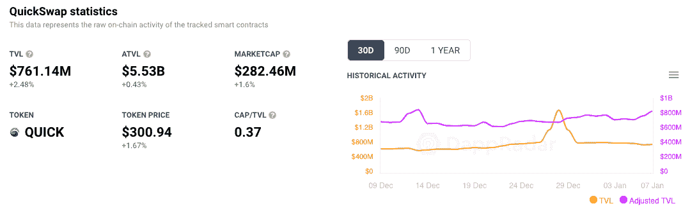
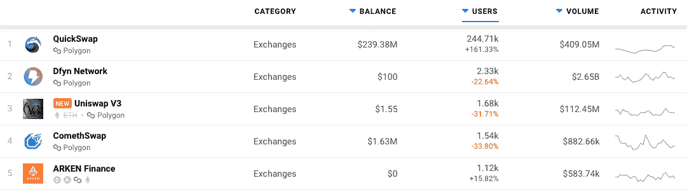
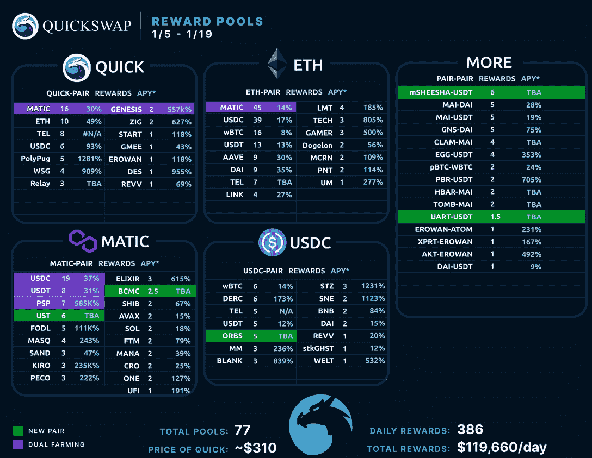
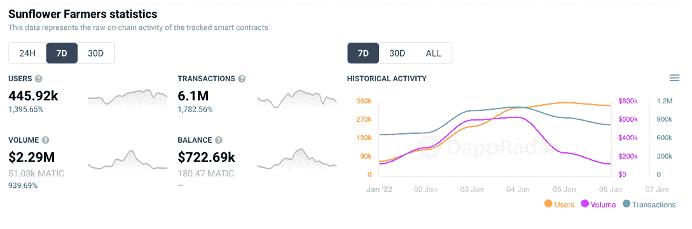
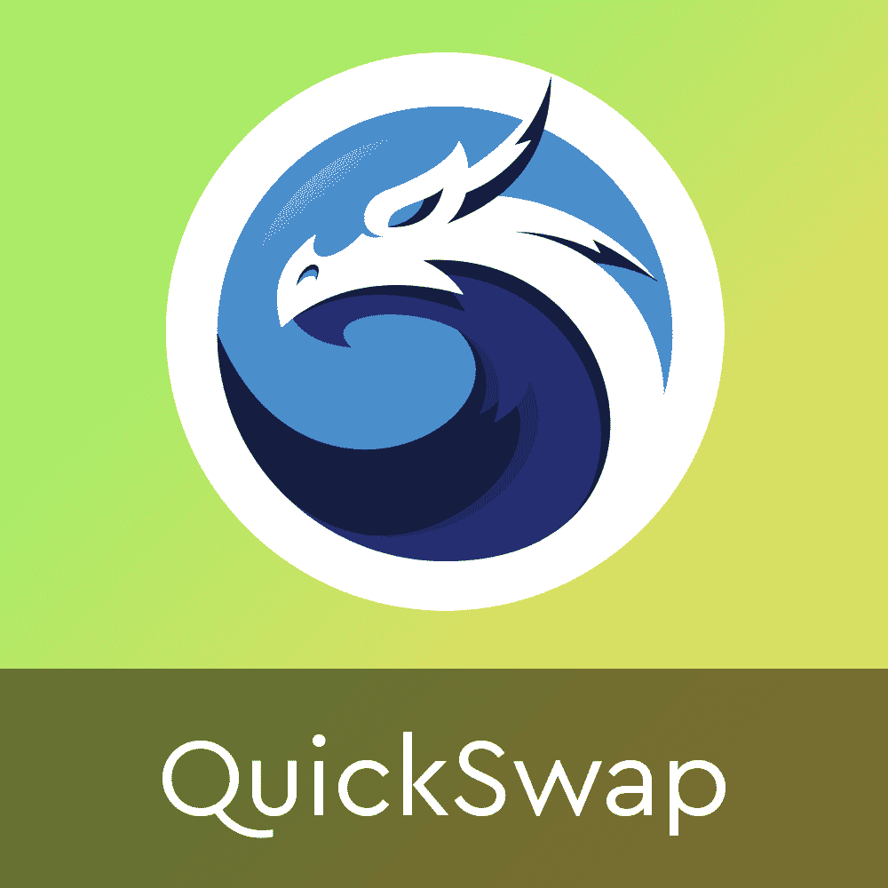
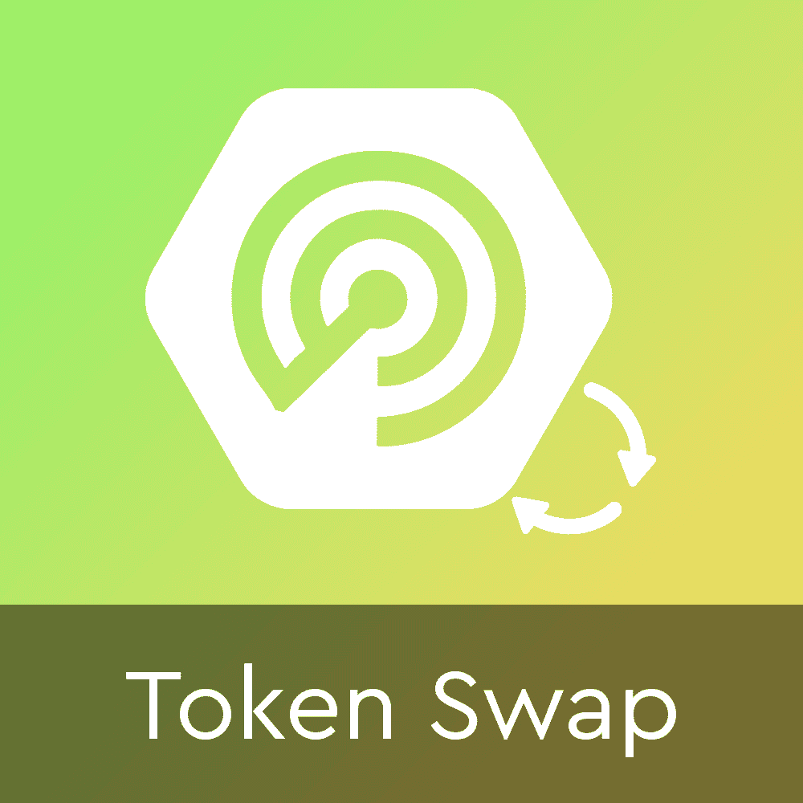

# 从玩到赚推动 QuickSwap Exchange 活动钱包 160%

> 原文：<https://web.archive.org/web/https://dappradar.com/blog/play-to-earn-pushes-quickswap-exchange-active-wallets-160>

## 治理快照和新的投资机会

本周，分散代币交换平台 QuickSwap 在连接到该平台的钱包中获得了可喜的增长。领先的 Polygon DEX 已经取得了令人印象深刻的 160%的增长，在过去的七天里将独特的活动钱包推高到近 25 万。

最近几周，我们已经看到 Polygon DeFi dapps 获得了更多的关注，首先是 Uniswap 将其服务转移到 Polygon 。许多人想知道 Uniswap 是否会超越 QuickSwap 的声誉，但多边形原生 DEX QuickSwap 是有弹性的。

在过去的 7 天里，分散式交易所的用户群增长了 160%，令人印象深刻。受到新的多边形游戏“向日葵农民”、“赌注机会”和即将到来的治理投票的刺激。

连接到 dapp 的钱包数量激增部分是由平台发布的[快照公告](https://web.archive.org/web/20220929042922/https://quickswap-layer2.medium.com/should-quickswap-increase-stakers-freedom-by-separating-the-dragon-s-lair-from-syrup-pools-6829565605f8)引起的。QUICK 和 dQUICK 的持有者需要在 12 月 7 日之前将代币放入 Metamask 等自我保管的钱包中，以便有资格对将龙穴与糖浆池分开的提案进行投票。许多人在 QuickSwap exchange 上拥有这些代币从事农业或赌博，因此他们需要连接到 dapp，并将这些代币发送到自我保管的钱包中，以便获得资格。其他人可能只是为了参加投票而购买了所需的代币。

## 奖励将用户带到 QuickSwap

本周连接到 QuickSwap 的人数增加的另一个强有力的原因是一些新的奖励池的推出。增加了几个新的双农和配对机会，包括 UST、姆谢莎、接力、圆球、uART 和 BCMC 的奖励。

## 享受向日葵农民的宣传

本周激增的另一个潜在的强大原因是一个新的基于多边形的游戏《向日葵农民》的成功。

dapp 本周已经有近 45 万个活跃钱包连接到它。这些钱包完成了超过 600 万笔交易，在整个游戏中带动了 229 万美元的交易量。[开始使用向日葵农民](/web/20220929042922/https://dappradar.com/blog/how-to-play-to-earn-on-sunflower-farmers/)的一个关键方面是持有平台的原生 SFF 令牌，可以通过 QuickSwap 获得。此外，一些人只是投资于流行的“玩即赚”游戏的底层代币，而不是玩这些游戏。两者都可以推动活跃钱包进入平台。

此外，那些参与游戏的人需要将任何获得的 SFF 代币交换到 MATIC，例如，从游戏中实现利润。块浏览器[显示了许多小事务](https://web.archive.org/web/20220929042922/https://polygonscan.com/token/0xdf9b4b57865b403e08c85568442f95c26b7896b0)，进一步支持了这个理论。这些行动促成了本周在 QuickSwap 上观察到的活动激增。

[<picture></picture>](https://web.archive.org/web/20220929042922/https://dappradar.com/polygon/exchanges/quickswap)[<picture></picture>](https://web.archive.org/web/20220929042922/https://dappradar.com/blog/)[<picture></picture>](https://web.archive.org/web/20220929042922/https://dappradar.com/hub/swap)

## 多边形已经成为游戏平台了吗？

多边形区块链在 2021 年取得了持续的成功,当市场见顶时，大量的 DeFi 和 exchange dapps 出现在网络上。几个金融 dapps 来来去去，而像 QuickSwap 这样的交易所确立了自己在网络上的领导地位。然而，Polygon 也非常适合托管游戏 dapps，因为它的安全性、快速交易和低费用。一些被 dapp 开发者发现的东西。

2021 年，CryptoBlades、Zed Run 和 Arc8 等游戏在 Polygon 上获得了成功，而向日葵农民则是目前的独角兽。在整个游戏排名中，达普拉达位居第二，坐落在坚定的分裂之地、外星世界和 Axie Infinity 之间。对于一款几周前才推出的游戏来说，这已经不错了。

 NewsletterUnsubscribe at any time. [T&Cs](https://web.archive.org/web/20220929042922/https://dappradar.com/terms) and [Privacy Policy](https://web.archive.org/web/20220929042922/https://dappradar.com/privacy-policy)

***以上不构成投资建议。此处给出的信息仅供参考。请行使尽职调查，做你的研究。作者持有 ETH、BTC、AGIX、HEX、LINK、GRT、CRO、OMI、不变 X、ENS、GALA、AVASTR、GMEE、CUBE、RADAR、FLOW、FTM、BNB、SPS、WRLD、ATOM 和 ADA。***