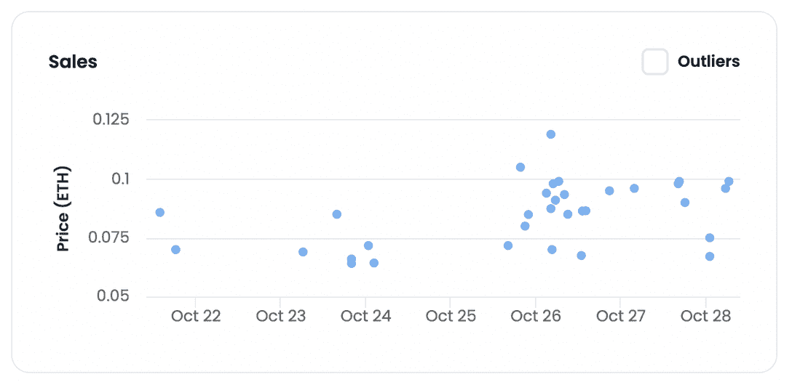
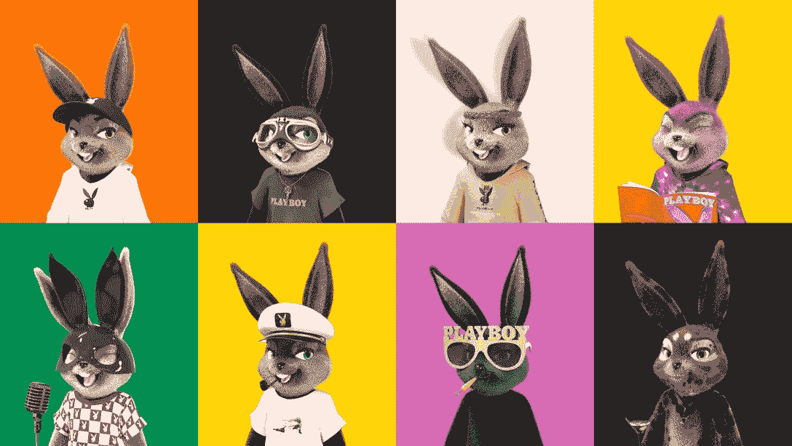
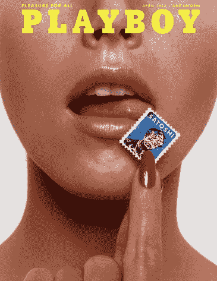

# 花花公子 Rabbitars NFTs 在沙盒元宇宙重塑品牌

> 原文：<https://web.archive.org/web/https://dappradar.com/blog/playboy-rabbitars-nfts-reinventing-the-brand-in-the-sandbox-metaverse>

## 作为花花公子进军 Web3 的主要项目，Rabbitars 的 NFT 可能比它们看起来的要多得多

即将庆祝 70 周年的《花花公子》有了自己的数字收藏品，动摇了它的历史根基。本周，亲民党 NFT 收藏的花花公子 Rabbitars 再次吸引了公众对该品牌的关注，这次是在沙盒的元宇宙虚拟世界中。

## 突出

*   Rabbitars collection 的总销量在过去一周增加了 41 %( T1 ),而独特钱包的数量也增加了 61 %( T3 );
*   本周，该系列正在庆祝其一周年纪念日，并在社区内进行推广——底价为 0.09 ETH。
*   从昨天开始，收藏者也可以在沙盒中使用他们的 NFT 作为头像。
*   你可以使用 DappRadar 的 [NFT 概览工具](https://web.archive.org/web/20221130033819/https://dappradar.com/ethereum/collectibles/playboy-rabbitars-official)跟踪 Rabbitars NFTs 的最高销售额和统计数据。

## 兔女郎们重操旧业了吗？

《花花公子》Rabbitars 于 2021 年 10 月与荣耀一起在 NFT 空间首次亮相。有世界上最著名的名字做后盾，兔子们甚至[对行业领导者 Bored Ape 游艇俱乐部构成了威胁。](https://web.archive.org/web/20221130033819/https://dappradar.com/blog/the-rise-of-the-hares-an-attack-on-the-bored-apes-empire)

然而，到目前为止，普通的 Web3 观众对这个系列一直保持沉默，即使这个项目与一个著名品牌有关。

与元宇宙沙盒的合作重新点燃了公众对兔子的兴趣。

> 准备好兔子！🐇@PlayboyNFTs 头像将于世界标准时间明天下午 2 点发布。
> 
> 在沙盒里扮演你的兔子！🐰【pic.twitter.com/VKBQltTNaI】@花花公子
> 
> — The Sandbox (@TheSandboxGame) [October 26, 2022](https://web.archive.org/web/20221130033819/https://twitter.com/TheSandboxGame/status/1585330648788746285?ref_src=twsrc%5Etfw)

[View Playboy Rabbitars NFT Collection](https://web.archive.org/web/20221130033819/https://dappradar.com/ethereum/collectibles/playboy-rabbitars-official)

在本周庆祝该系列一周年之际，数字比很长一段时间以来更乐观。

根据 DappRadar 的数据，在此期间，61%以上的独立活动钱包与非功能性钱包进行了互动，这意味着更多的人可能已经购买了非功能性钱包。

[<picture></picture>](https://web.archive.org/web/20221130033819/https://dappradar.com/ethereum/collectibles/playboy-rabbitars-official)

Source: OpenSea

该系列的底价为 0.09 ETH，在撰写本文时大约为 135 美元。同样，兔子的总体积为 2687 ETH(4030177 美元)。)

沙盒是元宇宙虚拟世界，2022 年用户数量领先，本周也发布了自己版本的花花公子大厦——元大厦——供玩家体验。

## 为什么《花花公子》广受欢迎的 NFT 系列没有裸体？

当把一堆 NFT 和花花公子品牌联系在一起时，不难想象它们的内容。但是兔女郎中的美女在哪里呢？

Source: [Playboy](https://web.archive.org/web/20221130033819/https://www.playboy.com/custom/playboy-nfts-and-blockchain-projects)

Check Out Playboy Rabbitars Top Sales

即使有一个不言自明的名字，花花公子品牌，现在没有任何赫夫纳工作或从公司获利，正在寻求超越*“男性娱乐”*的观众，正如[纽约时报](https://web.archive.org/web/20221130033819/https://web.archive.org/web/20191103001051/https://www.nytimes.com/2019/08/02/business/woke-playboy-millennials.html)所解释的。

与花花公子签署的其他 NFT 系列相比，Rabbitars 面向年轻观众，面向 Web3 游戏玩家和收藏品爱好者。这 11953 个兔子头像是建立在以太坊上的 PFP NFTs，可以在 OpenSea 上购买。

它还为持有者提供元宇宙和现实生活中的独家活动，创建自己的花花公子俱乐部。这还不是全部，Rabbitars 背后的团队还投资于[讲故事，以扩大系列的宇宙](https://web.archive.org/web/20221130033819/https://dappradar.com/blog/storytelling-nfts)——在 NFT 背后有他们自己的神话和一个叫做 Leveretia 的隐藏世界。

正如[官方网站](https://web.archive.org/web/20221130033819/https://www.playboy.com/read/legend-of-leveretia)上解释的那样，Rabbitar 的地下土地 Leveretia 的灵感来自于现实世界的传言，即有秘密隧道连接最初的花花公子大厦和洛杉矶的名人住宅。

尽管如此,《花花公子兔之家》完全是我们熟知的《花花公子》的现代翻版。但这并不意味着旧的概念已经从品牌的历史中抹去。

## 《花花公子》完美地融合了过去和未来

该品牌的其他系列与 Rabbitars 的性质完全不同。他们不仅以杂志特有的感性和更艺术的本质来赞美旧的内容，而且还有更高的底价。

Source: [Nifty Gateway](https://web.archive.org/web/20221130033819/https://www.niftygateway.com/@playboy/collections)

《Liquid Summer》于 2021 年 5 月在 Nifty Gateway 上发布，是《花花公子》首次涉足非功能性网络服务，至今仍是 web 2-into web 3 的最佳范例之一。

收藏家可以购买自己的花花公子数字艺术，价格从 1300 美元到 12500 美元不等。上面的 NFT，One Satoshi，是一个不公开出售的单一版本，最后一次在公开拍卖中以 25 万美元的价格售出。

## 跟上热门的 NFT 收藏

DappRadar 会在您进入 Web3 的整个过程中为您提供指导。如果你正在 NFT 寻找机会，请查看我们的[顶级 NFTs 排名](https://web.archive.org/web/20221130033819/https://dappradar.com/nft)。

[https://web.archive.org/web/20221130033819if_/https://www.youtube.com/embed/fkEaXYLOW-s?feature=oembed](https://web.archive.org/web/20221130033819if_/https://www.youtube.com/embed/fkEaXYLOW-s?feature=oembed)

[Check Out Top NFT Collections](https://web.archive.org/web/20221130033819/https://dappradar.com/hub/nft-explorer)

我们希望你喜欢了解更多关于花花公子兔子和品牌在元宇宙的激动人心的冒险。

DappRadar 将继续关注《花花公子》的项目，并让你在我们的博客和 Twitter 上保持关注。请务必加入我们的 [Discord](https://web.archive.org/web/20221130033819/https://discord.com/invite/4ybbssrHkm) 社区，保持领先地位。

### 有用的链接

*   《花花公子》官方| DappRadar
*   兔子的崛起:对无聊猿帝国的攻击
*   沙盒很拥挤:元宇宙活动急剧增加的背后是什么？
*   [10 大品牌进军元宇宙](https://web.archive.org/web/20221130033819/https://dappradar.com/blog/10-major-brands-in-the-metaverse)

***以上不构成投资建议。此处给出的信息仅供参考。请尽职调查并自行研究。***