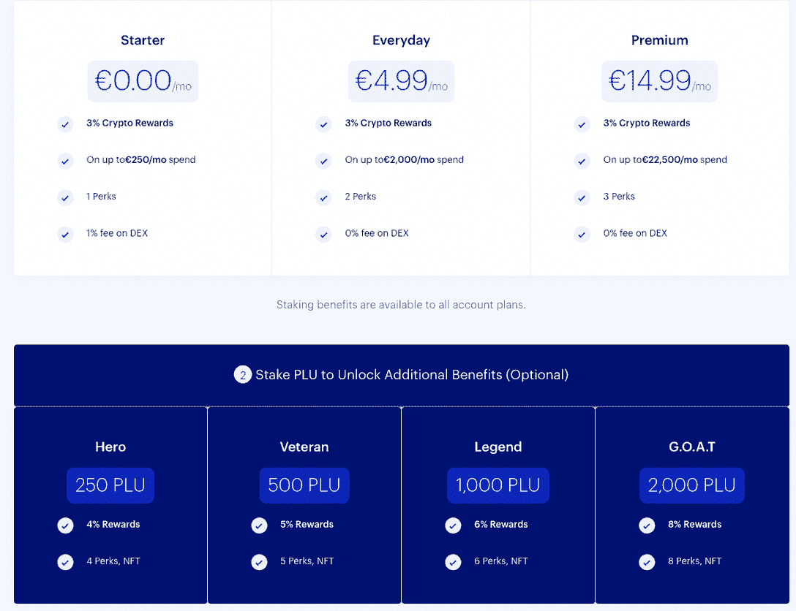
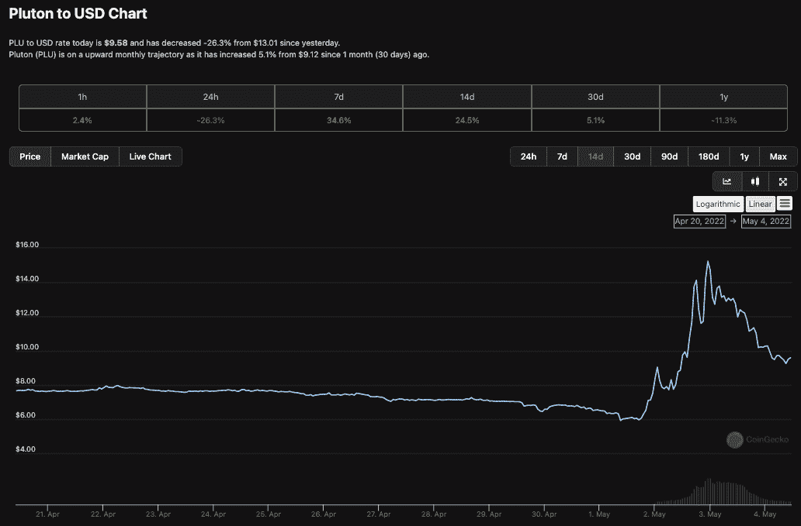
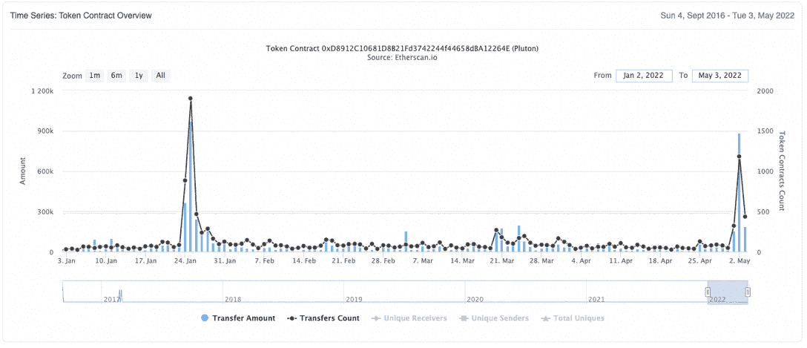
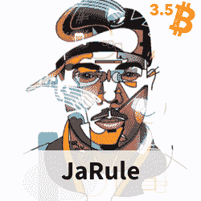
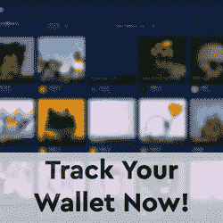

# Crypto.com 惨败后，普路托斯加密卡吸引用户

> 原文：<https://web.archive.org/web/https://dappradar.com/blog/plutus-crypto-card-attracts-users-in-wake-of-crypto-com-fiasco>

## 普路托斯推出 20 项新福利和高达 8%的返现

总部位于伦敦的普路托斯金融科技公司正试图利用 [Crypto.com 最近的失败](/web/20221127145422/https://dappradar.com/blog/crypto-com-flip-flops-after-cutting-staking-card-rewards/)进行一系列应用更新，包括 8%的卡返现以及与英国和欧盟 20 多个热门品牌的合作，使其成为最有吸引力的加密关联借记卡之一。

## 摘要

*   Crypto.com 大幅削减了收入和返现率，并立即感受到了用户的强烈反对
*   咄咄逼人的广告把普路托斯作为一个选择放在了前面和中心
*   普路托斯将 PLU 股东的信用卡返现率从 3%提高到 8%
*   普路托斯推出 20 项新优惠，包括对网飞、Spotify、Prime、Apple One、优步、Aldi、Asos 和 Deliveroo Plus 高达 100%的加密折扣

在 Crypto.com 的失败之后，普路托斯似乎已经彻底改革了其商业模式，以吸引新用户。他们提供三种灵活的订阅计划——免费启动，€每天 4.99 英镑，€14.99 英镑——和四个赌注级别:英雄，老兵，传奇和山羊——有史以来最大的。Visa 借记卡合作伙伴还将对其本地加密令牌 Pluton ( [PLU](https://web.archive.org/web/20221127145422/https://www.coingecko.com/en/coins/pluton) )的加密奖励返现率从 3%提高到 8%。

新模式旨在帮助普路托斯在 2023 年底前实现 60 万持卡人的目标。如前所述，及时而积极的营销让普路托斯赢得了用户。

## 趁热打铁

Crypto.com(CDC)客户的一个核心症结是针对高级客户的赌注奖励的[拟议变更。为了在 CDC 模型中获得无上限的 8% CRO 返现，用户需要在€下注 350，000，现在修改后的变化意味着他们在下注的 CRO 上赚取 8%的 APY。尽管如此，这仍是对一种潜在不稳定加密资产的相当大的资本投资，这种资产的历史最低价值为 0.01 美元，最高价值为 0.91 美元。这是一个相当大的范围。](/web/20221127145422/https://dappradar.com/blog/crypto-com-flip-flops-after-cutting-staking-card-rewards/)

普路托斯用户只需支付月费，就能获得 3%的加密返现，不同层级的返现奖励更多额外津贴。这是一个很有吸引力的提议，不需要任何加密就可以使用这些服务。为了在普路托斯获得 8%的赌注回报，用户需要下注 2000 PLU，按今天的价格计算，这将花费 19080 美元。

这与在疾病预防控制中心获得同等报酬所需的€35 万英镑相差甚远。值得注意的是，下面的赌注级别数字取代了订阅计划数字。例如，获得 Premium Subscription 计划和 Hero Staking 等于 4%的总奖励。

## 疾病控制中心对普路托斯

在 CRO 的 CDC 投注€350，000 英镑将在 1 年内产生大约€28，000 英镑的投注回报。除此之外，顾客将获得 8%的卡消费返现。假设这个人一年在这张卡上花了€10 万英镑。他们将获得大约 8000€的回报。当然，这些数字是建立在 CRO 价格保持不变或波动很小的基础上的。基于这些简单的数字，客户每年将获得约 36，000€的奖励。

在普路托斯，下注 20，000 美元左右将会给你一年 8%的下注回报，大约 1，600 美元。使用与第一个示例相同的消费水平，如果客户收到 100，000 美元的 8%返现，他们将收到 8，000 美元。一年的总收入约为 9600 美元。

略低于三分之一的奖励，疾病预防控制中心将利用，但没有风险€35 万。此外，大多数人没有€35 万英镑来投资，因此可以说，CDC 是富裕投资者的游乐场，钱生钱。

## 多重记号

PLU 代币支撑着整个运营，过去几天表现异常出色，因为它吸纳了新客户，增加了交易量。5 月 1 日周日，它开始从 6 美元左右向北移动，到 5 月 3 日周二达到 15 美元以上。今天，它的交易价格约为 10 美元，是 CDC 惨败前的两倍。

PLU 的代币供应量最高可达 20，000，000 枚，目前有 8，160 名 PLU 持有者。有趣的是，PLU 在 2022 年每天增加约 5 名新代币持有者，但在 4 月 30 日至 5 月 3 日之间增加了 200 多名。

在 Etherscan 上查看 PLU，我们可以看到过去几天 PLU 转移的显著高峰，随着关于 CDC 的消息开始传播，5 月 2 日有近百万 PLU 被转移。

## 比较两者

普路托斯[的首席执行官兼创始人昨天在 Twitter](https://web.archive.org/web/20221127145422/https://twitter.com/DDhopn/status/1521456402094567426) 上强调了这两个平台之间的一些关键差异，并宣布 4 月份发行的信用卡数量比上个月增加了 225%，信用卡消费增加了 45%，达到 775 万美元。普路托斯持卡人体验到的反馈回路旨在进一步区分它和 CDC。

*   用普路托斯卡消费
*   赢取 PLU 并下注
*   寻求获得更多的 PLU
*   释放更多优势

因此，随着普路托斯走过其生命周期的增长阶段，金融科技平台预计需求将继续增长。然而，关于普路托斯是否会成为下一个疾控中心并在几个月后上演同样的把戏的争论在网上激烈进行着。我们可以在可持续性和赌注回报等关键领域对这两种服务进行比较。

普路托斯的模式与 CDC 不同，虽然他们提供赌注和免费卡层，但他们也提供付费订阅。这应该是一个很好的商业模式，给客户一些信心水平。当用户下注 PLU 以获得信用卡优惠时，他们对他们的 PLU 拥有完全的监护权。它在顾客的钱包里，他们有钥匙。客户不会锁定任何东西，这意味着普路托斯不能像 CDC 现在这样做，因为在普路托斯，用户可以完全访问 PLU，可以将它移动到任何地方。

在这种情况下，老话“不是你的钥匙，不是你的密码”一如既往地准确。一些新用户很容易忘记或从未学会的东西，但似乎对普路托斯至关重要。

[<picture></picture>](https://web.archive.org/web/20221127145422/https://dappradar.com/hub/wallet/eth/0x8d3bc45d7b30013c37c141f6ce7c981b2613efaa)[<picture></picture>](https://web.archive.org/web/20221127145422/https://dappradar.com/hub/wallet/)[<picture></picture>](https://web.archive.org/web/20221127145422/https://dappradar.com/hub/wallet/eth/0x3b417faee9d2ff636701100891dc2755b5321cc3)

***以上不构成投资建议。此处给出的信息仅供参考。请行使尽职调查，做你的研究。作者持有多种加密货币的头寸，包括 BTC、瑞士法郎和雷达。***