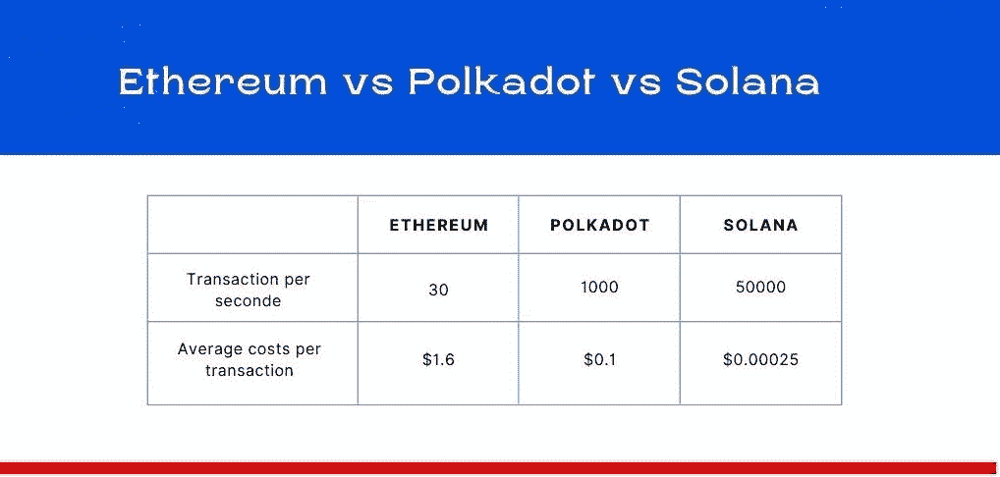
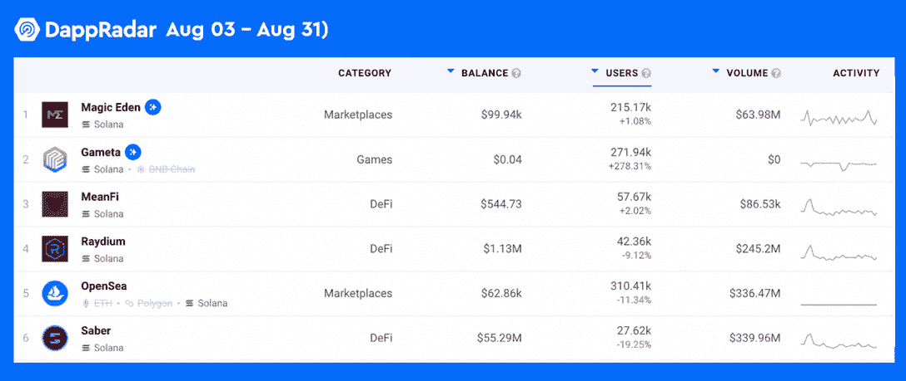
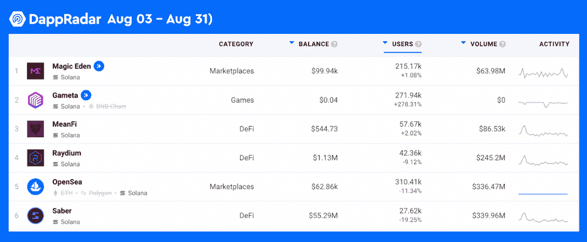

# 波尔卡多特与索拉纳:关键差异解释

> 原文：<https://web.archive.org/web/https://dappradar.com/blog/polkadot-vs-solana-key-differences-explained>

## 近距离观察两个发展最快的区块链网络

Polkadot 和 Solana 是最受欢迎的第三代区块链网络。它们都拥有出色的可伸缩性和效率，而没有牺牲去中心化。本文将从多个方面对波尔卡多特和索拉纳进行比较。希望你看完之后对每个链条的好处有一个清晰的认识。

内容:

*   [多连锁格局的兴起](https://web.archive.org/web/20220925232838/https://dappradar.com/blog/polkadot-vs-solana-key-differences-explained/#rise)
*   [什么是波尔卡多，什么是索拉纳？](https://web.archive.org/web/20220925232838/https://dappradar.com/blog/polkadot-vs-solana-key-differences-explained/#what-is)
*   [技术亮点](https://web.archive.org/web/20220925232838/https://dappradar.com/blog/polkadot-vs-solana-key-differences-explained/#technical)
*   [网络性能对比](https://web.archive.org/web/20220925232838/https://dappradar.com/blog/polkadot-vs-solana-key-differences-explained/#performance)
*   [代币](https://web.archive.org/web/20220925232838/https://dappradar.com/blog/polkadot-vs-solana-key-differences-explained/#tokens)
*   [生态系统](https://web.archive.org/web/20220925232838/https://dappradar.com/blog/polkadot-vs-solana-key-differences-explained/#ecosystems)
*   波尔卡多特 vs 索拉纳:哪个更好？

## 多连锁景观的兴起

许多人可能知道以太坊是目前市值第二大的加密公司。作为区块链的先驱，以太坊为智能合约和 NFT 等各种创新奠定了坚实的基础。如果你想了解以太坊的一切，[查看 DappRadar 的以太坊终极指南。](https://web.archive.org/web/20220925232838/https://dappradar.com/blog/what-is-ethereum-dappradars-ultimate-guide)

不过以太坊还是有它的局限性。例如，它相对较慢，每秒只能处理 30 个事务。此外，它仍然采用工作验证模型，这意味着它是能源密集型的。

因此，竞争对手如雨后春笋般涌现，希望解决以太坊的问题，加速 Web3 的大规模采用。在最有竞争力的候选人中，我们有波尔卡多特和索拉纳。

本文将看看这两者之间的区别。

## 什么是波尔卡多，什么是索拉纳？

Polkadot 成立于 2016 年，于 2020 年 5 月启动，是一个连接多个区块链生态系统的分散式网络。

Polkadot 旨在通过创建区块链网络来解决区块链的可扩展性和互操作性问题。值得注意的是，Polkadot 在其生态系统中已经有超过 100 个链，并有可能扩展到每秒处理多达 100 万次交易。

[阅读本文，全面了解 Polkadot。](https://web.archive.org/web/20220925232838/https://dappradar.com/blog/introducing-the-polkadot-blockchain)

Solana 的起源可以追溯到 2017 年，其 mainnet 测试版于 2020 年 3 月推出。Solana 专注于提高网络速度，并大幅降低作为单一区块链网络的交易成本。

此外，Solana 为开发人员提供了一个高性能的智能合约平台，使他们能够提供安全、通用和用户友好的 dapp 体验。目前，[Solana 生态系统中的数百个项目已经](https://web.archive.org/web/20220925232838/https://dappradar.com/rankings/protocol/solana)可供用户使用，支持从分散金融(DeFi)到 NFTs 的各种功能。

[这篇文章可以帮助你更深入地了解索拉纳。](https://web.archive.org/web/20220925232838/https://dappradar.com/blog/what-is-solana)

## 技术亮点

波尔卡多特的网络有三种类型的区块链。第一个是中继链，是处理事务的主链。然后是下一种类型，副链。这些是运行在中继链之上的特定于应用的链，允许向 Polkadot 添加新功能。

最后一种类型包括支持与其他区块链(如以太坊)互操作的网桥。

此外，Polkadot 采用了一种指定的利益证明(NPoS)共识模型来验证交易。它被设计成两个角色，验证者和提名者。在区块链中，验证者是负责验证交易的人。

非营利组织模式允许提名者用他们的股份支持验证者。该机制基于原始的利益相关证明模型优化了分散化和安全性。

区块链凭借其独特的共识机制，以卓越的效率和实惠的价格赢得了众多用户的青睐。Solana 通过结合利害关系证明(PoS)和历史证明(PoH)算法实现了区块链共识。

具体来说，PoH 模型使用时间戳过程将所有事务按时间顺序组织起来，这样可以加快网络传输。一旦交易被分类，系统将把它们发送给验证者进行验证。

## 网络性能比较

Solana 和 Polkadot 是以太坊的强劲竞争对手，致力于通过创新为用户带来更好的区块链体验。所以，让我们从成本和速度方面对这三者进行比较，以了解它们最近的性能。

## 代币

Polkadot 上的本地令牌是 dot，它在 Polkadot 生态系统中有两个基本功能:治理和赌注。作为治理令牌，DOT 允许持有者对提案进行投票，并塑造网络的未来。关于赌注，DOT 用于验证交易和生成额外的令牌。

dotasnapshot:

*   价格:6.95 美元
*   流通供应量:11.1 亿
*   市值:7737959429 美元。

在索拉纳，SOL token 为它的生态系统提供能量。用户在转移代币或与 Solana 的智能合约交互时，可以使用 SOL 支付交易费用。持有 SOL 还允许用户运行链上程序或成为验证者。

SOL 快照:

*   价格:31.09 美元
*   流通供应量:3.5 亿
*   市值:10883247039 美元

## 生态系统

Polkadot 的目标是为 dapps 和平台建立一个通用的多链范例。它允许项目要么建立在 parachain 之上，要么运行自己的链。

例如，最令人兴奋的项目之一 [Moonbeam](https://web.archive.org/web/20220925232838/https://dappradar.com/rankings/protocol/moonbeam) ，是一个共享 Polkadot 互操作性本质的副链。

DappRadar 追踪着月光平台生机勃勃的生态系统。找出 Moonbean 上的趋势。

索拉纳是近年来发展最快的区块链生态系统之一，在 [DeFi](https://web.archive.org/web/20220925232838/https://dappradar.com/defi/protocol/solana) 、 [NFT](https://web.archive.org/web/20220925232838/https://dappradar.com/nft/protocol/solana) 和博彩业蓬勃发展。

放大到 DeFi 部门，Solana 的 TVL 是 14.2 亿美元，落后于 Polygon，Avalanche，币安智能链，TRON 和以太坊。在游戏和 NFT 领域，索拉纳也做得不错。例如，休闲游戏平台 [Gameta](https://web.archive.org/web/20220925232838/https://dappradar.com/solana/games/gameta) 最近获得了巨大的吸引力，每月有超过 270，000 名用户访问 Solana。

同样值得一提的是 Solana 上最受欢迎的 NFT 市场 [Magic Eden](https://web.archive.org/web/20220925232838/https://dappradar.com/solana/marketplaces/magic-eden) 。这个相对年轻的市场目前正在 NFT 引起轰动，在 [DappRadar 市场排名中名列第二。](https://web.archive.org/web/20220925232838/https://dappradar.com/rankings/category/marketplaces)

如今，dapp 的发展速度比以往任何时候都要快。查看 [DappRadar 排名](https://web.archive.org/web/20220925232838/https://dappradar.com/rankings)来寻找当下最热门的 dapps。

## 波尔卡多特 vs 索拉纳:哪个更好？

通过比较，我们可以注意到两个项目都有其不同之处。Polkadot 强调解决可扩展性和互操作性问题，而 Solana 更关注提高网络速度和降低成本。

我们希望这两个项目将在未来取得更多突破，为用户提供更好的区块链体验。

查看下面更多关于区块链比较的文章。

*   [以太坊与 BNB 连锁店:解释主要差异](/web/20220925232838/https://dappradar.com/blog/ethereum-vs-bnb-chain-key-differences-explained/)
*   [对比:以太坊 vs 卡尔达诺](/web/20220925232838/https://dappradar.com/blog/comparison-ethereum-versus-cardano/)
*   [以太坊和以太坊经典有什么区别？](/web/20220925232838/https://dappradar.com/blog/ethereum-vs-ethereum-classic/)
*   [DeFi 和高危 Dapps:有什么区别](/web/20220925232838/https://dappradar.com/blog/defi-and-high-risk-dapps-whats-the-difference/)

达普拉达尔将继续关注波尔卡多特和索拉纳的最新进展。在 [Twitter](https://web.archive.org/web/20220925232838/https://twitter.com/dappradar) 、 [Discord](https://web.archive.org/web/20220925232838/https://discord.gg/4ybbssrHkm) 和 [Youtube](https://web.archive.org/web/20220925232838/https://www.youtube.com/c/DappRadar) 上关注我们，跟上区块链世界的动态。

 NewsletterUnsubscribe at any time. [T&Cs](https://web.archive.org/web/20220925232838/https://dappradar.com/terms) and [Privacy Policy](https://web.archive.org/web/20220925232838/https://dappradar.com/privacy-policy)

## 随身携带您的 Web3 之旅

有了 DappRadar 移动应用程序，您再也不会错过 Web3 了。查看最受欢迎的 dapps 的性能，并关注您投资组合中的 NFT。您在 DappRadar 上的帐户与我们的移动应用程序同步，很快您就可以选择实时接收提醒！

[<picture></picture>](https://web.archive.org/web/20220925232838/https://play.google.com/store/apps/details?id=com.portfolio.dappradar)[Download for Android](https://web.archive.org/web/20220925232838/https://play.google.com/store/apps/details?id=com.portfolio.dappradar)