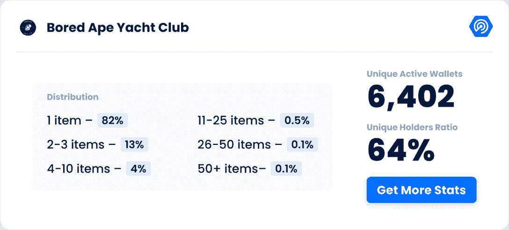
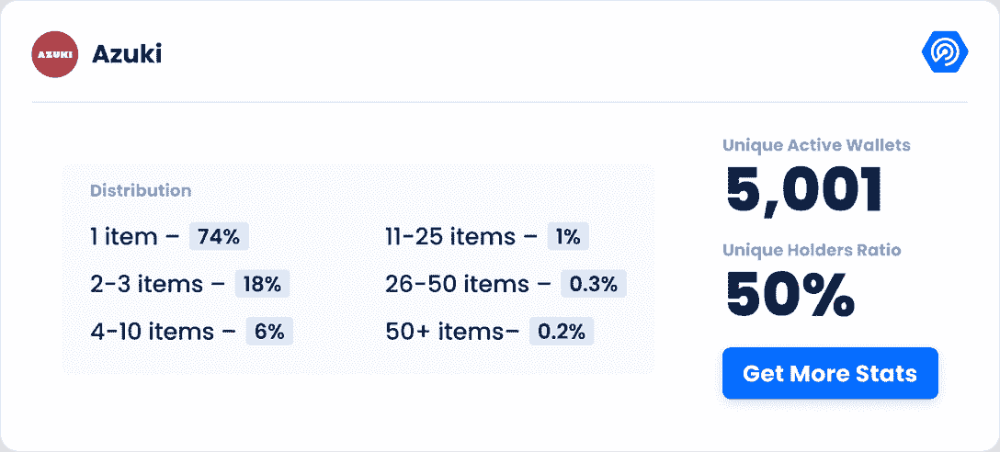
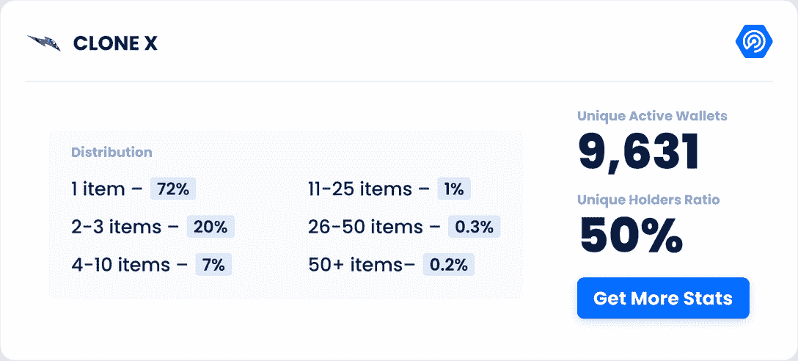
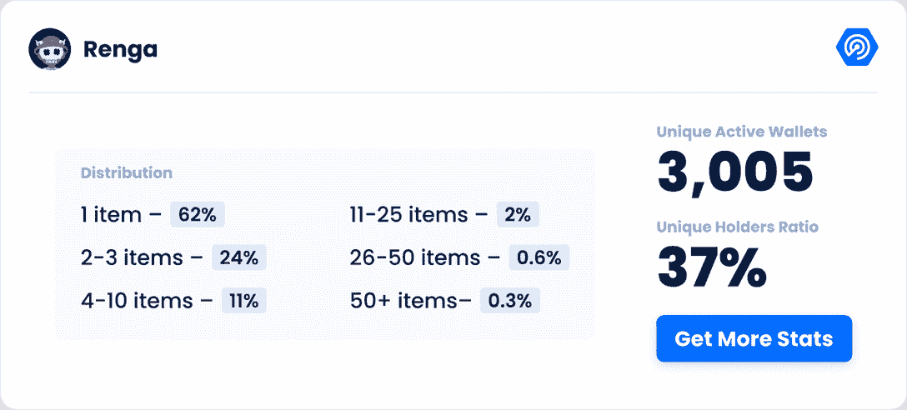
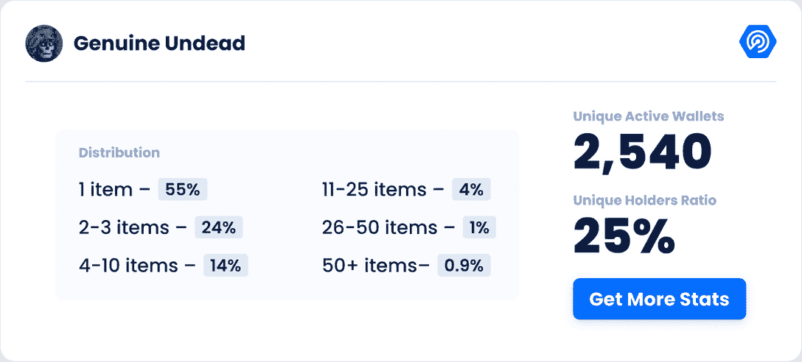

# 流行的 NFT 系列，最独特的钱包

> 原文：<https://web.archive.org/web/https://dappradar.com/blog/popular-nft-collections-with-most-unique-wallets>

## 独一无二的钱包是 NFT 系列分散程度的重要标志

在 NFT 社区，有各种各样的系列脱颖而出，但同样重要的是独特钱包的数量。唯一持有者越多，所有权就越分散。为什么这一指标对 NFT 系列如此重要？高或低的唯一持有人比率对 NFT 项目有什么影响？请继续阅读，了解答案。

无论你对 NFT 有多熟悉，你都可以利用 DappRadar 的各种数据指标来帮助你判断 NFT 或系列的市场表现。这些指标包括唯一持有人、交易数量、交易量、最高价格的单个项目等等。

独特的持有人代表多少独特的钱包至少有一个 NFT 从一个特定的集合。这个指标在 Opensea 上的对应名称是“owners”。

## 独特的钱包与独特的活动钱包

在进入今天的话题之前，让我们澄清一下独特钱包和活动钱包(UAW)之间的区别。UAW 是 DappRadar 用于 dapp 跟踪的重要指标之一。它强调独特的钱包的活动，这意味着在被跟踪的期间一定有交易。

[Dive into DappRadar Ranking](https://web.archive.org/web/20230310192312/https://dappradar.com/rankings)

相反，一个独特的钱包可以长期持有一个 NFT，而不执行任何交易行为。点击下面的按钮，阅读另一篇关于 UAW 对分散式应用意味着什么的文章。

[DappRadar Tracks Unique Active Wallets, But What Does That Mean?](https://web.archive.org/web/20230310192312/https://dappradar.com/blog/dappradar-tracks-unique-active-wallets-but-what-does-that-mean)

本文将讨论为什么独特的钱包对 NFT 收藏至关重要，以及如何在研究、收藏和交易 NFT 时利用它。

## 为什么需要关注独特的钱包？

大量独特的钱包参与 NFT 系列表明 NFT 持有者的分布更加均匀。某个系列的 NFT 越多，鲸鱼对价格的影响就越小。此外，这将表明该项目享有很高的知名度，以及与该指标相关的多个其他好处。

### 价格操纵

如果一个集合中的大部分非功能性钱包都放在少数钱包中，这应该被认为是一个危险信号。一旦他们开始大量抛售他们的 NFT，可能会导致价格大幅下跌。此外，少数人持有很大比例的藏品，这些用户可能故意抬高底价，使买家不得不支付高于市场正常水平的价格来收购藏品。

### 社区成员的多样性

一个系列拥有的独特钱包越多，这个群体就可能越多样化。理论上，这样的社区会有更多独特的个人，他们可以为社区贡献思想和创造力。此外，在项目推广时，更多的人可以传播这一信息。但是，钱包和真人只是有时候一对一的匹配。所以一定要考虑一个人拿着多个钱包的情况。

为什么人们会有多个钱包？一些用户更喜欢把他们的资产放在几个钱包里，他们的目的是减少黑客攻击的风险等。然而，一些人通过持有多个钱包获得了更多的造币机会，因为通常情况下，NFT 项目允许每个钱包在推出时铸造 1-2 个 NFT。

### 洗盘交易的可能性

在 NFT，当一个人或一个小团体交易 NFT 以创造人为的交易量时，就会发生“清洗”交易。他们的目的可能是试图抬高底价，或者通过虚假交易获得平台激励。

Wash 交易之所以成为可能，是因为大量的非金融资产集中在一个或几个人的钱包里。所以，我们看到的集中度高的集合是洗盘交易相对容易的目标。

那么什么样的交易数据会给洗盘交易提供线索呢？例如，如果一个集合有一个短期的事务高峰，我们需要进一步查看它的事务数据。如果项目有数百个 NFT 在几个钱包之间频繁流动，那么最有可能的情况是某人或某些人将这些 NFT 卖给他们自己。

## NFT 著名系列的钱包分布情况如何？

### 密码朋克

CryptoPunks 拥有 3626 个唯一钱包，唯一持有者比例为 36%。

**业主分布:**

*   1 项–74%
*   2-3 项–17%
*   4-10 项——6%
*   11-25 项-2%
*   26-50 个项目-0.5%
*   50 多种商品——0.7%

**顶级密码朋克钱包**

*   宇迦实验室:拥有 423 名朋克
*   拥有 218 名朋克
*   威尔科克斯:拥有 215 个朋克
*   拥有 156 名朋克
*   苏联朋克:拥有 146 个朋克

[Get more stats about CryptoPunks](https://web.archive.org/web/20230310192312/https://dappradar.com/ethereum/collectibles/cryptopunks)

### 无聊猿游艇俱乐部

Bored Ape 游艇俱乐部(BAYC)拥有 6397 个独特的钱包，独特持有者比例为 64%。

**业主分布:**

*   1 项-82%
*   2-3 项–13%
*   4-10 项——4%
*   11-25 项——0.5%
*   26-50 个项目-0.1%
*   50 多种商品——0.1%

**顶级 BAYC 钱包**

*   [奔道:](https://web.archive.org/web/20230310192312/https://dappradar.com/hub/wallet/eth/0xdbfd76af2157dc15ee4e57f3f942bb45ba84af24)拥有 303 只猿猴
*   丁加林:拥有 104 只猿
*   金丝雀保险库:72
*   98E711 : 71
*   08C1AE: 59
*   富兰克林厌烦了

[Get more stats about BAYC](https://web.archive.org/web/20230310192312/https://dappradar.com/ethereum/collectibles/bored-ape-yacht-club)

### 变异猿游艇俱乐部

变种人 Ape 游艇俱乐部(MAYC)拥有 12，933 个独特的钱包，独特持有者比例为 67%。

**业主分布:**

*   1 个项目–80%
*   2-3 项–16%
*   4-10 项——4%
*   11-25 项——0.5%
*   26-50 个项目–< 0.1%
*   50 多个项目–< 0.1%

**MAYC 顶级钱包**

*   [奔道:](https://web.archive.org/web/20230310192312/https://dappradar.com/hub/wallet/eth/0xdbfd76af2157dc15ee4e57f3f942bb45ba84af24)拥有 238 只变异猿
*   丁加林:拥有 99 只变异猿
*   [J1mmy 金库](https://web.archive.org/web/20230310192312/https://dappradar.com/hub/wallet/eth/0x8ad272ac86c6c88683d9a60eb8ed57e6c304bb0c):拥有 86 只变异猿
*   [麻吉老大哥:](https://web.archive.org/web/20230310192312/https://dappradar.com/hub/wallet/eth/0x020ca66c30bec2c4fe3861a94e4db4a498a35872)拥有 68 只变异猿
*   [买下每一滴](https://web.archive.org/web/20230310192312/https://dappradar.com/hub/wallet/eth/0x35ff42fc4a02e0e6789912f30b2415607099a535):拥有 59 只变异猿

[Get more stats about MAYC](https://web.archive.org/web/20230310192312/https://dappradar.com/ethereum/collectibles/mutant-ape-yacht-club)

### 志那都红豆

志那都红豆有 4998 个独特的钱包，独特持有人比例为 50%。

**业主分布:**

*   1 项–74%
*   2-3 项–18%
*   4-10 项——6%
*   11-25 项-1%
*   26-50 个项目-0.3%
*   50 多种商品——0.2%

**志那都红豆顶级钱包**

*   [豆鲸:](https://web.archive.org/web/20230310192312/https://dappradar.com/hub/wallet/eth/0xff3879b8a363aed92a6eaba8f61f1a96a9ec3c1e) 197 志那都红豆拥有
*   [志那都红豆奔道](https://web.archive.org/web/20230310192312/https://dappradar.com/hub/wallet/eth/0xd46c8648f2ac4ce1a1aace620460fbd24f640853) : 180 志那都红豆拥有
*   [D45058](https://web.archive.org/web/20230310192312/https://dappradar.com/hub/wallet/eth/0xd45058bf25bbd8f586124c479d384c8c708ce23a) 130 志那都红豆拥有
*   101 辆志那都红豆拥有
*   最后的骑士 Eth: 101 志那都红豆拥有

[Get more stats about Azuki](https://web.archive.org/web/20230310192312/https://dappradar.com/ethereum/collectibles/azuki)

### 克隆 X

Clone X 拥有 9，630 个唯一钱包，唯一持有者比例为 50%。

**业主分布:**

*   1 个项目–72%
*   2-3 个项目–20%
*   4-10 项–7%
*   11-25 项-1%
*   26-50 个项目-0.3%
*   50 多种商品——0.2%

**顶级克隆 X 钱包**

*   拥有 412 个克隆人 X
*   克隆人 X 道金库:拥有 153 个克隆人 X
*   拥有 130 个克隆 X
*   克隆 X 弯刀:拥有 101 个克隆 X
*   拥有 101 个克隆 X

[Get more stats about Clone X](https://web.archive.org/web/20230310192312/https://dappradar.com/ethereum/collectibles/clone-x-x-takashi-murakami)

## NFT 最新流行系列的钱包分布是怎样的？

### 连歌

Renga 拥有 2，984 个独特的钱包，独特持有人比例为 37%。

**业主分布:**

*   1 项-62%
*   2-3 项–24%
*   4-10 项——11%
*   11-25 项-2%
*   26-50 个项目-0.6%
*   50 多种商品——0.3%

**顶级连珠钱包**

*   托尔连加:拥有 195 个连加
*   1K :拥有 118 辆伦加
*   96D3B7 : 106 辆伦加拥有
*   修道士: 91 伦加拥有
*   1k 跳马:拥有 88 个连加

[Get more stats about Renga](https://web.archive.org/web/20230310192312/https://dappradar.com/hub/nft-explorer/collection/renga-by-dirtyrobot)

### qql mint 通

QQL Mint Pass 有 466 个独特的钱包，独特持有人比例为 54%。

**业主分布:**

*   1 个项目–70%
*   2-3 项–23%
*   4-10 项——6%
*   11-25 项-0.9%
*   26-50 个项目-0.2%
*   50 多种商品——0.2%

**顶级 QQL Mint Pass 钱包**

*   泰勒·霍布斯 X 蒲公英·威斯特:拥有 51 张通行证
*   [麻吉大哥:](https://web.archive.org/web/20230310192312/https://dappradar.com/hub/wallet/eth/0x020ca66c30bec2c4fe3861a94e4db4a498a35872)拥有 35 张通行证
*   拥有 23 张通行证
*   27F361 :拥有 14 张通行证
*   9684DF: 拥有 14 张通行证

[Get more stats about QQL Mint Pass](https://web.archive.org/web/20230310192312/https://dappradar.com/hub/nft-explorer/collection/ql-mint-pass-official-nft)

### 真正的亡灵

Renga 有 2，502 个独特的钱包，独特持有人比例为 25%。

**业主分布:**

*   1 个项目–55%
*   2-3 项–24%
*   4-10 项–14%
*   11-25 项-4%
*   26-50 个项目-1%
*   50 多种商品——0.9%

**顶级正版亡灵钱包**

*   拥有 207 个 NFT
*   [真正的不死鲸:](https://web.archive.org/web/20230310192312/https://dappradar.com/hub/wallet/eth/0x38fef205b860125af8e96e3b73a23b414074f103)拥有 170 NFTs
*   [逆智人:](https://web.archive.org/web/20230310192312/https://dappradar.com/hub/wallet/eth/0x5a2b6e84fadaa8b23ce782cb6226f87d1ba02416)拥有 146 个 NFT
*   [AB916C:](https://web.archive.org/web/20230310192312/https://dappradar.com/hub/wallet/eth/0xab916c4d4346af403e619a2e4759d53dd0d14f43) 拥有 130 辆 NFT
*   [冷却器最大值:](https://web.archive.org/web/20230310192312/https://dappradar.com/hub/wallet/eth/0xbca9faa320982f34779909e2347caf92c857f631)拥有 124 个 NFT

[Get more stats about Genuine Undead](https://web.archive.org/web/20230310192312/https://dappradar.com/hub/nft-explorer/collection/genuine-undead)

## 还需要注意什么？

从上一节的数据中可以看出，一个钱包可以容纳数百个 NFT，但有时这也没问题。也不意味着这些钱包试图操纵这个项目。在这一点上，我们需要留意独特的持有人的概况。他们是收藏家，鲸鱼，脚蹼，道，还是其他？

例如，在 CryptoPunk 和 BAYC 中，你可以看到 Wilcox 和 Dingaling 在积累令牌。这些鲸鱼的交易行为类似于传统金融中的基金。你可以通过 DappRadar 的 Whale 报告更深入地了解这些类型的用户。

[DappRadar Whale Report](https://web.archive.org/web/20230310192312/https://dappradar.com/blog/whales-report-trading-patterns-nft-collectors)

此外，名人大量收集特定的 NFT 系列。这些收藏者从知名投资者到娱乐明星、体育明星，不一而足。他们通常可以利用自己的名气来增加收藏的流量。

如果你想第一个知道哪些名人模仿了，点击下面的按钮找出答案。

[Celebrity Crypto & NFT Wallets Rich List](/web/20230310192312/https://dappradar.com/blog/celebrity-wallets-a-dive-into-crypto-hollywood/)

DappRadar 将继续监测 NFT 油田的最新发展。这篇文章将定期更新，为您提供最新的流行的 NFT 收藏钱包分布。

[https://web.archive.org/web/20230310192312if_/https://www.youtube.com/embed/fkEaXYLOW-s?feature=oembed](https://web.archive.org/web/20230310192312if_/https://www.youtube.com/embed/fkEaXYLOW-s?feature=oembed)

[Check out DappRadar NFT Explorer](https://web.archive.org/web/20230310192312/https://dappradar.com/hub/nft-explorer)

## 随身携带您的 Web3 之旅

使用 DappRadar 移动应用程序，再也不会错过 Web3。查看最受欢迎的 dapps 的性能，并关注您投资组合中的 NFT。您的 DappRadar 帐户与我们的移动应用程序同步，让您可以随时接收实时提醒。

[Download the DappRadar app now](https://web.archive.org/web/20230310192312/https://dappradar.app.link/blog)[<picture></picture>](https://web.archive.org/web/20230310192312/https://play.google.com/store/apps/details?id=com.portfolio.dappradar)