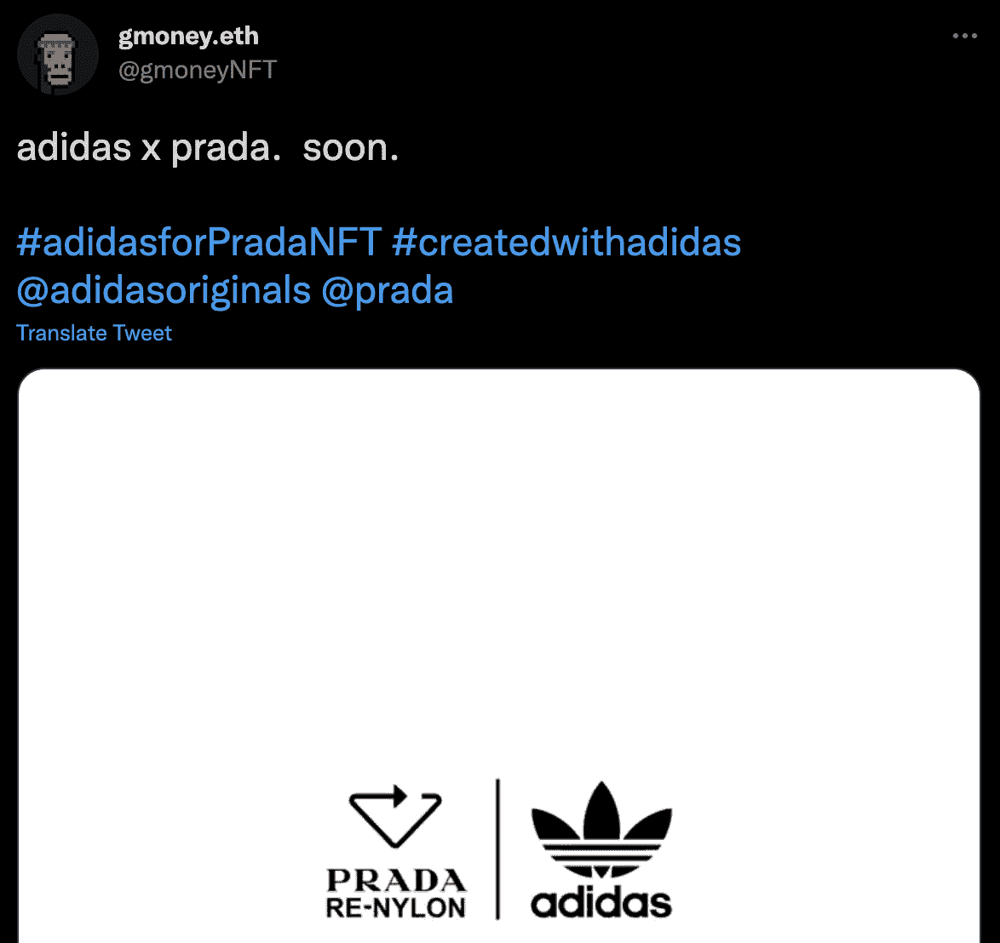

# 普拉达与阿迪达斯和格莫尼合作推出新的 NFT 系列

> 原文：<https://web.archive.org/web/https://dappradar.com/blog/prada-teams-up-with-adidas-and-gmoney-on-new-nft-collection>

## 该系列将于下周初推出

Gmoney.eth 最近在推特上宣布与普拉达和阿迪达斯合作推出一个系列，激起了 NFT 业界的热情。关于这个系列的细节仍然很少。然而，官方网站暗示将在 1 月 24 日披露更多信息。届时也有可能会出现下跌。

Gmoney.eth 在 NFT 是一个响当当的名字，这不是他第一次与阿迪达斯合作。运动服装品牌[已经与影响者推出了一个系列](https://web.archive.org/web/20221129150709/https://dappradar.com/blog/10-major-brands-in-the-metaverse/)，去年年底还推出了 Bored Ape 游艇俱乐部。然而，这是普拉达第一次进入 NFT 空间，这使得即将到来的下降本身就是一个事件。

从目前透露的小细节来看，这个系列将是一个重复使用、循环利用和重新思考的过程。即将推出的系列的正式名称是 Re-Source。阿迪达斯和普拉达已经合作创建了服装和配饰的实体尼龙线。即将到来的 NFT 之旅将是这一合作的自然延续。

## 普拉达加入大时尚品牌的 NFT 竞赛

普拉达是活跃在 NFT 市场的众多时尚和服装品牌中的最新一个。合作伙伴阿迪达斯已经通过其 [Originals NFT drop](https://web.archive.org/web/20221129150709/https://dappradar.com/ethereum/collectibles/adidas-originals-into-the-metaverse) 取得了长足的进步，仅在过去 24 小时内就产生了 172 万美元的交易量。

阿迪达斯的主要竞争对手耐克最近迈出了更大的步伐，收购了元宇宙时尚品牌 RTFKT。其他高级时装品牌如[【古驰】](https://web.archive.org/web/20221129150709/https://dappradar.com/blog/nft-superstars-janky-guggimon-partner-with-gucci/)和[【博柏利】](https://web.archive.org/web/20221129150709/https://dappradar.com/blog/blankos-bringing-burberry-and-deadmau5-into-gaming-nfts)也已经发布了一些 NFT 项目。

随着元宇宙和虚拟世界继续在加密领域占据突出地位，数字时尚的需求将会增加。因此，时尚界的大牌已经在寻求供应来满足这种需求。合作伙伴关系层出不穷，普拉达与阿迪达斯和 Gmoney 的合作只是最近的一个例子。敬请关注 1 月 24 日就在眼前。

DappRadar 将继续关注这个即将到来的项目，为您带来最新的更新。要了解最新的 NFT 交易数据，请查看 [DappRadar PRO](https://web.archive.org/web/20221129150709/https://dappradar.com/token/pro) 。专业版可以让你访问最近 15 分钟的销售和交易数据。此外，它开辟了过多的独家 [Discord](https://web.archive.org/web/20221129150709/https://discord.gg/4ybbssrHkm) 频道和讨论，DappRadar 社区在这里分享和交流对加密行业未来的想法。

 NewsletterUnsubscribe at any time. [T&Cs](https://web.archive.org/web/20221129150709/https://dappradar.com/terms) and [Privacy Policy](https://web.archive.org/web/20221129150709/https://dappradar.com/privacy-policy)