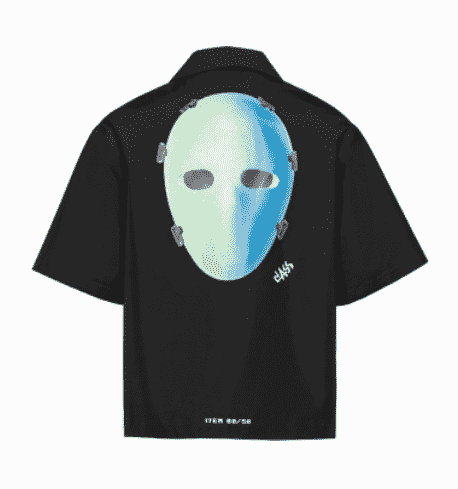
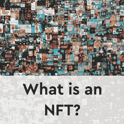
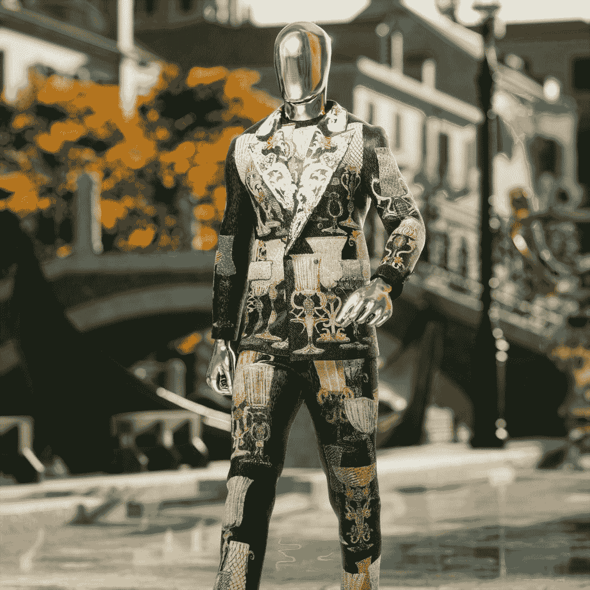

# 普拉达 x 凯西斯赫斯特确认新 NFT 和空投

> 原文：<https://web.archive.org/web/https://dappradar.com/blog/prada-x-cassius-hirst-confirm-new-nft-airdrop>

## 世界著名艺术家达米安·赫斯特之子的独家收藏

**奢侈时尚品牌普拉达本周宣布进一步进军 Web3 和 NFTs，推出独家 NFT 系列，并空投了世界知名艺术家达明安·赫斯特之子**卡修斯·赫斯特******。普拉达 Timecapsule NFT 系列将于 6 月 2 日推出，是该品牌于 2019 年 12 月推出的 Timecapsule 实体系列的演变。**

2019 年 12 月推出的最初的普拉达 Timecapsule 系列在每个月的第一个周四推出成衣单品。它在普拉达的网站上推出了限量版商品，仅在 24 小时内发售。每个项目都有一个序列号，并在定制包装交付。

6 月 2 日星期四，新的合作项目将推出 100 件中性衬衫，由艺术家达明安·赫斯特之子卡修斯·赫斯特设计。然而，这一次，普拉达将出售实物连同一个 NFT 的 GIF 具有相应的实物唯一的序列号。截至发稿时，价格尚未公布，而且要到发售当天才会公布。重要的是，我们知道销售将以法定货币进行，而不是加密货币。

此次发布标志着 NFTs 的又一个里程碑，作为第二阶段的营销和客户互动船只，原活动中任何普拉达 Timecapsule 项目的持有者都将排队等待免费 NFTs 的空投。

目前，还没有关于 NFTs 将如何被空投到实物购买者手中的细节，但是如前所述，所有的实物都有一个独特的序列号，该序列号将与空投的 NFT 保持一致。

NFTs 的效用将在适当的时候通过品牌在 [Discord](https://web.archive.org/web/20220705005017/https://www.discord.gg/prada) 上的新社区普拉达 Crypted 展示。虽然 NFT 是赠送给持有者的，但没有在二级市场上出售的规定，在某些情况下，这些 NFT 可能代表购买实物的退款。然而，了解普拉达客户的影响力和客户档案，这些非功能性交易可以继续产生巨大的需求和价值。

这个想法很好，因为它违背了榨取顾客利益以奖励忠诚顾客的大趋势，并且应该有助于普拉达将其 NFT 战略整合到已经很受欢迎的实体计划中。

[<picture></picture>](https://web.archive.org/web/20220705005017/https://dappradar.com/blog/what-are-non-fungible-tokens-nfts)[<picture></picture>](https://web.archive.org/web/20220705005017/https://dappradar.com/nft/marketplaces)[<picture></picture>](https://web.archive.org/web/20220705005017/https://dappradar.com/nft/sales)

## 大品牌进军 Web3

看待时尚 NFT 的一种方式是，不要将它们视为数字可穿戴设备，而是另一种营销流，品牌可以用它将自己的产品展示在付费观众面前。在过去的六个月里，高街品牌和奢侈时装公司已经一头扎进了非功能性服装市场。阿迪达斯、[耐克](https://web.archive.org/web/20220705005017/https://dappradar.com/blog/tag/nike)和[古驰](https://web.archive.org/web/20220705005017/https://dappradar.com/blog/gucci-launches-10-exclusive-supergucci-nfts)在 NFT 创造了 1.375 亿美元的销售额。Dolce & Gabbana 的数字拍卖就带来了 600 万美元的收入。

2021 年 9 月，意大利时装品牌杜嘉班纳(Dolce & Gabbana)与 UNXD 合作，以不到 600 万美元的价格拍卖了其 NFT 系列。这件由多米尼克·多尔茨和斯蒂芬诺·嘉班纳设计的玻璃套装以超过 100 万美元的价格售出。这是杜嘉班纳卖出的最贵的西装。

去年 12 月，[耐克收购了 NFT 工作室 RTFKT](https://web.archive.org/web/20220705005017/https://dappradar.com/blog/nike-acquired-nft-fashion-company-rtfkt-studios) ,此举引起了人们的惊讶，因为耐克以特立独行而闻名，不参与合作或收购。然后，在 2022 年 2 月，该合作伙伴发布了一个名为 MNLTH 的系列。

作为这个系列的一部分，一个神秘的品牌盒子被空投给了克隆 X NFT 的持有者。克隆 X 是由 RTFKT 和日本当代艺术家 Taskashi Murakami 设计的 NFT 系列。由于其未知的内容，空投箱是[目前在 OpenSea](https://web.archive.org/web/20220705005017/https://opensea.io/assets/0x86825dfca7a6224cfbd2da48e85df2fc3aa7c4b1/1) 上出售，售价 12325 美元(4.5 ETH)。当粉丝们[急切地讨论内容，然后发布他们打开盒子的视频时，耐克获得了免费营销。](https://web.archive.org/web/20220705005017/https://www.youtube.com/results?search_query=nike+rtfkt+mnlth)

## 大局

在酷的时候在区块链的钱包里放一堆数字服装仍然是市场的投机部分。围绕时尚 NFT 有[的炒作，它们很受欢迎，但众所周知，在加密领域，事情可能变化很快。如果这些物品在一两年内仍然没有真正的用途，它们将如何发展？如上所述，它们似乎在主要品牌的营销和宣传预算中占有明确的位置，但要成为主流，人们需要一个地方来佩戴它们，更重要的是，](/web/20220705005017/https://dappradar.com/blog/three-fashion-nft-collections-generate-137-5-million-in-three-months/)[展示它们](https://web.archive.org/web/20220705005017/https://dappradar.com/blog/boson-protocol-to-sell-physical-fashion-in-a-virtual-world)。

一个值得关注的地方是游戏世界，在这里头像皮肤是一笔大生意。堡垒之夜[无意中透露](https://web.archive.org/web/20220705005017/https://www.forbes.com/sites/paultassi/2021/05/11/epic-reveals-it-made-50-million-from-one-set-of-fortnite-skins/)仅 NFL 品牌的一个系列就赚了 5000 万美元。《英雄联盟》(League of Legends)通过出售游戏内资产、皮肤和礼品袋获得大量收入，据报道，[在 2020 年赚了 17.5 亿美元。](https://web.archive.org/web/20220705005017/https://www.dbltap.com/posts/how-much-money-did-league-of-legends-make-in-2021-01fr6hfexgdt)

随着在线游戏社区在 2021 年达到 32.4 亿人，精品和知名 NFT 时装设计师将进入这个市场。就目前而言，时尚品牌利用元宇宙的优势，积极参与其中，建立强大的数字部落，并为元宇宙生活的到来做准备。

 NewsletterUnsubscribe at any time. [T&Cs](https://web.archive.org/web/20220705005017/https://dappradar.com/terms) and [Privacy Policy](https://web.archive.org/web/20220705005017/https://dappradar.com/privacy-policy)

***以上不构成投资建议。此处给出的信息仅供参考。请行使尽职调查，做你的研究。作者持有多种加密货币的头寸，包括 BTC、瑞士法郎和雷达。***