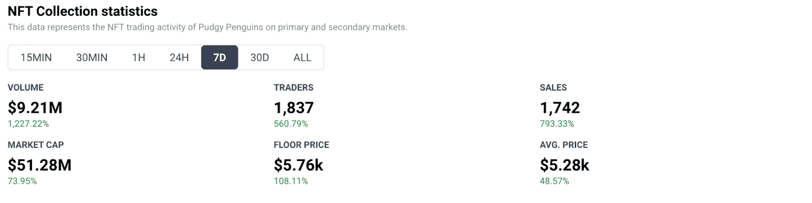
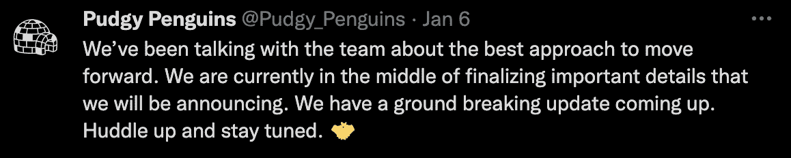

# 矮胖企鹅麻袋创始人，地板价格翻倍

> 原文：<https://web.archive.org/web/https://dappradar.com/blog/pudgy-penguins-sacks-founder-floor-price-doubles>

## 矮胖企鹅收藏的未来现在掌握在它的社区手中

经过矮胖企鹅社区的投票，创始人 ColeThereum 被从他的冰王座上移除。社区决定新的领导应该恢复该项目，这立即导致地板价格在过去一周翻了一番。

Pudgy Penguins 是去年夏天 BAYC 大肆宣传后推出的第一批 PFP 头像风格系列之一。不幸的是，随着时间的推移，该系列并没有按照社区的期望进行，矮胖的企鹅粉丝开始公开反对创始团队。经过几个月的反馈，矮胖企鹅团队几天前发起了一场社区投票，这决定了联合创始人 [ColeThereum](https://web.archive.org/web/20220929043712/https://twitter.com/ColeThereum) 的命运，他被投票淘汰出了这个项目。

令人印象深刻的是，经过动荡的几天，矮胖企鹅似乎找到了新的力量，收集活动一直在蓬勃发展。根据 [DappRadar 数据](https://web.archive.org/web/20220929043712/https://dappradar.com/ethereum/collectibles/pudgy-penguins)显示，在过去的七天里，与收藏互动的交易者数量上升了 560%。更重要的是，这使得交易量飙升了 1200%，达到 921 万美元。

随着围绕矮胖企鹅及其治理的讨论在社交媒体上爆发，收藏品的智能合同开始升温。过去一周的统计数据显示，各行各业的活动都出现了令人印象深刻的增长。重要的是，新发现的社区力量也将底价推高了 108%以上，使其达到目前的 1.64 ETH 的水平，约合 5760 美元。

## 矮胖企鹅怎么了？

Pudgy Penguins 是 Bored Ape 游艇俱乐部(Bored Ape Yacht Club)隆重进入 NFT 空间后几周推出的众多系列之一。企鹅收藏家们一直在耐心等待他们最喜爱的头像“登上月球”的时刻。然而，这一刻从未真正到来。尽管 2022 年伊始，NFT 热潮再起(例如，想想[涂鸦](https://web.archive.org/web/20220929043712/https://dappradar.com/blog/celebrities-ape-into-doodles-floor-passes-9-eth/))。

项目中的这种缺乏发展，以及随后团队中许多不成功的放弃，导致社区感觉被背叛了。因此，他们去寻找更好的管理他们的收藏。不满主要针对联合创始人 ColeThereum，他负责矮胖企鹅的社区管理和营销。

为了达到预期，矮胖企鹅团队发起了一项投票，询问科尔是否应该留在项目中。这件事发生在 1 月 5 日，投票颇有定论。科尔应该去。民意测验的结果很清楚。然而，在 Pudgy Penguins 的官方网站上，ColeThereum 仍然是联合创始人。

尽管如此，矮胖企鹅团队在 1 月 6 日发布了一条推特，宣布该项目将很快看到一些突破性的变化。这些变化仍不明朗。然而，看看该系列在过去一周的表现，这可能是矮胖企鹅需要的推动力。

由于企鹅持有者仍在等待官方信息，猜测开始在加密推特上酝酿。一些用户开始散布信息说 [9x9x9eth](https://web.archive.org/web/20220929043712/https://twitter.com/9x9x9eth) 将接管这个项目。他也是最大的企鹅鲸之一。他后来[解释说](https://web.archive.org/web/20220929043712/https://twitter.com/9x9x9eth/status/1478909630164185089)确实有人出价购买 888 ETH 的整个项目。但是，OpenDAO 创始人拒绝了。然而，矮胖企鹅的未来现在看起来更加光明了。

DappRadar 将继续监测矮胖企鹅，因此请继续关注关于该集合的未来和管理的最新更新。如果你想看到最新的企鹅销售数据，请查看 [DappRadar PRO](https://web.archive.org/web/20220929043712/https://dappradar.com/token/pro) 。专业版可以让你访问 NFT 收藏的 15 分钟增量的销售和活动数据。此外，你可以在 [Twitter](https://web.archive.org/web/20220929043712/https://twitter.com/dappradar) 和 [Discord](https://web.archive.org/web/20220929043712/https://discord.gg/4ybbssrHkm) 上关注 DappRadar，轻松了解所有 NFT 新闻。

 NewsletterUnsubscribe at any time. [T&Cs](https://web.archive.org/web/20220929043712/https://dappradar.com/terms) and [Privacy Policy](https://web.archive.org/web/20220929043712/https://dappradar.com/privacy-policy)