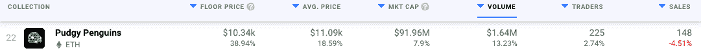
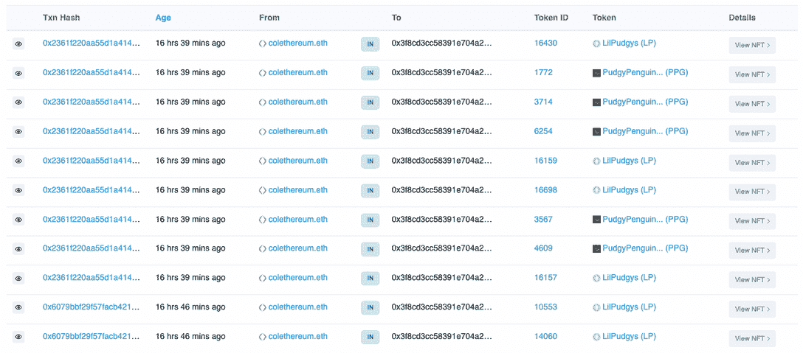
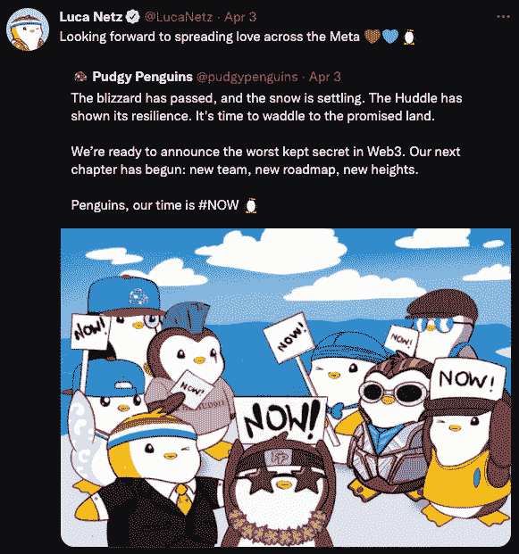

# 矮胖企鹅与新主人卢卡·内茨一起茁壮成长

> 原文：<https://web.archive.org/web/https://dappradar.com/blog/pudgy-penguins-thrives-with-new-owner-luca-netz>

## 在过去的 24 小时里，矮胖企鹅的地板价格上涨了 38%

在去年夏天的 BAYC 炒作之后，Pudgy Penguins 是第一批推出的 PFP 头像风格系列之一，它很快引起了炒作。不幸的是，在过去的几个月里，这个项目经历了不止一两次的挑战。这包括移除联合创始人 ColeThereum。然而，企鹅群聚的未来是光明的。 **上周末，企业家卢卡·内茨(Luca Netz)以 250 万美元的价格购买了该系列的控制权和管理权。**

***汇总***

*   ***矮胖企鹅***[***【NFT】收藏底价***](https://web.archive.org/web/20221003201814/https://dappradar.com/nft/collections)***24 小时涨 38%***
*   ***企业家[卢卡·内茨](https://web.archive.org/web/20221003201814/https://dappradar.com/blog/pudgy-penguins-thrives-with-new-owner-luca-netz/#Luca-Netz)现在拥有项目***
*   ***新团队，[新目标](https://web.archive.org/web/20221003201814/https://dappradar.com/blog/pudgy-penguins-thrives-with-new-owner-luca-netz/#new-goals)***
*   ***集合准备争雄烟雨*** [***领军 NFT 项目***](https://web.archive.org/web/20221003201814/https://dappradar.com/nft)

最近的收购对藏品的底价产生了直接影响。仅在过去的 24 小时内，矮胖企鹅的底价就飙升了 38%以上。这使得二级市场上最便宜的 NFT 企鹅的价格达到了 10，340 美元。

值得注意的是，该系列的市值也飙升至 9，000 多万美元，而企鹅 NFT 的平均售价飙升 18%，超过 11，000 美元。

## 卢卡·内茨花 250 万美元买下了矮胖企鹅

企业家兼狂热的 NFT 收藏家卢卡·内茨是矮胖企鹅的最大粉丝之一。他以总计 250 万美元的价格买下了整个项目，掌控了藏品的未来。所有权的转移已经发生，卢卡·内茨的钱包里现在有 21 只矮胖的企鹅，其中一些是昨天由 [colethereum.eth](https://web.archive.org/web/20221003201814/https://dappradar.com/hub/wallet/eth/0xfe5573c66273313034f7ff6050c54b5402553716/nfts) 转让的。

Source: [Etherscan](https://web.archive.org/web/20221003201814/https://etherscan.io/tokentxns-nft?a=0x3f8cd3cc58391e704a2a0fab2482b8116cb9d670&p=1)

购买的消息传开后，矮胖的企鹅群欢欣鼓舞。这个项目进行了几个月，结果并不令人满意，而且对该系列的未来发展缺乏明确的目标。这导致社区投票将 ColeThereum 排除在项目之外。你可以在这里阅读关于这段动荡时期的所有内容。一个奇怪的附带说明是，被放逐的联合创始人 ColeThereum 现在只拥有过去 24 小时内购买的 [2 只企鹅 NFT](https://web.archive.org/web/20221003201814/https://dappradar.com/hub/wallet/eth/0xfe5573c66273313034f7ff6050c54b5402553716/nfts/1/pudgypenguins)。

Source: [Twitter](https://web.archive.org/web/20221003201814/https://twitter.com/pudgypenguins/status/1510444156979761154)

## 新团队，新目标？

Luca Netz 承诺“在整个 Meta 传播爱”，他还与新团队进行了一个半小时的 Twitter 空间聊天。在交谈中，他介绍彼得·洛巴诺夫为该项目的新创意负责人。

除了介绍新团队之外，Luca Netz 还调侃了与 Pudgy Penguins 衍生项目的合作，以及即将到来的 Pudgyverse 和可能的 DAO 的许多令人兴奋的计划。要了解更多关于团队目标的信息，请点击这里查看整个 Twitter 空间记录[。](https://web.archive.org/web/20221003201814/https://twitter.com/Berko_Crypto/status/1510765606055956491?t=21URasC59G7QzHNG7cuxxg&s=19)

DappRadar 将继续监督 Pudgy Penguins 项目，作为新的想法，新的管理人员承担起恢复对这些 NFT 的兴趣的任务。从最新的销售数据来看，仅仅是所有权转移的消息就产生了积极的影响。如果你想密切关注矮胖的企鹅，请查看它们的官方 dapp 页面。此外，如果你自己拥有任何企鹅， [NFT 金融视图工具](https://web.archive.org/web/20221003201814/https://dappradar.com/hub/wallet/eth/0xfe5573c66273313034f7ff6050c54b5402553716/nfts-financial)可以让你跟踪你的投资，监控你的 NFT 投资组合的价值变化。

 NewsletterUnsubscribe at any time. [T&Cs](https://web.archive.org/web/20221003201814/https://dappradar.com/terms) and [Privacy Policy](https://web.archive.org/web/20221003201814/https://dappradar.com/privacy-policy)