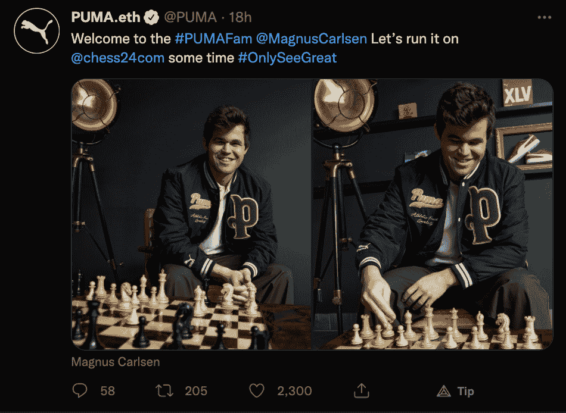
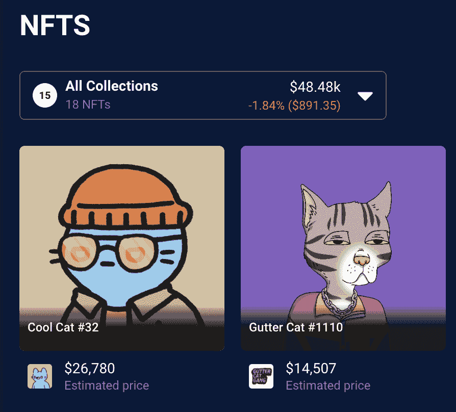

# 彪马进入 NFT 空间，锁定 ENS 域

> 原文：<https://web.archive.org/web/https://dappradar.com/blog/puma-enters-the-nft-space-locks-in-an-ens-domain>

## 阴沟猫帮也戏弄合作

运动服装品牌彪马(Puma)已经加入 NFT 市场，紧随竞争对手耐克(Nike)和阿迪达斯(Adidas)的脚步。这家受欢迎的体育公司在 Twitter 上更名为 Puma.eth，奇怪的是仅保留 ENS 域名 6 个月，直到 2022 年 10 月。

随着元宇宙的升温，更多的主流品牌转向 NFTs 和更广阔的 web3 空间。越来越多的服装和时尚公司进军加密领域，彪马是其中最新的一家。竞争对手阿迪达斯已经凭借其品牌 NFT 系列引起轰动，而[耐克](https://web.archive.org/web/20221007161619/https://dappradar.com/blog/nike-acquired-nft-fashion-company-rtfkt-studios/)继续疯狂购物，收购了元宇宙时尚品牌 RTFKT。

除了收购 Puma.eth 之外，这家运动服装公司还有意与流浪猫帮 NFT 收藏合作。关于这次合作的细节还没有公开，然而，一条非常令人心酸的消息出现在[阴沟猫帮的推特上](https://web.archive.org/web/20221007161619/https://twitter.com/GutterCatGang/status/1495877502484500486)。

此外，与 Puma.eth 相关的 NFT 投资组合包含 [Gutter Cat #1110](https://web.archive.org/web/20221007161619/https://dappradar.com/hub/assets/eth/0xedb61f74b0d09b2558f1eeb79b247c1f363ae452/1110) 。几天前，在公司向前主人支付了 7.25 ETH，约合 18494 美元后，NFT 进入了公司的钱包。

虽然关于即将到来的 Gutter Cat Gang 合作的细节仍然笼罩在神秘之中，但 Puma 也已经与国际象棋选手芒努斯·卡尔森合作。卡尔森最近成为了密码聚光灯下的焦点。他[购买了沙盒中的](https://web.archive.org/web/20221007161619/https://dappradar.com/blog/magnus-carlsen-and-the-sandbox-move-chess-into-the-metaverse/)虚拟土地，有效地将象棋世界带到了 web3。

## Puma.eth 钱包里还有什么？

彪马已经开始建立一个令人印象深刻的加密组合。在 NFTs 方面，运动服装品牌押注动物主题系列。除了[地沟猫#1110](https://web.archive.org/web/20221007161619/https://dappradar.com/hub/assets/eth/0xedb61f74b0d09b2558f1eeb79b247c1f363ae452/1110) ，公司钱包里还有一只[懒狮 NFT](https://web.archive.org/web/20221007161619/https://dappradar.com/hub/assets/eth/0x8943c7bac1914c9a7aba750bf2b6b09fd21037e0/4609) ，一只[酷猫 NFT](https://web.archive.org/web/20221007161619/https://dappradar.com/hub/assets/eth/0x1a92f7381b9f03921564a437210bb9396471050c/32) ，还有一只[考拉 NFT](https://web.archive.org/web/20221007161619/https://dappradar.com/hub/assets/eth/0x7f0159d3a639a035797e92861d9f414246735568/411) 。

除了 Puma 投资组合中的 17 个 NFT，该公司的钱包还持有价值约 27，449 美元的以太坊。根据 [DappRadar 使用统计工具](https://web.archive.org/web/20221007161619/https://dappradar.com/hub/wallet/eth/0x4b26bdf68ac9abfb19f6146313428e7f8b6041f4/usage-stats)，钱包只与二级市场 [OpenSea](https://web.archive.org/web/20221007161619/https://dappradar.com/ethereum/marketplaces/opensea) 进行过交互。迄今为止，彪马已经花费了大约 250 美元的汽油费。

一个有趣的细节是，Puma 尚未涉足一些最受欢迎的动物主题系列。具体来说，[无聊猿游艇俱乐部](https://web.archive.org/web/20221007161619/https://dappradar.com/ethereum/collectibles/bored-ape-yacht-club)。Puma 的投资组合中还缺少其他知名品牌，如[crypto punk](https://web.archive.org/web/20221007161619/https://dappradar.com/ethereum/collectibles/cryptopunks)和 [CyberKongz](https://web.archive.org/web/20221007161619/https://dappradar.com/ethereum/collectibles/cyberkongz) 。尽管如此，该公司刚刚宣布进军 NFT 领域，因此 DappRadar 将继续关注 Puma.eth

要了解元宇宙和 NFT 的最新新闻，请查看 DappRadar PRO。PRO 让你获得最新的 NFT 销售数据，并授予你独家 [Discord](https://web.archive.org/web/20221007161619/https://discord.gg/4ybbssrHkm) 频道。此外，你可以在推特[点击](https://web.archive.org/web/20221007161619/https://twitter.com/dappradar)关注 DappRadar。

 NewsletterUnsubscribe at any time. [T&Cs](https://web.archive.org/web/20221007161619/https://dappradar.com/terms) and [Privacy Policy](https://web.archive.org/web/20221007161619/https://dappradar.com/privacy-policy)