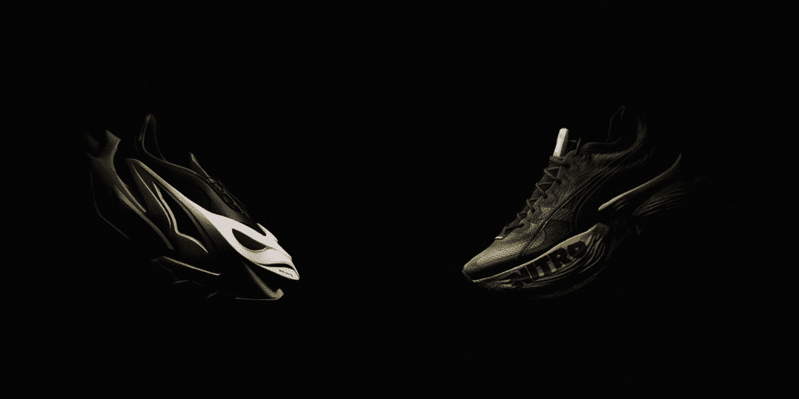
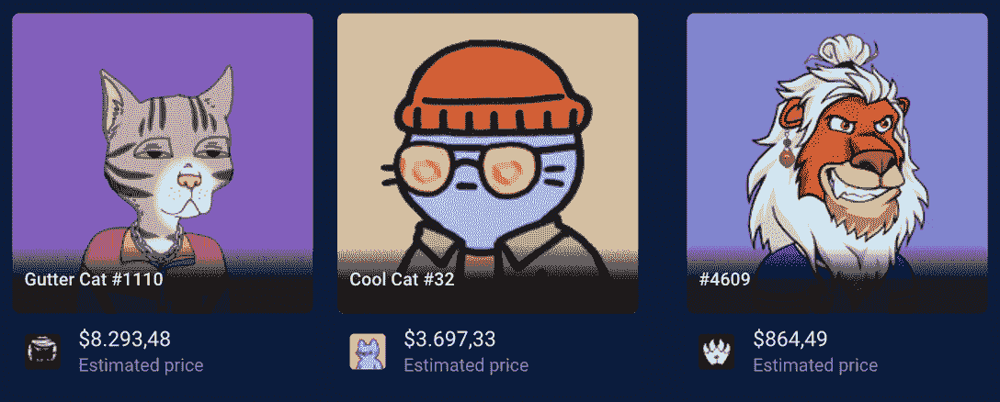

# 彪马在纽约时装周推出 NFTs &元宇宙体验

> 原文：<https://web.archive.org/web/https://dappradar.com/blog/puma-launches-nfts-metaverse-experience-at-new-york-fashion-week>

## 在时尚界最大的活动期间，这个巨大的运动服装品牌将更深入 Web3

在一个重复出现的巨人趋势中，彪马再次探索了时尚和元宇宙融合的结果。该品牌选择在 2022 年纽约时装周上推出自己的元宇宙空间，名为 Black Station，以及独家 NFTs。

我们正在目睹有史以来最具革命性的 NYFW 活动，数码收藏品[充分融入时尚界。](https://web.archive.org/web/20220929091024/https://dappradar.com/blog/what-are-non-fungible-tokens-nfts)

在 [Black Station](https://web.archive.org/web/20220929091024/https://blackstation.puma.com/) ，Puma 展示了一个 3D 空间，人们可以在这里发现他们的新 NITRO NFRNO 和 NITRO Fastroid 运动鞋。9 月 13 日，该品牌还将在这里展示 NYFW 沉浸式时装秀“Futrograde”。

通过进入大厅空间的三个门户，你会发现新的运动鞋——链接到彪马的 NFT 硝基薄荷，以及虽然尚未推出的 Futrograde 秀。

NITRO NFRNO and NITRO Fastroid Sneakers, debuting at NYFW

该展览将展示带有混合复古签名和创新合作的系列，以加强 Web3 空间内的品牌。

在官方[新闻稿](https://web.archive.org/web/20220929091024/https://www.prnewswire.com/news-releases/black-station-puma-reveals-first-ever-metaverse-experience-with-exclusive-nfts-at-new-york-fashion-week-301618803.html)中，Puma 表示 Black Station 是一个跨越时尚、运动性能、品牌传统经典和创新的数字探索的新门户。

## 彪马的 NFT 风险投资公司

而《时尚》杂志不得不问并解释，“彪马在纽约时装周上做什么？”一段时间以来，我们 DappRadar 一直关注着[品牌进入 NFT 空间](https://web.archive.org/web/20220929091024/https://dappradar.com/blog/puma-enters-the-nft-space-locks-in-an-ens-domain)的历程。

今年早些时候，Puma 将其官方 Twitter 账户重命名为 *Puma.eth* ，并保留 ENS 域名仅 6 个月，直到 2022 年 10 月。此外，与 Puma.eth 相关的加密和 NFT 组合包含一些知名项目的收藏品。

[NFTs on Puma’s wallet via DappRadar Portfolio Tracker](https://web.archive.org/web/20220929091024/https://dappradar.com/hub/wallet/eth/0x4b26bdf68ac9abfb19f6146313428e7f8b6041f4/nfts/1)

在 DappRadar，你可以先睹为快名人的 NFT 投资组合。[访问名人密码& NFT 钱包富豪榜](https://web.archive.org/web/20220929091024/https://dappradar.com/blog/celebrity-wallets-a-dive-into-crypto-hollywood)

## 时尚遇上网络 3

这并不是最近唯一一个测试创新伙伴关系和推出 NFTs 的时尚先锋。

像彪马一样，其他著名的时尚品牌也在元宇宙推出了合作伙伴和系列。阿迪达斯、古驰、杜嘉班纳以及最近的耐克也加入了这场游戏。

2021 年 12 月，[耐克](https://web.archive.org/web/20220929091024/https://dappradar.com/blog/nike-acquired-nft-fashion-company-rtfkt-studios)收购了 Web3 中最具创新性的时装公司之一 RTFKT Studios。凭借创造数字可穿戴设备、收藏品和蓝筹股 [CloneX NFT 系列](https://web.archive.org/web/20220929091024/https://dappradar.com/hub/nft-explorer/collection/clonex)的经验，这一合作关系提高了未来时尚*的门槛。*

 *## 继续关注 NFT 最大的项目

当越来越多的富人和有权势的人进入 NFTs 和去中心化的应用程序时，这个空间是为每个人准备的。

这些趋势只是展示了时尚的未来会是什么样子，以及我们如何交流。元宇宙将越来越成为我们的一部分，我们最好做好准备。

如果你有兴趣了解更多关于 NFTs 和元宇宙趋势的信息，一定要去看看 DappRadar 博客上一些很棒的教育内容。

我们还报道业内最重要的最新消息，因此您应该关注我们的 [Twitter](https://web.archive.org/web/20220929091024/https://twitter.com/DappRadar) 以保持领先。

***以上不构成投资建议。此处给出的信息仅供参考。请尽职调查并自行研究。***

 NewsletterUnsubscribe at any time. [T&Cs](https://web.archive.org/web/20220929091024/https://dappradar.com/terms) and [Privacy Policy](https://web.archive.org/web/20220929091024/https://dappradar.com/privacy-policy)*