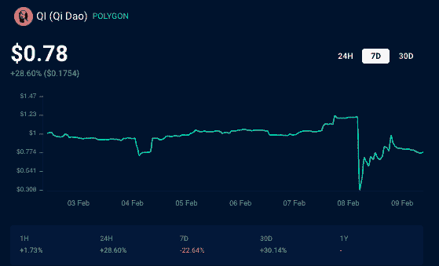
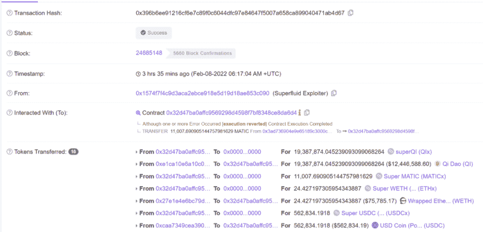
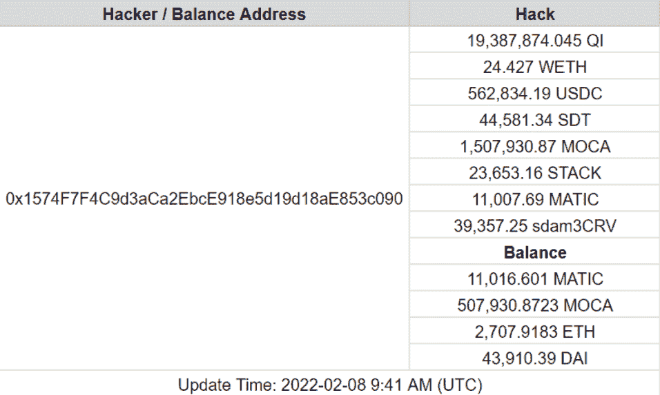

# 青岛超流体合同开采价值 1300 万美元

> 原文：<https://web.archive.org/web/https://dappradar.com/blog/qi-dao-superfluid-contract-exploited-for-13-million>

## 复杂攻击中的超流体授权合同

多边形上的 Stablecoin 协议 Qi Dao 区块链 [**带着**](https://web.archive.org/web/20221007155216/https://twitter.com/QiDaoProtocol/status/1490985946346844162?s=20&t=EIx6LpNLPRDpPJp5EWqmqg) **在 2 月 8 日星期二的推特上，告知社区关于超流体归属合同的一个漏洞。此外，齐道向用户保证资金是安全的，齐道的资金没有受到影响。**

超流体也证实了奇道上的漏洞，并表示正在分析情况，将很快更新。需要注意的是，该漏洞是利用超流体合同中的漏洞进行的，而奇道没有被利用。如前所述，七道作为一个稳定的协议存在于多边形区块链上。它使用户能够实时、持续地将资产从一个钱包转移到另一个钱包。例如，1000 美元将以每天 10 美元的速度从一个钱包转移到另一个钱包。

## 团队代币被取走

早期的报道表明，被盗的资金属于该项目的一些早期支持者，包括团队既得的令牌。这一漏洞导致齐道的气令牌价格下跌了 65%。从 1.24 美元到 0.27 美元，因为黑客在领先的 Polygon exchange QuickSwap 上以高滑点抛售了 QI。自从漏洞被公布后，价格开始回升，在撰写本文时，由于投资者抓住机会买入，价格回升至 0.78 美元。

虽然用户的资金没有受到影响，但[黑客们设法带走了价值超过 2000 万美元](https://web.archive.org/web/20221007155216/https://polygonscan.com/tx/0x396b6ee91216cf6e7c89f0c6044dfc97e84647f5007a658ca899040471ab4d67)的代币，包括 562，000 USDC、24 wETH、44，000 Stake DAO (SDT)、[150 万加密艺术博物馆(MOCA)](https://web.archive.org/web/20221007155216/https://twitter.com/MuseumofCrypto/status/1491060462427205633) 等等。

Source: [Polygonscan](https://web.archive.org/web/20221007155216/https://polygonscan.com/tx/0x396b6ee91216cf6e7c89f0c6044dfc97e84647f5007a658ca899040471ab4d67)

多亏了分析公司 SlowMist，我们可以更清楚地看到黑客活动的程度。在分析钱包交易数据后，估计黑客成功窃取了约 1300 万美元的密码。

## 压力下的象征性桥梁

在 P [olygon Network 在红杉资本印度公司(Sequoia Capital India)牵头的一轮融资中筹集了 4.5 亿美元后几天，该漏洞就出现了，其中包括来自软银愿景基金 2、银河数码和老虎环球等风险投资公司的投资。然而，关于该漏洞的新闻并没有影响 Polygon 的 native MATIC token 的 token 价格，因为人们普遍认为错误在于超流体授权合同，而不是 Polygon 本身。](https://web.archive.org/web/20221007155216/https://economictimes.indiatimes.com/tech/startups/polygon-raises-450-million-from-sequoia-india-others-to-scale-ethereum/articleshow/89413660.cms)

这是两周内第三次引人注目的智能合约攻击。1 月 28 日，币安智能链上的 DeFi 协议 Qubit Finance 看到黑客利用其令牌桥获得了 8000 万美元。然后在 2 月 3 日，黑客攻击了索拉纳虫洞桥，并带走了价值 3 . 21 亿美元的代币。

以太坊创始人 [Vitalik Butterin 最近表达了对令牌桥](https://web.archive.org/web/20221007155216/https://old.reddit.com/r/ethereum/comments/rwojtk/ama_we_are_the_efs_research_team_pt_7_07_january/hrngyk8/)的担忧，更具体地警告了它们在 51%攻击事件中的脆弱性。他的评论是随着更多的低成本 EVM 兼容第一层网络，如 Polygon，寻求利用以太坊的高额燃气费而来的。他有一个很强的观点，考虑到跨链协议是 2021 年黑客攻击最严重的协议之一，这一趋势将持续到 2022 年。

 NewsletterUnsubscribe at any time. [T&Cs](https://web.archive.org/web/20221007155216/https://dappradar.com/terms) and [Privacy Policy](https://web.archive.org/web/20221007155216/https://dappradar.com/privacy-policy)

***以上不构成投资建议。此处给出的信息仅供参考。请行使尽职调查，做你的研究。作者持有 ETH、BTC、AGIX、HEX、LINK、GRT、CRO、OMI、不可变 X、GALA、AVASTR、GMEE、CUBE、RADAR、FLOW、FTM、BNB、SPS、WRLD、ATOM 和 ADA。***