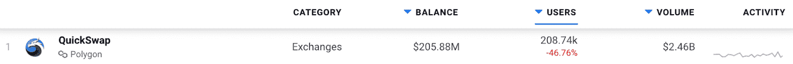

# QuickSwap 及其快速令牌

> 原文：<https://web.archive.org/web/https://dappradar.com/blog/quickswap-and-its-quick-token>

## 关于基于多边形的索引，您需要知道的一切

**QuickSwap 是多边形上最流行、应用最广泛的去中心化交换。该平台的本机令牌 QUICK 是 QuickSwap 提供的功能和盈利机会的一个组成部分。请继续阅读，了解你需要知道的关于多边形交易所的一切。**

于 2020 年推出的 [QuickSwap](https://web.archive.org/web/20230116132322/https://dappradar.com/polygon/exchanges/quickswap) 是首批采用高吞吐量和低费用第二层解决方案区块链多边形的 dex 之一。QuickSwap 是在以太坊的 Uniswap 之后设计的，很快成为 Polygon 上的首选交换服务。

除了明显的代币互换功能，该平台还提供了各种各样的加密投资工具。交易员可以设置限价单，或在养殖池中提供流动性以获取回报。每当向资金池发送交易费时，就会分发奖励。

根据 DappRadar 的数据，在过去的三十天里，QuickSwap 已经吸引了超过 200，000 个独特的活动钱包。该平台还产生了超过 24 亿美元的交易额。由此可见 QuickSwap 的服务在 Polygon 上的受欢迎程度。

## 更多关于 QuickSwap 及其本机令牌 QUICK 的信息

QuickSwap 已经成功地吸引了 Polygon 上交易者的注意。然而，如果没有平台的本地令牌 QUICK，这是不可能的。QUICK 是平台上所有交易、交换和耕作功能的基础。这也是利用 QuickSwap 上所有投资工具的最简单方法。

QUICK 总共供应 100 万代币。此外，96.75%的供应流向了 QuickSwap 上的流动性矿池。目前，一个快速令牌的价格为 207.28 美元。您可以通过其 [DappRadar 单令牌页面](https://web.archive.org/web/20230116132322/https://dappradar.com/hub/token/polygon/QUICK/ETH?from=0x831753dd7087cac61ab5644b308642cc1c33dc13)轻松跟踪价格变化。

根据 DappRadar Token Explorer 的数据，在撰写本文时，QUICK 是 Polygon 上十大交易量最大的 DeFi tokens 之一。这表明，除了 QuickSwap 作为交易所的受欢迎程度之外，QUICK 作为一项独立资产也成功吸引了交易者的注意。

如果你想开始交易和交换，你可以通过 DappRadar 令牌交换服务轻松获得一些快速令牌。此外，您可以在这里查看 QuickSwap。在 [Twitter](https://web.archive.org/web/20230116132322/https://twitter.com/dappradar) 上关注 DappRadar，并加入 [DappRadar PRO](https://web.archive.org/web/20230116132322/https://dappradar.com/token/pro) 以获得更多教育内容，并熟悉区块链空间中丰富的 dapps 和协议生态系统。

 NewsletterUnsubscribe at any time. [T&Cs](https://web.archive.org/web/20230116132322/https://dappradar.com/terms) and [Privacy Policy](https://web.archive.org/web/20230116132322/https://dappradar.com/privacy-policy)