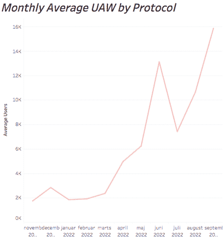
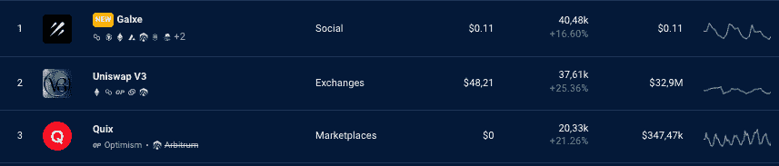
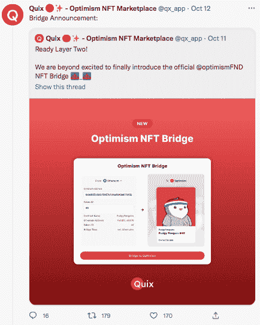
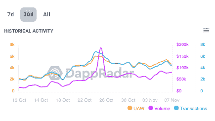

# 如何在 Quix NFT 市场交易和赢取 OP 代币

> 原文：<https://web.archive.org/web/https://dappradar.com/blog/quix-nft-marketplace-optimism-op-token-trading-rewards>

## Quix 是乐观第二层网络上的 NFTs 之家

Quix NFT 市场火了，在排名上紧随 OpenSea 和 Magic Eden 之后。在官方最近宣布看好 NFT 大桥后，其 UAW 在过去一个月内增长了 62.79%。让我们揭开数据背后的故事，告诉你如何赚取 OP 代币。

**内容**

*   **[什么是 Quix NFT 市场？](https://web.archive.org/web/20221130143115/https://dappradar.com/blog/quix-nft-marketplace-optimism-op-token-trading-rewards/#What-is-Quix-NFT-Marketplace?-)**
*   在 Quix NFT 市场上你能做些什么？
*   为什么在过去的一个月里，Quix 无人机数量增加了？
*   **[如何赚取 OP 代币？](https://web.archive.org/web/20221130143115/https://dappradar.com/blog/quix-nft-marketplace-optimism-op-token-trading-rewards/#How-to-earn-OP-tokens?)**

## 什么是 Quix NFT 市场？

Quix 是乐观 NFT dapp 生态系统的明星，拥有超过 100 个系列，为 34，000 名用户提供服务。它是专为第 2 层解决方案而构建的，具有可伸缩性、快速性和安全性。在撰写本文时，Quix 通过早期乐观主义者、Opti Punks 和 Apetimism 等流行集合在 NFTs 中交易 24 小时 83，604 美元或 53.31 ETH。

[Get Quix NFTs](https://web.archive.org/web/20221130143115/https://dappradar.com/multichain/marketplaces/quix)

在过去的 6 个月里，乐观情绪稳步增长。2022 年 5 月，该协议有 6224 个 UAW，去年 9 月显示有 15855 个 UAW，显示出大约 150%的惊人增长。

使用 DappRadar 排名，我们可以看到 Quix 是乐观主义的顶级 dapps 之一，占据第三位，分别落后于排名第二和第一的 Uniswap V3 和 Galxe。看看 dapp 在过去 7 天的活动，你会看到 347，470 美元的交易量和独特的活跃钱包数量飙升 21%，达到 20，330 个。

[Discover Optimism Dapps](https://web.archive.org/web/20221130143115/https://dappradar.com/rankings/protocol/optimism)

## 在 Quix NFT 市场上你能做些什么？

这个平台有适合每个人的东西，包括用户和开发者。如果你是一个用户，准备收集和出售数字收藏品。例如，你可以将 NFTs 从以太坊区块链转移到乐观主义，然后再转移回来。这是通过乐观桥实现的，非常类似于将加密货币从一个区块链连接到另一个的方法。

此外，为了增加你按时获得奖励的机会，你也可以做乐观任务。

[Discover Galxe](https://web.archive.org/web/20221130143115/https://dappradar.com/multichain/social/galxe)

另一方面，如果你是一名开发人员，Quix 的 NFT Launchpad 可以让你启动免费的智能合同。这些收藏可以用于应用内稀有度排名计算器和扫地工具。

## 为什么在过去的一个月中 Quix UAWs 增加了？

最近几个月，Quix 在吸引新买家和卖家方面做得很好，这一趋势与上图中的乐观情绪相似。高峰值，尤其是在过去的一周，可能是由于这个平台的新手用户和急切的令牌猎人。

[Check Quix´s Growth](https://web.archive.org/web/20221130143115/https://dappradar.com/multichain/marketplaces/quix)

这种宣传与该团队最近于 10 月 12 日发布的官方乐观 NFT 桥以及激励其平台用户的几项任务相吻合。下图显示了此类事件后包括 UAW、交易量和交易量在内的所有统计数据的激增趋势。

[Check Rankings](https://web.archive.org/web/20221130143115/https://dappradar.com/rankings/category/marketplaces)

前往我们的排名，通过市场过滤，查看 DappRadar 上所有协议中表现最佳的市场。

## **如何赚取 OP 代币？**

OP 是乐观主义生态系统的固有表征。令牌可以作为支付货币和奖励用于治理决策。Quix 上的活动可以为您赢得 OP 中支付的奖励，但在寻找 OP 令牌之前，您必须首先检查您的资格。

### 您需要满足以下一项或多项资格标准:

*   在 2021 年 6 月 23 日之前使用过 OP 桥，或者在 2021 年 6 月 23 日到 2022 年 3 月 25 日之间使用乐观项目超过一次。
*   在 2021 年 6 月 23 日至 2022 年 3 月 25 日之间的四个不同的星期里回来使用 OP 上的应用程序。
*   积极参与 L1 的治理。]
*   控制大型资金池和关键协议功能，
*   捐赠给 L1 的 Gitcoin Grants
*   作为 L1 的活跃用户，我经常使用桥梁

如果您归类为合格，这是您现在需要关注的地方:

1.  **通过 DappRadar** 访问 Quix dapp，并确保连接您的乐观钱包。只需打开元掩码，选择下拉菜单，然后选择“添加网络”
    1.  网络名称–乐观主义
    2.  新的 RPC URL-[https://mainnet .乐观. io](https://web.archive.org/web/20221130143115/https://mainnet.optimism.io/)
    3.  链条 ID–10
    4.  货币符号–ETH
    5.  块资源管理器-[https://optimistic . ethers can . io](https://web.archive.org/web/20221130143115/https://optimistic.etherscan.io/)
2.  通过他们的任务和测验寻找 OP，投入一些时间，目标是完成至少 50-75 个这样的任务。你可以在 [Galxe](https://web.archive.org/web/20221130143115/https://dappradar.com/multichain/social/galxe) 上找到这些任务
3.  任务和测验包括互动，如交易、搭桥、买 NFT。使用 [DappRadar 乐观排名](https://web.archive.org/web/20221130143115/https://dappradar.com/rankings/protocol/optimism)找到有趣的 dapps。
4.  通过与他们的智能合同互动，你增加了获得奖励的机会，这些合同促进了乐观主义生态系统的使用和发展。
5.  **在 Twitter 上关注问答游戏 NFT 市场**
6.  任何使用乐观主义 NFT 桥的人都可以宣称拥有这座桥。最大供应量为 100，000，铸造将于 2023 年 1 月 1 日结束。
7.  **在钱包中持有任何 OP OG NFT** 将为用户在 Quix 上购买任何 NFT 赢得 2% $OP 奖励。

## 随身携带您的 Web3 之旅

使用 DappRadar 移动应用程序，再也不会错过 Web3。查看最受欢迎的 dapps 的性能，并关注您投资组合中的 NFT。您在 DappRadar 上的帐户会与我们的移动应用程序同步，这样您很快就可以选择实时接收提醒。

[Download the DappRadar app now](https://web.archive.org/web/20221130143115/https://dappradar.app.link/blog)[<picture></picture>](https://web.archive.org/web/20221130143115/https://play.google.com/store/apps/details?id=com.portfolio.dappradar)