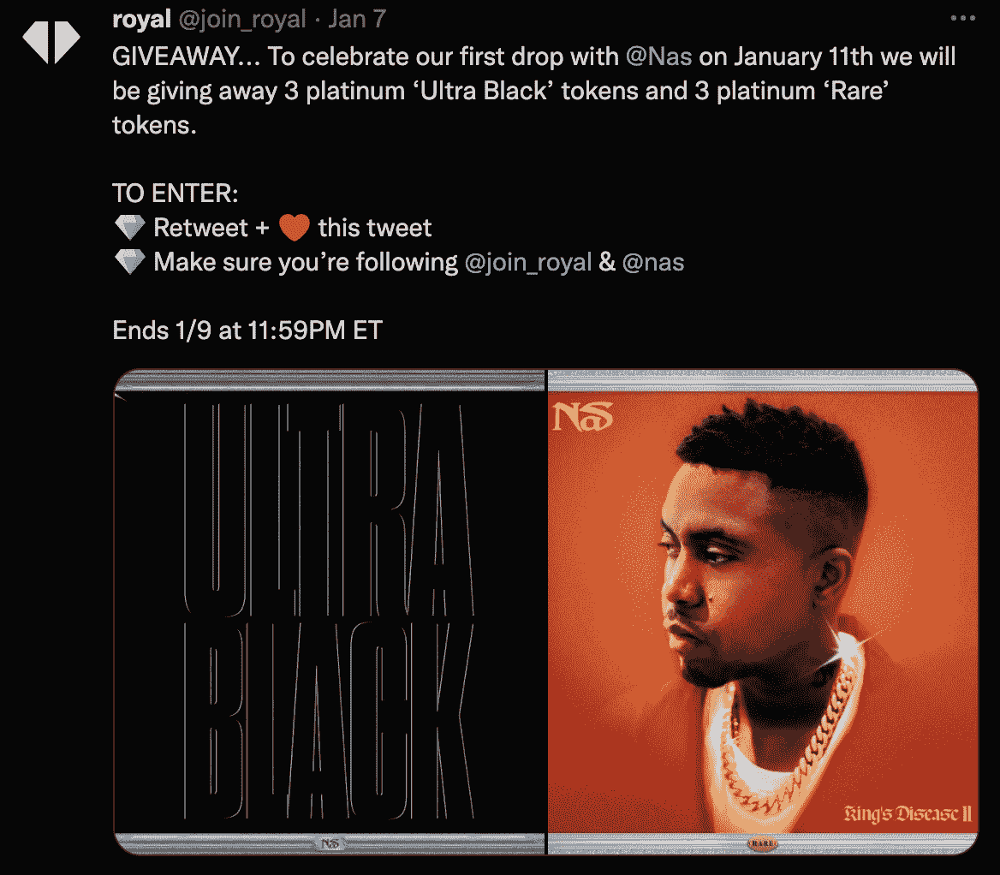

# 说唱歌手 Nas 让粉丝通过 NFTs 赚取流媒体版税

> 原文：<https://web.archive.org/web/https://dappradar.com/blog/rapper-nas-lets-fans-earn-streaming-royalties-through-nfts>

## Nas 与 Royal 合作，提供他的两首歌曲的版税权利作为 NFTs

世界著名的说唱歌手和加密早期采用者 Nas 宣布与 NFT 平台 Royal 合作，这将允许他的粉丝购买 NFT，给他们歌曲流媒体的版税收入。这位说唱歌手选择了两首歌曲，作为限量版 NFTs 发行。每个 NFT 都让所有者有权从流媒体平台获得一定比例的版税利润。

作为“有限数字资产”(LDA)推出的第一首歌是《超黑》(Ultra Black)。它是“国王的疾病 II”专辑的一部分。将会有 760 个为“超黑”铸造的 NFTRoyal 上的第二首歌是“稀有”，它将作为 1110 个令牌下降。这两种 NFT 都将于 1 月 11 日上市。重要的是，收藏家和粉丝们必须在键盘上快一点，因为可用性很少，而且没有白名单或预留位置。

尽管如此，Royal 还是在 Twitter 上发起了一场赠品竞赛。它将允许六名幸运的获奖者享受两个 NFT 之一的免费白金版。目前还没有关于版税的确认。然而，预计 NFT 越稀有，特许权使用费百分比越高。

## Nas 与 3LAU's Royal 合作

有趣的是，NFT 的这次发布很容易被称为合作。粉丝兼音乐人 3LAU 创造了 Royal。3LAU 有大量的 NFT 作品集，你可以通过 DappRadar 作品集追踪器查看他的全部收藏。

罗亚尔还没有成为头条新闻。然而，这是主流音乐产业和 NFT 空间融合的重要的第一步。允许粉丝从他们对音乐的热爱中获利是一个有利可图的机会，这无缝集成了区块链技术。

Nas 不是唯一一个认识到 Royal 背后潜力的音乐家。根据最近的一条推文，Royal 已经获得了其他大牌如 Chainsmokers 和 Kygo 的投资。此外，比特币基地也将目光投向了这个平台，并认为它是一个可靠的投资选择。

达普拉达将继续关注 3LAU 和 Royal 以及音乐产业对 NFT 空间的参与。如果你想获得最新的 NFT 销售数据和新闻，请查看 [DappRadar PRO](https://web.archive.org/web/20221206043039/https://dappradar.com/token/pro) 。PRO 也给你一张参与独家[不和](https://web.archive.org/web/20221206043039/https://discord.com/invite/dappradar)频道和讨论的通行证。

 NewsletterUnsubscribe at any time. [T&Cs](https://web.archive.org/web/20221206043039/https://dappradar.com/terms) and [Privacy Policy](https://web.archive.org/web/20221206043039/https://dappradar.com/privacy-policy)