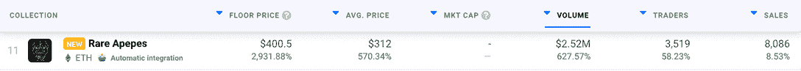

# 罕见的 Apepes 超高价格爆发

> 原文：<https://web.archive.org/web/https://dappradar.com/blog/rare-apepes-mega-price-break-out>

## 过去一周地板价格上涨超过 2800%

在过去的七天里，罕见的 Apepes NFT 系列成为市场上表现最好的项目之一。让这一突破如此令人惊讶的是，该系列背后的工作室 Rare Labs 由于缺乏兴趣，在不到两周前免费赠送了大量的 NFT。价格为何如此急剧上涨仍有待讨论。

**总结**

*   所有稀有 Apepes 的链上分析显示，过去一周数量急剧增加。尤其是底价、销售均价和交易量都已经上了月球。查看我们的[***【NFT】收藏排行榜***](https://web.archive.org/web/20221003233641/https://dappradar.com/nft/collections) ***看看现在的表现如何。***
*   该系列基于 NFT 历史上最大的两个系列:稀有猿和 T2 无聊猿游艇俱乐部。
*   ***稀有设计师是稀有 Apepes 背后的艺术家。他是稀有实验室工作室的负责人，是原始稀有 Pepes 现象背后的大脑。罕见的 Pepes 于 2015 年在比特币区块链上推出，早于***[***crypto 朋克***](https://web.archive.org/web/20221003233641/https://dappradar.com/ethereum/collectibles/cryptopunks)***OG***[***集合***](https://web.archive.org/web/20221003233641/https://dappradar.com/hub/nft-explorer/collection/cryptopunks) ***。***

## 什么是罕见的 Apepes？

稀有的 Apepes 系列于 2022 年 3 月 5 日推出，在[以太坊](https://web.archive.org/web/20221003233641/https://dappradar.com/nft/protocol/ethereum)区块链建造。最初的造币价格是 0.05 [ETH](https://web.archive.org/web/20221003233641/https://dappradar.com/hub/token/eth/ETH) ，这个项目没有大张旗鼓地到来。所以，没有白名单。没有抢钱的结合曲线。尽管路线图已经存在，但并不明确。

7 月 31 日，大概是因为最初上市后吸收缓慢，稀有实验室决定向任何想要的人免费提供剩余的稀有 Apepes。最终他们成功了。但是没有人疯狂地去抢一个。没有满怀希望的收藏家会抱怨错过了一个大好机会。

快进不到两个星期，罕见的 Apepes 的故事发生了变化。自从免费造币厂在一周前结束后，收集的链上分析的图表线都在上升。

我们在 DappRadar 跟踪的大量重要信息显示出三位数和四位数的百分比增长。目前任何人都不知道这种突然的受欢迎程度是从哪里来的。但这并不是我们最近看到的第一个成功抓住未开发的公共利益的收藏。

2022 年 5 月，地精镇不知从何而来，从那时起，价值数千万美元的丑陋的小地精已经转手。尽管有充分研究表明 [NFT 泡沫已经破裂](https://web.archive.org/web/20221003233641/https://dappradar.com/blog/dappradar-blockchain-industry-report-july-2022/#bubble-burst)，但市场上似乎仍然存在合适藏品的缺口。

## 活动激增

截至发稿时，罕见的 Apepes 免费薄荷开始 9 天前。在过去的一周里，该系列的在线分析显示了惊人的增长。

该系列的底价和平均售价分别上涨了 2932%和 570%。请记住，这些数字可能会发生变化。随着收藏品经历了一段非常受欢迎的时期，链上的数据每分钟都会发生巨大的变化。

你最好去 NFT 排名页面看看这个系列的表现如何，看看稀有的 Apepes 是保持了强劲的增长还是从雷达上消失了。

[DappRadar’s seven-day on-chain activity for Rare Apepes](https://web.archive.org/web/20221003233641/https://dappradar.com/nft/collections)

有趣的是，你可以看到销售数字并没有像一些链上分析那样增长 10 倍或 100 倍。这表明该系列有许多忠实的霍德勒，因为尽管底价飙升，他们并没有急于出售。

交易量飙升 628%——衡量人们买卖时有多少钱易手——是新涨价的结果，而不是销量增加。目前楼面价徘徊在 0.22-0.23 ETH 关口附近。但一些最昂贵的销售确实引人注目。

仅在过去的 12 小时内，就有四种罕见的 Apepes 被卖出超过一个 ETH:

*   稀有 Apepe # 6668–2 ETH
*   [稀有 Apepe # 5528](https://web.archive.org/web/20221003233641/https://dappradar.com/hub/assets/eth/0x31d45de84fde2fb36575085e05754a4932dd5170/5528)–1.2 ETH
*   稀有 Apepe # 830–5 ETH
*   稀有 Apepe # 8188–4 ETH

你可以在 DappRadar 的 NFT 探险者号上找到所有这些罕见的 Apepe NFTs。对于任何想要购买该系列的人来说，我们的探索者是找到最稀有和最有价值的稀有 Apepes 的完美工具。

## 找到最好的稀有 Apepe

鉴于 NFT 仍处于相对初级阶段，二级市场在搜索功能方面质量参差不齐，我们的 NFT 探索者是了解藏品的最佳途径之一。我们汇总了各种链上数据点和 NFT 元数据，以便您可以做出在何处使用加密货币的最佳决策。

[https://web.archive.org/web/20221003233641if_/https://www.youtube.com/embed/fkEaXYLOW-s?start=18&feature=oembed](https://web.archive.org/web/20221003233641if_/https://www.youtube.com/embed/fkEaXYLOW-s?start=18&feature=oembed)

DappRadar’s NFT Explorer

要找到目前市场上价格最优惠的珍稀 Apepes:

1.  前往我们的 [NFT 探险者](https://web.archive.org/web/20221003233641/https://dappradar.com/hub/nft-explorer)。
2.  找到[稀有猿类收藏](https://web.archive.org/web/20221003233641/https://dappradar.com/hub/nft-explorer/collection/rare-apepes)。
3.  使用右侧的下拉菜单过滤元数据。
4.  寻找具有最受欢迎特征的最稀有的 Apepes。
5.  当您单击“应用”时，您将看到一些独特的 NFT。
6.  然后你需要去二级市场，提出一个你认为合理的报价。更好的是，如果 NFT 的拍卖价格低于我们的估计价格，那么你就知道你找到了便宜货。

你应该注意到，并不是所有的非功能性食物都有估计价格。这是因为一些集合太新了，我们还没有将它们的数据完全整合到我们的平台中。对于其他集合，可能没有足够的交易数据来给出完全知情的估计。

 NewsletterUnsubscribe at any time. [T&Cs](https://web.archive.org/web/20221003233641/https://dappradar.com/terms) and [Privacy Policy](https://web.archive.org/web/20221003233641/https://dappradar.com/privacy-policy)