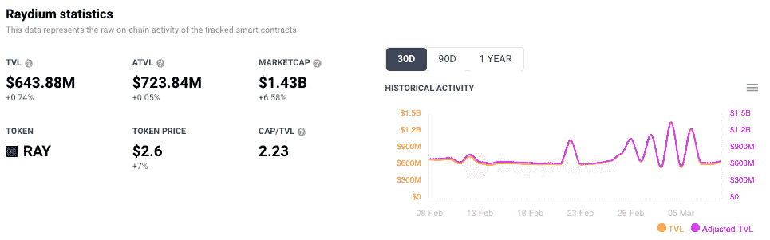
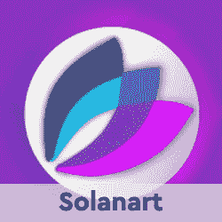

# Raydium DEX on Solana 现已为移动用户量身定制

> 原文：<https://web.archive.org/web/https://dappradar.com/blog/raydium-dex-on-solana-now-tailored-for-mobile-users>

## 交换、池和场等核心功能在 V2 测试版中可用

领先的 Solana 分散式交易所 Raydium 发布了期待已久的 V2 升级版，推出了为区块链移动用户量身定制的智能手机友好模式。此外，更新后的 DEX 为用户提供了刷新的界面，改进的导航选项，同时还提高了速度和用户体验。在 DeFi，争夺关注度的战斗愈演愈烈。

Raydium 是[索拉纳区块链](https://web.archive.org/web/20221207005118/https://dappradar.com/rankings/protocol/solana)上领先的 DeFi 平台之一，这个生态系统在 2021 年取得了巨大的增长。DEX 每月提供超过 150，000 个不同的活动钱包，仅次于 NFT 市场 Magic Eden。Raydium 的优势使得 V2 升级版更加美味。

值得注意的是，核心功能如掉期、池和农场在 V2 测试版中可用，而交易指数和加速器仍在开发中。V2 仍处于测试阶段，因此鼓励用户通过使用现场或 [Discord](https://web.archive.org/web/20221207005118/https://discord.gg/raydium) 上的反馈链接来报告任何错误或建议，从而帮助 Raydium 做得更好。

版本 1 仍然有效，可以毫无问题地使用。与此同时，Raydium 开发团队不断改进、调整和消除 V2 上的错误。到目前为止，对于 Raydium 的升级，反馈看起来是积极的。

短期来看，Raydium 的用户活动略有上升，其原生 token RAY 的价格也有小幅变动，在写作时上涨了 7%。访问 DappRadar 上的 Raydium dapp 页面,发现 Solana 上领先的 AMM。

## 什么是 Raydium？

对于熟悉 Uniswap 和 SushiSwap 等以太坊去中心化交易所的人来说， [Raydium](/web/20221207005118/https://dappradar.com/blog/raydium-on-solana-surpasses-100-000-active-wallets-per-week/) 会感觉很熟悉。Raydium 是一个自动做市商(AMM ),为 Solana 的分散式交易所 Serum 而建。这两个协议有着紧密的关系，Raydium 将向 Serum 的中央限价指令簿提供链上流动性，允许流动性提供者(LPs)获得对 Serum 的量和流动性的完全访问权。另一方面，Raydium 用户还可以通过中央指令簿获得流动性，几乎可以进行即时交易。

使用 Raydium ，用户可以将任何基于 Solana 的代币换成另一种代币，这得益于两个主要来源的流动性。首先，Raydium 的流动性池和血清订单。每笔交易所交易将产生 0.25%的交易费用，其中 88%的费用将被重新存入流动性池，以奖励流动性提供者。同时，剩余部分作为产量发送给射线堆栈器。

虽然 Raydium 首先是一个 DeFi 平台，但其背后的团队去年决定涉足区块链技术的其他方面。例如，Raydium DropZone 是一项旨在促进茄属植物 NFT 生长的倡议。该项目还旨在为推出新系列所需的基础设施团队提供支持。

## 模糊的线条

随着 DeFi、NFTs 和游戏之间的界限不断模糊；可以想象，更多的项目将会步 Raydium 的后尘。随着越来越多的开发者冒险探索其快速的交易速度和最低的天然气费用，DappRadar 将继续监测 Solana dapp 生态系统的发展。要了解更多关于 Solana，Raydium 和 DeFi 空间的信息，请点击下面的链接。

[<picture></picture>](https://web.archive.org/web/20221207005118/https://dappradar.com/blog/how-to-set-up-a-solana-blockchain-wallet)[<picture></picture>](https://web.archive.org/web/20221207005118/https://dappradar.com/solana/defi/mercurial)[<picture></picture>](https://web.archive.org/web/20221207005118/https://dappradar.com/blog/what-is-solana)[<picture></picture>](https://web.archive.org/web/20221207005118/https://dappradar.com/solana/defi/solend)[<picture></picture>](https://web.archive.org/web/20221207005118/https://dappradar.com/blog/tag/solana)[<picture></picture>](https://web.archive.org/web/20221207005118/https://dappradar.com/solana/marketplaces/solanart)

***以上不构成投资建议。此处给出的信息仅供参考。请行使尽职调查，做你的研究。作者持有 ETH、BTC、AGIX、HEX、LINK、GRT、CRO、OMI、不变 X、ENS、GALA、AVASTR、GMEE、CUBE、RADAR、FLOW、FTM、BNB、SPS、WRLD、ATOM 和 ADA。***

 NewsletterUnsubscribe at any time. [T&Cs](https://web.archive.org/web/20221207005118/https://dappradar.com/terms) and [Privacy Policy](https://web.archive.org/web/20221207005118/https://dappradar.com/privacy-policy)