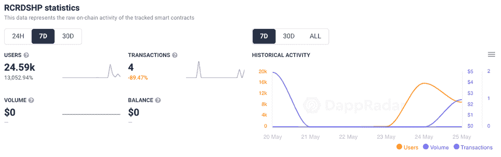
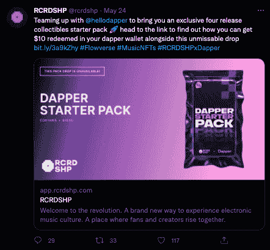
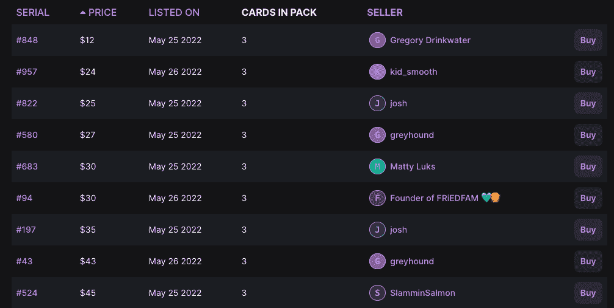
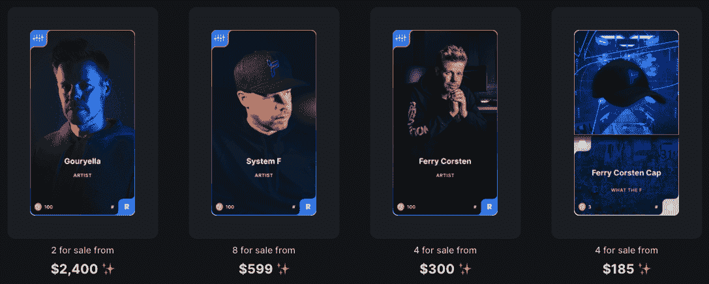
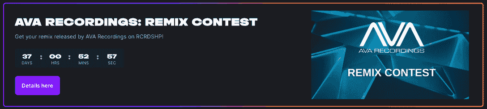
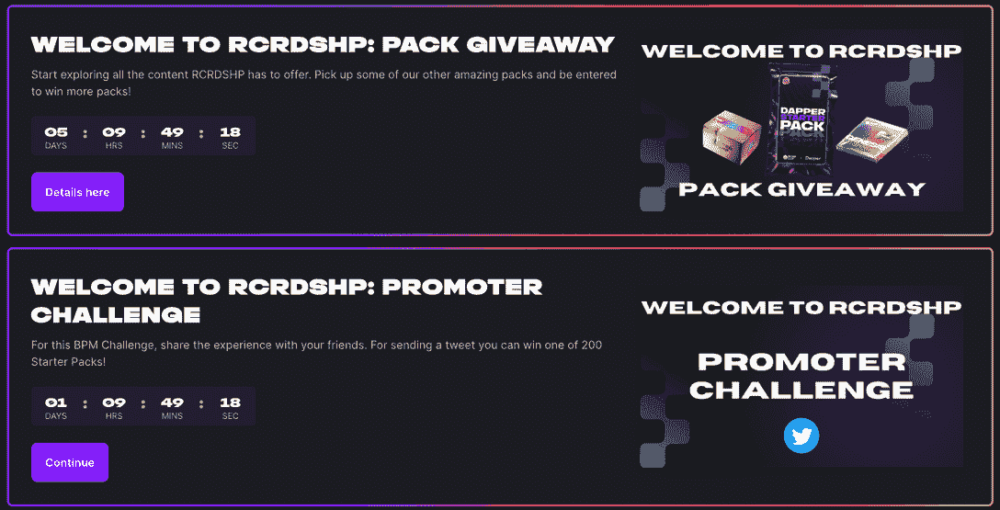

# RCRDSHP 希望让音乐重新变得有价值

> 原文：<https://web.archive.org/web/https://dappradar.com/blog/rcrdshp-wants-to-make-music-valuable-again>

## 流媒体摧毁了在职音乐人的收入

策展的数字收藏品平台 RCRDSHP，发音为“唱片店”,正在颠覆音乐行业，它在 Flow 区块链上推出了一个新项目。该平台利用区块链和不可替代代币(NFT)为电子音乐行业提供精选的数字收藏品。

总部位于区块链的流媒体和 NFT 音乐交付平台的崛起，源于 10 多年来音乐行业的垄断，这种垄断将艺术家的利润挤压到了无利可图的地步。像 Spotify 这样的平台主导了这个领域，但却不公平地奖励艺术家。更重要的是，他们限制对粉丝数据和分析的访问，阻止艺术家潜在的增长和接触新的观众和收入流。

RCRDSHP 正在为[流区块链](https://web.archive.org/web/20220704235201/https://dappradar.com/rankings/protocol/flow)构建一个新的解决方案，旨在解决和改善现有音乐分销系统的弱点，并重新调整激励机制，使之有利于在职音乐人和粉丝。首先，RCRDSHP 将自己打造成一个交易音乐和音乐相关收藏品的平台。

## RCRDSHP 入门包

该平台在上周吸引了超过 24，500 个独特的活跃钱包，周环比增长超过 13，000%。链上指标在这里是必不可少的，因为用户可以只使用电子邮件地址和简单的 KYC 连接到 [RCRDSHP](https://web.archive.org/web/20220704235201/https://dappradar.com/flow/collectibles/rcrdshp) 。或者，用户可以使用 Dapper 或自定义 RCRDSHP 钱包进行连接，以访问 Web3 功能。

连接到 RCRDSHP lept 的用户钱包从 5 月 23 日的 100 多一点增加到 5 月 24 日的 16，000 多一点。一个刺激因素[似乎是 Dapper starter pack 的发布](https://web.archive.org/web/20220704235201/https://twitter.com/rcrdshp/status/1529159255105884160),以及一个特别优惠，让使用 Dapper wallet 的前 20，000 名买家有权获得 10 美元的信贷，最低消费为 10 美元。此外，在 5 月 25 日上午 9:00(太平洋标准时间)之前购买任何 RCRDSHP pack 的任何人都可以额外获得一个 NFT，并享受每月 DJ 混音、参加社区活动等专属优惠。

每包包含五个随机的来自不同艺术家的音乐收藏品，售价 10 美元。用户撕开包装，一次展示一件收藏品，并希望序列号低，因为这些可能更有价值。

此外，它不仅仅是五首音乐。单个 NFT 可以包含多个轨道和附加内容，如幕后视频素材。意大利著名音乐人 DJ Mauro Picotto 的收藏品包括一段来自主角的视频短片。另一个重要的事实是，用户只需花 1 美元就可以获得音乐，并使用信用卡进行购买，这使得登录变得轻而易举。

## 费里·科斯腾介绍了什么是 F

与其他区块链音乐初创公司不同的是， [RCRDSHP 已经获得了一些有着坚实粉丝的受人尊敬的艺术家](https://web.archive.org/web/20220704235201/https://dappradar.com/flow/collectibles/rcrdshp)通过该平台发布音乐。它主要迎合电子音乐，所以虽然有些读者可能从未听说过这些艺术家，但有些是世界知名的 DJ。像 DJ 说唱，费里·科斯腾，托德特里，整齐的 Trax 和水晶水脱颖而出。更重要的是，这些行为无疑是利用他们的社交媒体追随者直接向粉丝出售音乐，这将[帮助 RCRDSHP 发展](https://web.archive.org/web/20220704235201/https://dappradar.com/flow/collectibles/rcrdshp)。

费里·科斯腾的下降似乎是本周活跃钱包激增的另一个重要原因。这位白金销量、屡获殊荣的艺术家是舞蹈音乐界最受尊敬的电子音乐制作人和 DJ 之一，从业近 30 年。他的 What the F drop 包含三种常见的收藏品，售价 13 美元，已全部售罄。

在本地二级市场上，这些收藏包已经未开封上市，底价为 12 美元，中位数为 90 美元。就像早期的 NBA Top Shot 一样，人们通过高价出售物品来投机和冒险，希望得到最好的结果。其中一些是创世纪的项目，所以他们可以随着时间的推移升值。

## 挑战

那些接触过由 Dapper Labs 开发的另一款 NFT 收藏游戏的人，会在挑战部分看到相似之处。挑战是平台的一部分，让人们不断收集和参与。

此外，有一个超级高的机会获得一个启动挑战所需的收藏品，通常会引导用户继续前进。如上所述，收藏品可以便宜到 1 美元，所以它更多的是关于乐趣和可能对创世纪发行的猜测，一些知名艺术家的杰出音乐，或者只是你个人喜欢的东西。

对于音乐家来说，一些挑战可能是非常有益的。例如，混音挑战邀请制作人购买一首曲目的 NFT 音轨来制作混音。茎是组成轨道的工作文件，如踩镲、鼓和圈套。一旦用户购买了原声音乐，他们就可以自由地创作一首歌曲的混音，并上传以供考虑，如果成功的话，还可以在唱片上发行。赢得这样的奖项可能会在一夜之间改变一个艺术家的轨迹。

其他挑战包括挖掘用户的社交流，为 [RCRDSHP](https://web.archive.org/web/20220704235201/https://dappradar.com/flow/collectibles/rcrdshp) 平台带来更多关注，以及简单的分享和推文。重要的是，所有的挑战都需要购买某种物品才能开始，所以这样的话，dapp 就是付费游戏。如前所述，物品起价为 1 美元，所以目前进入门槛不高。

## 颠覆音乐的时机已经成熟

自从区块链技术问世以来，关于它将如何颠覆音乐产业的想法一直存在。然而，直到现在，他们似乎还为时过早，艺术家的教育水平较低，更没有能力建立和部署智能合同或 NFT 造币厂。随着对 PFP 和 avatar 系列的大肆宣传逐渐平息，更多的用例正在被探索和强调，远离[百万美元的 ape NFT 销售](https://web.archive.org/web/20220704235201/https://dappradar.com/nft/sales)。

艺术家总是需要与他们的粉丝直接联系，并利用他们的品牌来销售音乐。像 RCRDSHP 这样的平台可以为费里·科斯腾和托德·特里这样的知名艺术家打开大门，反过来，他们也可以为有抱负的艺术家打开大门。费里·科斯腾通过他的社交媒体平台推广他在 RCRDSHP [上的专辑《the What the F drop 》,作为粉丝与专辑互动的首选方式。

在更广阔的 Web3 空间中，我们看到各种试图颠覆音乐产业的举措。Snoop Dogg 和史蒂夫·青木](https://web.archive.org/web/20220704235201/https://www.youtube.com/watch?v=6nS-1QAsMqM)[与 Gala Music](https://web.archive.org/web/20220704235201/https://dappradar.com/blog/snoop-dogg-and-gala-music-drop-nft-stash-boxes) 合作，而 [Audius 可能成为 Spotify](https://web.archive.org/web/20220704235201/https://dappradar.com/hub/token/eth/AUDIO/ETH?from=0x18aaa7115705e8be94bffebde57af9bfc265b998) 的 Web3 替代品。另外，DJ 3LAU [已经开拓](https://web.archive.org/web/20220704235201/https://dappradar.com/blog/how-musicians-are-making-money-with-nfts) NFTs 有一段时间了。以及像 Corite 这样的新平台出现，在技术方面帮助艺术家。音乐艺术家正在寻找新的赚钱方式，与他们的粉丝互动，扩大他们的影响力。

## 达普拉达会见 DJ 塑料

在最近的播客中，DappRadar 与 Dubstep 先锋 DJ Plastician 坐下来讨论音乐和区块链。在这个有趣的对话中，我和 Plastician 探讨了音乐行业中的误解，并讨论了艺术家如何迈出进入区块链的第一步。对于 NFTs 的效用来说，这是一个非常有趣和令人兴奋的时代，现在围绕该行业金融元素的炒作已经平静了一些。对于 RCRDSHP 这样的平台来说，这可能是一个崭露头角的绝佳时机。

[https://web.archive.org/web/20220704235201if_/https://www.youtube.com/embed/OvNW5-DPPSI?feature=oembed](https://web.archive.org/web/20220704235201if_/https://www.youtube.com/embed/OvNW5-DPPSI?feature=oembed)

***以上不构成投资建议。此处给出的信息仅供参考。请行使尽职调查，做你的研究。作者持有多种加密货币的头寸，包括 BTC、瑞士法郎和雷达。***

 NewsletterUnsubscribe at any time. [T&Cs](https://web.archive.org/web/20220704235201/https://dappradar.com/terms) and [Privacy Policy](https://web.archive.org/web/20220704235201/https://dappradar.com/privacy-policy)