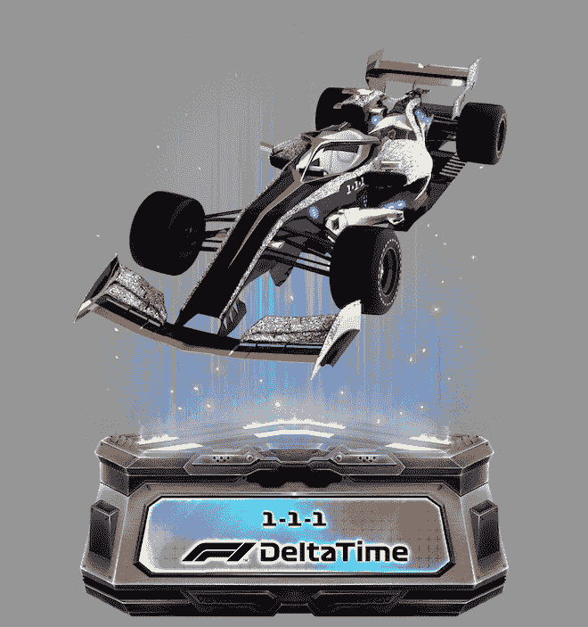
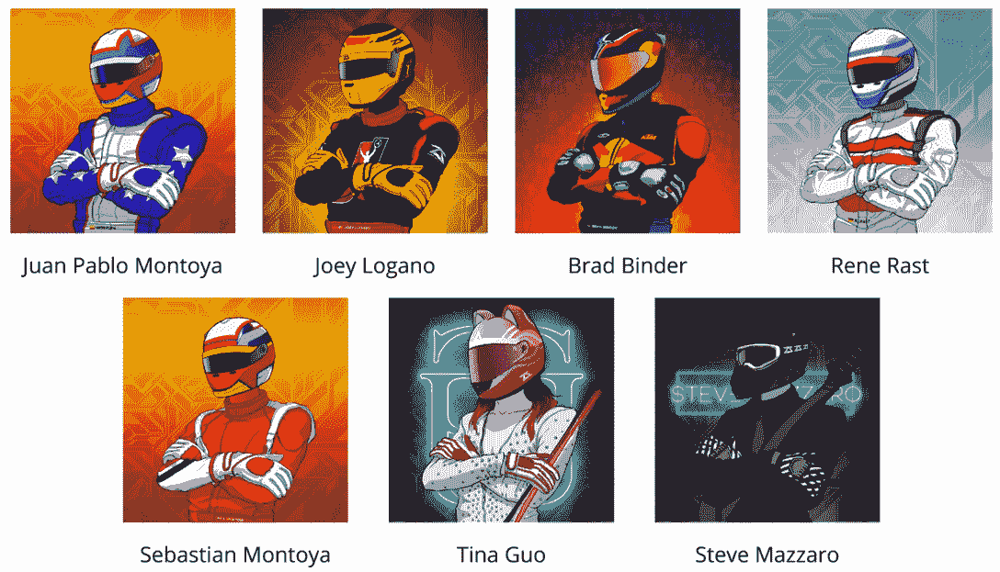

# 准备，设置，去为新 NFT 收集扭矩班

> 原文：<https://web.archive.org/web/https://dappradar.com/blog/ready-set-go-for-new-nft-collection-torque-squad>

## 再见 F1 德尔塔时间，你好 REVV 赛车运动生态系统的新成员

4 月 2 日，Animoca Brands 的子公司 Motorverse Corporation 将推出名为 Torque Squad 的新 NFT 系列。在周日开始的铸造活动中，总共将有 8，888 辆 NFT 可供销售。

又是一周，又一个 NFT 项目启动。但这一系列来自 Animoca Brands 的子公司 Motorverse Corporation，其背后有一些真正的分量。Motorverse Corporation 将很快融入 REVV Motorsport 世界，Torque Squad NFTs 的持有者将可以在游戏生态系统中获得跨平台体验。

REVV Motorsport 于 3 月 15 日在 Twitter 上发布了一条消息，称其最成功的游戏之一“F1 Delta Time”停止运营。该公司[做出了令人震惊的宣布](https://web.archive.org/web/20221006033107/https://dappradar.com/blog/f1-delta-time-closes-down)，它无法更新其与 f1 的许可协议。24 小时后，一切都结束了。

自 2019 年推出以来，F1 Delta Time 一直是 REVV 赛车运动生态系统的支柱。这款赛车游戏成为头条新闻，当时它现在传奇的 1-1-1 以 415.9 ETH 的价格出售，并赢得了 2019 年最昂贵的 NFT 的称号。当时，这相当于大约 113 124 美元。那些日子。

1-1-1: 2019’s most expensive NFT

有趣的是，在 REVV motor sport 3 月 15 日的 Twitter 帖子之后，生态系统的原生令牌 [REVV](https://web.archive.org/web/20221006033107/https://dappradar.com/hub/token/eth/REVV?from=0x557b933a7c2c45672b610f8954a3deb39a51a8ca) 的价格上涨了 14%，至 0.101 美元。自那以后，它继续攀升，现在位于 0.109 美元。

## 什么是 Motorverse 及其 Torque Squad？

“Motorverse”是区块链一个以赛车运动为中心的生活方式平台，其生态系统基于“游戏、时尚、活动、DeFi 等”的关键支柱它将加入现有的 REVV Motorsport stable，该公司已经包括 [REVV Racing](https://web.archive.org/web/20221006033107/https://dappradar.com/polygon/games/revv-racing) 、 [MotoGP 点火](https://web.archive.org/web/20221006033107/https://dappradar.com/flow/games/motogp-ignition)和 [Formula E: High Voltage](https://web.archive.org/web/20221006033107/https://dappradar.com/binance-smart-chain/games/formula-e-high-voltage) 。

Torque Squad 项目已经与赛车运动领域的一些世界顶级赛车手合作。由格莱美提名者 Tina Guo 和作曲家 Steve Mazzaro 作曲的《Motorverse》将很快在 Spotify 上推出。

Legendary racers have partnered with the Torque Squad project

除了获得 REVV 赛车运动生态系统中的其他平台，Torqies 的持有者还将从其代币中获得真正的效用:

*   进入现实生活和虚拟活动，有大奖赛和电子竞技直播的 VIP 门票可供争夺。
*   现实生活和虚拟世界中的时装和街头服饰。
*   Motorverse 本身，被吹捧为赛车运动爱好者的 web3 社交平台。
*   从 Torque Squad 和 Motorverse 中提前获得未来的 NFT 版本。
*   Torqie NFTs 的持有者将获得 Animoca 品牌蓬勃发展的元宇宙生态系统的其他部分。

阿凡达赛车服将表明其稀有性。有六种类型的服装:

*   赛车运动——3010 人(33.9%)
*   街道——2767 人(31.1%)
*   未来——1477 人(16.6%)
*   空间-1188(13.4%)
*   幽灵——436 人(4.9%)
*   哨兵-10 人(0.1%)

我在祈祷下周会有一个哨兵出现在我面前。

## 造币机隆隆作响，开始行动了

即将到来的铸造活动将于 4 月 2 日开始，并将首先向该项目的 OG 粉丝开放，他们可以花 0.064 ETH(撰写本文时为 217 美元)获得一个 NFT。Motorverse 将于 4 月 3 日欢迎白名单成员，价格为 0.08 ETH(撰写本文时为 271 美元)。公开销售将于 4 月 6 日开始。

你仍然可以通过加入他们的 [Discord](https://web.archive.org/web/20221006033107/https://discord.com/invite/xVuhcSZgvF) 服务器并遵循“白名单-信息”提要中的说明来加入 Torque Squad 白名单。但是，即使你的名字不在白名单上，你仍然有机会通过公开拍卖获得自己的托奇 NFT。请务必关注 Torque Squad 社交媒体，了解时间、地点和流程的最新动态。
为了跟踪这个项目的故事，请继续关注 [DappRadar 博客](https://web.archive.org/web/20221006033107/https://dappradar.com/blog/)。你也可以使用我们的工具和跟踪器进行自己的研究，如 [Token Explorer](https://web.archive.org/web/20221006033107/https://dappradar.com/hub/tokens/ethereum/all/) 和我们的 [NFT 排名页面](https://web.archive.org/web/20221006033107/https://dappradar.com/nft)。我们的 [Twitter](https://web.archive.org/web/20221006033107/https://twitter.com/DappRadar) feed 将为您提供最新的突发新闻，您可以通过加入我们的 [Discord](https://web.archive.org/web/20221006033107/https://discord.com/invite/4ybbssrHkm) 服务器来参加每周的活动。