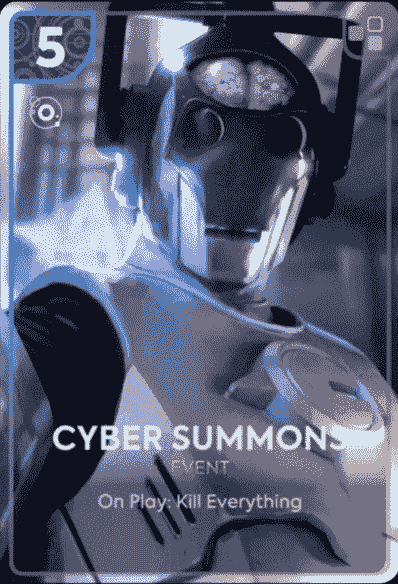
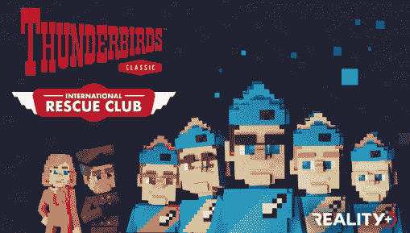
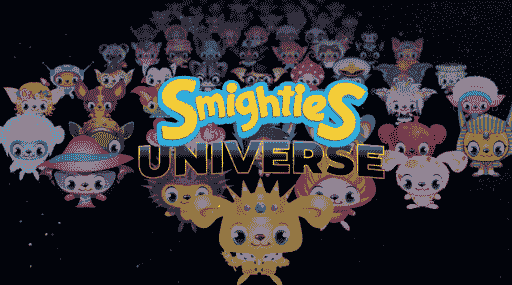

# 现实+CEO:NFT 是终极用户获取工具

> 原文：<https://web.archive.org/web/https://dappradar.com/blog/reality-ceo-nfts-are-the-ultimate-user-acquisition-tools>

## 元宇宙品牌应该马上在学校里教授。

DappRadar 启动了一系列与行业影响者的新访谈，在这些访谈中，我们从品牌、营销和艺术专业人士的角度深入探讨了网络游戏、游戏和元宇宙等 web3 主题。

我们已经见证了由于熊市导致的加密行业的低迷。影响 [Axie Infinity](https://web.archive.org/web/20221003235613/https://dappradar.com/multichain/games/axie-infinity) 的 [Ronin bridge heist](https://web.archive.org/web/20221003235613/https://dappradar.com/blog/sky-mavis-to-launch-axie-infinity-origin-amidst-hack-crisis) 等黑客事件，以及最近来自其他重要玩家的抵制，如微软拥有的《我的世界》背后的开发工作室 Mojang，禁止 NFT 进入其游戏。

尽管如此，尽管加密货币在这些困难时期受到黑客攻击、诈骗和负面报道，但人们仍然对加密货币和 NFT 持积极态度。万事达卡最近的一项民意调查显示，35，000 名参与者中有 47%对 NFTs 和密码行业表示了积极的看法。此外，[对今年总投资的预测已经增加到 120 亿，比上个季度](https://web.archive.org/web/20221003235613/https://dappradar.com/blog/dappradar-x-bga-games-report-q2-2022) 增长了 20%，将其他类别远远甩在后面。

根据 DappRadar 的数据，[区块链游戏公司顶住了熊市](https://web.archive.org/web/20221003235613/https://dappradar.com/blog/dappradar-x-bga-games-report-6)，筹集了 3 亿美元的资金，每日独特活跃钱包超过 100 万个。 [DappRadar](https://web.archive.org/web/20221003235613/https://dappradar.com/) 是你所有分散应用的一站式商店，在这里你可以探索你最喜欢的区块链[游戏](https://web.archive.org/web/20221003235613/https://dappradar.com/rankings/category/games)和 [NFTs](https://web.archive.org/web/20221003235613/https://dappradar.com/nft) 。

## 品牌如何利用 NFTs 和游戏化来构建 web3 经济？

我与 Reality+首席执行官莫滕·朗加德(Morten Rongaard)就此进行了对话。Reality+是一家行业先锋，在 web3 行业拥有强大的影响力，是全球最大的元宇宙[沙盒](https://web.archive.org/web/20221003235613/https://dappradar.com/multichain/games/the-sandbox)的首选合作伙伴，拥有阿迪达斯等大牌，以及[探听犬](https://web.archive.org/web/20221003235613/https://dappradar.com/hub/wallet/eth/0xce90a7949bb78892f159f428d0dc23a8e3584d75)、[史蒂夫·青木](https://web.archive.org/web/20221003235613/https://dappradar.com/hub/wallet/eth/0xe4bbcbff51e61d0d95fcc5016609ac8354b177c4)等名人。

### **告诉我们关于你自己和现实+**

我帮助领先品牌从 web 2.0 迁移到 web 3.0，成为他们的品牌守护者。作为 Reality+的首席执行官，我们帮助最大的品牌进入 web3，为他们在元宇宙开发游戏和令人兴奋的 NFT 项目。

我们的团队拥有丰富的综合经验，我们是这一领域真正的开拓者。当我们刚开始的时候，NFT 这个词并不存在，但是人们在游戏行业中把它们称为数字收藏品。

Source: [Dr Who Worlds Apart](https://web.archive.org/web/20221003235613/https://doctorwho-worldsapart.com/)

### 你和 BBC 在游戏《神秘博士》中的合作是如何开始的？

我们看到了像《神秘博士——天各一方》这样的热门节目与游戏捆绑在一起的潜力。我们的主要目标是为神秘博士的粉丝创造一个有趣的游戏，所以我们联系了 BBC，花了八个月的时间开发了这个概念，并在其中加入了区块链元素。达成交易是一个非常艰难的过程，我们动用了所有的资源来确保我们能提供最好的游戏。

此外，我们必须勾选所有与尽职调查、拥有自己的技术和可持续发展相关的选项。然而，我对 BBC 拥抱 web3 的开放态度印象深刻。他们知道 web2 已经筋疲力尽了，并且对创造全新的东西感到非常兴奋。

### 你能告诉我们目前的状况和路线图吗？

《神秘博士——天各一方》是一个大型游戏，我们希望确保我们有最好的质量。这意味着我们为团队增加了许多新的资源。我们谈论的是工作室导演、制作人、游戏设计师和开发者。

我们创始人的令牌持有者玩了一个游戏的早期版本，给了我们惊人的反馈，让我们明白我们需要改变什么。我敢肯定，许多开发人员可以联系到，一些想法只有在纸上看起来很好！

很快，我们将有一个 50.000 人的封闭测试版，增加 60 张卡，你可以玩不同的数字原型。你不需要在玩之前购买任何 NFT，因为我们想从许多其他人正在做的事情中脱颖而出。

我们是免费的游戏；如果你想让你的牌有一些很酷的特点，你可以选择。我们专注于乐趣和娱乐，而不是赚钱。我们在制作游戏的同时也在销售卡包。对我们来说，更容易专注于打造一款留住人的伟大游戏。我们处于一个竞争非常激烈的市场，所以我们认为这是最好的方法。

### **在这次熊市期间，粉丝们还渴望卡牌和新皮肤吗？**

我们已经很久没有发布更多的包了。如果你不断添加更多的包装，这可能会感觉像是抢钱，而你希望避免给人这种印象。市场普遍放缓，但我们的市场正在蓬勃发展。我们看到大约 80 万美元的交易量。我认为这证明我们创造了一个成功的概念。

我们看到每天的交易从 50 美分到数百美元不等。我们创造了一个有趣的游戏，五年后。我们应该仍然能够进入它并且能够购买最初的包装。

### **掉了这么多卡皮，你和你的团队学到了什么？**

回顾过去，我知道我们应该带着一些背包等待。问题是，当你与 AAA 品牌合作时，很多事情会提前 3-6 个月安排好，很难做出任何改变。另一方面，我们看到不同用户的另一种兴趣。

### 在你的社区中，你看到了什么类型的用户？

我们可以马上发现我们的社区是由三个群体组成的。一方面，有单纯的神秘博士粉丝；另一方面,《神秘博士》的粉丝们也精通网络 3，最后是投机者。

我为我们的社区感到非常自豪，因为他们有 web3 的心态，他们试图互相教育，web3 专家帮助那些对此一无所知的人，反之亦然。《神秘博士》的粉丝教育 web3 的专家关于这个节目，这对游戏来说非常重要。

我不能要求一个更好的社区。我真的很害怕只吸引投机者，这就是为什么我们强调要做出一个完全拥抱所有人的概念，尤其是那些只想要一个酷游戏的人。如果你在游戏中很活跃，你会有其他投机者不会有的好处。

比如不同种类的体验。新型 NFT 和资源，因为我们重视给我们反馈的人，同时也拥有活跃的市场。与其他项目相比，这是我们拥有巨大优势的地方，也是我们让他们参与我们产品的地方。

<https://web.archive.org/web/20221003235613im_/https://wp.dappradar.com/wp-content/uploads/2022/08/dappradar.com-thunderbirds.mp4>

Source: [Thunderbirds, Reality+](https://web.archive.org/web/20221003235613/https://www.thunderbirdsclub.com/) 

### **品牌进入 NFTs 和元宇宙世界的第一步是什么？**

首先，品牌需要自我教育。他们必须理解什么是元宇宙，以及为什么非功能性测试很重要。我认为这是至关重要的，因为那些不注意这一点的人迟早会被淘汰。

如果 web2 需要社交媒体战略，那么你现在需要为 web3 做同样的事情，它增加了新的维度。品牌还必须超越这一点，真正了解他们的产品，提出以下问题:

*   我们甚至需要 web3 吗？
*   未来 web3 将如何工作并与我们的用户互动？
*   我们如何将 web3 的功能整合到 web2 的沟通策略中？

事实是，大多数品牌还没有准备好全面进军 web3，所以真正的重点应该是找到一个中间地带或混合地带，考虑集中和分散的方法。我称之为中间地带的 web 2.5，这是他们必须开始的必要的教育之旅。

[Thunderbirds](https://web.archive.org/web/20221003235613/https://www.thunderbirdsclub.com/)

### 对非母语教学和元宇宙有哪些典型的误解？

现在有很多关于 NFTs 和元宇宙的误解，但是我想着重谈谈我一直听到的两个误解:

*   " NFT 对环境有害."
*   “只有一个元宇宙。”

按照 sé的说法，NFT 对环境没有坏处。工作证明区块链采矿方法比股权证明对环境的影响更大，但总体而言，NFT 只代表以太坊交易的一小部分。

此外，你可以使用这项技术来抵消你的碳足迹。环境可持续发展是我们的核心价值观，这也是我们与 ReFeed 合作的原因，re feed 是一个模块化的多步骤流程，从未使用的食物和食物垃圾中提取 100%的效用。

公司可以通过购买儿童来投资该计划，这些儿童将使用我们定制的区块链系统透明地提高他们的 ESG 可持续发展分数。区块链为我们提供了分散处理事物的所有可能性，而 NFT 只是资产。我们需要教育人们理解他们可以用这种资产做什么。

这使我们在竞争中脱颖而出。没有其他人这么做。我们的链是碳中和的，在我们的游戏中制造一个 nft 是可测量的。这就是我们如何与 BBC 进行可持续的努力。

最后，元宇宙不仅仅是一个中央集权的地方。相反，它是关于多个虚拟世界的，人们需要理解互操作性是这里的一个关键方面。不同的非功能性测试将提供不同的元测试，因此它们将发挥更大的作用。

### 品牌必须不惜一切代价避免哪些错误？

他们不能只是推出一个 NFT 系列，并希望它会成功，或者认为他们自动需要有一个网络 3 战略。首先，他们必须了解自己的市场。他们需要一个平台、游戏化、令牌组学和使用产品的人。

我看到的一个常见错误是，他们想省钱，但仍然以某种方式利用 web3 的宣传。但是他们弄错了。他们应该退一步，问问自己，从长远来看，这样做是否正确。

品牌应该问自己的另一个有用的问题是，他们是否有足够的资源。他们如何让用户参与进来？他们需要建立一个可持续发展的社区。

### **你如何说服一个大品牌进入元宇宙并拥抱 NFTs？**

我们不仅是这一领域的开拓者，我们还有真实的使用案例和创收项目。我们有重要的合作伙伴关系，一旦你开始与大品牌合作，所有这些因素都很重要。他们知道我们以前做过，我们非常清楚我们在做什么。

### 为什么元宇宙不仅仅是炒作？

物理和数字之间的界限变得越来越模糊，尤其是在 Covid 之后。事实上，在元宇宙，任何人都可以成为他们想成为的任何人。

我相信元宇宙是真正的需求，因为越来越多的人正在寻找一个地方，在那里他们可以表达自己，逃离周围的负面影响，并以全新的方式与他人互动。绝对不是炒作，而且超越了电商。

元宇宙让新的社交方式成为可能，这就是为什么我们看到人们更加关注心理健康问题，尤其是在疫情之后。需要围绕精神健康问题以及我们如何在元宇宙进行建设性的互动进行讨论。我们还需要有利于用户的法规，澄清现实世界和数字世界之间的游戏场。

### 区块链最好的建筑是什么？

作为一个平台，我们是链不可知的。我们不想专注于一个特定的平台，但我个人是以太坊的超级粉丝。海德拉也很棒，我真的很喜欢他们所做的多边形也令人印象深刻。然而，一旦以太坊过渡到股权证明，第 2 层解决方案会发生什么？我们不知道，这就是为什么我们是链不可知论者。

我可能错了，但我担心我们会看到许多网络消失，所以我对这方面的未来仍然非常好奇。

### 你如何选择与哪些品牌合作？

Reality+为我们合作的每个品牌提供定制服务。我们不只是开发一个外部产品和营销策略。我们还与我们的合作伙伴合作，教育和宣传思维方式的转变，帮助他们理解和发展这个领域。

为了确保我们能够为我们的合作伙伴提供这种程度的关怀和关注，我们每年只选择和合作几个品牌。

Smighties Universe, Reality+

### 品牌通常想要什么样的非功能性营销，为什么？

嗯，它开始于一种无聊的猿类方法。Jpeg，个人资料图片，但这种情况正在改变。品牌越来越对其 NFT 背后的效用感兴趣。最终目标是什么？更多用户参与？我看到了一种治理 NFT 的方法，它与未来的效用相关联。

品牌经常会想，他们如何才能给他们的粉丝带来价值，并以一种新的方式与他们互动？生成性艺术仍然有市场，但我看到事情正在迅速发展，尤其是在粉丝参与方面。

现在不仅仅是收入的问题。更重要的是，我如何创新地获取新用户？在我看来，NFT 是最终的用户获取工具。

例如，我们正在与一家名为 Toikido 的玩具公司合作。他们在自己的商店里出售实物 NFT 收藏品，第一次将实物玩具和非功能性玩具结合在一起。该系列名为 Smighties，粉丝们将会很高兴拥有他们最喜欢的角色的毛绒版本和罕见的 Smighties 宇宙数字收藏品 NFT。

这是明智的，尤其是在 web3 和游戏领域，锁定用户可能会非常昂贵，这绝对是一个更长期的战略。

### 你认为元宇宙的未来在哪里？品牌如何融入其中？

品牌需要有不同类型的位置，因为不会只有一个元宇宙来迎合所有品牌。他们需要完全控制自己的策略，并且知道交易在哪里发生，用户在哪里。

现在，当谈到元宇宙时，品牌比以往任何时候都更需要通过研究元宇宙内部的概念和用户在那里的行为来了解他们的消费者。我们现在应该在学校教授这个。

我们必须回答一些基本问题，比如我们如何通过元宇宙提高人们的社交技能，让他们更加熟悉这些平台。最后，我们需要一些监管框架来保护用户，并决定我们在元宇宙的行动范围。

我主要担心的是最终会出现这样一种局面，所有这些都不是用 web3 思维来定义的。元宇宙的未来需要我们进行公开讨论，讨论我们如何以健康的方式接受这一创新，并从精神健康的角度监测人们是如何度过的。

[<picture></picture>](https://web.archive.org/web/20221003235613/https://dappradar.com/ethereum/marketplaces/decentraland)[<picture></picture>](https://web.archive.org/web/20221003235613/https://dappradar.com/ethereum/marketplaces/the-sandbox-marketplace)[<picture></picture>](https://web.archive.org/web/20221003235613/https://dappradar.com/ethereum/games/somnium-space) NewsletterUnsubscribe at any time. [T&Cs](https://web.archive.org/web/20221003235613/https://dappradar.com/terms) and [Privacy Policy](https://web.archive.org/web/20221003235613/https://dappradar.com/privacy-policy)