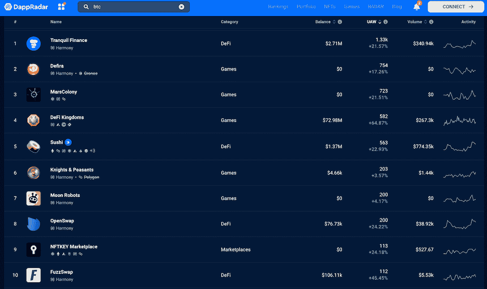
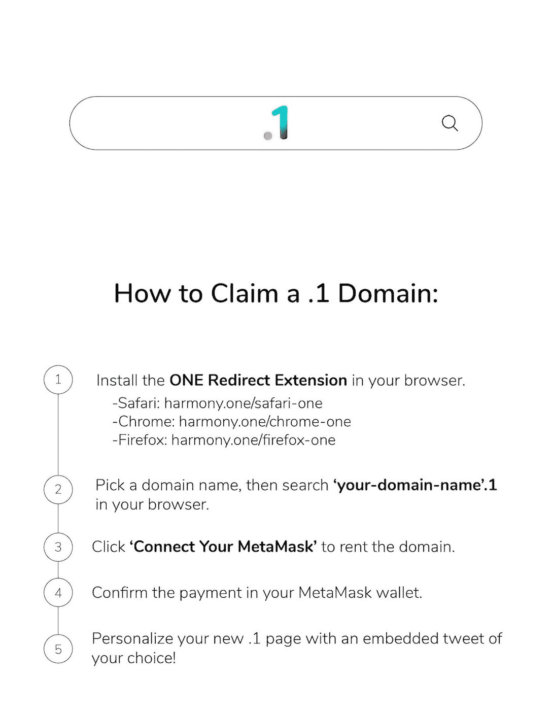

# 用和谐的全新领域系统重新想象 Web3 创造者经济

> 原文：<https://web.archive.org/web/https://dappradar.com/blog/reimagine-web3-creator-economy-with-harmonys-brand-new-domain-system>

## . 1 和。国家是和谐的最新 Web3 域名倡议。

和谐区块链引入了一个新的域名系统，以增强 Web3 身份的建设，并为创意经济增添动力。该系统包括. 1 和。国家域名，继承了网络的安全性和隐私性。最重要的是，这些 Web3 域将权力交还给用户，让他们成为自己真正的主人。

**内容:**

*   *[web 3 域为什么重要？](https://web.archive.org/web/20230128214233/https://dappradar.com/blog/reimagine-web3-creator-economy-with-harmonys-brand-new-domain-system/#why)*
    *   *[Web3 域名的好处](https://web.archive.org/web/20230128214233/https://dappradar.com/blog/reimagine-web3-creator-economy-with-harmonys-brand-new-domain-system/#benefits)*
*   *[什么是和谐的. 1.country 域？](https://web.archive.org/web/20230128214233/https://dappradar.com/blog/reimagine-web3-creator-economy-with-harmonys-brand-new-domain-system/#what)*
    *   打造你的网络 3 业务的实惠方式
*   *[有用链接](https://web.archive.org/web/20230128214233/https://dappradar.com/blog/reimagine-web3-creator-economy-with-harmonys-brand-new-domain-system/#links)*

到目前为止，2023 年对 crypto 来说非常好，因为象征性的奖励正在上升。当然，这并不是故事的全部。除了象征性的价格上涨，dapp 行业也见证了用户活动的增加，和谐网络是首批录得增长的用户之一。

根据 DappRadar Harmony 排名，该网络在 1 月 12 日至 18 日期间多个细分市场的用户活动都有所增长。在此期间，宁静金融、Defra 和 Mars Colony 的独立活跃钱包(UAW)增幅最大，分别增长了 21.57%、17.26%和 21.51%。

进入 2023 年，和谐号正朝着明确的目标前进。除了持续的协议开发，该网络旨在通过为 Web3 身份和创造者经济奠定基础来为采用铺平道路。为了实现这一目标，Harmony 引入了存储在用户加密钱包中的. 1.country、Web3 域，这些域可以与区块链、智能合约，当然还有 dapps 进行交互。

[Learn more about Harmony’s .1.country domain](https://web.archive.org/web/20230128214233/https://open.harmony.one/1-and-country-for-creator-economy)

## 为什么 Web3 域很重要？

在 Web2 中，域是 IP 字符串的简化格式，用于标识通过互联网提供的服务，如网站、电子邮件服务等。

通常，网站所有者对域名拥有管理自主权和权限，但他们并不拥有该域名。这是因为 Web2 生态系统由少数科技巨头控制，这些巨头是中央集权的实体。

近年来 Web 2.0 向 Web 3.0 的快速演进显示了互联网用户拥有自己的 Web 空间的刚性需求。Web3 域名的创建为实现互联网的自主管理增添了动力。

### Web3 域的优势

Web3 域可以用作分散式钱包的名称。这样，用户在进行加密货币交易时只需要确认域名，而不是盯着一串繁琐的字母数字组合。这种简化对推动加密货币的采用有着直接的好处。

用户还可以在这些域上创建和托管 web 应用程序。但与传统的由中央实体处理的域名不同，用户是 Web3 的所有者。此外，Web3 域名可以匿名注册，这意味着用户的身份与他们的域名无关。

储存在区块链上的 Web3 域名不能被任何人篡改或删除，因此可以抵御审查。此外，他们可以更有效地打击黑客劫持，因为分散消除了一个中心故障点。

## 什么是 Harmony 的. 1.country 域？

Harmony 将推出一个新的域名系统。1.country，它将允许创作者更好地发展数字经济，并在 Web3 生态系统中团结他们的粉丝。值得一提的是，用户可以部署. 1 和。国家域名分开。

像 s.1 这样的短名称可以用于钱包地址、数字收藏品和社会声誉。另一方面，像 s.country 这样的域名作为用户的商业网站或托管其他种类更广泛的内容。本质上，s.1 和 s.country 是一样的。

用户将需要一个特定的浏览器扩展，以便于从 s.1 重定向到 s.1.country。按照以下步骤安装该扩展，并了解如何声明您自己的由 Harmony 支持的 Web3 域。

和谐生态系统中的域名将成为不可伪造的标志(NFT)。因此，用户不仅可以公开透明地交易 Web3 域名，还可以通过拍卖出售。

[Learn more about Harmony’s .1.country domain](https://web.archive.org/web/20230128214233/https://open.harmony.one/1-and-country-for-creator-economy)

### 建立你的 Web3 业务的一个负担得起的方法

Harmony 将为 Web3 创作者和企业主提供一站式服务，以可承受的成本运营分布式网站。该产品可分为四个级别。

*   首先，用户可以每年支付 10 美元租用互联网域名。国家，其中包括. 1，可用于命名他们的钱包地址和数字收藏品。

*   第二，通过每年花费 100 美元，用户可以为他们的 Web3 域启用社交简档服务。这包括虚荣心网址，客户电子邮件，增长分析支持，等等。

*   第三，每年花费 1000 美元，这些 Web3 域名所有者可以在他们的网站上托管视频内容。这项服务也接受每月订阅和按次付费。

*   第四，这种订阅将满足订户的各种零售商业需求，费用为每年 10，000 美元。例如，如果订户想要一个为他们的社区定制的忠诚度计划，这可以包含在这个包中。

[Learn more about Harmony’s .1.country domain](https://web.archive.org/web/20230128214233/https://open.harmony.one/1-and-country-for-creator-economy)

以上是 Harmony 对其域名系统以及如何商业化的初步建议。区块链网络相信，这一创新将使用户在 Web3 中拥有一个独特的、受隐私保护的身份。除此之外，Harmony 希望其技术能够让用户在 Web3 生态系统中创新出更独特的商业模式。

因此，在 2023 年，区块链网络将专注于在技术、使用案例和商业化方面改进其. 1.country 域名系统。为了跟上 Harmony 在关键里程碑上的更新，你可以点击下面的链接。

#### 有用的链接

*   [网站](https://web.archive.org/web/20230128214233/https://www.harmony.one/)
*   [推特](https://web.archive.org/web/20230128214233/https://twitter.com/harmonyprotocol?s=20&t=WecuQNR4JAEUojT3Dlqg8g)
*   [中等](https://web.archive.org/web/20230128214233/https://medium.com/harmony-one)

**免责声明** —这是一篇赞助文章。DappRadar 不认可本页面上的任何内容或产品。DappRadar 旨在提供准确的信息，但读者应该在采取行动之前总是自己做研究。DappRadar 的文章不能被认为是投资建议。