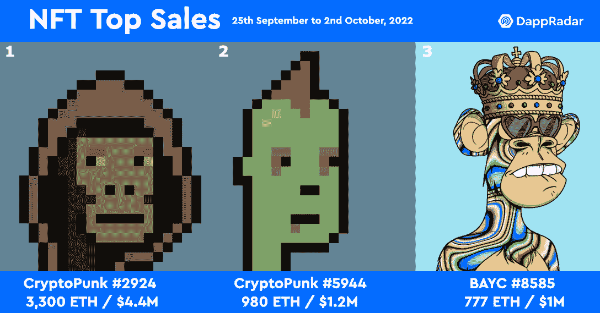
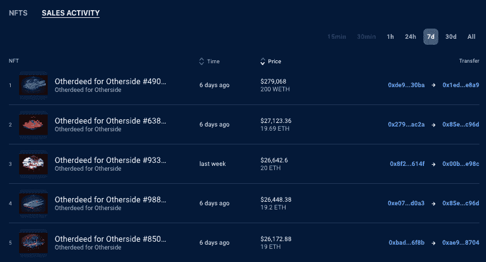
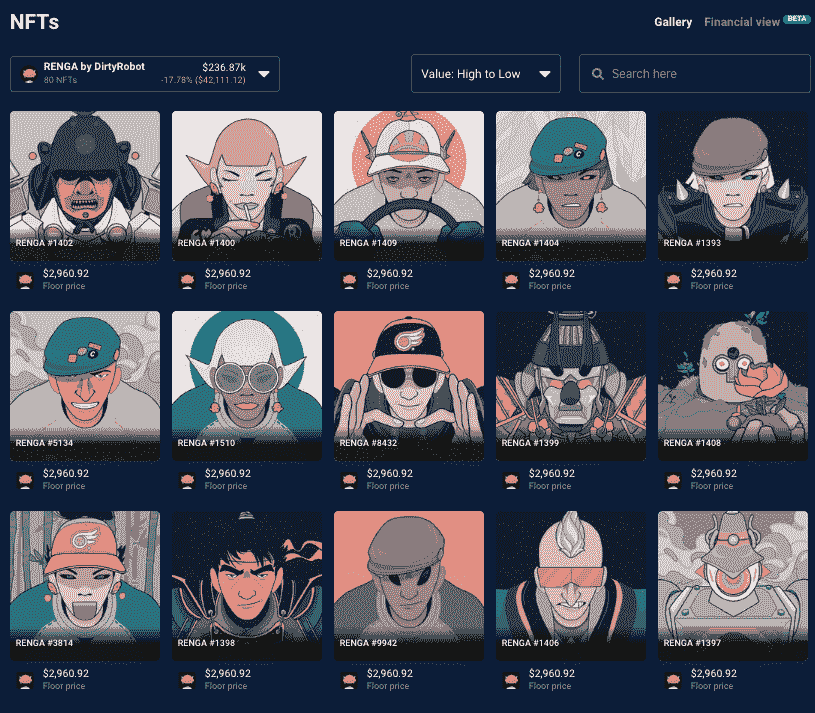

# RENGA 在 NFT 销量超过 Bored Ape 游艇俱乐部——NFT 顶级亮点

> 原文：<https://web.archive.org/web/https://dappradar.com/blog/renga-overtakes-bored-ape-yacht-club-in-nft-sales-top-nft-highlights>

## 查看 2022 年 9 月 25 日至 10 月 2 日期间的 NFT 销售亮点排名

由艺术家 Dirty Robot 制作的名为 RENGA 的一万个角色的手工收藏品是过去七天中交易量第二大的 NFT 收藏品。每一个 NFT 都有自己的身份，有待在更广泛的伦加传说中发现。截至发稿时，该系列产生了超过 750 万美元的交易量。

每周 DappRadar 不仅会重点报道 NFT 最贵的[销售](https://web.archive.org/web/20221128091306/https://dappradar.com/nft/sales)，还会报道过去七天中最有趣的。虽然大量的数字肯定会占据头条，但同样重要的是[突出新兴趋势](https://web.archive.org/web/20221128091306/https://dappradar.com/nft/sales)并保持 DappRadar 社区的领先地位。

一如既往，我们看到蓝筹股 NFTs 主导了最高价值的销售。在过去的七天里，NFT 的最高成交价是 T2 的 CryptoPunk #2924，3,300 ETH 或超过 420 万美元。第二名同样属于另一个朋克，僵尸 [CryptoPunk #5944，为 980 ETH](https://web.archive.org/web/20221128091306/https://dappradar.com/hub/assets/eth/0xb47e3cd837ddf8e4c57f05d70ab865de6e193bbb/5944) ，约合 120 万美元。

第三高的销售额属于 8585 号无聊猿游艇俱乐部，该俱乐部以 777 ETH 易手，约合 100 万美元。有趣的是，这只猿猴戴着国王的皇冠，出售的时间似乎与女王去世和查尔斯国王登基的时间非常吻合。[你能看出这只无聊的猿猴(BAYC)和新英国国王之间的相似之处吗？](https://web.archive.org/web/20221128091306/https://dappradar.com/hub/assets/eth/0xbc4ca0eda7647a8ab7c2061c2e118a18a936f13d/8585)

## 熊的底部

最近 CryptoPunk 和 BAYC NFT 销量如此之高的一个原因可能是交易员预计市场将很快稳定下来，并可能开始稳定。BTC 似乎对 19，000 美元的区域非常满意。与此同时，ETH 似乎满足于 1000 美元左右，长期预测者正在猜测底部，一些鲸鱼买家似乎已经接受了这一信号。

NFT 拍卖会上第四高的拍卖品是位于元宇宙世界另一边的宇迦实验室的一块土地，成交价为 200 wet T1，约合 28 万美元。有趣的是，这块土地上有一个[Koda](https://web.archive.org/web/20221128091306/https://dappradar.com/hub/assets/eth/0x34d85c9cdeb23fa97cb08333b511ac86e1c4e258/49060)，这解释了它的价值。

我们看到，在过去的七天里，这块地的价格与大约 20 天的土地易手趋势背道而驰。以 Koda——另一个宇宙中的关键人物之一——为特色的土地通常享有更高的价值。

[<picture></picture>](https://web.archive.org/web/20221128091306/https://dappradar.com/hub/nft-explorer/collection/otherdeed-for-otherside/sales-activity?period=week )

## 查看 NFT 销售亮点列表

*注意:出售时给出的美元价值是正确的*

1.  [志那都红豆# 2311](https://web.archive.org/web/20221128091306/https://dappradar.com/hub/assets/eth/0xed5af388653567af2f388e6224dc7c4b3241c544/2311)——134.56 万美元/100 ETH—[买家钱包](https://web.archive.org/web/20221128091306/https://dappradar.com/hub/wallet/eth/0xa1b0716aa6dbf5d1e477e0e434c40758ad24670b)
2.  [fide nza # 974](https://web.archive.org/web/20221128091306/https://dappradar.com/hub/assets/eth/0xa7d8d9ef8d8ce8992df33d8b8cf4aebabd5bd270/78000974)-120.92 万美元/ 92 瑞士法郎-[买家钱包](https://web.archive.org/web/20221128091306/https://dappradar.com/hub/wallet/eth/0x256ddbf15b903b8c80fd00ce908ef84d984e9dc2)
3.  [Ringers # 323](https://web.archive.org/web/20221128091306/https://dappradar.com/hub/assets/eth/0xa7d8d9ef8d8ce8992df33d8b8cf4aebabd5bd270/13000323)–90.14 万美元/65 ETH—[买家钱包](https://web.archive.org/web/20221128091306/https://dappradar.com/hub/wallet/eth/0x36c90e324ec049cf853292fb04c6f996d8c6ce97)
4.  [CloneX # 4491](https://web.archive.org/web/20221128091306/https://dappradar.com/hub/assets/eth/0x49cf6f5d44e70224e2e23fdcdd2c053f30ada28b/9861)-84.93 万美元/63 WETH-[买家钱包](https://web.archive.org/web/20221128091306/https://dappradar.com/hub/wallet/eth/0x1ff1d7f0a7b9b4520228cbe69e95b404ff70d1c3)
5.  [CloneX # 10071](https://web.archive.org/web/20221128091306/https://dappradar.com/hub/assets/eth/0x49cf6f5d44e70224e2e23fdcdd2c053f30ada28b/4302)-$ 77.42k/58 ETH-[买家钱包](https://web.archive.org/web/20221128091306/https://dappradar.com/hub/wallet/eth/0x2b1e214be3249be48a23ad1d3ee50d50ab526637)
6.  [变种人猿游艇俱乐部# 15042](https://web.archive.org/web/20221128091306/https://dappradar.com/hub/assets/eth/0x60e4d786628fea6478f785a6d7e704777c86a7c6/15042)-$ 65.85k/50 ETH-[买家钱包](https://web.archive.org/web/20221128091306/https://dappradar.com/hub/wallet/eth/0xed5ab5bd6018891c7ab7af0a0ce44442d7e8968c)
7.  [Meebit # 6272](https://web.archive.org/web/20221128091306/https://dappradar.com/hub/assets/eth/0x7bd29408f11d2bfc23c34f18275bbf23bb716bc7/6272)–＄60.06 万/60 万 USDC—[买家钱包](https://web.archive.org/web/20221128091306/https://dappradar.com/hub/wallet/eth/0x6c8ee01f1f8b62e987b3d18f6f28b22a0ada755f)
8.  [伦加黑匣子# 593](https://web.archive.org/web/20221128091306/https://dappradar.com/hub/assets/eth/0x64ad353bc90a04361c4810ae7b3701f3beb48d7e/593)-$ 58.25k/44.44 ETH-[买家钱包](https://web.archive.org/web/20221128091306/https://dappradar.com/hub/wallet/eth/0xa14964479ebf9cd336011ad80652b08cd83dfe3a)
9.  [Beanz # 2557](https://web.archive.org/web/20221128091306/https://dappradar.com/hub/assets/eth/0x306b1ea3ecdf94ab739f1910bbda052ed4a9f949/2557)-$ 50.08k/37.5 ETH-[买家钱包](https://web.archive.org/web/20221128091306/https://dappradar.com/hub/wallet/eth/0x80ac8b6f4cacea6129f5cf1365904f056b4e29ea)
10.  [QQL Mint Pass # 555](https://web.archive.org/web/20221128091306/https://dappradar.com/hub/assets/eth/0xc73b17179bf0c59cd5860bb25247d1d1092c1088/555)-30，965.76 美元/24 ETH-[买家钱包](https://web.archive.org/web/20221128091306/https://dappradar.com/hub/wallet/eth/0x97e7124bbce0baf75a7c4688b98a0c1ddfafb3f5)

## 肮脏机器人的连珠

虽然 NFT 市场最近有所降温，但一些藏品却一出手就产生了影响。由加密艺术家和插画家 Dirty Robot 创作的 RENGA 表现如此出色，以至于在过去的七天里，它目前已经成为[第二大交易量的 NFT 收藏](https://web.archive.org/web/20221128091306/https://dappradar.com/nft/collections)，仅次于 CryptoPunks，产生了超过 750 万美元的交易量。

上周如此活跃的交易将伦加 NFT 的平均价格推高了 35%，至 2.29 埃特，而平均销售价格接近 3.6 埃特。在过去的七天里，有 2315 件伦加 NFT 作品被拍卖，其中最贵的是 26 号伦加作品，售价为 20 ETH，将近 26000 美元。元数据显示这个特殊的伦加·NFT 有 1/18 的特征，是个炼金术士。

[<picture></picture>](https://web.archive.org/web/20221128091306/https://dappradar.com/hub/nft-explorer?period=week)

我们还看到了我们的第一条伦加 NFT 鲸(T1)和 80 条伦加鲸鱼(T3)的收藏，根据底价估计价值为 235，000 美元。​​

[<picture></picture>](https://web.archive.org/web/20221128091306/https://dappradar.com/hub/wallet/eth/0x3d2403a1764cb01304807da570ef440e609a8607/nfts/1/renga-by-dirtyrobot )

## qqq 造币厂传递新 NFT 艺术感觉

在伦加后面，但在 BAYC 和 MAYC NFTs 上面，我们看到了 [QQL Mint pass 系列](https://web.archive.org/web/20221128091306/https://dappradar.com/hub/nft-explorer/collection/qql-mint-pass-official)。QQL 是泰勒·霍布斯(Tyler Hobbs)和 Dandelion Wist Mané在生殖艺术领域的合作实验。一张[qqq 造币通票](https://web.archive.org/web/20221128091306/https://dappradar.com/hub/nft-explorer/collection/qql-mint-pass-official)给予所有者权利，用他们选择的作品，在 [qql.art.](https://web.archive.org/web/20221128091306/https://qql.art/) 上生成，铸造一个官方的 qqq NFT

有 [999 个可用的代币](https://web.archive.org/web/20221128091306/https://dappradar.com/hub/nft-explorer/collection/qql-mint-pass-official/sales-activity?period=week&order-by=priceInFiat)，每个代币授予持有者铸造一个 NFT 的能力。一场荷兰式拍卖将提供竞拍 900 枚代币的机会。创作者将为惊喜合作预留 99 个代币。

薄荷通行证的平均价格约为 22，000 美元。迄今为止最贵的是 [Mint Pass #555](https://web.archive.org/web/20221128091306/https://dappradar.com/hub/assets/eth/0xc73b17179bf0c59cd5860bb25247d1d1092c1088/555) ，售价 24 ETH，约 3 万美元。然而，考虑到大多数[泰勒·霍布斯的](https://web.archive.org/web/20221128091306/https://tylerxhobbs.com/)生成性艺术作品[，比如菲登扎](https://web.archive.org/web/20221128091306/https://dappradar.com/hub/assets/eth/0xa7d8d9ef8d8ce8992df33d8b8cf4aebabd5bd270/78000974)，价格都在 10 万美元以上，这使得它成为一个现实的成本切入点。

[<picture></picture>](https://web.archive.org/web/20221128091306/https://dappradar.com/hub/nft-explorer/collection/qql-mint-pass-official/sales-activity?period=week&order-by=priceInFiat)

这些 NFT 艺术品最令人兴奋的是，持有者可以通过连接 web3 钱包，通过[创建页面](https://web.archive.org/web/20221128091306/https://qql.art/about)来玩算法。用户可以保存独特的输出和图像，并能够回来继续迭代。此外，[举办了一场竞赛](https://web.archive.org/web/20221128091306/https://qql.art/about)，挑战收藏者使用 QQL 算法创作出他们最好的作品，这反映了 QQL 对社区策展的关注。

## 随身携带您的 Web3 之旅

使用 DappRadar 移动应用程序，再也不会错过 Web3。查看最受欢迎的 dapps 的性能，并关注您投资组合中的 NFT。您在 DappRadar 上的帐户会与我们的移动应用程序同步，这样您很快就可以选择实时接收提醒。

[Download the DappRadar app now](https://web.archive.org/web/20221128091306/https://dappradar.app.link/blog)[<picture></picture>](https://web.archive.org/web/20221128091306/https://play.google.com/store/apps/details?id=com.portfolio.dappradar)

## 更多 NFT 市场出现增长

当 OpenSea 作为 NFT 市场的领导者享受其先发优势时，一些追求者来敲门了。很高兴看到两个 dapp 本地市场进入前十，因为 CryptoPunk 和 Axie 市场仍然是交易者进行这些 NFT 交易的地方。

OpenSea 失去控制的最明显迹象是交易者数量下降了近 20%。相比之下，竞争对手平台 [Magic Eden](https://web.archive.org/web/20221128091306/https://dappradar.com/solana/marketplaces/magic-eden) 和 X2Y2 在过去一周的交易人数增加了约 3%。这两个平台现在都从事以太坊非功能性金融交易，进一步巩固了它们的地位。

[<picture></picture>](https://web.archive.org/web/20221128091306/https://dappradar.com/nft/marketplaces)

***以上不构成投资建议。此处给出的信息仅供参考。请行使尽职调查，做你的研究。作者持有多种加密货币的头寸，包括 BTC、瑞士法郎和雷达。***

 NewsletterUnsubscribe at any time. [T&Cs](https://web.archive.org/web/20221128091306/https://dappradar.com/terms) and [Privacy Policy](https://web.archive.org/web/20221128091306/https://dappradar.com/privacy-policy)