# NFT 估价报告:哪些以太坊收藏跑赢了市场？

> 原文：<https://web.archive.org/web/https://dappradar.com/blog/report-the-decline-of-ethereum-nft-collection-market-caps>

## NFT 的市值估计为 37 亿美元。

**NFT 仍然是 dapp 行业的关键驱动力之一，区块链以太坊一直拥有最大的 NFT 收藏市值。NFT 市场不仅显示出明显的经济复苏迹象，而且采用数字收藏品的品牌和使用案例的数量持续上升，并超越了以太坊。**

到目前为止，2023 年，NFTs 产生了 8.7 亿美元的交易量，其中 5.87 亿美元来自收藏品。支票和 Memes OE 等新趋势引起了市场的注意，但蓝筹股收藏品在 NFT 市场上的价值最高。

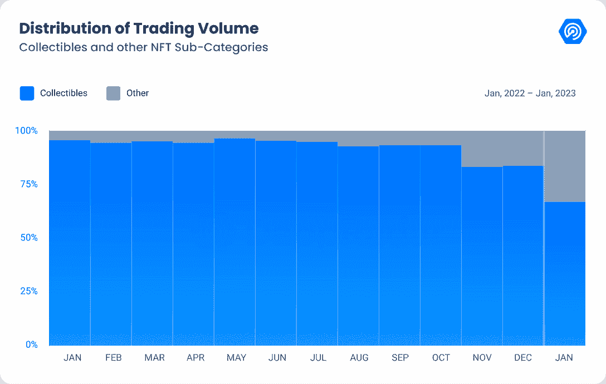

通过使用机器学习算法，DappRadar 生成了每个 NFT 个体值的精确估计。这份报告将利用这些 NFT 价值评估，对顶级以太坊 NFT 系列的市值进行更准确的分析。

## 关键要点

*   尽管 2022 年对以太坊系列来说是充满挑战的一年，但我们的机器学习算法分析的 81 个系列的市值以美元计下降了 59.60%，从年初的 93 亿美元降至 37 亿美元。
*   宇迦实验室已经确立了自己在 NFT 行业的领先地位。然而，大多数藏品在年底都面临贬值，其中 Otherdeeds 的市值经历了 86.15%的最大跌幅。
*   志那都红豆、矮胖企鹅和德根·图恩兹系列是 2021 年或 2022 年初推出的唯一一个市值大幅增长的 NFT 系列，升值幅度分别为 113.89%、260%和 204%。
*   在 Terra Luna 崩溃后推出的 NFT 系列设法在 2022 年底前提高了市值。比如 134.68%的波塔托兹，211.63%的伦加，209.88%的 DigiDaigaku 和 1653.28%的神恨 NFTees

## 目录

1.  [如何给 NFTs 估值？](https://web.archive.org/web/20230306081247/https://dappradar.com/blog/report-the-decline-of-ethereum-nft-collection-market-caps/#Chapter-1)
2.  [以太坊 NFT 市值估计为 37 亿美元](https://web.archive.org/web/20230306081247/https://dappradar.com/blog/report-the-decline-of-ethereum-nft-collection-market-caps/#Chapter-2)
3.  [以太坊 NFT 67%的市值属于宇迦实验室 NFTs](https://web.archive.org/web/20230306081247/https://dappradar.com/blog/report-the-decline-of-ethereum-nft-collection-market-caps/#Chapter-3)
4.  [2021 年，尽管市场波动，NFT 收藏在 2022 年依然繁荣](https://web.archive.org/web/20230306081247/https://dappradar.com/blog/report-the-decline-of-ethereum-nft-collection-market-caps/#Chapter-4)
5.  [在 Terra Luna 崩溃后证明具有弹性的非功能性测试](https://web.archive.org/web/20230306081247/https://dappradar.com/blog/report-the-decline-of-ethereum-nft-collection-market-caps/#Chapter-5)
6.  [并非所有蓝筹股都是金矿](https://web.archive.org/web/20230306081247/https://dappradar.com/blog/report-the-decline-of-ethereum-nft-collection-market-caps/#Chapter-6)
7.  [结论](https://web.archive.org/web/20230306081247/https://dappradar.com/blog/report-the-decline-of-ethereum-nft-collection-market-caps/#Conclusion)

## 1.如何评价 NFTs？

[DappRadar 的 NFT 价值估计器](https://web.archive.org/web/20230306081247/https://dappradar.com/hub/nft-value-estimator/)是一种工具，它根据非森林树木的稀有特征和属性提供对其个体价值的精确估计。估计器使用受监督的机器学习算法来分析 NFTs 的元数据，并对最近的销售进行插值，以提供基于最新市场条件的估计。DappRadar 还在平台的其他部分部署了价值评估器，例如 [your own Portfolio](https://web.archive.org/web/20230306081247/https://dappradar.com/hub/wallet) 和 [NFT Explorer](https://web.archive.org/web/20230306081247/https://dappradar.com/hub/nft-explorer) 。

估计器使用插值，这是一种机器学习算法，使用一组标记的数据点来创建问题的预测模型。它提供了连续的估计，但是严重依赖于所提供的数据点，并且不能确定给定数据点之外的函数行为。

DappRadar 的 [NFT 价值估算器](https://web.archive.org/web/20230306081247/https://dappradar.com/hub/nft-value-estimator/)是一个关键工具，可以更准确地估算一个收藏品的真实市值。为了估计 NFT 的价值，该算法不会查看过去的销售额或底价来确定其价值。相反，它会比较集合中所有资产的元数据，以计算 NFT 最可能的价值，并在新的销售发生时调整其计算。

目前，NFT 价值估算者计算了几十个集合中几十万个非功能性翻译的价值。用户可以通过 NFT 价值估算器、NFT 探索者或[投资组合](https://web.archive.org/web/20230306081247/https://dappradar.com/hub/wallet)找到单个资产的定价。DappRadar 不断向 estimator 添加新的集合和数据，以创建市场上最准确的价格预测工具。

NFT 估值器基于实际销售额，比较单个销售额的元数据，以确定哪些属性使特定的 NFT 在价格上脱颖而出。集合中发生的交易越多，评估者的工作就越好。

NFT 估值器提供了三种不同的价格估值:

1.  **最后销售价格**–特定 NFT 最后支付的价格，这是最不准确的估价。
2.  **底价**–根据一段时间内一个收藏中出售的最便宜的 NFT 计算的价格，对收藏中最稀有和最不稀有的非专利艺术品给出相同的价格估计。
3.  **预计价格**——预计价格更加智能，根据实际销售额和 NFT 元数据计算得出，可以在[投资组合](https://web.archive.org/web/20230306081247/https://dappradar.com/hub/wallet)和 [NFT 浏览器页面](https://web.archive.org/web/20230306081247/https://dappradar.com/hub/nft-explorer)中看到。

## 2.以太坊 NFT 市值估计为 37 亿美元

我们的价值估算师*分析的 81 个以太坊系列的市场在 2022 年经历了艰难的一年。这些藏品的市值从年初的 93 亿美元下降了 59.60%，目前估计为 37 亿美元。宇迦实验室的 NFT 收藏市值占总市值的 67%。然而，考虑到 ETH 去年损失了 60%的价值也是很重要的，这对 NFTs 的价值有很大的影响。

此外，NFT 市场的这种收缩并不反映 NFT 的效用，而是不良行为者和市场操纵的结果。尽管如此，许多有前途的项目从熊市中脱颖而出，展示了独特数字资产的潜力。

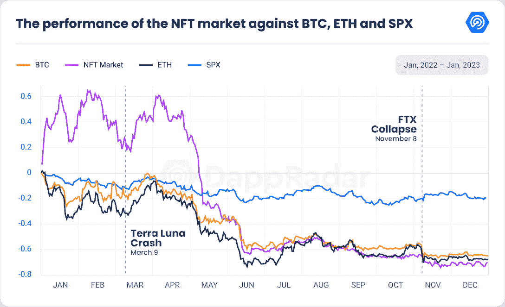

虽然 2022 年上半年出现了 NFT 的繁荣和围绕独特数字资产的炒作，但这种增长与以太网、比特币和 SPX 等其他传统资产的表现形成了鲜明对比，这些资产都呈下降趋势。NFT 市场为投资者提供了更高的回报，市值在 2022 年 2 月达到最高值 191 亿美元。

然而，这种增长是不可持续的，2022 年 5 月 Terra Luna 的崩溃对 NFT 市场产生了毁灭性的影响，导致其价值在 6 月份下降了 88%。Terra Luna 事件也对比特币和以太的表现产生了重大影响。

11 月份 FTX 的崩溃进一步加剧了这一下降趋势，月底市值达到最低点 22 亿美元。

尽管 2022 年面临挑战，但 NFT 市场显示出充满希望的复苏迹象，今年收盘时市值为 37 亿美元，比 11 月增长 68%。这种价值的增长是一个看涨的信号，特别是当结合 2023 年 1 月[看到的积极的连锁指标时。](https://web.archive.org/web/20230306081247/https://dappradar.com/blog/2023-begins-with-a-comeback-nfts-and-defi-show-recovery-signs/#Chapter-3)

* **我们的价值估算师分析的 81 个以太坊 NFT 系列:**

无聊猿养狗俱乐部、CryptoPunks、变种人猿游艇俱乐部、无聊猿游艇俱乐部、Meebits、Otherdeed for Otherside、God Hates、KILLABEARS、DirtyRobot 的 RENGA、DigiDaigaku、Potatoz、Netvrk Land、DEGEN TOONZ COLLECTION、Pudgy Penguins、mfers、rektguy、志那都红豆、Rare Apepes、10KTF、CryptoDickbutts、S3、goblintownNFT、Tom Sachs 火箭工厂、Autoglyphs、Fluf World、安东尼·霍普金斯-The ever、CLONE X–X 村上隆 0N1 Force、Adam Bomb Squad、10KTF 古驰圣杯、pixel mon–第 1 代、邪恶的 Craniums、Avastars、ALIENFRENS V2、被遗忘的符文、懒惰的狮子、月鸟、Kaiju Kingz、DeadFellaz、Loot(给冒险者的)、华尔街公牛、Hashmasks、VeeFriends 系列 2、网络经纪人、Gutter Cat Gang、WebbLand、MutantCats、The Alien Boy、Cyberkongz VX、看不见的朋友、Animetas、NFT 世界 V2、Akutars、朋克漫画特别版、酷猫、Mekaverse、Cyberkongz 鲜花官方、3Landers、Anonymice、TROSLEY 的丛林怪胎、Doge Pound、MetaHero Universe:、生成身份、鬼鬼祟祟的吸血鬼辛迪加、Sup Ducks、Vox Collectibles、反义词:创世纪、PXN:幽灵除运算、卡拉福鲁 V2、朋克漫画

## 3.以太坊 NFT 67%的市值属于宇迦实验室 NFTs

宇迦实验室已经在 NFTs 领域建立了强大的存在，创造了 yug 倒戈生态系统，其中包括几个 NFT 集合，如无聊猿游艇俱乐部(BAYC)、无聊猿养狗俱乐部(BAKC)、突变猿游艇俱乐部(MAYC)、Meebits、CryptoPunks 和 Otherside 的其他 deeds。

Bored Ape 游艇俱乐部的所有者是第一批拥有完全所有权和商业使用权的人，这使它有别于其他 NFT 收藏。

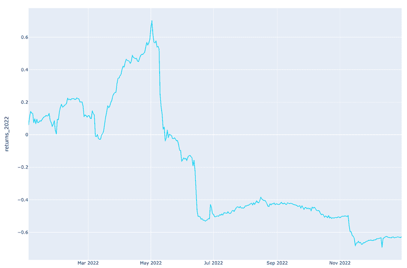

然而，尽管以 26 亿美元的市值评估进入 2022 年，Bored Ape 游艇俱乐部仍经历了 64.92%的贬值，以 9.34 亿美元的市值结束了这一年。

无聊猿养狗俱乐部后来被释放，为无聊猿游艇俱乐部的主人提供狗的 NFTs。这些 NFT 在 2023 年 1 月的平均底价为 11，536 美元(ETH 为 8 美元)，总交易量为 4，590 万美元。

这个 NFT 系列在 2022 年底的市值贬值了 47.42%，达到 1.01 亿美元。

2021 年 8 月，变异猿游艇俱乐部启动，拥有 20k 只变异猿，2022 年初市值 10 亿美元。这个集合是通过一种血清创造的，这种血清将一只无聊的猿变异成一只突变猿。从技术上来说，这意味着用户需要一个血清 NFT，以烧毁资产，并获得一个突变猿。2022 年末，其市值贬值 64.80%，达到 3.73 亿美元。

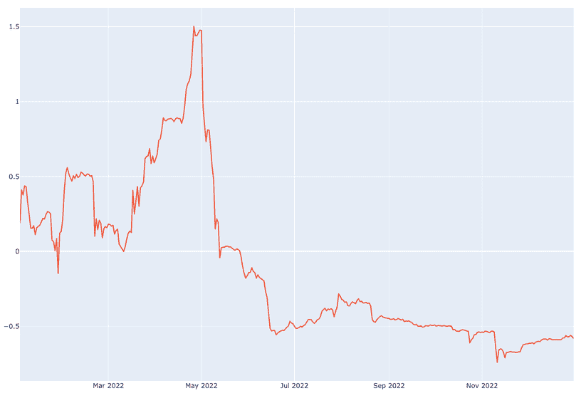

宇迦实验室还从幼虫实验室获得了市场上最大的两个 NFT 收藏 CryptoPunks 和 Meebits，金额未披露。尽管 NFT 市场整体下滑，CryptoPunks 系列仍然是最有价值的 NFT 系列之一。

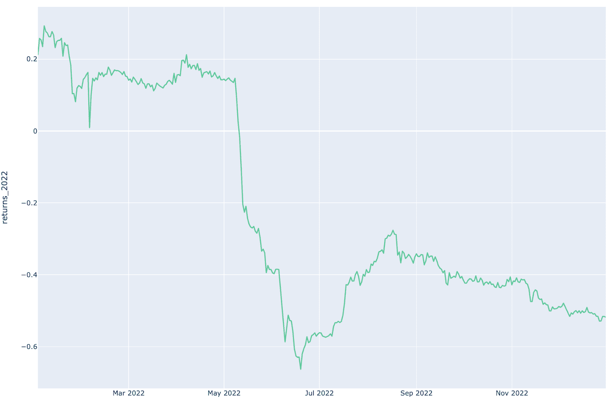

截至 2022 年底，NFT 系列的市值为 11 亿美元，跌幅为 60.24%，但截至 2023 年 1 月，该系列在瑞士联邦理工学院的平均底价仍为 95，200 美元和 66 美元。

另一方面，Meebits 系列并不成功。2022 年底，Meebits 系列的市值为 1.1 亿美元，下跌了 96.35%，价值大幅下降。

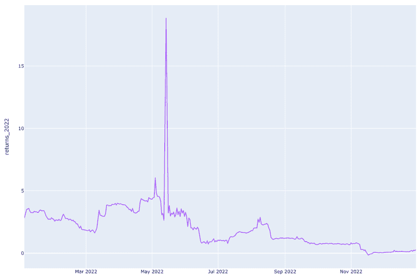

宇迦实验室的最终目标是另一边的元宇宙，他们仍在开发中。它由 20 万块土地组成，由另一个契约 NFT 代表。每个地契都提供了独特的环境和沉积物，可能包含资源、神器或 Koda。元宇宙运行 ApeCoin 加密货币，该货币由 ApeCoin DAO 拥有和管理，宇迦实验室是主要贡献者之一。

NFT 收藏的推出非常成功，第一个月的交易量为 7.29 亿美元，吸引了宇迦实验室的每一个 NFT 收藏。

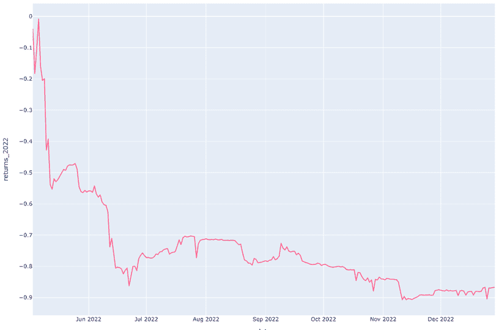

这帮助 Otherdeeds 的市值增加到 25 亿美元。然而，到 2022 年底，市值减少到 3.56 亿美元，降幅达 86.15%。早在 2022 年 11 月，宇迦实验室收购了 NFT 初创公司 WENEW，这是他们将时尚部门推进到元宇宙计划的关键一环。WENEW 由著名艺术家 Mike“bee ple”winkel Mann 共同创立，通过与古驰、路易威登、花花公子和温布尔登网球锦标赛等主要品牌的合作，已成为 NFT 领域的知名玩家。此外，WENEW 的 10KTF 项目围绕一个虚构的裁缝为高价值的侧面图片项目(包括无聊的猿)创建数字服装，该项目因其创新的 NFTs 方法而获得了认可。

## 4.尽管市场波动，2021 年 NFT 系列仍在 2022 年蓬勃发展

2021 年和 2022 年初，推出了几个 NFT 系列，但尽管加密市场起伏不定，但并非所有系列都能保持其价值。在这一部分，我们将重点关注三个在 2022 年脱颖而出的 NFT 系列，即使在加密价格下跌的情况下，它们也能保持盈利。

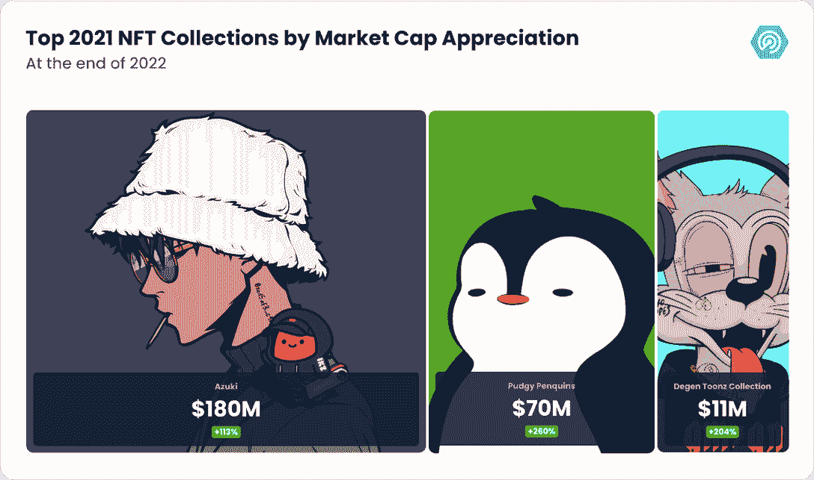

第一个系列是志那都红豆。2022 年初，其市值为 8400 万美元，平均底价为 12235 美元或 4.78 ETH。然而，该系列在 2022 年 4 月出现了大幅升值，当时达到了 11 亿美元的最高市值，增长了 1660%。这种增长是由于推出了第二个系列，名为 Beanz，它为社区提供了一个更便宜的切入点，标志着志那都红豆新时代的开始。最初的志那都红豆·NFT 系列的主人在他们的钱包里收到了一个神秘的空投 NFT，后来发现这是宾兹系列的一个新角色。

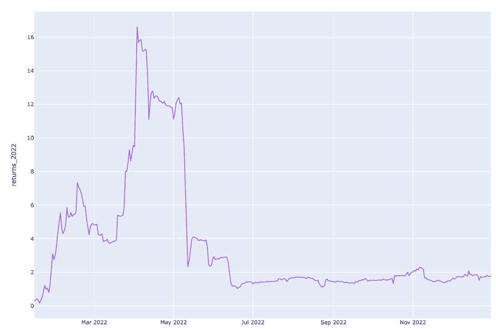

尽管今年晚些时候市值有所下降，但志那都红豆在 2022 年收盘时的市值为 1.8 亿美元，比年初增长了 113.89%。年底的底价为 14，786 美元和 12 ETH，2023 年 1 月，以美元计算的底价上涨了 29.71%，ETH 上涨了 10.16%。2022 年 11 月，志那都红豆还与红牛车队合作，将志那都红豆#8494 放在两辆汽车的侧面，这是对该系列的重大推动。

第二个系列是 Pudgy Penguins，今年年初的市值为 2500 万美元。4 月份，市值达到了 1.12 亿美元的最高值，增长了 478%。这些收藏品随后以 750 ETH(约合 250 万美元)的价格卖给了 Luca Schnetzler，他是这个项目及其社区的长期粉丝。

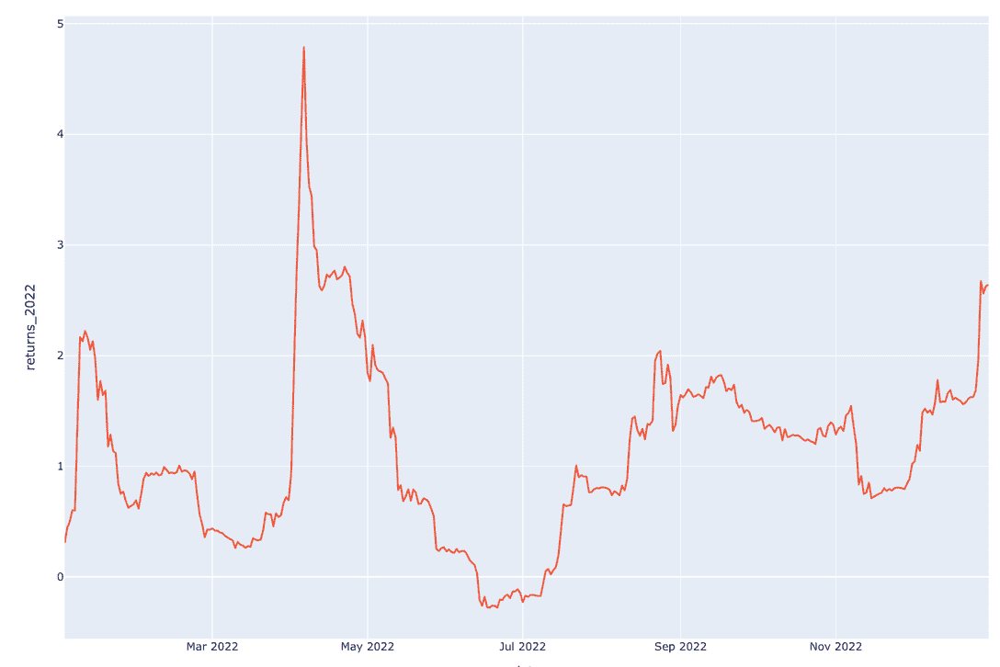

尽管由于 Terra Luna 的崩溃，2022 年 6 月的市值有所下降，但 Pudgy Penguins 以 7000 万美元的市值结束了这一年，比年初增长了 260%。

最后一个系列是 Degen Toonz 系列。今年年初，它的市值为 340 万美元，2022 年 5 月达到了 6170 万美元的最高值。这一增长是由每个卡通持有者要求一份免费 NFT 的下降以及官方无聊和饥饿餐厅的汉堡合作推动的。

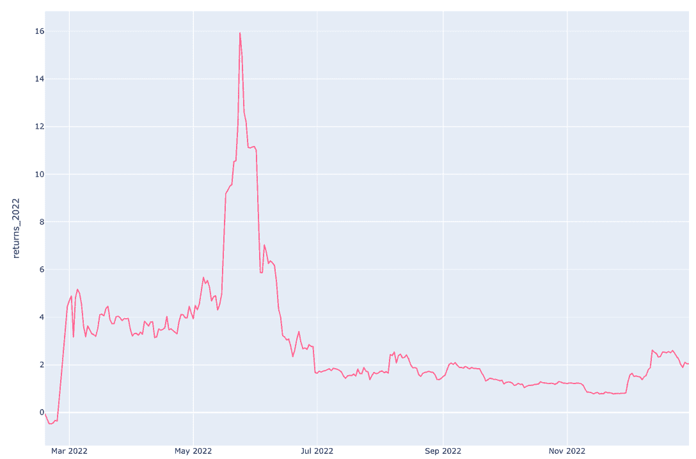

尽管在炒作之后市值有所下降，但 DEGEN TOONZ COLLECTION 在 2022 年收盘时的市值为 1，100 万美元，较年初上涨了 204%。

## 5.在 Terra Luna 崩溃后证明具有弹性的非功能性测试

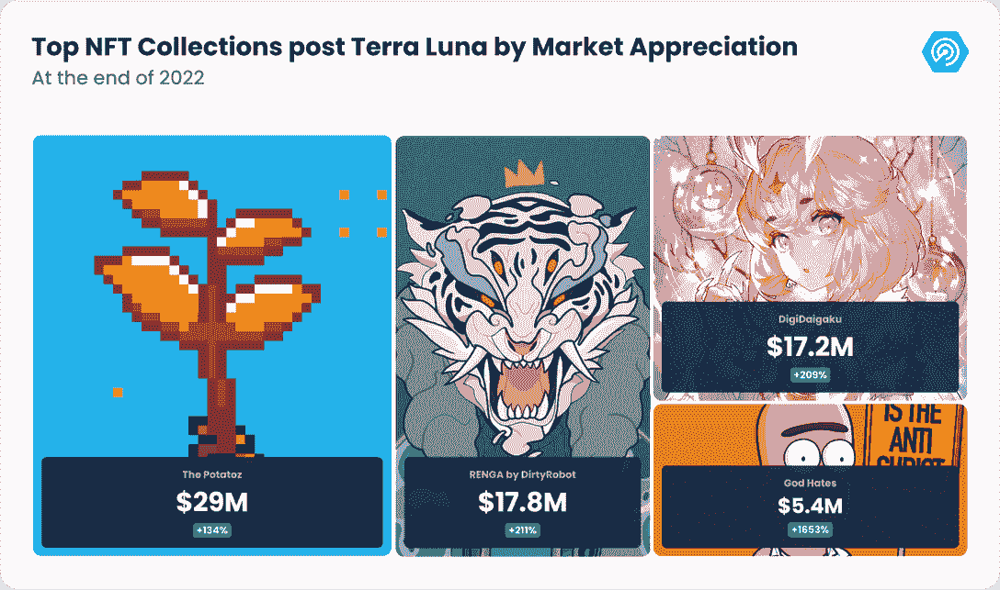

NFT(不可替代代币)市场受到了 2021 年初 Terra Luna 崩溃的严重影响。市场动荡不仅影响了 NFT 市场，也影响了整个 dapp 行业。尽管行业面临挑战，还是有一些 NFT 系列成功推出，并在市场上表现良好。这些系列，包括 Potatoz、Renga、DigiDaigaku 和 God Hates NFTees，尽管面临市场挑战，但其市值都有显著增长。

Potatoz 于 2022 年 7 月 20 日铸造，并于 11 月 12 日公布，是由互联网媒体巨头 9GAG 旗下的元宇宙项目 Memeland 制作的集合。该系列在 mint 上市首日的初始市值为 1230 万美元，总体呈上升趋势，2022 年 8 月的最高估值为 2940 万美元。

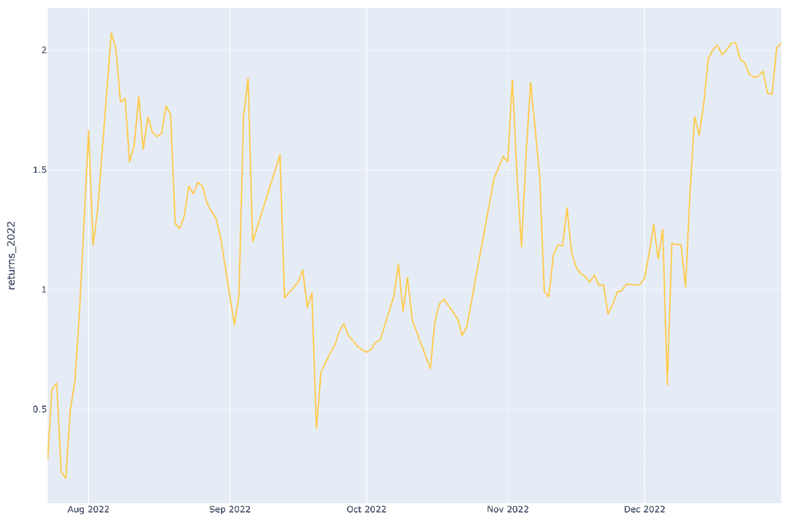

该系列还能够保持其价值，2022 年收盘时市值为 2906 万美元，仅比最高价值下降了 1.2%。该系列提供了铸造 NFT 上尉的机会，这可能有助于它的成功。

Renga 是一个手工制作的 10，000 个角色的集合，于 2022 年 9 月由著名的 NFT 艺术家 DirtyRobot 推出。他以其时尚的个性和丰富的职业道德而闻名。

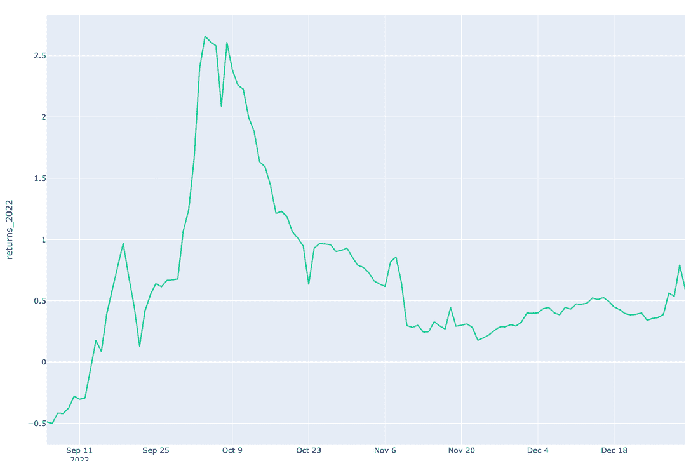

该系列独特的艺术和社区基金会，包括一个紧密团结的收藏家团体和 10KTF 社区的支持，帮助它自推出以来市值上涨了 211.63%，截至 2022 年市值为 1，780 万美元

DigiDaigaku 是一个由 Web3 游戏公司 Limited Break 推出的 NFT 集合。他们从可爱的动漫风格中获得了灵感。

该系列是未来 MMO 游戏的一部分，该游戏利用了一种新颖的“自由拥有”机制，自推出以来，市值上涨了 209.88%，截至 2022 年，市值为 1720 万美元。DigiDaigaku 看到了各种额外的 NFT 下降，这反过来使原来的收藏更有价值。

上帝讨厌 NFTees 是一个由 5022 个 meme NFT 人物组成的集合，由一个化名为 SrPeters 的神秘人物在 2022 年 7 月推出。

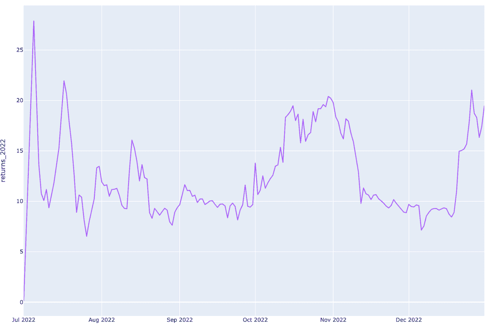

该集合作为一个社区管理的 DAO 进行运营，其不和谐之处仅用于钓鱼目的，自推出以来，市值上涨了+1，653.28%，截至 2022 年，市值为 540 万美元。

总之，尽管 NFT 市场在 Terra Luna 崩溃后面临挑战，但仍有一些系列能够在市场上推出并表现良好。

## 6.并不是所有的蓝筹股都是金矿

近年来，NFT 市场出现了爆炸式增长，各种各样的数字艺术和收藏品变得非常受欢迎。尽管有长期价值的承诺，但并不是每一件 NFT 藏品都能保持其价值，一些藏品在一年中出现了大幅贬值。

我们名单上的第一个是 Meebits，它在 2022 年底的市值为 1.107 亿美元，但比年初的价值下降了 96.35%。

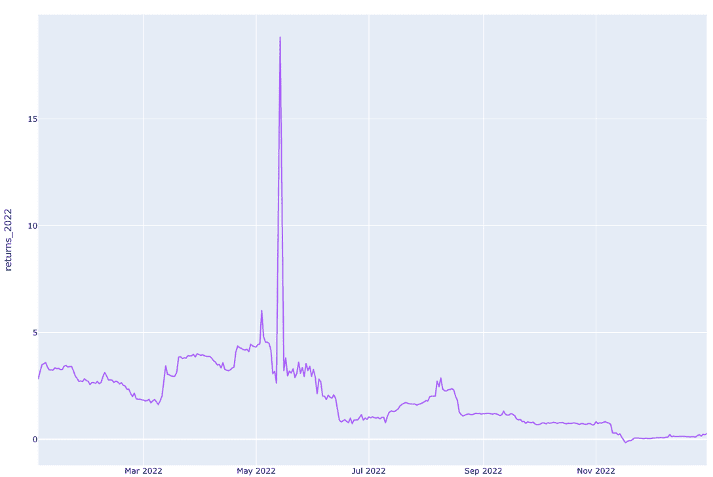

幼虫实验室创造了米比特 NFT 系列，并于 2022 年将该品牌出售给宇迦实验室。尽管围绕 Meebits 的炒作和关注，但该系列未能达到预期，其市场价值因此受到影响。

另一个经历大幅贬值的 NFT 系列是酷猫，2022 年底的市值为 3540 万美元。这个市值代表了 92.04%的跌幅。

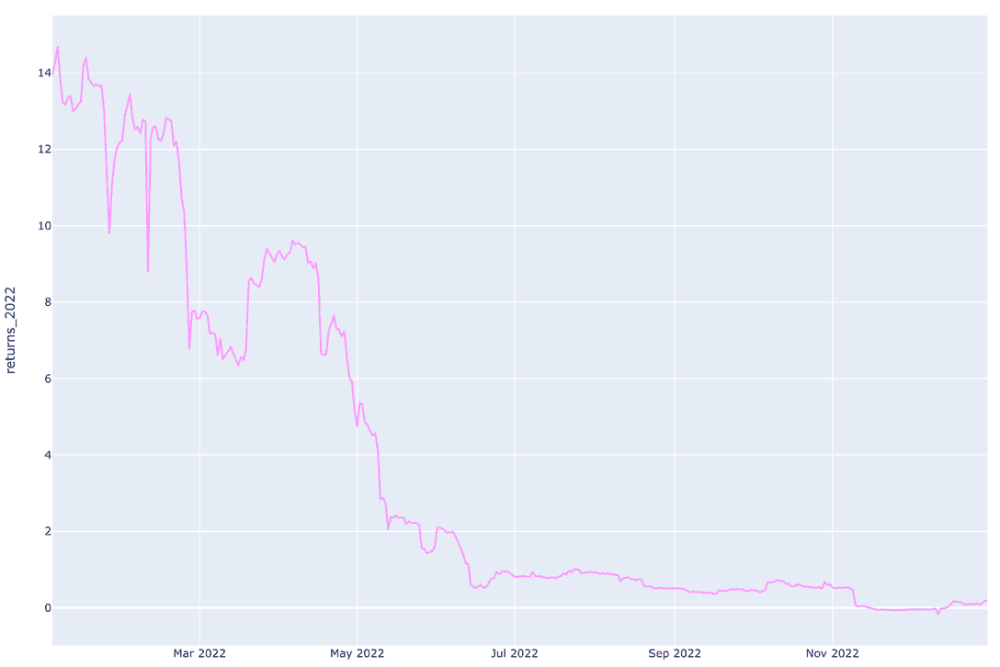

酷猫 NFT 系列是由科林·伊根、埃文·卢扎、汤姆·威廉姆森和罗布·梅休创建的，最初引起了很多兴奋和热议。然而，炒作很快消退，其市值也因此暴跌。

克隆 X- x 村上隆，NFT 系列与日本著名艺术家村上隆合作创建了数字时装工作室 RTFKT。尽管与这些有影响力的名字相关联，这些收藏品的价值还是急剧下降。

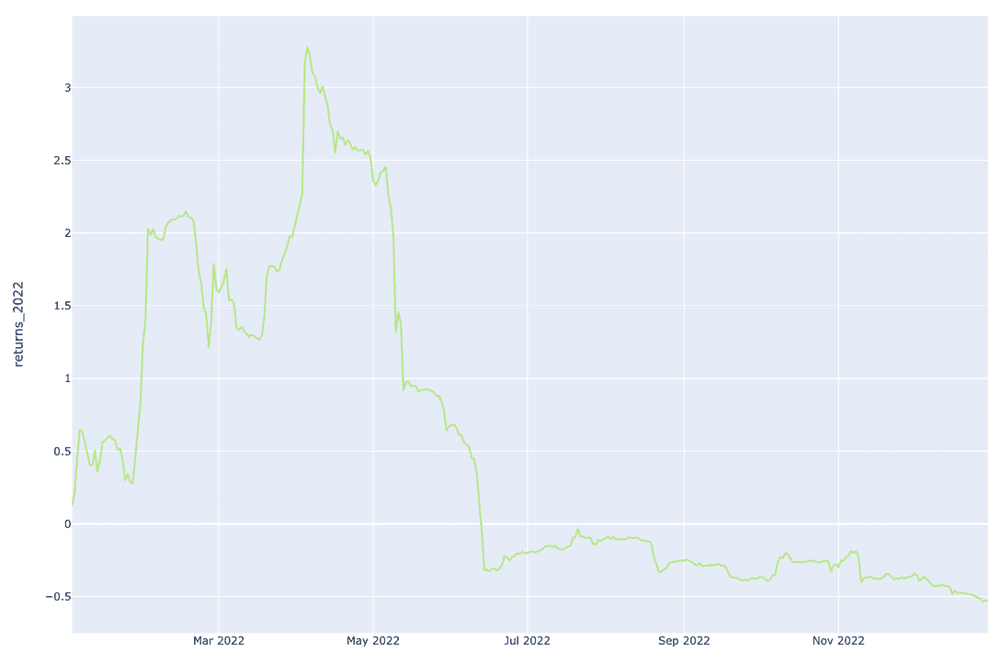

2022 年末，其市值为 1.75 亿美元，跌幅为 89.20%。尽管艺术家的声誉和高质量的艺术品，克隆 X 系列未能达到预期，其市场价值因此受到影响。

VeeFriends 和 Doodles V4 是 NFT 的另外两个系列，它们的价值大幅缩水。

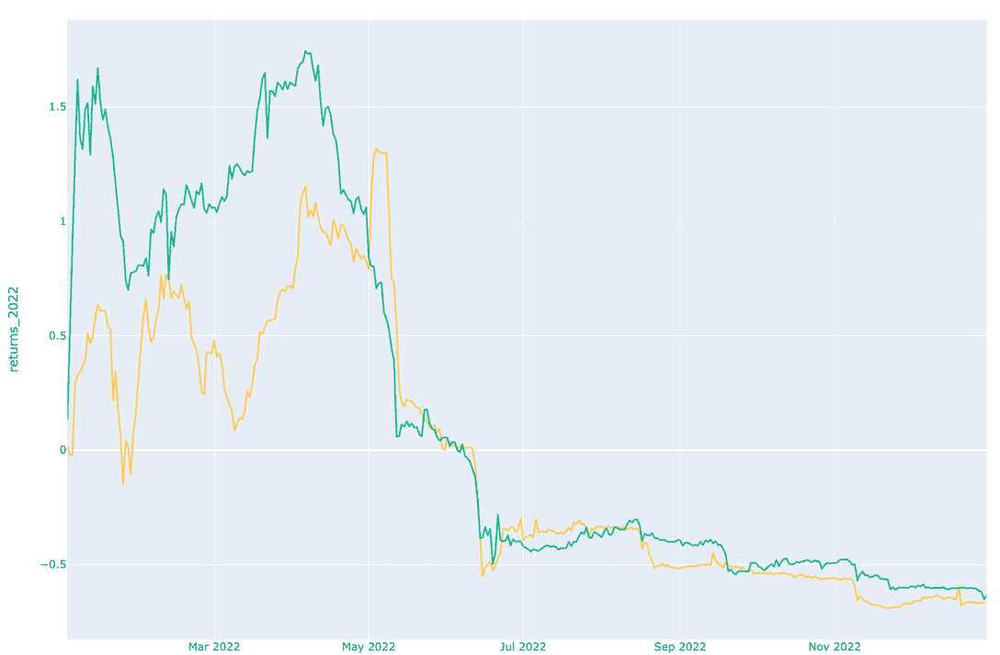

VeeFriends: Green
Doodles V4: Yellow

VeeFriends 在 2022 年底的市值为 8860 万美元，跌幅为 87.31%。Doodles V4 在 2022 年底的市值为 9400 万美元，跌幅为 86.64%。这两个系列都被寄予厚望，但没有达到宣传的效果，结果都很糟糕

有了《月鸟》,我们又有了一个备受推崇的 NFT 收藏，但却未能保持其价值。Moonbirds 在 2022 年底的市值为 9740 万美元，比年初下降了 85.12%。与此同时，Moonbirds 的子集合 Moonbirds Oddities 在 2022 年底的市值为 1490 万美元，下降了 80.85%。

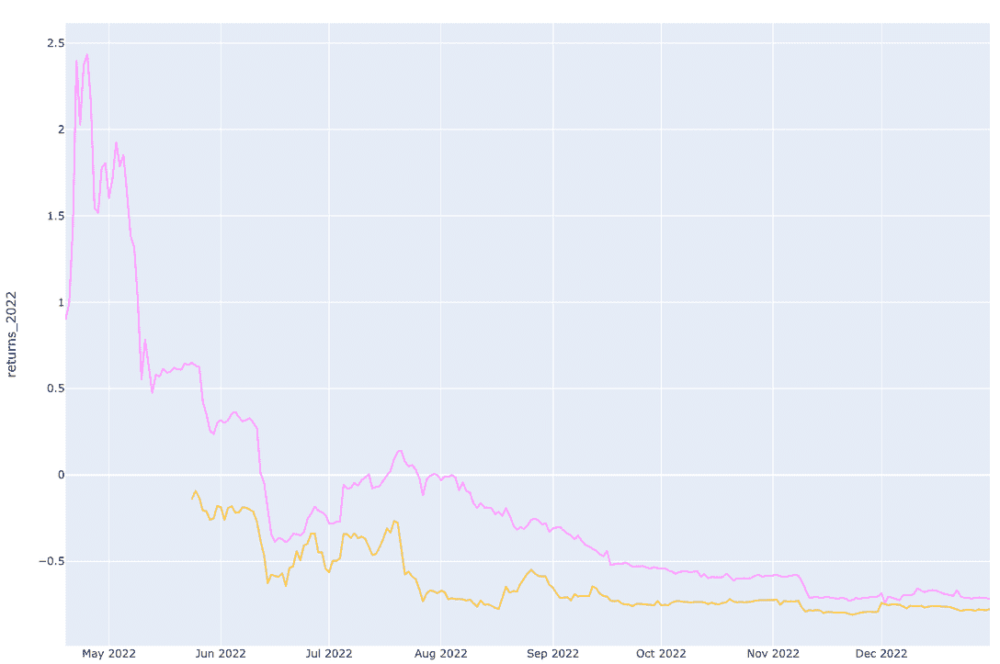

Moonbirds: Pink
Moonbirds Oddities: Yellow

总之，NFT 市场仍处于早期阶段，有许多增长和成功的机会。然而，重要的是要记住，不是所有发光的或被认为是好的东西都会变成金子。仅仅因为一个系列被寄予厚望，或者由知名艺术家创作，并不能保证成功。

## 结论

2022 年对于 NFT 市场和整个 dapp 行业来说都是充满挑战的一年。尽管遭遇了不幸和需求，一些 NFT 收藏仍然成功发展并升值了市值。

这些系列的成功可以归功于它们推出的完美时机、它们保持势头的能力以及它们形成的伙伴关系。此外，他们对社区的持续参与以及对构建和改进产品的关注对他们的成功起到了重要作用。这突出了精心规划和关注 NFT 地区社区建设的重要性。

尽管市值有所下降，宇迦实验室仍然是整个 NFT 市场的重要参与者，对其总市值做出了重大贡献。宇迦实验室贬值的市值并没有减少它对 NFT 生态系统的影响及其对行业的重要性。NFT 市场在不断发展，考虑像宇迦实验室这样的项目带来的长期潜力和价值非常重要。他们的贡献，加上新的 NFT 系列的表现，有助于整个 NFT 市场的增长和成熟。

市场可能会面临起起落落，但对于那些能够应对这些挑战并坚持自己目标的人来说，成功的潜力就在那里。

## **免责声明**

NFT 价值评估工具目前正处于测试阶段。插值模型仍然需要训练，以适当考虑交易异常值，并考虑集合底价的实时波动。