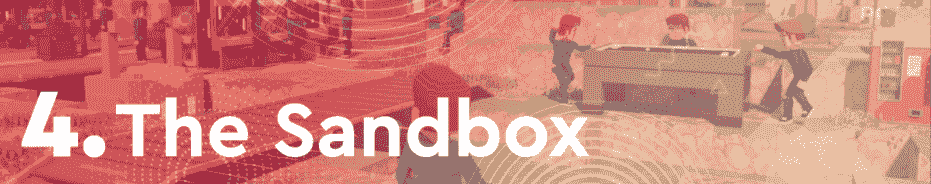
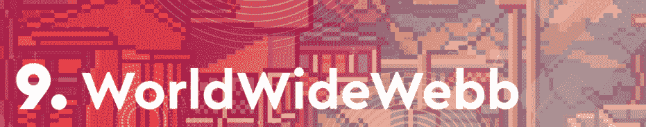
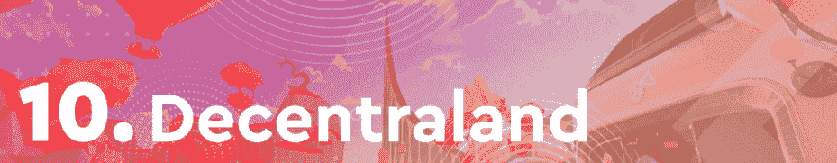

# REVV Racing 在 F1 Delta 时间折叠中领先

> 原文：<https://web.archive.org/web/https://dappradar.com/blog/revv-racing-takes-the-lead-as-f1-delta-time-folded>

## 虚拟世界分散土地和万维网卷土重来

**本周的[区块链十佳运动会](https://web.archive.org/web/20220930094105/https://dappradar.com/rankings/category/games)排名显示 REVV Racing 出人意料地名列前茅。由于 F1 Delta 时间许可没有更新，REVV 生态系统遭受了严重的打击，游戏不得不关闭。尽管如此，或者可能是受到动荡事件的启发，生态系统的原生 token REVV 在过去七天的估值上涨了 13%以上。**

除了赛车界蜂拥至 REVV Racing，本周的排名显示虚拟世界正在恢复一些实力。在加密领域相当悲观的背景下，虚拟世界沙盒、分散的土地和万维网都在本周晋级。

几个月来，区块链游戏一直处于加密活动的前沿。通过这篇文章，DappRadar 看了本周最热门的游戏 dapps。为了编制这个排名，我们考虑了链上活动，NFT 交易量，令牌估值，以及围绕每个 dapp 的新闻和事件。

在下面浏览本周十大区块链游戏的完整列表。单击相应的图片，了解每个平台的更多信息。或者，看看下面的视频，它总结了排名，可以快速查看。

[https://web.archive.org/web/20220930094105if_/https://www.youtube.com/embed/hNvbxTgV8es?feature=oembed](https://web.archive.org/web/20220930094105if_/https://www.youtube.com/embed/hNvbxTgV8es?feature=oembed)

## 区块链十大运动会–2022 年第 11 周

### 随着 F1 德尔塔时间的推移，REVV 赛车速度加快

F1 Delta Time 关闭的惊人消息推动了 REVV Racing 的活动。生态系统的本土标志 [REVV](https://web.archive.org/web/20220930094105/https://dappradar.com/hub/token/polygon/REVV/MATIC?from=0x70c006878a5a50ed185ac4c87d837633923de296) 在过去一周上涨了 13%。根据 [DappRadar 报道](https://web.archive.org/web/20220930094105/https://dappradar.com/blog/f1-delta-time-closes-down/)，REVV 赛车活动的一个显著峰值可能是由于 F1 Delta Time 玩家转换游戏，并转移到 REVV 赛车平台的事实。

### Chainmonsters 宣布第二阶段测试对所有人开放

随着游戏[宣布即将向所有玩家开放的测试版第二阶段](https://web.archive.org/web/20220930094105/https://dappradar.com/blog/chainmonsters-opens-beta-phase-2-to-all-players/)，Chainmonsters 本周荣登排行榜榜首。这是这款游戏第一次面向大众。到目前为止，只有持有早期 NFT 通行证的玩家才能玩《连锁怪兽》。

### 分裂之地再次冲击顶峰

基于蜂巢的卡牌游戏[splitterlands](https://web.archive.org/web/20220930094105/https://dappradar.com/multichain/games/splinterlands)一直出现在每周十大区块链游戏排行榜上。本周，Splinterlands 排名第三，在过去的七天里有超过 540，000 个独特的活动钱包连接到游戏。

### 沙盒吸引了机构玩家

虚拟世界[沙盒](https://web.archive.org/web/20220930094105/https://dappradar.com/ethereum/games/the-sandbox)也在排行榜上攀升，这要感谢[宣布国际银行汇丰银行在游戏](https://web.archive.org/web/20220930094105/https://dappradar.com/blog/the-sandbox-welcomes-hsbc-to-the-metaverse/)中购买了一块土地。这是迈向沙盒这样的虚拟世界主流化的重要一步。另一方面，一些密码爱好者对一家中央银行机构敢于涉足去中心化和区块链技术领域感到愤怒。不管是哪种情况，汇丰进入沙盒的举动都提振了该平台本周的表现。

### 《异形世界》从上周的榜首下滑了四位

上周的领头羊[外星世界](https://web.archive.org/web/20220930094105/https://dappradar.com/multichain/games/alien-worlds)发现自己本周进入第五名，因为其本土标志 TLM 在过去一周内损失了约 2.3%的估值。尽管有所下降，但该平台在过去七天里吸引了超过 240，000 个独特的活动钱包，提高了其统计数据，并成为蜡区块链上访问量最大的 dapp。

### Mobox 喜欢炒作塔防迷你游戏

基于 BSC 的 NFT 农业游戏 [Mobox](https://web.archive.org/web/20220930094105/https://dappradar.com/binance-smart-chain/games/mobox-nft-farmer) 本周排名第六。继上周[发布新的迷你游戏](https://web.archive.org/web/20220930094105/https://dappradar.com/blog/user-activity-surges-as-mobox-reveals-moland-defense/)之后，在过去的七天里，Mobox 享受到了新奇元素的持久效应。该游戏的 NFT 收藏产生了超过 400 万美元的交易量，而其原生令牌 MBOX 的估值增长了近 2.5%。

### 高地统治着房地产行业

基于 EOS 的代表[高地](https://web.archive.org/web/20220930094105/https://dappradar.com/eos/games/upland)继续其成功的连胜，作为新的地区，地标景点被添加到房地产游戏的地图上。本周高地排名第七，在过去的七天里吸引了超过 141，000 个独特的活动钱包。

### 疯狂防御英雄在 Polygon 上推手机游戏

[疯狂防御英雄](https://web.archive.org/web/20220930094105/https://dappradar.com/multichain/games/crazy-defense-heroes)已经成为区块链手机游戏领域不可否认的领导者。进入多边形区块链，塔防游戏在过去一周吸引了近 175，000 个独特的活动钱包。更重要的是，该游戏的原生令牌塔在游戏领域表现最为稳定，与上周相比，其定价仅下降了 0.5%。

### 环球网继续用任务挑战玩家

随着新任务的推出，虚拟世界继续努力成为元宇宙的领导者。本周，该平台开始了武士搜索任务，以及为成功完成挑战的玩家提供的物品抽奖。此外，过去七天，WorldWideWebb 在 NFT 的交易量超过了 430 万美元。关于推出代币的谣言让社区很忙，因为他们期望游戏活动将转化为空投奖励。

### 去中心化推动用户体验提升

本周，[分散的土地](https://web.archive.org/web/20220930094105/https://dappradar.com/ethereum/marketplaces/decentraland)完成了虚拟世界的存在，在区块链十大游戏排名中排名最后。该平台为其市场带来了巨大的用户体验提升。分散土地现在允许玩家直接在市场上预览可穿戴设备，让他们有机会在购买前做出明智的选择。此外，该平台在过去七天内产生了超过 370 万美元的 NFT 交易量。

## REVV Racing 将延续 F1 Delta 时代遗产

F1 德尔塔时间将不复存在的声明对游戏粉丝来说就像闪电一样。不幸的是，Animoca Brands 没有设法更新其使用 F1 品牌的许可证，这意味着该平台必须立即关闭。

声明发布后引发了巨大的不满浪潮，因为玩家在过去 90 天内在该平台上投资了超过 11 万美元。然而，Animoca Brands 已经保证将引入机制来补偿受影响的玩家。此外，F1 Delta Time 玩家可以用他们的 NFT 兑换一张比赛通行证，让他们有机会在 REVV Racing 中获得未来的 NFT 薄荷糖和空投。从这个意义上说，REVV Racing 活动的激增是意料之中的，因为大多数 F1 Delta Time 粉丝群转向了 Animoca Brands 的其他赛车游戏。

DappRadar 将继续监测区块链的游戏空间，因为项目推动了寒冷的冬季风。为了更详细地了解这个领域，请查看 [DappRadar 顶级游戏](https://web.archive.org/web/20220930094105/https://dappradar.com/rankings/category/games)排名。此外，你可以在[推特](https://web.archive.org/web/20220930094105/https://twitter.com/dappradar)上关注 DappRadar，抢先获得最新的区块链博彩新闻。

 NewsletterUnsubscribe at any time. [T&Cs](https://web.archive.org/web/20220930094105/https://dappradar.com/terms) and [Privacy Policy](https://web.archive.org/web/20220930094105/https://dappradar.com/privacy-policy)