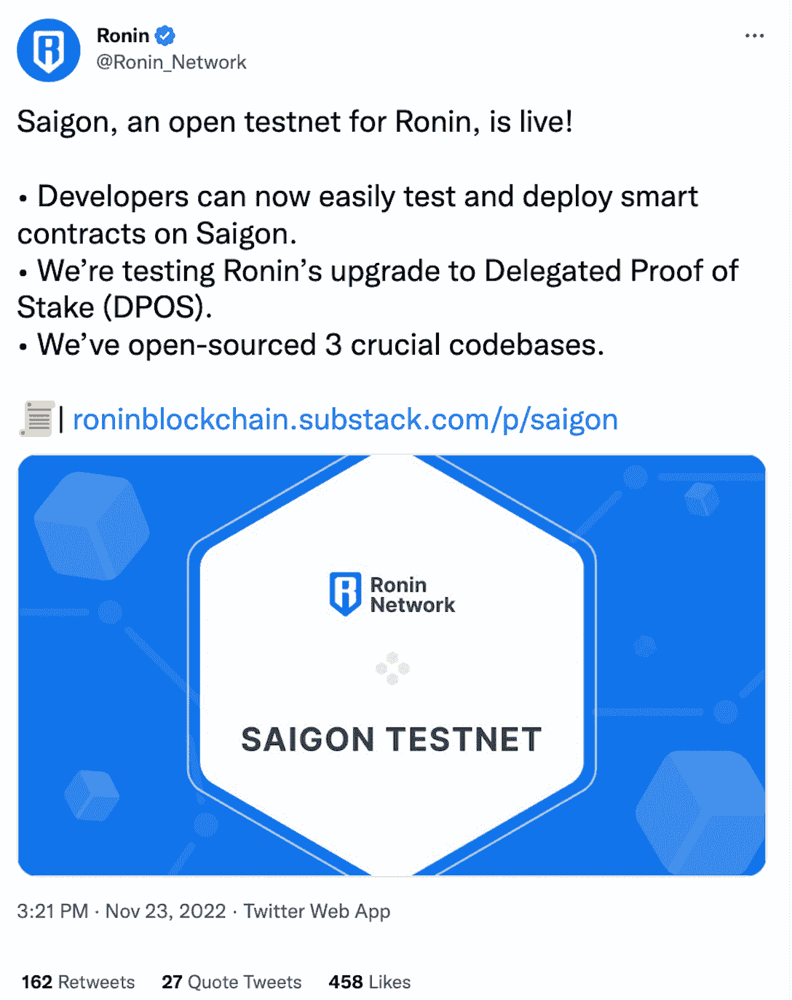
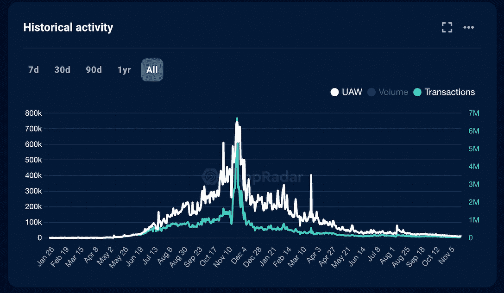

# Ronin 继续扩张，推出西贡测试网以吸引游戏开发商

> 原文：<https://web.archive.org/web/https://dappradar.com/blog/ronin-expansion-continues-launches-saigon-testnet-to-attract-game-developers>

## 西贡测试网的推出是 Sky Mavis 从游戏开发商转向游戏发行商的战略举措。

Axie Infinity 的主持人区块链推出了西贡测试网。它旨在提供一个开发平台，任何人都可以在这个平台上测试和实现他们的想法。此外，西贡是区块链发展成为一个包罗万象的游戏生态系统的基石。

**内容**

*   [*西贡测试网是什么？*](https://web.archive.org/web/20221130135021/https://dappradar.com/blog/ronin-expansion-continues-launches-saigon-testnet-to-attract-game-developers/#what)
*   [*阿希无穷数滑落，浪人需要突破*](https://web.archive.org/web/20221130135021/https://dappradar.com/blog/ronin-expansion-continues-launches-saigon-testnet-to-attract-game-developers/#axie)
*   [*西贡试验网标志浪人的新篇章*](https://web.archive.org/web/20221130135021/https://dappradar.com/blog/ronin-expansion-continues-launches-saigon-testnet-to-attract-game-developers/#saigon)
*   *[了解浪人和阿西无穷的一切](https://web.archive.org/web/20221130135021/https://dappradar.com/blog/ronin-expansion-continues-launches-saigon-testnet-to-attract-game-developers/#learn)*

## 西贡试验网是什么？

11 月 23 日，Ronin 在推特上宣布了《西贡测试网》的发布。这是一个 Ronin testnet，让构建者和开发人员可以轻松地在西贡测试和部署智能合同。

[*Ronin Twitter*](https://web.archive.org/web/20221130135021/https://twitter.com/Ronin_Network/status/1595316542991790080?ref_src=twsrc%5Etfw%7Ctwcamp%5Etweetembed%7Ctwterm%5E1595316542991790080%7Ctwgr%5E6a0ce4ff5319f900a0c8d3ac067da5778a6841f2%7Ctwcon%5Es1_&ref_url=https%3A%2F%2Fp2enews.com%2Fnews%2Fsaigon-ronin%2F)

此外，开发人员可以与浪人钱包，武士刀，和西贡浪人桥合同集成。Ronin 还允许开发人员在西贡部署 ERC20 和 ERC721 令牌，为他们的项目调整最佳虚拟经济。

随着西贡的推出，任何想在 Ronin——一个久经考验的游戏区块链——上建立一个强大的 dapp 的人，都可以把西贡作为一个起点。通过 testnet 水龙头获得免费的 testnet RON 和 ERC20。开发者现在可以开始在 Ronin 上创建项目了。

为了增强 Ronin 的生态系统活力或对其进行补充，它希望开发人员开始围绕但不限于以下领域部署实验性合同。

*   Axie 团队和公会管理
*   NFT 抵押和交易
*   社区构建的 Axie 游戏
*   电子竞技工具和支出

[Ronin real-time network stats](https://web.archive.org/web/20221130135021/https://dappradar.com/rankings/protocol/ronin)

## Axie Infinity 数字下滑，Ronin 需要突破

Axie Infinity 在 2021 年上半年的人气持续飙升。自从游戏首次在以太坊上发布以来，游戏的使用量增加已经使以太坊网络超载。最终，它以高昂的交易费用和网络延迟伤害了用户体验。

为了解决这一问题，项目创始人 Sky Mavis 于 2021 年 2 月创建了 Ronin network，并于当年 4 月底完成了 Axie Infinity 的全面迁移。这一关键举措使 Axie Infinity 在 2021 年 11 月达到了活动高峰。在其巅峰时期，当天有超过 70 万个独特的钱包参与了游戏。

[View more stats about Axie Infinity](https://web.archive.org/web/20221130135021/https://dappradar.com/multichain/games/axie-infinity)

然而，随着宏观经济衰退和加密货币行业的重组，Axie Inifity 的数量逐渐下降。Axie 继续更新新的版本和功能，如原点和土地桩。但该领域的竞争已经加剧，这意味着 Axie 必须面临更大的挑战来延长其生命周期。

## 西贡试验网标志着浪人的新篇章。

推出以太坊侧链 Ronin 是为了让 Sky Mavis 对其整个生态系统有更多的控制权。同时，它允许 Sky Mavis 在 sidechain 上开发更多的游戏，并邀请外部开发者在 Ronin 上构建自己的游戏。

毫无疑问，西贡将在 Ronin 的游戏生态系统中扮演至关重要的角色。它为 Ronin 发展成为区块链顶级游戏基础设施铺平了道路。

未来，Axie Infinity 可能拥有也可能不拥有浪人冠军头衔。但可以肯定的是，会有更多的明星从西贡 Testnet 诞生。

[View the Ronin network stats](https://web.archive.org/web/20221130135021/https://dappradar.com/rankings/protocol/ronin)

## 了解关于 Ronin 和 Axie Infinity 的一切

*   看看浪人区块链上的 dapps。
*   [在单个 dapp 页面上查看 Axie Infinity 统计数据。](https://web.archive.org/web/20221130135021/https://dappradar.com/multichain/games/axie-infinity)
*   彻底理解什么是无限轴。
*   [更多关于 Axie Infinity 的文章](https://web.archive.org/web/20221130135021/https://dappradar.com/blog/tag/axie-infinity)

## 随身携带您的 Web3 之旅

使用 DappRadar 移动应用程序，再也不会错过 Web3。查看最受欢迎的 dapps 的性能，并关注您投资组合中的 NFT。您在 DappRadar 上的帐户会与我们的移动应用程序同步，这样您很快就可以选择实时接收提醒。

[Download the DappRadar app now](https://web.archive.org/web/20221130135021/https://dappradar.app.link/blog)[<picture></picture>](https://web.archive.org/web/20221130135021/https://play.google.com/store/apps/details?id=com.portfolio.dappradar) NewsletterUnsubscribe at any time. [T&Cs](https://web.archive.org/web/20221130135021/https://dappradar.com/terms) and [Privacy Policy](https://web.archive.org/web/20221130135021/https://dappradar.com/privacy-policy)