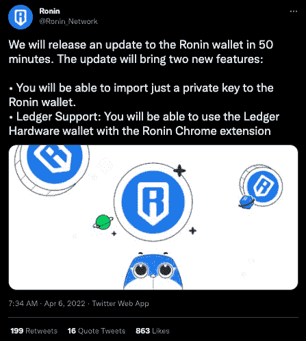
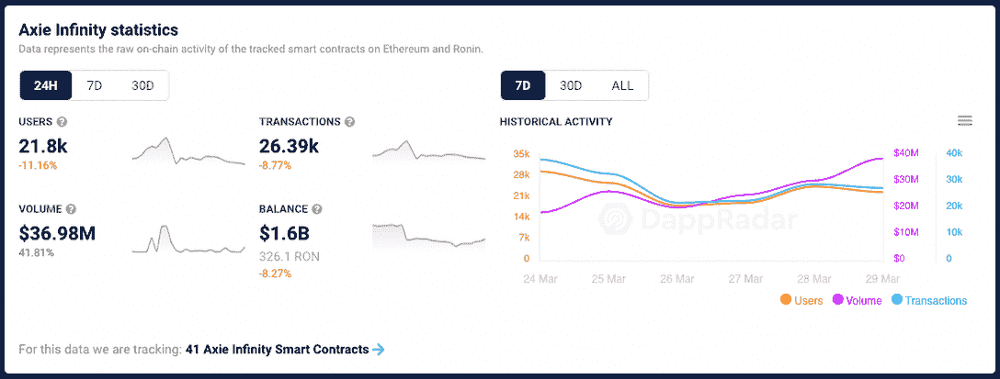

# Ronin 增加了安全措施并增加了更多验证器

> 原文：<https://web.archive.org/web/https://dappradar.com/blog/ronin-increases-security-measures-and-adds-more-validators>

## 密码史上最大的黑客攻击后一周

一周前，一个致命的漏洞导致超过 6 亿美元的资金从 Ronin bridge 流出，Sky Mavis 宣布了加强网络安全的计划。Ronin Network 计划在 6 月底之前将其验证器网络扩展到 21 个独立节点，通过更新 Ronin wallet 提供额外保护。

**更新@世界协调时 4 月 6 日下午 2 点**:4 月 6 日，Sky Mavis [透露](https://web.archive.org/web/20221004125959/https://axie.substack.com/p/funding?utm_source=substack&utm_medium=email&utm_content=share&token=eyJ1c2VyX2lkIjo0MDE1MzEyLCJfIjoiRExxZ3AiLCJpYXQiOjE2NDkyNDYzNDQsImV4cCI6MTY0OTI0OTk0NCwiaXNzIjoicHViLTY2NTEiLCJzdWIiOiJwb3N0LXJlYWN0aW9uIn0.XI7ofp0ctrpEerigZEJlnAp4Zm_RRJuc6sa2ZzHCYNA&s=r)他们已经在由世界上最大的密码交易所[币安](/web/20221004125959/https://dappradar.com/blog/binance-chain-and-binance-smart-chain-become-bnb-chain/)牵头的一轮融资中筹集了 1.5 亿美元，参与方包括 Animoca Brands、a16z、Dialectic、Paradigm 和 Accel。这一轮将用于偿还受 [Ronin validator hack](https://web.archive.org/web/20221004125959/https://dappradar.com/blog/axie-infinity-activity-plummets-after-600-million-ronin-exploit) 影响的用户资金。

## 摘要

*   2022 年 3 月 29 日，[黑客利用允许用户将资产移入和移出 Axie Infinity 生态系统的 Ronin bridge，窃取了 173600 个 ETH 和 2550 万个 USDC](https://web.archive.org/web/20221004125959/https://dappradar.com/blog/axie-infinity-activity-plummets-after-600-million-ronin-exploit) 。
*   罗宁希望到 2022 年，Q2 能将独立验证者的数量扩大到 21 个。
*   Animoca、Nansen、Delphi、Stable Node 和 diadicial 将成为 Ronin node 验证器。
*   Ronin 邀请社区成员成为验证者-申请表[此处](https://web.archive.org/web/20221004125959/https://skymavis.typeform.com/roninvalidator)。
*   Ronin wallet 增加了私钥和分类帐支持。

## 保护浪人

根据 Sky Mavis 对 Ronin 的雄心勃勃的计划，他们希望与他们的社区进一步合作，共同保护和监督网络。Ronin 已经宣布 Animoca Brands、Nansen、Delphi、Stable Node 和 Dialectic 将很快成为新的节点验证者，使数量达到 11 个，并计划在未来三个月内再增加 10 个。值得注意的是，每个新宣布的验证程序合作伙伴也是 Sky Mavis、Ronin 和 Axie Infinity 的投资者。

首先，Ronin 希望将更多组织添加到验证器节点池中，他们加入了 Nansen、Delphi Digital、Sthrible Node、Animoca Brands 和 diactical。验证器节点池的扩展将在一周内完成。此阶段的目标是简单地将一批新的利益相关者召集到小组中，并让他们熟悉当前状态的节点技术。

其次，Ronin 希望改进当前的源代码，以提高安全性和去中心化功能。例如，添加分配撤回限制的能力可以在桥中实现更多的治理功能。此外，该流程旨在让社区、其他证券公司和投资者参与进来。

此外，还鼓励机构群体成员申请。该应用程序询问各种问题来评估一方保护网络的能力。感兴趣的人可以使用#securingronin 标签，通过社交媒体与 ronin 分享反馈。

## Ronin 钱包更新

在 4 月 6 日的一条推文中，Ronin 还宣布了对其 Ronin 钱包的几项升级，带来了两项新功能来帮助提高安全性。用户现在可以只向 Ronin wallet 导入一个私钥，并通过 Ronin Chrome 扩展使用分类帐硬件钱包。

## 阿西感觉到了燃烧

作为[漏洞](https://web.archive.org/web/20221004125959/https://dappradar.com/blog/axie-infinity-activity-plummets-after-600-million-ronin-exploit/)的结果，Axie Infinity，属于 dapps 的 Sky Mavis 家族的领先游戏，感受到了全部的影响。在黑客攻击被揭露后的 24 小时内， [Axie Marketplace](https://web.archive.org/web/20221004125959/https://dappradar.com/multichain/marketplaces/axie-marketplace) 的活跃度下降了 17%以上。此外，该平台产生的交易量减少了约 30%。 [Axie Infinity NFTs](https://web.archive.org/web/20221004125959/https://dappradar.com/multichain/games/axie-infinity) 也受到了冲击，交易量最大的 NFT 藏品之一的交易量下降了 20%以上。活跃交易者的数量也大幅减少。该系列的市值缩水了 33%，仅略高于 1，100 万美元。关于 Axie Infinity，该游戏的活跃玩家减少了 11%，交易量也有所下降。

Data Captured: March 30, 2022

社区保持强大，团结在品牌周围，保持过去 12 个月获得的势头。更重要的是，Sky Mavis 团队[表示](https://web.archive.org/web/20221004125959/https://roninblockchain.substack.com/p/community-alert-ronin-validators?s=w)他们致力于确保所有被盗资金被追回或报销。他们将继续与利益相关者和更广泛的群体进行讨论，以确定最佳行动方案，并且仍在调查该问题。

## 演出必须继续

尽管如此，Axie Infinity Origin 是最受欢迎的游戏赚取版本之一，将于 4 月 7 日[推出，](https://web.archive.org/web/20221004125959/https://dappradar.com/blog/axie-infinity-origin-brings-brand-new-arena-mode)将带来一个改进的竞技场游戏模式。竞技场是玩家相互战斗、争夺积分以提升整体排名并赢得 AXS 奖励的地方。

尽管有负面的背景，Axie Infinity Origin 已经在 Axie 社区成员中引起了很多讨论。此外，Sky Mavis 组织了 [Origin 发布周](https://web.archive.org/web/20221004125959/https://dappradar.com/blog/sky-mavis-to-launch-axie-infinity-origin-amidst-hack-crisis)，包括游戏信息的点滴式发布。这为新版本带来了更多的兴奋和炒作。

[<picture></picture>](https://web.archive.org/web/20221004125959/https://dappradar.com/ethereum/games/axie-infinity)[<picture></picture>](https://web.archive.org/web/20221004125959/https://dappradar.com/blog/axie-infinity-biggest-contributor-to-august-game-nft-trading/)[<picture></picture>](https://web.archive.org/web/20221004125959/https://dappradar.com/hub/swap/eth/ETH/AXS?to=0xbb0e17ef65f82ab018d8edd776e8dd940327b28b)

***以上不构成投资建议。此处给出的信息仅供参考。请行使尽职调查，做你的研究。作者持有多种加密货币的头寸，包括 BTC、瑞士法郎和雷达。***

 NewsletterUnsubscribe at any time. [T&Cs](https://web.archive.org/web/20221004125959/https://dappradar.com/terms) and [Privacy Policy](https://web.archive.org/web/20221004125959/https://dappradar.com/privacy-policy)