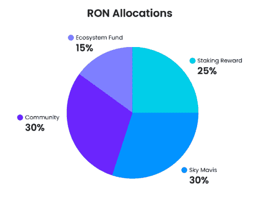

# Ronin 本地令牌 RON 现已上线

> 原文：<https://web.archive.org/web/https://dappradar.com/blog/ronin-native-token-ron-is-now-live>

## 罗恩直播了。了解如何申领您的 RON 代币

期待已久的 RON token 登陆了 Ronin。浪人侧链的原生令牌由 Sky Mavis 团队在 2021 年底推出，现已上线，可在 Katana DEX 上申请。

罗恩将成为整个浪人生态系统的主要标志。最重要的是，RON 令牌将保护支持 Ronin 侧链的分散网络。Ronin 网络将要求验证者持有并标记 RON 令牌，以基于利益一致机制的证据来验证块。

据官方[RON litepape](https://web.archive.org/web/20221209063304/https://litepaper.roninchain.com/ronin-token-usdron)称，浪人验证者将获得新发行的 RON 奖励，以表彰他们在保护网络安全方面所做的努力。这些 RON 奖励将根据验证者及其代表下注的 RON 按比例分配。

[点击此处查看您是否可以申领](https://web.archive.org/web/20221209063304/https://katana.roninchain.com/#/farm)。

## 你能用罗恩代币做什么？

当 Sky Mavis 在 2021 年 11 月推出 Katana DEX 时，需求飙升。随着这次发布，Axie Infinity 的创造者们还开玩笑说，将会有一个本地的浪人令牌，最终接管网络的治理和安全。然而，当时还没有一个明确的时间表来说明 RON 何时会进入用户的钱包。

今天，RON 上线了，这为 Axie 粉丝和 DeFi 爱好者带来了一些激动人心的机会。首先，从现在开始，Ronin 网络上的所有燃气费都将包含在 RON 中。值得注意的是，钱包里有 Axies 或 land NFTs 的用户将从免费交易中受益。其次，使用过武士刀敏捷赌注和农场池的用户现在可以提取他们的 RON 奖励了。

最后但同样重要的是，天空梅维斯还将在武士刀德克斯上引入一个全新的农场，并在现有的基础上重塑奖励结构。从 2 月 3 日开始，武士刀 DEX 的奖金池将有以下奖励结构:

*   AXS/瑞士联邦理工学院:每天 24，169.18 朗
*   SLP/瑞士联邦理工学院:每天 132，930.51 朗
*   朗/埃特:每天 84，592.15 朗

## 令牌组学

与其他新推出的加密令牌不同，RON 不会经历首次公开募股或 IEO。相反，Sky Mavis 将依靠几个月来对 RON 的兴趣。令牌流动性的主要驱动力将是 Katana DEX 流动性养殖池。

Sky Mavis 概述了社区总供应量中相当大的一部分。最大供应量为 1，000，000，000 RON 代币，将在发行开始后 294 个月达到。其中，30%将进入社区，30%将被发送到 Sky Mavis 团队，15%将形成生态系统基金，其余 25%将作为赌注奖励池。

## 监控达普拉达上浪人的活动

Axie Infinity 是最受欢迎的游戏之一。然而，Sky Mavis 更进一步，围绕游戏创建了一个 DeFi 生态系统。如果没有 [Ronin sidechain](https://web.archive.org/web/20221209063304/https://dappradar.com/rankings/protocol/ronin) 的功能，这一切都是不可能的。

自从 11 月推出 Katana DEX 以来，Ronin 已经成为一个成熟的游戏和 DeFi 链，为用户提供了大量的赚钱机会。今天，随着原生 RON token 的推出，这个生态系统就完成了。

如果你有兴趣监测整个[武士刀指数](/web/20221209063304/https://dappradar.com/blog/ronin-based-katana-dex-climbs-dappradar-rankings/)和 Axie Infinity 的活动，你可以查看专门的 DappRadar Ronin 排名页面。如果你在 AXS 或 SLP 下注，别忘了查看你的武士刀 DEX 农场页面。您的 RON 奖励正在等着您！