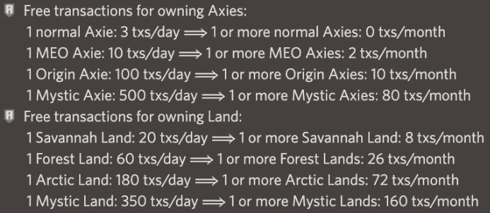
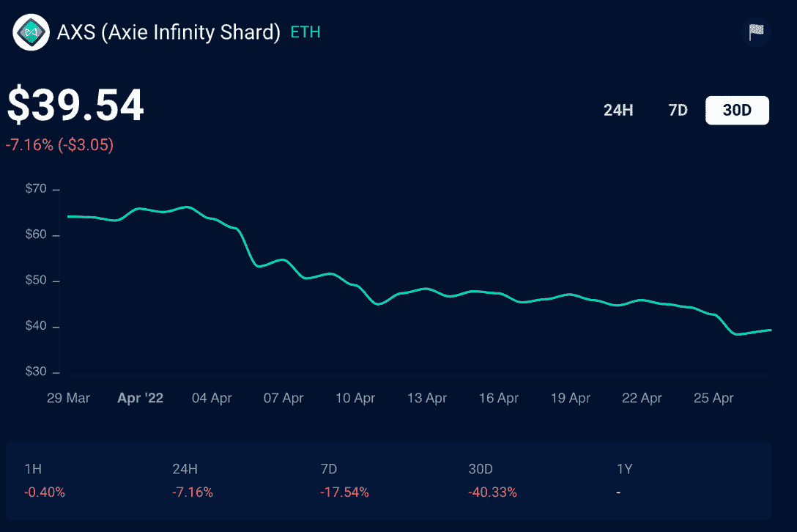

# Ronin Network 终于完成了酝酿已久的 RON 实用程序更新

> 原文：<https://web.archive.org/web/https://dappradar.com/blog/ronin-network-finally-making-long-proposed-ron-utility-updates>

## 用户现在需要 RON 来支付交易费用

Ronin 网络终于做出了它在三月份提出的改变，为本地 RON 令牌带来了更多的实用性。这个消息不会让社区感到震惊，他们已经期待这些变化有一段时间了。自从一个月前的提议以来，RON 已经损失了大约 50%的价值。

**总结**

*   ***对 RON 使用的修改建议将于 4 月 28 日生效。***
*   ***[用户现在将需要花费他们的 RON 来进行交易，而不能再依赖零成本交易。](https://web.archive.org/web/20220927103156/https://dappradar.com/blog/ronin-network-finally-making-long-proposed-ron-utility-updates/#what-changes)***
*   此举正值 [Axie Infinity](https://web.archive.org/web/20220927103156/https://dappradar.com/multichain/games/axie-infinity) 和 Ronin 寻求开发一个更可持续的生态系统。他们无法无限期地支付每个人的交易成本。

浪人区块链上自由交易的日子终于结束了。Axie Infinity 背后的网络花了一段时间来跟进上个月的声明，当时该团队宣布将对其市场进行彻底的改变。4 月 28 日，网络将大规模限制自由交易，用户将需要 RON 来进行交易。

DappRadar 在 3 月 28 日报告称，浪人网络正在改变其使用条款，不再允许玩家进行无汽油费的交易。随着用户过渡到新的浪人区块链，免费交易是必要的。但是现在，【Ronin 背后的团队希望减少玩家对零费用市场的依赖。

## 有哪些变化？

正如我们在 3 月份报道的那样，Ronin 团队正在大幅减少玩家可以在其网络上进行的免费交易的数量。到目前为止，玩家可以有效地进行无限制的交易，而不会产生任何汽油费。

Ronin’s changes will take place on April 28th

持有一个 Axie 目前给你三个免费交易。持有 MEO Axie 每天可以进行 10 次免费交易。如果一个玩家的钱包里有更多的东西，他们就有更多的自由交易，而不是他们可以合理使用的。

如上图所示，这样的日子已经过去了。现在，玩家需要花费他们的 RON 来进行交易，或者持有如此多的 Axies 和地，以至于他们可以建立一个免费交易的商店来按月使用。

Ronin 团队也明确表示，每月的自由交易津贴是基于玩家每月持有资产的天数。持有一天 MEO Axie 并认为你将获得两次免费交易是没有好处的。你必须整个月都拿着工资才能拿到你的全部津贴。

## Axie Infinity、Ronin 和 RON 令牌

对于 Axie Infinity 和它的区块链浪人来说，这是一段艰难的日子。三月下旬[昂贵的桥牌黑客](https://web.archive.org/web/20220927103156/https://dappradar.com/blog/north-korean-lazarus-hackers-behind-600-million-ronin-hack)对游戏的链上指标和人们对网络安全的信心产生了直接影响。

[DappRadar’s 30-day on-chain analytics for Axie Infinity](https://web.archive.org/web/20220927103156/https://dappradar.com/multichain/games/axie-infinity)

这是一个平台仍在恢复的插曲，这可能是他们将提议的更改推迟到 4 月 28 日的原因。在危机期间，确保用户和投资者的信心非常重要。处理桥梁黑客事件的余波可能占用了该公司的大量时间，这几乎没有给其他事情留下任何空间。

在黑客攻击后，RON 令牌立即下跌了 20%,此后一直没有恢复。它目前的交易价格在 1.18 美元左右。RON 是 Ronin 网络的本地令牌，它支持区块链上的交易。

在大桥事件发生后的一个月里， [AXS](https://web.archive.org/web/20220927103156/https://dappradar.com/hub/token/eth/AXS?from=0xbb0e17ef65f82ab018d8edd776e8dd940327b28b) 令牌的价格下跌了 40%。AXS 是 Axie Infinity 的统治象征，位于以太坊区块链。持有人可以在 Ronin 网络上下注并获得奖励。

[DappRadar’s Token Explorer showing the 30-day price of AXS](https://web.archive.org/web/20220927103156/https://dappradar.com/hub/token/eth/AXS?from=0xbb0e17ef65f82ab018d8edd776e8dd940327b28b)

现在我们已经确认，浪人的自由交易将很快成为过去，人们可能会期待浪人的重要性增加，价格上涨。但是请记住，只有当人们在 Axie Infinity 市场上进行交易时，RON 才是重要的。因此，请使用 [DappRadar 的工具](https://web.archive.org/web/20220927103156/https://dappradar.com/multichain/games/axie-infinity)关注游戏的链上分析。

你也可以通过关注我们的[博客](https://web.archive.org/web/20220927103156/https://dappradar.com/blog/)和我们的[推特](https://web.archive.org/web/20220927103156/https://twitter.com/DappRadar)页面来了解 Axie Infinity 的最新进展。通过使用我们的[排名页面](https://web.archive.org/web/20220927103156/https://dappradar.com/rankings)，查看 Axie Infinity 与其他游戏和 dapps 相比的优势。使用我们专门的 [NFTs](https://web.archive.org/web/20220927103156/https://dappradar.com/nft) 页面，看看 Axie Infinity 是否能重新成为区块链领域最重要的玩家。