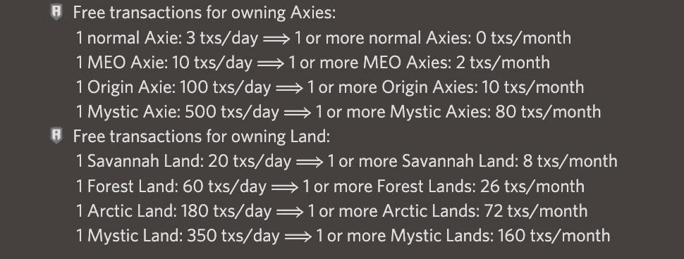
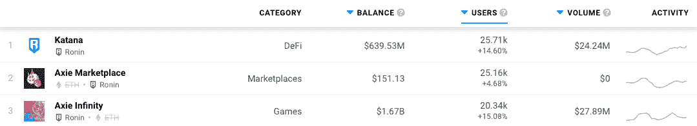
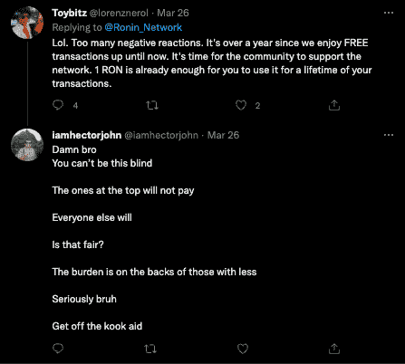

# Ronin 网络提高本地 RON 令牌的效用

> 原文：<https://web.archive.org/web/https://dappradar.com/blog/ronin-network-to-boost-utility-of-native-ron-token>

## 提高 RON 的效用，确保 Ronin 能够可持续地扩大交易规模

**从 3 月 29 日开始，领先的玩赚游戏 Axie Infinity 将减少玩家可获得的免费交易次数，因为 RON 代币的引入期即将结束。自由交易保证了罗恩的顺利入门。然而，随着生态系统的增长，该团队希望减少玩家对这些免费赠品的依赖，并确保罗恩在浪人网络上的效用。**

*RON 是* [*浪人区块链*](https://web.archive.org/web/20221002000023/https://dappradar.com/rankings/protocol/ronin) *的原生 token，是 Axie Infinity、Sky Mavis 背后团队打造的一款定制区块链。在 Katana(一个在网络上运行的分散交易 dapp)的帮助下，Axie Infinity 的玩家可以在 Ronin 上使用 Katana 快速、廉价地交换代币。此外，此举是为了帮助游戏扩展和摆脱昂贵的以太坊燃气费。*

玩家[现在将根据他们在游戏中拥有多少轴或土地 NFT 获得](https://web.archive.org/web/20221002000023/https://twitter.com/Ronin_Network/status/1507422485544808448)免费交易。因此，玩家拥有的越多，获得的免费交易就越多。这是有意义的，因为拥有更多财富的人应该代表核心群体，更加活跃。尽管如此，一些社区派别感到不满，并声称新的结构让更富裕的 Axie 玩家获得更多的好处，而新玩家遭受损失或可能无法正常进入游戏。

总的免费交易数量现在是基于拥有的 Axie 资产的平均值和玩家持有这些资产的天数。例如，如果您在一个 30 天的月份中有一天拥有一个神秘轴，则公式为 1 神秘轴* 1 天/ 30 = 0，因为不包括小数。因此，在这种情况下，玩家将获得零交易，直到他们持有神秘轴整整一个月。

## 阿协社区反应如何？

[查看 Ronin](https://web.archive.org/web/20221002000023/https://dappradar.com/rankings/protocol/ronin) 上的 dapp 活动，自宣布以来，我们看到在过去 24 小时内全面增加，因为玩家可能会涌入以充分利用免费天然气交易，并在 2022 年 3 月 29 日变化到来之前购买更多的土地和 Axies 以保持收入。与此同时，玩家可能误解了新的结构，并购买土地和其他轴来增加他们的自由交易分配。事实并非如此，玩家必须等待至少一个月才能获得任何新购买资产的免费交易。

连接到生态系统的 DEX 武士刀的钱包数量增长了近 15%，而 T2 的 Axie 市场增长了近 5%。最显著的影响可以在游戏本身中看到，独特的活动钱包[飙升超过 15%](https://web.archive.org/web/20221002000023/https://dappradar.com/ronin/games/axie-infinity) ，在过去 24 小时内超过 20，000 名在线用户。

自那以后，该社区一直让 Sky Mavis 不好过，因为它允许更富裕的玩家从更多的免费交易中受益。这可以说是苛刻的，因为团队应用了一个 fit 来让核心社区或那些在游戏中拥有最多资产的人更习惯于使用它来进行交易和[推动更多的活动](https://web.archive.org/web/20221002000023/https://dappradar.com/blog/axie-infinity-engages-lift-off-katana-dex-shows-comeback)。

在某种程度上，这里有一个观点，更富裕的玩家将几乎免费玩游戏，而新玩家将负担费用。然而，如果成功，这些变化将增加 RON 的效用，并反过来推高网络本地令牌的交易量，从长远来看，可能会提高价格，自 2022 年初以来，价格一直在 2 美元一线徘徊。

作为领先的游戏赚取游戏，[所有的目光都集中在 Axie Infinity](https://web.archive.org/web/20221002000023/https://dappradar.com/blog/axie-infinity-engages-lift-off-katana-dex-shows-comeback) 上，因为它试图保持势头，并可以说为跟随他们脚步的项目提供了一个蓝图。

 NewsletterUnsubscribe at any time. [T&Cs](https://web.archive.org/web/20221002000023/https://dappradar.com/terms) and [Privacy Policy](https://web.archive.org/web/20221002000023/https://dappradar.com/privacy-policy)

***以上不构成投资建议。此处给出的信息仅供参考。请行使尽职调查，做你的研究。作者持有多种加密货币的头寸，包括 BTC、瑞士法郎和雷达。***

[<picture></picture>](https://web.archive.org/web/20221002000023/https://dappradar.com/ethereum/games/axie-infinity)[<picture></picture>](https://web.archive.org/web/20221002000023/https://dappradar.com/blog/axie-infinity-biggest-contributor-to-august-game-nft-trading/)[<picture></picture>](https://web.archive.org/web/20221002000023/https://dappradar.com/hub/swap/eth/ETH/AXS?to=0xbb0e17ef65f82ab018d8edd776e8dd940327b28b) NewsletterUnsubscribe at any time. [T&Cs](https://web.archive.org/web/20221002000023/https://dappradar.com/terms) and [Privacy Policy](https://web.archive.org/web/20221002000023/https://dappradar.com/privacy-policy)