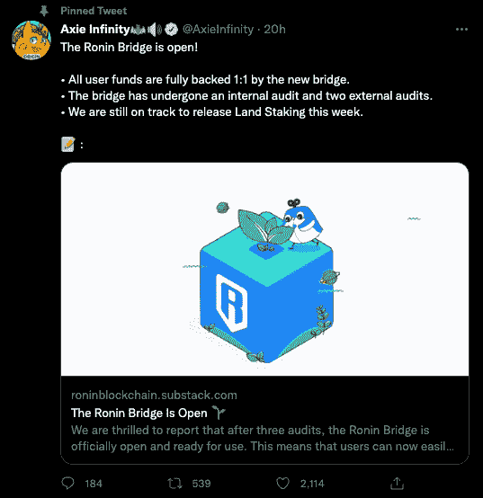
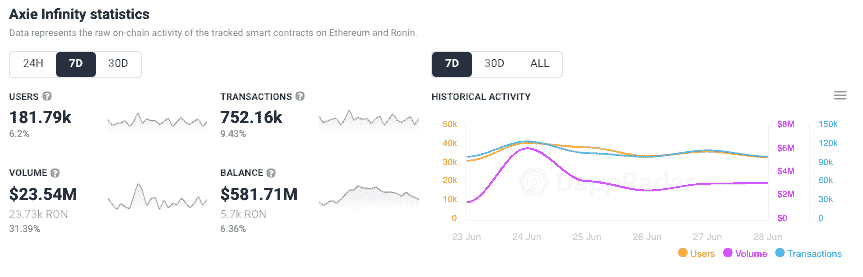

# Ronin 希望成为区块链游戏的行业标准

> 原文：<https://web.archive.org/web/https://dappradar.com/blog/ronin-wants-to-be-the-industry-standard-for-blockchain-gaming>

## Axie Infinity Ronin 桥在 6 亿美元黑客攻击后重新开放

在区块链领先游戏 Axie Infinity 的 token bridge 遭遇毁灭性黑客攻击、损失超过 6 亿美元资产的三个月后，Axie 背后的团队 Sky Mavis 宣布 Ronin Bridge 重新上线。

3 月 30 日， [DappRadar 报告说，在黑客设法获得私人验证器密钥后，大约 170，000 ETH 和 2，500 万 USDC 从 Ronin bridge 中被取走。那次被黑的是当时价值超过 6.2 亿美元的](https://web.archive.org/web/20221127164242/https://dappradar.com/blog/axie-infinity-activity-plummets-after-600-million-ronin-exploit)。

[浪人桥](https://web.archive.org/web/20221127164242/https://dappradar.com/ethereum/defi/ronin-bridge)是由 Axie 的创造者 Sky Mavis 开发的[，用于环绕](/web/20221127164242/https://dappradar.com/blog/dappradar-integrates-ronin-the-axie-infinity-sidechain/)[以太坊气费](/web/20221127164242/https://dappradar.com/blog/when-are-ethereum-gas-fees-lowest/)，并为玩家提供更便宜和更流畅的游戏体验。它使用户能够在 Ronin sidechain 和 Ethereum mainnet 之间转移资产。然而，对于 Ronin 来说，更大的前景是成为区块链游戏和消费应用的行业标准。

## 重建通向无限轴的桥梁

根据 Sky Mavis 在 6 月 28 日星期二发布的公告，Ronin bridge 在三次审计后重新上线。Verichains 和 Certik 进行了一次内部审计和两次外部审计。值得注意的是，该团队表示，他们正在为本周上线的土地标桩而努力。此外，针对用户被盗资产的新设计和[完全解决方案](https://web.archive.org/web/20221127164242/https://www.bloomberg.com/news/articles/2022-06-23/axie-infinity-developer-to-reimburse-hack-victims-restart-ronin?utm_campaign=socialflow-organic&utm_source=twitter&utm_content=crypto&utm_medium=social#xj4y7vzkg)也已推出。

到目前为止，Sky Mavis 已经通过提供流动资金来支持用户在 Ronin 上的 wet(包装以太网),退还了大约 120，000 ETH 和 2，500 万 USDC。黑客攻击发生后，币安立即偿还了大约 46000 个 ETH，因为他们介入提供了一个到其交易所的桥梁，让用户将 wet 换成 ETH。

币安还领导了一轮 1.5 亿美元的融资，以帮助 Sky Mavis 偿还 Axie Infinity 用户。值得注意的是，其余 56，000 被盗 ETH 属于 Axie DAO 财政部，将继续无法抵押，因为 Sky Mavis 正在与执法部门合作追回这些资金。

使用 [NFT 浏览器](https://web.archive.org/web/20221127164242/https://dappradar.com/hub/nft-explorer)发现您最喜爱的 NFT 系列，并获得可操作的准确数据。

## Axie Infinity 的更多分散化

最初的黑客之所以成为可能，是因为 Ronin Bridge 只有 9 个验证器节点，而 Sky Mavis 的员工控制着其中的 4 个。在一份事后文件中，该团队承认，缺乏分权导致 Ronin Bridge 容易受到黑客攻击。

当 DappRadar [最初报道故事](https://web.archive.org/web/20221127164242/https://dappradar.com/blog/axie-infinity-activity-plummets-after-600-million-ronin-exploit)时，Sky Mavis 明确表示，他们很快希望将验证器的数量增加到 11 个，然后在 7 月份达到 21 个，并在 2022 年底扩展到 100 个以上。然而，[在最近的公告](https://web.archive.org/web/20221127164242/https://roninblockchain.substack.com/p/the-ronin-bridge-is-open-)中，Sky Mavis 团队没有提供浪人网络现在有多少验证器节点的更新。

作为更新的 Ronin bridge 架构的一部分，Sky Mavis 更新了智能合约软件，让验证者设置每日取款限额。初始金额设定为 5000 万美元，该团队还引入了一个断路器，将取款的财务价值分为三层。

*   第 1 级适用于 100 万美元以下的提款，需要 70%的验证人员签准。
*   第 2 级适用于超过 100 万美元的金额，要求 90%的验证人签名。
*   第三级是超过 1000 万美元的提款，需要 90%的验证者签字，少量交易费，以及 7 天的审查过程。

## Axie Infinity 现在怎么样

首先，Axie Infinity 成功地解决了问题，避免了在这个过程中失去太多的客户忠诚度。Sky Mavis [是透明的，并且提供信息](https://web.archive.org/web/20221127164242/https://dappradar.com/blog/ronin-increases-security-measures-and-adds-more-validators)。此外，Axie 社区已经相信，Axie 将使每个人再次完整，并重新获得其作为区块链最受欢迎的游戏的地位。

虽然创建 Ronin 是为了解决构建 Axie Infinity 时遇到的主要问题，但更重要的是，它过去和现在都将成为区块链游戏和消费应用的行业标准。Sky Mavis 看到了一个未来，Ronin 是启动区块链游戏开发者的首选网络，他们将能够利用 Ronin 创建一个基础广泛的游戏生态系统，共享巨大的用户群、社区拥有的 dapps 和深厚的资产流动性。

[链上数据](https://web.archive.org/web/20221127164242/https://dappradar.com/multichain/games/axie-infinity)显示，每周与 Axie 互动的独特活跃钱包增长了 6%，交易量增长了近 10%，交易量增长了 31%以上。这一表现将 Axie 推到了 DappRadar 上所有类别中第四位[最常用的 dapp，同时它也跳回到游戏类别](https://web.archive.org/web/20221127164242/https://dappradar.com/rankings)中的[前三名。当然，公告是最近才发布的，所以再过一周重新审视数据，看看玩家的反应会很有趣。](https://web.archive.org/web/20221127164242/https://dappradar.com/rankings/category/games)

在被黑之前， [DappRadar 在](https://web.archive.org/web/20221127164242/https://youtu.be/jXmS7UWma3s) [AMA 的一次会议上](https://web.archive.org/web/20221127164242/https://youtu.be/jXmS7UWma3s)向 Axie Infinity 团队讲述了他们的成功，他们对未来的计划，以及更多。如果您想了解更多关于 [Axie Infinity](https://web.archive.org/web/20221127164242/https://dappradar.com/multichain/games/axie-infinity) 、Sky Mavis 和即玩即赚游戏的信息，请访问我们的[终极即玩即赚指南](https://web.archive.org/web/20221127164242/https://dappradar.com/blog/the-ultimate-guide-to-playing-games-earning-crypto)。

[https://web.archive.org/web/20221127164242if_/https://www.youtube.com/embed/jXmS7UWma3s?feature=oembed](https://web.archive.org/web/20221127164242if_/https://www.youtube.com/embed/jXmS7UWma3s?feature=oembed)

***以上不构成投资建议。此处给出的信息仅供参考。请行使尽职调查，做你的研究。作者持有多种加密货币的头寸，包括 BTC、瑞士法郎和雷达。***

 NewsletterUnsubscribe at any time. [T&Cs](https://web.archive.org/web/20221127164242/https://dappradar.com/terms) and [Privacy Policy](https://web.archive.org/web/20221127164242/https://dappradar.com/privacy-policy)