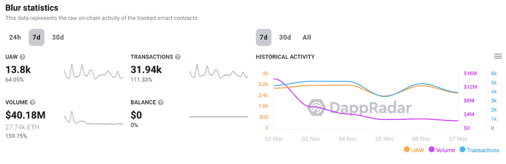

# 免版税的 NFT 交易:市场和创造者费用会发生什么？

> 原文：<https://web.archive.org/web/https://dappradar.com/blog/royalty-free-nft-trades>

## NFT 空间着火了。巨大的市场 OpenSea 和 Magic Eden 正在从 0%创作费交易中获益——但是这对社区意味着什么呢？

本周，Web3 领域的基本价值发生了前所未有的转变。经过几个月的讨论，主要市场对我们所知的创造者收费政策设定了最后期限。当 NFT 艺术家无权从他们的销售中获得版税时会发生什么？

## 突出

*   全球最受欢迎的 NFT 市场 OpenSea ，将仅对使用链上执行工具的新系列征收创作费；
*   *[MagicEden](https://web.archive.org/web/20230122124549/https://dappradar.com/solana/marketplaces/magic-eden) 也在 10 月初在他们的平台上移动到可选版税；*
*   市场聚合器 [Blur](https://web.archive.org/web/20230122124549/https://dappradar.com/ethereum/marketplaces/blur) 首次注册了更多向创作者支付 0%费用的交易。这是一个以创造者为中心的 NFT 时代的终结吗？

## 创造者收费生存困境

在过去的几个月里，就为每笔交易向 NFT 艺术家支付版税是否可行进行了多次讨论。显然，市场似乎已经认定它不是。

当收藏家、交易商和创作者在争论这个问题时，连锁市场让可选的 0%版税征收成为现实。

但是这场争论从何而来？

银河公司的 NFT 版税报告指出，18 亿美元的版税已经支付给了总部位于以太坊的 NFT 收藏馆的创作者。

根据 Flipside 的数据表，宇迦实验室的 [BAYC](https://web.archive.org/web/20230122124549/https://dappradar.com/hub/nft-explorer/collection/bored-ape-yacht-club) 和 [Otherdeeds](https://web.archive.org/web/20230122124549/https://dappradar.com/hub/nft-explorer/collection/otherdeed-for-otherside) ，以及 [ArtBlocks](https://web.archive.org/web/20230122124549/https://dappradar.com/hub/nft-explorer/collection/art-blocks-curated) 、[志那都红豆](https://web.archive.org/web/20230122124549/https://dappradar.com/hub/nft-explorer/collection/azuki)和 [Doodles](https://web.archive.org/web/20230122124549/https://dappradar.com/hub/nft-explorer/collection/doodles-official) ，是从其创作者费用中获利最多的一些收藏。

在 NFT 发行后，从每笔销售额中提取很小一部分来筹集数千美元，NFT 空间长期以来一直怀疑这样一个系统的可持续性。

然而，在这种情况发生的同时，创作费也是支持许多独立艺术家进入 NFT 空间的原因，正是因为区块链支持的奖励的可能性。

## NFT 市场及其新的版税政策

自从 SudoSwap 在 2022 年 7 月向社区推出免版税的 NFT 交易以来，许多索拉纳市场跟随潮流，开始对 Magic Eden 的市场份额构成威胁。

当魔法伊甸园宣布平台上的创作者可以选择是否允许版税时，索拉纳·NFT 社区疯狂了。

> 现在对索拉纳市场非常失望。对 0%版税的贪婪会扼杀这个空间。大家干得好。
> 
> — Obey Raves 🚍 (@Ravers) [October 15, 2022](https://web.archive.org/web/20230122124549/https://twitter.com/Ravers/status/1581107600237932545?ref_src=twsrc%5Etfw)

[View Top NFTs on Solana](https://web.archive.org/web/20230122124549/https://dappradar.com/nft/protocol/solana)

正如我们在 10 月份的行业报告中解释的那样，在版税公布后，Magic Eden 的市场份额增加到了索拉纳 NFT 市场的近 90%。

快进到 11 月，当 OpenSea 决定应用自己的关于创作者费用的新政策时，更广泛的 NFT 以太坊社区面临着同样的震惊。

新推出的 NFT 市场聚合软件 Blur 引起了交易者的兴趣，因为其功能和免版税政策使得交易更加有利可图。

本周，PROOF Collective 的研究员 [NFTstatistics.eth](https://web.archive.org/web/20230122124549/https://twitter.com/punk9059) 将 Blur 置于聚光灯下，因为他透露:

> ***“本周，向创作者支付 0%版税的交易首次超过了支付任何版税的交易”。***

DappRadar 数据显示，在过去的 7 天里，他们的交易量增长了 160%，在 [ETH 市场排名](https://web.archive.org/web/20230122124549/https://dappradar.com/rankings/protocol/ethereum/category/marketplaces)中攀升至**第二位**。

[<picture></picture>](https://web.archive.org/web/20230122124549/https://dappradar.com/ethereum/marketplaces/blur)[Check Out Real-Time Blur Statistics](https://web.archive.org/web/20230122124549/https://dappradar.com/ethereum/marketplaces/blur)

当然，这推动了 OpenSea 快速分享他们的创作费更新计划。

marketplace 在 11 月 6 日宣布，他们将推出一个新工具，允许创作者在链上强制收费。也就是说，在征收层面而不是在市场层面强制征收版税。

> 3/为此，今天我们推出了一个针对*新收藏*的链上执行创建者费用的工具，从 11 月 8 日星期二美国东部时间中午 12 点开始，OpenSea 将仅对使用像这样的链上执行工具的新收藏执行创建者费用。[https://t.co/i0PMdt5HiV](https://web.archive.org/web/20230122124549/https://t.co/i0PMdt5HiV)
> 
> — OpenSea (@opensea) [November 6, 2022](https://web.archive.org/web/20230122124549/https://twitter.com/opensea/status/1589058773196636160?ref_src=twsrc%5Etfw)