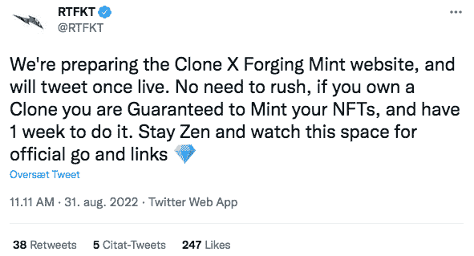
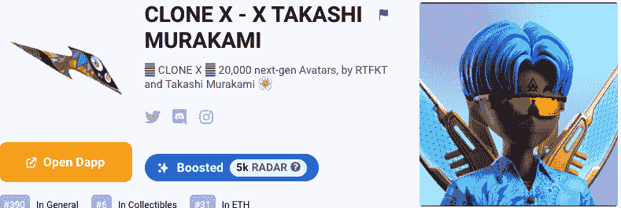
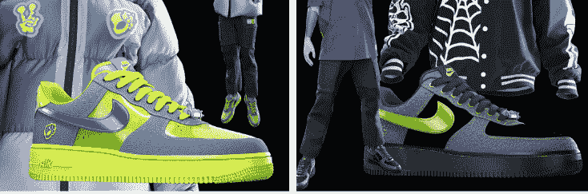

# RTFKT 推出克隆 X 锻造第一季

> 原文：<https://web.archive.org/web/https://dappradar.com/blog/rtfkt-launches-clone-x-forging-season-1>

## 伪造使用户能够根据他们特定的 NFT 获得实物商品

**该系列将于今日发布，锻造将于日后进行。该声明是在展示 60 件数码可穿戴设备的时尚系列时发布的，NFT 持有者可以从中打造实物商品。这一重大举措将 RTFKT 置于令牌门控时尚和创新的前沿。**

克隆 X 是一个受欢迎的以社区为中心的 NFT 系列，由耐克的 RTFKT 和艺术家村上隆在区块链以太坊推出。这些视觉上吸引人的 3D 角色被设计成在[元宇宙](https://web.archive.org/web/20220928104516/https://dappradar.com/blog/what-is-the-metaverse/)中互动，并且可以被定制成最好地代表他们用户的身份

## 与特定 DNA 相关的神经营养因子

物理(物理和数字)收藏由你的 NFT 化身解锁，允许用户订购与他们的化身的 DNA 相关的商品。有超过 10 个独特的总套和超过 60 个单项。

以下是解锁令牌的主要特征:

*   人类
*   机器人
*   恶魔
*   天使
*   爬行动物
*   技术上已死但仍活着的
*   村上
*   外星人
*   村上滴

## 有哪些优质的可穿戴设备？

最值得注意的高级可穿戴设备包括帽衫、t 恤、运动鞋、夹克、帽子和袜子。每位持有者拥有的代币数量和类型将决定他们可以订购的商品数量。

## 克隆 X 为什么这么受欢迎？

撰写本文时，克隆 X 的当前底价为 6.94 ETH。这个由日本艺术家村上隆设计的 20，000 个字符的创新 NFT 集合从其他集合中脱颖而出，因为它在元宇宙的多个平台上具有独特的视觉效果和实用性。

例如，Clone X NFTs 现在还可以解锁沙盒[中的虚拟角色，显示跨世界移动的互操作性和数字身份。而且 RTFKTs 3D 文件可以变成有商业权限的 NFT。](https://web.archive.org/web/20220928104516/https://dappradar.com/multichain/games/the-sandbox)

另请阅读[《克隆 X》通过 3d 文件和商业权利释放创造力](https://web.archive.org/web/20220928104516/https://dappradar.com/blog/clonex-nfts-unleash-creativity-with-3d-files-and-commercial-rights/)

## Clone X 是如何让时尚“phygital”的？

高级可穿戴设备配备了后方现场通信(NFC)标签。这些特殊标签使商品的令牌门控使用成为可能，开启了商业和商品分销的全新篇章。

另请阅读 [VNCCII 想要将音乐游戏化](https://web.archive.org/web/20220928104516/https://dappradar.com/blog/vnccii-wants-to-gamify-music)

## 用 DappRadar 追踪克隆 X

你可以使用我们的 [NFT 浏览器在这里](https://web.archive.org/web/20220928104516/https://dappradar.com/ethereum/collectibles/clone-x-x-takashi-murakami)查看收藏。有了 Clone X，元宇宙超越了游戏，也成为了一个生活空间，人们可以在这个虚拟世界中社交和收集数字物品。

 NewsletterUnsubscribe at any time. [T&Cs](https://web.archive.org/web/20220928104516/https://dappradar.com/terms) and [Privacy Policy](https://web.archive.org/web/20220928104516/https://dappradar.com/privacy-policy)