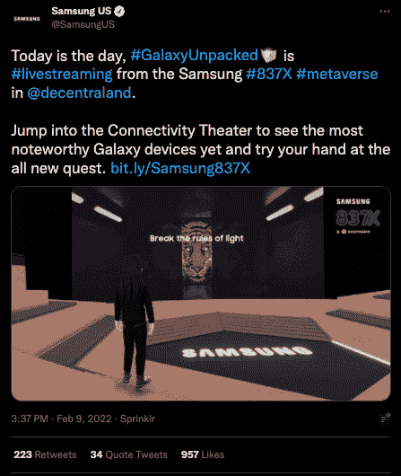
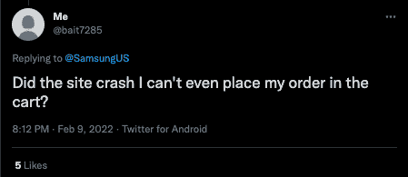

# 三星在分散的土地上发布新的 Galaxy S22 手机

> 原文：<https://web.archive.org/web/https://dappradar.com/blog/samsung-unveils-new-galaxy-s22-phone-in-decentraland>

## 100，000 名与会者参加了三星在元宇宙的 837X 空间

韩国科技巨头三星在分散虚拟世界的虚拟 837X 空间发布了新款 Galaxy S22 智能手机。2 月 9 日星期三，超过 100，000 名用户参加了元宇宙的活动，使三星 837X 总部成为分散地访问量最大的包裹之一。

尽管存在技术问题，一些媒体显然不喜欢元宇宙的设置，但该公告进展顺利，旁观者称赞三星为沟通现实和元宇宙世界所做的努力。此外，那些还不喜欢直接进入元宇宙的人从 Twitter 和其他社交媒体平台的直播中收听了这一活动。

这家电子公司在三星 837X space 的连接影院的屏幕上展示了新款 Galaxy S22、Galaxy S22 Plus 和三星 Galaxy S22 Ultra。然而，一项旨在让用户购买设备的功能遇到了技术问题，许多人在三星的 Twitter 上表达了他们的不满。

其他人开始在网上散布谣言，说黄牛和机器人试图抢尽风头。与此同时，一些人抱怨说，他们无法获得 NFT 令牌徽章奖励完成事件的寻宝游戏。

早在 2021 年底，三星就在中心区[开设了 837 旗舰店的虚拟版。虚拟 837X 商店是该公司最新产品的展示平台，有三个区域:连接剧场、可持续森林和定制阶段。](https://web.archive.org/web/20230103000426/https://dappradar.com/ethereum/marketplaces/decentraland)

## 元宇宙事件

2021 年 12 月，DappRadar 在 Somnium Space 虚拟世界中策划了我们自己的[雷达令牌发射活动，对于在元宇宙成功举办活动需要跳过的无数技术和其他问题，他并不陌生。三星采取了最初的步骤在](https://web.archive.org/web/20230103000426/https://youtu.be/Z-wDpHXwy1A?t=1290)[分散地](/web/20230103000426/https://dappradar.com/blog/virtual-real-estate-in-decentraland-sold-for-2-42-million/)建立旗舰店，现在已经以这样或那样的方式接待了超过 10 万人。这一壮举不应被低估。

[https://web.archive.org/web/20230103000426if_/https://www.youtube.com/embed/Z-wDpHXwy1A?start=1290&feature=oembed](https://web.archive.org/web/20230103000426if_/https://www.youtube.com/embed/Z-wDpHXwy1A?start=1290&feature=oembed)

让人们有机会与来自世界各地的人一起参与如此重大的活动是一回事。在他们内部采取行动，购买或保留一件物品，这就更进一步了。本周早些时候，我们报道说[麦当劳已经申请了十个商标](/web/20230103000426/https://dappradar.com/blog/mcdonalds-metaverse-restaurants-to-feature-food-delivery-service/),透露了开设一家虚拟餐厅的计划，该餐厅以实际和虚拟商品为特色，随着元宇宙概念的不断发展，还计划提供送货上门服务。

 NewsletterUnsubscribe at any time. [T&Cs](https://web.archive.org/web/20230103000426/https://dappradar.com/terms) and [Privacy Policy](https://web.archive.org/web/20230103000426/https://dappradar.com/privacy-policy)

***以上不构成投资建议。此处给出的信息仅供参考。请行使尽职调查，做你的研究。作者持有 ETH、BTC、AGIX、HEX、LINK、GRT、CRO、OMI、不可变 X、GALA、AVASTR、GMEE、CUBE、RADAR、FLOW、FTM、BNB、SPS、WRLD、ATOM 和 ADA。***