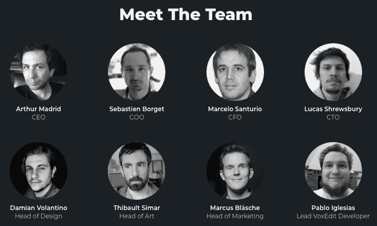
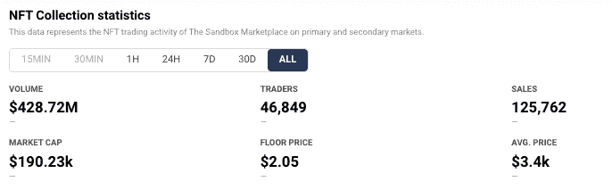
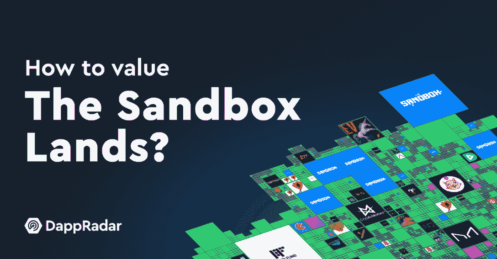

# 沙子是趋势:基本面仍然强劲吗？

> 原文：<https://web.archive.org/web/https://dappradar.com/blog/sand-was-trending-are-the-fundamentals-still-strong>

## 更好地了解什么是 HODL，什么是放手

**沙币是虚拟世界的原生数字货币，[沙盒](https://web.archive.org/web/20221216174727/https://dappradar.com/multichain/games/the-sandbox)，由 Animoca Brands 所有。玩家可以使用 s and 来支付 NFTs 或服务，并通过完成目标、交易或提供其他服务来赚取 SAND。最终，游戏玩家可以用他们自己的盈利模式创建他们自己的游戏，所有这些都由 SAND token 提供支持。**

在 2021 年牛市的巅峰时期，桑德和沙盒受到了 T2 脸书更名为 Meta T3 的消息以及元宇宙平台上突然出现的关注。2021 年 10 月 28 日星期四，代币价格为 0.76 美元。到 2021 年 11 月 25 日，触及 8.40 美元。在不到一个月的时间里，涨幅超过 1000%。

最重要的是，沙盒特定的原因推动了加密货币的上涨，这些原因今天仍然有效。此外，Animoca Brands 的区块链博彩和 NFT 领域的领导者的参与为团队和前景增加了重要的分量。他们能把沙盒推回到 8000 多美元甚至更高的峰值吗？

[https://web.archive.org/web/20221216174727if_/https://www.youtube.com/embed/6gkPOOUs-UY?feature=oembed](https://web.archive.org/web/20221216174727if_/https://www.youtube.com/embed/6gkPOOUs-UY?feature=oembed)

## 见见团队

沙盒背后的团队不是匿名的，所有人都是完全多元化的，也许最外向的团队成员是 Sebastien Borget。他是沙盒背后的开发工作室 Pixowl 的联合创始人和首席运营官。他对区块链技术、游戏和教育充满热情，是一名非常活跃的演讲者和福音传播者，在过去的八年里，他专注于手机游戏，创作了下载量达数百万次的成功游戏。点击查看[团队成员的详细信息。](https://web.archive.org/web/20221216174727/https://www.sandbox.game/en/about/)

## 著名的合作伙伴

沙盒已经获得了 50 多个合作伙伴，包括[探听狗](/web/20221216174727/https://dappradar.com/blog/snoop-dogg-moves-into-the-sandbox/)、[阿迪达斯](/web/20221216174727/https://dappradar.com/blog/adidas-enters-the-metaverse-joins-the-sandbox/)、[行尸走肉](/web/20221216174727/https://dappradar.com/blog/comic-series-the-walking-dead-coming-to-the-sandbox/)、雅达利、CryptoKitties 和 Shaun the Sheep，以建立一个由玩家拥有和制作的有趣、创意的游戏平台。这些合作伙伴将创建内容，并将他们的社区带入沙盒，可能会给游戏世界带来很多活动。

## 沙盒时间线

*   沙盒公司发布会:2012 年 5 月 15 日
*   沙地令牌发射:2020 年 8 月 14 日
*   沙盒阿尔法游戏发布会:2021 年 11 月 29 日
*   [完成路线图](https://web.archive.org/web/20221216174727/https://www.sandbox.game/en/roadmap/)从发布开始继续

## **沙子价格统计**

*   [今日沙子价格:0.94 美元](https://web.archive.org/web/20221216174727/https://dappradar.com/hub/token/eth/SAND?from=0x3845badade8e6dff049820680d1f14bd3903a5d0)
*   市值排名:#49
*   历史最高价:2021 年 11 月 25 日 8.45 美元
*   历史新低:2020 年 11 月 4 日:0.03 美元

## 举起

*   2021 年 11 月 2 日-[软银发展基金](https://web.archive.org/web/20221216174727/https://dappradar.com/blog/the-sandbox-receives-93-million-to-fund-creator-economy)-9300 万美元
*   2022 年 2 月 10 日——every realm A 系列——6000 万美元
*   2022 年 3 月 22 日——宇迦实验室种子轮——4.5 亿美元
*   2022 年 5 月 4 日——Kinetix 种子轮——1100 万美元

作为背景，[宇迦实验室最出名的](/web/20221216174727/https://dappradar.com/blog/how-yuga-labs-nfts-became-a-dominant-force-with-an-8-1b-market-cap/)是创造了迄今为止世界上最大和最赚钱的 NFT 项目、[无聊猿游艇俱乐部(BAYC)](https://web.archive.org/web/20221216174727/https://dappradar.com/ethereum/collectibles/bored-ape-yacht-club) 及其衍生项目。在过去的 12 个月中，它还花了大部分时间收购其他高调的 NFT 知识产权、品牌和版权，包括 [CryptoPunks](/web/20221216174727/https://dappradar.com/blog/yuga-labs-takeover-pushes-cryptopunk-meebit-sales-1000/) 、 [MeeBits](/web/20221216174727/https://dappradar.com/blog/meebits-nfts-attract-whale-activity-floor-price-jumps-93/) 、酷猫等等。该公司将在开发自己的名为 [Otherside](/web/20221216174727/https://dappradar.com/blog/yuga-labs-600m-otherside-nft-land-sale-records-highest-gas-fees-ever-on-ethereum/) 的虚拟世界平台中发挥重要作用，似乎将与其他主要参与者携手推出其[元宇宙愿景](/web/20221216174727/https://dappradar.com/blog/what-is-the-metaverse/)。

## 净销售额

一年多来，沙盒已经通过向公众出售虚拟土地在元宇宙开辟了一片天地。它吸引了一些相当大的买家。例如，[说唱歌手 Snoop Dogg 不仅在沙盒](/web/20221216174727/https://dappradar.com/blog/snoop-dogg-moves-into-the-sandbox/)中购买了土地——他还邀请玩家通过通行证和派对通行证加入他的 [Snoopverse](/web/20221216174727/https://dappradar.com/blog/snoop-dogg-launching-nft-avatars-in-the-sandbox/) 。此外，玩家可以在沙盒市场[创造和出售低价值的游戏内 NFT 物品](https://web.archive.org/web/20221216174727/https://dappradar.com/nft/marketplaces)。

来自 DappRadar 的 NFT 销售和市场[数据将沙盒列为以太坊上交易量第 14 大的 NFT。超过 46，000 名交易者产生了超过 125，000 笔交易，在撰写本文时的交易量超过 4.28 亿美元。查看下面我们的](https://web.archive.org/web/20221216174727/https://dappradar.com/hub/nft-explorer/collection/the-sandbox)[沙盒土地估价报告](https://web.archive.org/web/20221216174727/https://dappradar.com/blog/the-sandbox-land-valuation-report)。

[<picture></picture>](https://web.archive.org/web/20221216174727/https://dappradar.com/blog/the-sandbox-land-valuation-report)

## 最新发展

浏览 DappRadar 博客上的 100 多篇文章，涵盖了来自[沙盒的新闻和事件。最新发展如下:](https://web.archive.org/web/20221216174727/https://dappradar.com/blog/search/?q=the%20sandbox)

*   2021 年 11 月-[Alpha 游戏发布](https://web.archive.org/web/20221216174727/https://dappradar.com/blog/the-sandbox-to-launch-second-play-to-earn-alpha-season)
*   2021 年 11 月—[对沙盒土地的需求达到创纪录的高度](https://web.archive.org/web/20221216174727/https://dappradar.com/blog/demand-virtual-land-in-the-sandbox-metaverse-reaches-record-heights)
*   2022 年 2 月-[多边形上的沙堆标志桩开始使用](https://web.archive.org/web/20221216174727/https://dappradar.com/blog/the-sandbox-sand-token-staking-launched-on-polygon)
*   2022 年 3 月—[沙盒欢迎汇丰来到元宇宙](https://web.archive.org/web/20221216174727/https://dappradar.com/blog/the-sandbox-welcomes-hsbc-to-the-metaverse)
*   2022 年 5 月-[最终幻想的创造者投资 Animoca 品牌和沙盒](https://web.archive.org/web/20221216174727/https://dappradar.com/blog/creator-of-final-fantasy-to-invest-in-animoca-brands-and-the-sandbox)
*   2022 年 6 月-[时代与沙盒合作在元宇宙建造“时代广场”](https://web.archive.org/web/20221216174727/https://www.sandbox.game/en/blog/time-is-partering-with-the-sandbox-to-build-time-square-in-the-metaverse/)

[https://web.archive.org/web/20221216174727if_/https://www.youtube.com/embed/3H8DoAYwMaU?feature=oembed](https://web.archive.org/web/20221216174727if_/https://www.youtube.com/embed/3H8DoAYwMaU?feature=oembed)

## 我现在能用我的沙子做什么？

玩家需要沙子代币来参与区块链版本的游戏，在市场上交易资产和购买土地 NFT，这是游戏中的数字土地。您还可以使用 SAND 作为治理令牌，通过他们的分散自治组织(DAO)结构在平台上投票并提出改进建议。

除此之外，沙子的持有者可以继续去 HODL，或者将他们的沙子放入[多边形网络桩](https://web.archive.org/web/20221216174727/https://medium.com/sandbox-game/introducing-sand-staking-on-polygon-462a671e8a9d)中，以从低廉的汽油费中受益，或者[在以太坊](https://web.archive.org/web/20221216174727/https://sandboxgame.gitbook.io/the-sandbox/staking/stake-sand-eth)上做同样的事情，用沙子制造更多的沙子。

## 摘要

沙盒的价值去年大幅上涨，然而，上涨可能还没有结束。这是因为沙盒正处于其成长故事的早期阶段。该平台举办了两次阿尔法活动，允许有限数量的玩家体验沙盒所提供的一切。最新的《阿尔法第二季》吸引了超过 32.5 万名访客。

一只坚实的[元宇宙用已经很长的尾巴玩](/web/20221216174727/https://dappradar.com/blog/what-is-the-metaverse/)。与现实世界品牌的强大合作伙伴关系，以及领先企业 Animoca 和宇迦实验室的大量投资。

[<picture></picture>](https://web.archive.org/web/20221216174727/https://dappradar.com/ethereum/games/the-sandbox)[<picture></picture>](https://web.archive.org/web/20221216174727/https://dappradar.com/hub/token/eth?to=0x3845badade8e6dff049820680d1f14bd3903a5d0)[<picture></picture>](https://web.archive.org/web/20221216174727/https://dappradar.com/blog/the-sandbox-land-valuation-report)

***以上不构成投资建议。此处给出的信息仅供参考。请行使尽职调查，做你的研究。作者持有多种加密货币的头寸，包括 BTC、瑞士法郎和雷达。***

 NewsletterUnsubscribe at any time. [T&Cs](https://web.archive.org/web/20221216174727/https://dappradar.com/terms) and [Privacy Policy](https://web.archive.org/web/20221216174727/https://dappradar.com/privacy-policy)