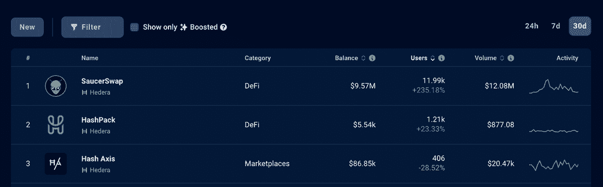
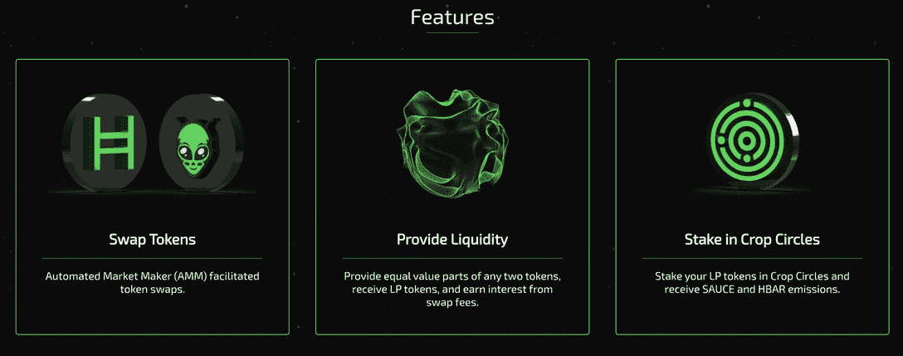
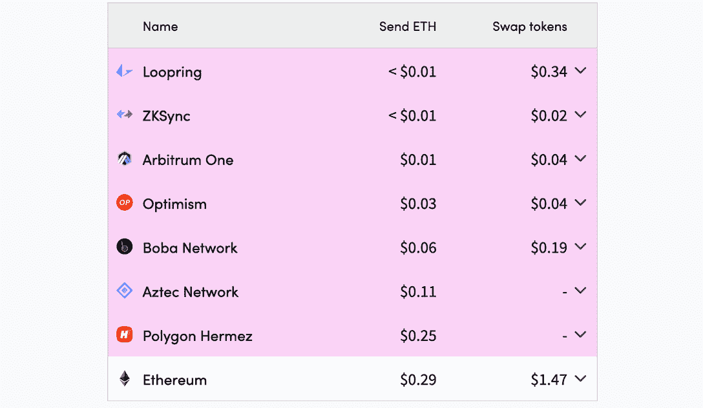

# Hedera 上的 SaucerSwap 用户增长了 235%

> 原文：<https://web.archive.org/web/https://dappradar.com/blog/saucerswap-on-hedera-sees-235-in-user-growth>

## SaucerSwap 是一个开创性的 DEX，它利用了开源的公共 Hedera 网络。

SaucerSwap 是一个开源的、分散的交换平台，它利用了公共的 Hedera 网络。SaucerSwap 提供全套 DeFi 服务，包括但不限于掉期、流动性、农场、赌注等等。Hedera 的 ace DeFi 项目最近见证了用户和流动性的显著增长。

总结:

*   [Hedera DeFi 生态系统](https://web.archive.org/web/20221129073440/https://dappradar.com/defi/protocol/hedera)最近在应用程序、流动性和用户方面都有显著增长。
*   Hedera 上最大的 DeFi 服务提供商 SaucerSwap 的用户在 30 天内增长了 235%。
*   Hedera 独特的架构和本地服务与 EVM 相结合，克服了区块链网络面临的问题。
*   Hedera 上的 DeFi 应用程序用户可以期待无前期运行、低固定费用、超快的性能和高可用性。
*   这些是 DeFi 项目(如 SaucerSwap)选择 Hedera 作为其底层基础设施来推动令人难以置信的用户体验的重要原因。

Hedera 上的先锋 DeFi dapp 最近见证了用户的激增，30 天内增长了 235%。这样的表现显示了海德拉的攀登热情。同时也间接证明了 Hedera 可以滋生 DeFi 项目蓬勃发展。

## 什么是 SaucerSwap？

SaucerSwap 是一个基于 Hedera 的 DeFi 平台，于 8 月 5 日发布。值得注意的是，该项目立即获得了用户的关注和强烈参与，这可以从其数据性能中充分体现出来。

关于《锁定的总价值》( TVL), SaucerSwap 在正式亮相后的第一周内实现了 1000 万美元，一个月后达到了 1600 万美元。截至 9 月 21 日，SaucerSwap 的总交易额已经超过了 37，000，000 美元。

SaucerSwap 凭借强大的功能和流畅的 DeFi 体验，迅速赢得了用户的青睐。 [SaucerSwap 凭借其强大的功能迅速赢得了用户的青睐](https://web.archive.org/web/20221129073440/https://www.saucerswap.finance/)，包括掉期、流动性挖掘、收益耕作等等。此外，流畅的用户体验有助于实现这些目标。

SaucerSwap 有一个原生令牌 SAUCE 来方便它的平台。它既是治理令牌，也是实用令牌。用户可以入股酱为平台提供流动性，并因此获得回报。

## 为什么要在 Hedera 上建项目？

[Hedera 以创新的技术方法重新定义了](https://web.archive.org/web/20221129073440/https://hedera.com/)去中心化的分布式网络和加密货币。作为今天唯一使用 hashgraph consensus 的公共分类帐，Hedera 不受区块链的缩放问题的影响。而且也不存在开采消耗过多能源或者危害环境的情况。因此，由 hashgraph 支持的交易从第一天起就变得更安全、更快速、更便宜。

因此，由 hashgraph 支持的交易从第一天起就变得更安全、更快速、更便宜。Hedera 上的交易确认时间平均为 3-5 秒，即时完成。这与第 2 层(L2)汇总有根本的不同，因为 L2 汇总需要将事务捆绑到单个块中，然后将经过验证的事务发布到主链。

[基于 Hedera 并利用其多功能服务](https://web.archive.org/web/20221129073440/https://hedera.com/)(使用 EVM 的 Hedera 令牌服务、Hedera 共识服务和 Hedera 智能合同服务)使 DeFi 项目能够提供安全、高效且经济实惠的终极用户体验。

以 SaucerSwap 为例:用户在 SaucerSwap 上交换代币时，只需花费少至 0.003 美元的固定费用。这样的性能甚至让最好的 L2 以太坊解决方案都望尘莫及。

[*Source*](https://web.archive.org/web/20221129073440/https://l2fees.info/)

[https://web.archive.org/web/20221129073440if_/https://www.youtube.com/embed/HyeQVlKlTQo?feature=oembed](https://web.archive.org/web/20221129073440if_/https://www.youtube.com/embed/HyeQVlKlTQo?feature=oembed)

## Hedera DeFi 联盟为 Hedera 的 DeFi 繁荣铺平了道路

Stader Hedera、Saucerswap Labs 和 HeadStarter，三个基于 Hedera 构建的首批 DeFi 协议，已经组成了 Hedera DeFi 联盟(HDA)。联盟成员的共同努力将为现有和未来的 Hedera DeFi 项目以及那些考虑迁移到生态系统的项目提供必要的支持。

此外， [SaucerSwap](https://web.archive.org/web/20221129073440/https://www.saucerswap.finance/) 已经向开发者社区开源了它的 DEX 代码，这是一个加速在 Hedera 上采用分散技术的行动。通过共享其底层技术，SaucerSwap 邀请开发人员优化、回馈和构建新的解决方案。

多样性对于健康的 Web3 世界至关重要，因为当一种技术无法有效解决问题时，用户需要在不损害体验的情况下有其他选择。

[Hedera DeFi 生态系统的发展势头越来越强劲](https://web.archive.org/web/20221129073440/https://hedera.com/)更多的 DeFi legos 将加入其中，包括 HeliSwap 和 HBARSuite。作为去中心化账本技术的先行者，Hedera 总是会以其独特的技术优势吸引开发者和用户。

简而言之，当传统的区块链技术无法处理现实世界的大规模交易量时，Hedera 可以提供有效的解决方案。

## 随身携带您的 Web3 之旅

使用 DappRadar 移动应用程序，再也不会错过 Web3。查看最受欢迎的 dapps 的性能，并关注您投资组合中的 NFT。您在 DappRadar 上的帐户会与我们的移动应用程序同步，这样您很快就可以选择实时接收提醒。

[Download the DappRadar app now](https://web.archive.org/web/20221129073440/https://dappradar.app.link/blog)[<picture></picture>](https://web.archive.org/web/20221129073440/https://play.google.com/store/apps/details?id=com.portfolio.dappradar)

**了解更多关于 Hedera 和 SaucerSwap 的信息:**

[网站(海德拉)](https://web.archive.org/web/20221129073440/https://hedera.com/)

[推特](https://web.archive.org/web/20221129073440/https://twitter.com/hedera) ( [海德拉](https://web.archive.org/web/20221129073440/https://twitter.com/hedera))

[Discord(荣誉)](https://web.archive.org/web/20221129073440/https://hedera.com/discord)

[网站](https://web.archive.org/web/20221129073440/https://www.saucerswap.finance/) ( [酱包](https://web.archive.org/web/20221129073440/https://www.saucerswap.finance/))

[Twitter](https://web.archive.org/web/20221129073440/https://twitter.com/SaucerSwapLabs)([saucers WAP](https://web.archive.org/web/20221129073440/https://twitter.com/SaucerSwapLabs))

[不和(SaucerSwap)](https://web.archive.org/web/20221129073440/https://discord.gg/BpZAGpzGfw)

**免责声明** —这是一篇赞助文章。DappRadar 不认可本页面上的任何内容或产品。DappRadar 旨在提供准确的信息，但读者应该在采取行动之前总是自己做研究。DappRadar 的文章不能被认为是投资建议。