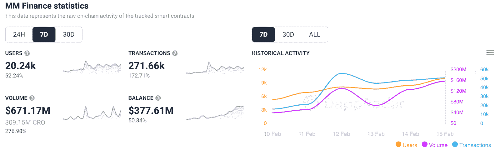
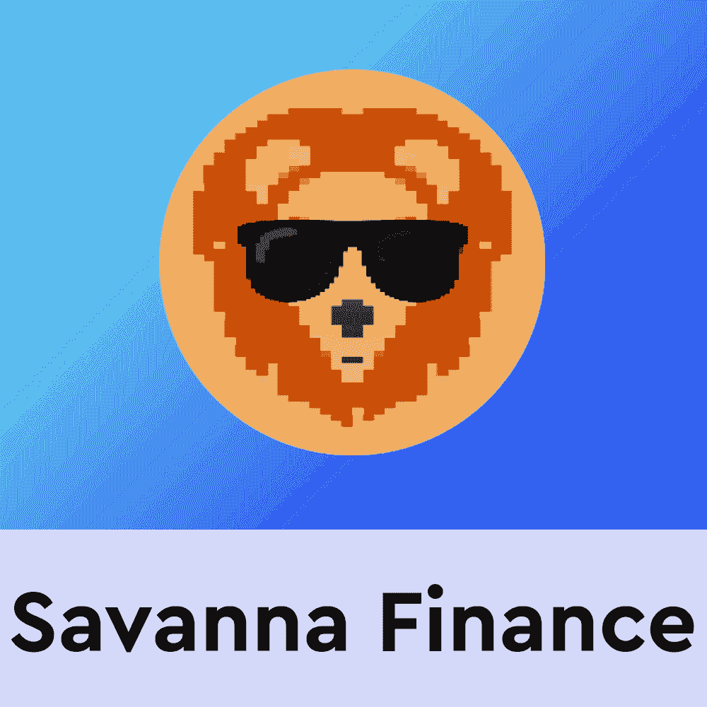
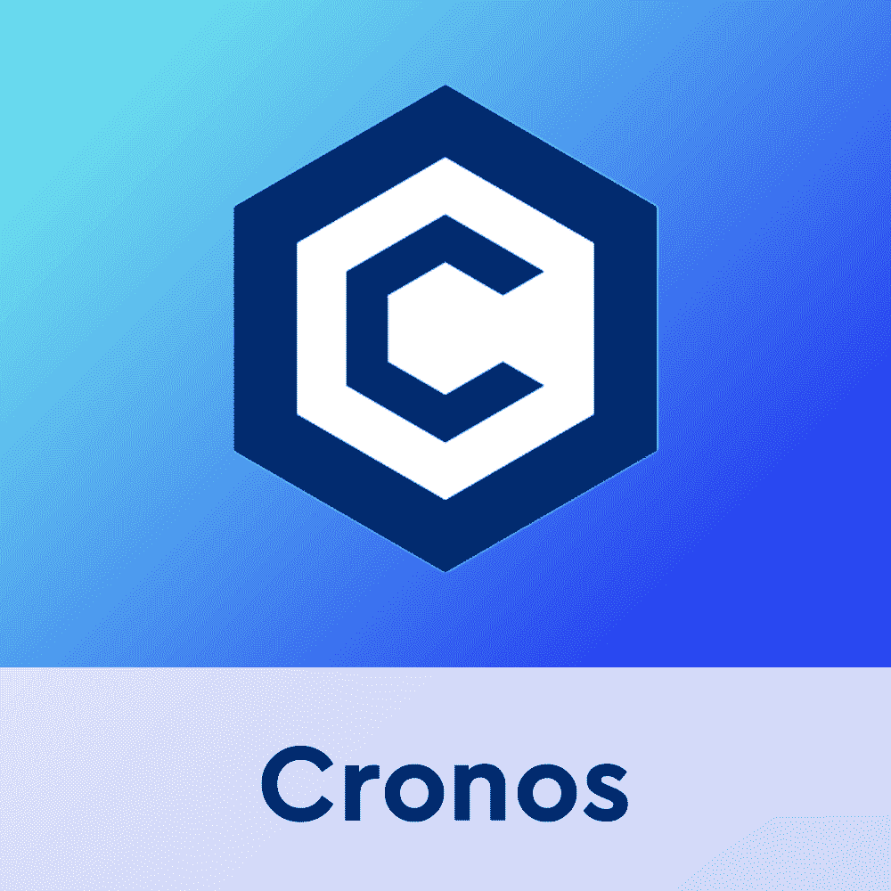

# Savanna Finance 提高了 MM Finance 在 Cronos 上的性能

> 原文：<https://web.archive.org/web/https://dappradar.com/blog/savanna-finance-boosts-performance-for-mm-finance-on-cronos>

## Savanna Finance 的 SVN 稳定币与 MM Finance 的 MMF 代币挂钩

Savanna Finance 发行的 SVN 稳定币提升了 MM Finance 的业绩，因为稳定币与 MMF 代币挂钩。Savanna Finance 是 Cronos 区块链上第一个也是最大的算法稳定币平台。Savanna Finance 最近登陆 Cronos，对 MM Finance 过去一周的业绩产生了非常积极的影响。

MM Finance 是一家建立在克罗诺斯区块链基础上的自动化做市商和分散式交易所。该平台的本机令牌 MMF 为做市商中的大多数池提供了便利。这就是为什么 Savanna Finance 的 SVN 一直与美元挂钩。

在过去的七天里，MM Finance 的用户群增长了 50%以上，达到了 20，240 个唯一活跃钱包。此外，该平台通过其众多的养殖池和服务产生了超过 6.711 亿美元的交易额。

重要的是，这种活动的增加使 MM Finance 在 Cronos 区块链的 DeFi 排名中位居第一。就交易额而言，MM Finance 比亚军[大地构造](https://web.archive.org/web/20221006033817/https://dappradar.com/cronos/defi/tectonic)多获得了 1 亿多美元。

但现在你可能会想，为什么 Savanna Finance 要将其稳定币与 MMF 币挂钩。是什么让这个项目脱颖而出成为一个 DeFi 平台？

## 什么是稀树草原金融？

[稀树草原金融](https://web.archive.org/web/20221006033817/https://dappradar.com/cronos/defi/savannah-finance)是一个算法稳定的投币平台。重要的是，本国货币 SVN 是一种稳定的货币，与 MMF 的价值以 1:1 的比例挂钩。稀树草原金融项目背后的主要目标是作为一个快速增长的生态系统的骨干。重要的是，这个新项目旨在为 MM 金融服务网络带来流动性和更多用例。该平台的基本机制动态调整 SVN 的供应，推动其价格相对于 MMF 价格上下浮动。

为了更好地应对市场的快速变化，Savanna Finance 将依赖另外两个标志。当网络扩张和 SVN 经历通货膨胀时期时，SVN 持有者可以申请 Meerkat Share (MSHARE)令牌。当网络收缩时，可以购买 Meerkat Bond (MBOND)令牌。更重要的是，当网络进入通货紧缩阶段时，它可以为 SVN 挽回损失。

这种三重令牌经济将允许交易者从市场波动中受益，同时仍然为 SVN/MMF 的养殖池提供流动性。实质上，当挂钩价格超过一个 MMF 代币的价格时，持有者将获得 MSHARE 代币。这些可以换来更多的 SVN。如果相反的情况是真的，并且挂钩低于一个 MMF 代币的价值，用户将能够要求 MBOND 代币，这些代币也可以交换更多的 SVN，但是，只有当 SVN 的价值回到 1:1 挂钩。

## 养殖池

除了革命性的三重令牌经济，Savanna Finance 还引入了两种截然不同的投资机会。首先，有一个沙漠池，这是一个线性的 SV/MMF 池，任何时候都起作用，不管 SVN 与挂钩的关系如何。

另一方面，只有当 SVN 的价值超过 1:1 挂钩时，绿洲池才发挥作用。从这个意义上来说，绿洲资金池与 MSHARE 代币一起使用，当 SVN 的价值高于 MMF 时，它让交易员获得了额外的流动性回报。

## Savanna Finance 自启动以来的表现

自 2 月 11 日 Savanna Finance 正式推出以来，该平台吸引了大量用户和交易量。在撰写本文时，已有超过 6，500 个独特的活动钱包连接到算法稳定的硬币平台。用户喜欢这些新的 DeFi 计划，尤其是当市场变动对他们有利时。

此外，Savanna Finance 处理了超过 6500 万美元的交易量，约占 MM Finance 交易量的十分之一。考虑到这个平台还不到一周，这是一个不小的成就。

DappRadar 将继续监测 [MM Finance](https://web.archive.org/web/20221006033817/https://dappradar.com/cronos/defi/mm-finance) 和 [Savanna Finance](https://web.archive.org/web/20221006033817/https://dappradar.com/cronos/defi/savannah-finance) ，因为这些平台在 Cronos 的 [DeFi 空间留下了它们的印记。如果你想了解更多关于克罗诺斯区块链和它的 dapps 生态系统的知识，可以看看这篇文章。此外，您可以点击下面的链接了解更多信息，并浏览 DappRadar 上完整的 Cronos 排名。](https://web.archive.org/web/20221006033817/https://dappradar.com/rankings/protocol/cronos/category/defi)

[<picture></picture>](https://web.archive.org/web/20221006033817/https://dappradar.com/cronos/defi/mm-finance)[<picture></picture>](https://web.archive.org/web/20221006033817/https://dappradar.com/cronos/defi/savannah-finance)[<picture></picture>](https://web.archive.org/web/20221006033817/https://dappradar.com/rankings/protocol/cronos) NewsletterUnsubscribe at any time. [T&Cs](https://web.archive.org/web/20221006033817/https://dappradar.com/terms) and [Privacy Policy](https://web.archive.org/web/20221006033817/https://dappradar.com/privacy-policy)