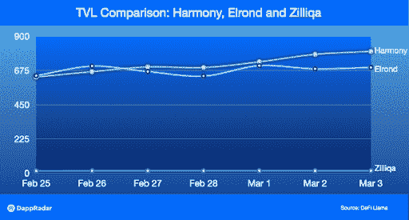
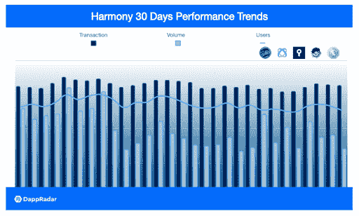
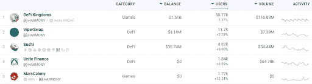

# 可扩展的和谐生态系统健康发展

> 原文：<https://web.archive.org/web/https://dappradar.com/blog/scalable-harmony-ecosystem-sees-healthy-growth>

## 得益于 DeFi、游戏和 NFT 产品，区块链公用事业增长超过 26%

随着 dapp 开发者和用户都体验到该平台的好处，和谐区块链生态系统在其所有垂直领域都实现了健康增长。分片为区块链解决方案公司扩展其平台创造了独特的机会，而和谐公司正在收获回报。

和谐是新一代的基于分片的区块链。它完全可扩展，可证明是安全的，并且节能。可扩展性问题严重限制了区块链生态系统的可持续发展。Harmony 通过将最佳研究成果和工程实践结合在一个优化的系统中来解决这个问题。值得注意的是，和谐的杰出表现已被其不断扩大的生态系统所证明。

区块链技术的可扩展性一直是业界关注的焦点。以太坊之后出现的大部分公链一直致力于解决这个问题。于是，迎来了公链的爆发式增长。Harmony 是使用这种技术的后起之秀之一，其 TVL 在过去一周增长了 20%以上。这标志着用户和 dapp 开发者的信心。

## 不断发展的和谐生态系统

和谐号的优异表现使其在众多竞争对手中脱颖而出。目前，有无数的 dapps 选择拥抱和谐。生态系统与各种不同的产品一起工作，包括游戏、NFTs 和 DeFi。和谐在所有领域迅速发展，包括游戏、NFT、DeFi 等。随着和谐智能合约锁定的总价值(TVL)的增长，其生态系统正在健康快速地扩张。

下图显示了 2022 年 2 月 25 日至 3 月 3 日埃尔隆德、Zilliqa 和 Harmony TVL 的 7 天趋势。与领先的区块链如以太坊、BSC 和 Polygon 相比，这些数字并不令人印象深刻。因此，和谐的增长是最好的相比，争夺区块链生态系统。

可以看出，这种上升趋势在和声区块链上最为明显。具体来说，根据 DeFi Llama 的数据，该数据在一周内从 6.3262 亿美元增长到 8.013 亿美元，增长率为 26.7%。TVL 是分散金融(DeFi)协议中锁定或存放的加密资产的总价值。区块链生态系统中的每一项服务都依赖 DeFi 为其自身经济提供动力。因此，TVL 是衡量对整个生态系统兴趣的关键指标。

接下来，我们来看三组数据，反映了 Harmony 上顶尖 dapps 的整体表现。DappRadar 在和谐区块链上对大量的申请进行跟踪和排名。我们从排名靠前的基于和谐的 dapps 中挑选了五家，它们是 [DeFi 王国](https://web.archive.org/web/20220925234754/https://dappradar.com/harmony/games/defi-kingdoms)、 [ViperSwap](https://web.archive.org/web/20220925234754/https://dappradar.com/harmony/defi/viperswap) 、 [MarsColony](https://web.archive.org/web/20220925234754/https://dappradar.com/harmony/games/marscolony) 、 [NFTKEY Marketplace](https://web.archive.org/web/20220925234754/https://dappradar.com/harmony/marketplaces/nftkey-marketplace) 和 [Unite Finance](https://web.archive.org/web/20220925234754/https://dappradar.com/harmony/defi/unite-finance) 。这些 dapps 覆盖了 DeFi、NFTs 和元宇宙领域。毫无疑问，和谐生态系统已经成为一个多样化和动态的系统。

我们汇总了这五个 dapps 的用户数量、交易量和交易量，然后研究了过去 30 天的趋势(截至本文撰写之时)。图表显示，尽管最近加密货币市场动荡不安，但 Harmony dapps 的表现似乎非常稳定。更值得注意的是，截至本文撰写之时，ViperSwap、Unite Finance 和 Mars Colony 的七天用户数据较前一周分别增长了 1.75%、7.65%和 13.13%。

## 什么是和谐

和谐是一个开放和快速的区块链。Harmony mainnet 运行以太坊应用程序，交易结束时间为 2 秒，费用低 100 倍。和谐的安全桥梁提供与以太坊，币安，和其他 3 个链的跨链传输。

值得注意的是，Harmony 也是一个使用分片的公共区块链。让我们弄清楚什么是碎片。分片对于互联网世界来说并不陌生，因为它通常指的是数据库分片。简单来说，就是将单个数据库的数据处理工作分配给多个数据库的策略。因此，它提高了数据处理的效率。理论上，分片支持数据库的无限水平扩展。

区块链的鲨鱼也有类似的性质。由分片策略支持的网络创建多组(即分片)验证器，并让它们同时处理事务。通过这种方式，随着碎片数量的增加，总事务吞吐量线性增加。

基于分片的下一代区块链 Harmony 是完全可扩展的，可证明是安全和节能的。而且，Harmony 提供了无与伦比的技术解决方案，让 dapps 在服务大用户和面对高频交易时能够高枕无忧。和谐具有各种特征，赋予生态系统独特性。

## 和声独特的技术特征

*   **完全可扩展**–Harmony 将分片应用于网络通信、交易验证和区块链状态。这使得 Harmony 成为一个完全可扩展的区块链。
*   **安全分片**–Harmony 的分片过程可证明是安全的，这要归功于分布式随机生成(DRG)过程，它是不可预测的、无偏见的、可验证的和可扩展的。Harmony 还以不间断的方式重组网络，以防止缓慢适应的拜占庭对手。
*   **高效、快速的共识**–和谐基于 PoS，因此节能。此外，达成共识的是一种线性可扩展的拜占庭容错(BFT)算法，比实用的拜占庭容错(PBFT)快 100 倍。
*   **自适应阈值位置**–节点加入网络所需的赌注阈值根据总赌注量进行调整，恶意赌注者无法将其权力集中在单个碎片上。而且门槛足够低，小赌注者可以参与网络，赚取报酬。
*   **可扩展的网络基础设施**–通过 RaptorQ fountain 代码，Harmony 可以使用自适应信息传播算法在分片内或跨网络快速传播数据块。Harmony 还采用 Kademlia 路由来实现跨分片事务，该事务与分片数量成对数关系。
*   **一致的跨分片事务**–Harmony 支持跨分片事务，分片之间直接通信。

## 结束语

总之，高质量的 dapps 希望拥有稳定、高效、廉价的区块链技术作为培育他们项目的土壤。另一方面，区块链生态系统的全面性需要各种高质量的 dapps 来丰富其用户的服务范围。在 Harmony 的案例中，我们已经看到 dapp 和技术基础设施之间的关系是健康的，其中飞轮效应对 Harmony 生态系统和单个 dapp 的生态系统都有积极的影响。

[*Discover more Harmony dapps in the DappRadar Rankings*](https://web.archive.org/web/20220925234754/https://dappradar.com/rankings/protocol/harmony)

**链接**
[网站](https://web.archive.org/web/20220925234754/https://www.harmony.one/)
[白皮书](https://web.archive.org/web/20220925234754/https://harmony.one/whitepaper.pdf)
[推特](https://web.archive.org/web/20220925234754/https://twitter.com/harmonyprotocol)