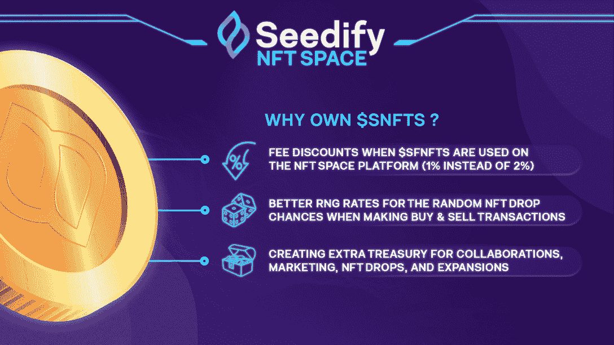
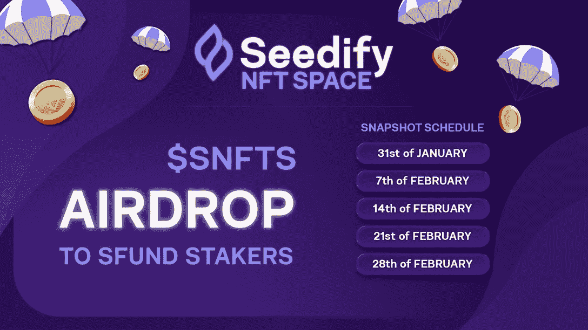

# Seedify NFT 空间:为元宇宙市民和游戏玩家量身定制的市场

> 原文：<https://web.archive.org/web/https://dappradar.com/blog/seedify-nft-space-a-marketplace-tailored-for-metaverse-citizens-and-gamers>

## Seedify 推出针对 NFT 博彩业的最新大师级产品

Seedify 推出了一个更加垂直的 NFT 市场，目标是元宇宙市民和游戏玩家。NFT 正在改变我们欣赏、评估和消费资产、投资、艺术和收藏品的方式。为了满足不同的需求，NFTs 的使用场景正在增加。为了应对这种市场趋势，Seedify NFT 空间将只满足 NFT 博彩业的需求。

[DappRadar 报告显示，](https://web.archive.org/web/20221127150546/https://dappradar.com/blog/why-are-nfts-sidestepping-the-crypto-crash)2021 年，不可替代令牌(NFT)交易产生了 250 亿美元，与之前四年的总和相比，增长了 18，414%。NFT 市场已经成为创作者、收藏者和投资者分享和交易非专利技术的中心。

非物质文化遗产也改变了我们欣赏、评估和消费资产、艺术品和收藏品的方式。NFTs 的使用场景总是会增加，以满足不同用户的需求。为了应对这种市场趋势，Seedify 推出了一个更加垂直的 NFT 市场，针对特定的用户群体，即元宇宙用户和游戏玩家。

## 游戏和元宇宙的 NFT 市场

目前，Seedify 的孵化器和 launchpad 平台推出了 40 款游戏产品，每款产品都提供了独特的游戏玩法。随着元宇宙游戏玩家群体的不断扩大，无数互联的用例、多元宇宙集成和复杂的应用程序将会不断涌现。

现有的 NFT 市场通常提供所有不同 NFT 类别的混合。因此，很难在特定细分市场的用户体验方面实现高度定制。根据 [2021 年 DappRadar 行业报告](https://web.archive.org/web/20221127150546/https://dappradar.com/blog/2021-dapp-industry-report)，截至报告发布时，游戏占行业使用量的 51%，而 DeFi 占 37%。游戏玩家构成了区块链用户的很大一部分，他们的用户行为和偏好与其他人有着本质的不同。

为了解决这个问题，Seedify NFT 空间将推出一个创新的 NFT 市场，专门满足元宇宙市民和游戏玩家的需求。除了精简的用户体验和无缝的用户界面，Seedify NFT 空间还将采用更低的交易费用，以应对游戏世界的高交易频率。

## 不仅仅是 NFT 市场

Seedify 的愿景是成为区块链游戏的门户，它将引入一个 NFT 市场，以更好地装备创作者，并为创作者经济提供动力。市场的所有功能都是为这些目标用户群的用户旅程量身定制的。

**类似 Kickstarter 的众筹机制**

该功能旨在让创作者、游戏玩家和收藏者同时受益。一方面，如果用户决定在项目上市前预购或资助收藏，用户，或者在这种情况下的赞助商可以保证他们自己有一个预先造币的位置。另一方面，这种机制提供了额外的选项来支持和推出新的 NFT 系列。

**自动启动功能**

Seedify 为创作者和项目提供发射台，以及营销支持、咨询和行业合作伙伴。Seedify launch pad 的上市就绪网络将护送创作者和项目顺利发布。

**激励机制**

Seedify NFT 太空市场还在其系统中纳入了一个设计合理的奖励机制，50%的市场费用被注入 RNG·NFT 奖金池。

用户在市场上进行的每一笔交易都将通过 RNG 机制给予他们赢得 NFT 奖的平等机会。为了更公平有效地激励交易行为，交易量较大的用户可以获得更慷慨的奖励，例如，更罕见的 NFT 下降。

## 代币经济和即将到来的空投

Seedify 的原生令牌 SFUND 将游戏玩家和收藏者与创作者和项目所有者联系起来。SFUND 最重要的效用之一就是众筹创作者和收藏。此外，SFUND 允许用户体验 Seedify 的 IGO、INO 和 IMO Launchpads 上的功能。

此外，Seedify 正在向其生态系统引入一个新的平台令牌 SNFTS。使用 SNFTS，用户可以获得 1%的市场费用，而使用其他令牌时则为 2%。此外，SNFTS 提供了更高的 RNG(随机数发生器)率，以获得更罕见的 NFT 奖励下降。Seedify 团队将创建一个 SNFTS 库，为未来的合作、营销和项目扩展提供资金。

Seedify 不会出售任何 SNFTS 令牌。相反，代币将以 20 比 1 的比例空投给 SFUND 代币持有者(SNFTS 到 SFUND)。五周内拍摄的战略快照将决定每位持有者将获得的代币数量。持有某些蓝筹 NFT 的 OpenSea 用户和钱包，如 JRNT Club 和 Neo Tokyo Citizens，也将获得参与空投的机会。

该团队将在未来几天分享更多关于 Seedify NFT 空间的信息，因为 Seedify 努力建立一个完全支持和推动区块链游戏和元宇宙生态系统创新的平台。

**SNFTS 空投计划快照**

**空投参与快速指南**

对于 skate 或 farm 中的每个 SFUND，用户可以获得 20 个 SNFTS。有 5 种时间可供选择，分别为 7 天、15 天、30 天、60 天和 90 天。

1.购买 SFUNDs(可在 Pancakeswap、Gate.io、KuCoin 上购买)–[更多信息](https://web.archive.org/web/20221127150546/https://launchpad.seedify.fund/)

2.投资或经营这些基金-[点击此处](https://web.archive.org/web/20221127150546/https://staking.seedify.fund/)

[点击此处](https://web.archive.org/web/20221127150546/https://seedify-fund.gitbook.io/seedify-nft-space)了解 Seedify NFT 空间的所有详情。

## 关于指定

[Seedify 是区块链一家专注于游戏的孵化器和发射台生态系统](https://web.archive.org/web/20221127150546/https://dappradar.com/blog/seedify-is-your-ticket-to-the-blockchain-gaming-ecosystem/)，通过获得资金、社区和合作伙伴关系建设以及全面的支持系统，为创新者和项目开发者提供支持，帮助推动游戏和区块链的未来。

要了解关于 Seedify 的更多信息，请访问以下链接:

*   [网站](https://web.archive.org/web/20221127150546/https://launchpad.seedify.fund/?utm_source=Dapp+Radar&utm_medium=PR&utm_campaign=snfts_airdrop&utm_id=DappRadar_PR)
*   [推特](https://web.archive.org/web/20221127150546/https://twitter.com/SeedifyFund/)
*   [电报聊天](https://web.archive.org/web/20221127150546/https://t.me/seedifyfundofficial)
*   [电报通知](https://web.archive.org/web/20221127150546/https://t.me/seedifyfund)
*   [中等](https://web.archive.org/web/20221127150546/https://blog.seedify.fund/)

**免责声明** —这是一篇赞助文章。DappRadar 不认可本页面上的任何内容或产品。DappRadar 旨在提供准确的信息，但读者应该在采取行动之前总是自己做研究。DappRadar 的文章不能被认为是投资建议。