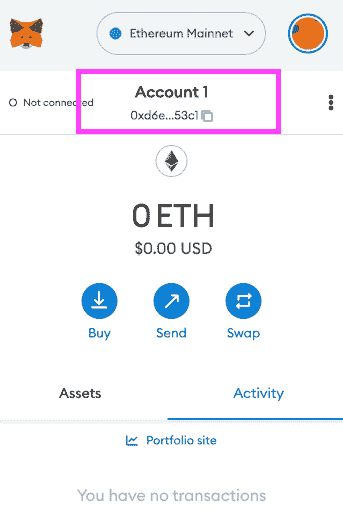
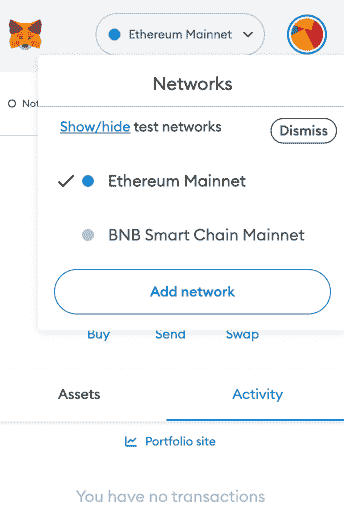

# 自保管在加密中很重要——原因如下

> 原文：<https://web.archive.org/web/https://dappradar.com/blog/self-custody-matters-in-crypto-heres-why>

## 不是你的钥匙，不是你的密码

随着集中交易所滥用用户资金，在更广泛的行业中引发财务问题，用户钱包中的加密资产的自我保管已成为一个话题。“不是你的钥匙，不是你的密码”这句话大多数人都听说过，但可能并不完全理解。然而，理解它的意义和重要性对于任何计划参与 Web3 革命的人来说都是至关重要的。

FTX 是一个集中的交易所。这意味着，当交易所开始崩溃时，持有代币的客户被冻结，无法提取代币。原因是 FTX 保管着客户的令牌，持有公司钱包中的所有资产，同时还控制着私钥。

FTX 冻结客户使用这些代币来支付债务，阻止客户大量流失，这只会加剧局势。如果像 Mt.Gox 交易所案那样，消费者可能需要十年时间才能拿回任何东西。许多人损失了很多钱，却没有追索权，也没有办法拿回来。
木已成舟，但采取预防措施以避免更多的心碎是至关重要的。我们建议用户了解加密自保管、私钥和钱包。这些是 Web3 中用户授权的重要方面。

当用户拥有钱包的所有权时，他们可以与各种分散的应用程序进行交互。您的所有活动，赢得的收藏品和加密硬币都可以通过用户友好的 DappRadar 投资组合跟踪器进行跟踪。

[DappRadar Portfolio Tracker](https://web.archive.org/web/20221127191454/https://dappradar.com/hub/wallet)

但是要理解自我监护，首先要了解基础知识。

## 什么是集中交易所(CEX)？

集中式交易所的运作方式类似于传统的金融机构。他们拥有中央控制权，并利用第三方和中介的服务来执行交易。集中交易所的例子有比特币基地、币安、北海巨妖等。

## 什么是分散式交易所(DEX)？

分散交易所或 DEX 是一个加密交易平台，它不依赖中介来帮助两个人之间执行交易。它的运作不需要办公桌或办公室职员。DEX 上的用户交互通过智能合约进行，智能合约是区块链上的软件。

## 监禁与非监禁

保管是指交易所、dapp 或钱包保管您的代币。也就是说，他们代表你照看他们——他们把他们拘留起来。

最常见的情况是你在 Crypto.com、FTX、BlockFi 等交易所购买代币。那些代币仍在交易中。它们不在只有你能拿到的钱包里。从本质上说，它们不是你的——因此有这样一句话，不是你的钥匙，也不是你的密码。

就背景而言，传统银行是托管的。银行最终控制你存入的资金。与传统银行的不同之处在于，如果资金被第三方转移或在破产的情况下，银行会提供过多的用户保护和保险。

非保管或自保管是指用户在区块链钱包(如 MetaMask)或冷存储设备(如账本)中持有令牌。当用户创建一个钱包时，这些数字密钥被分发出去，意味着完全控制。即，如果用户丢失了那些密钥，他们就失去了对他们的密码和钱包的访问。没有重置按钮或呼叫客户服务寻求帮助的能力。

自我监管是真正分散的。用户将钱包连接到 Sushi 或 Uniswap 等平台，进行代币互换。例如，他们正在用一块以太坊来交换一块 USDC。在另一个例子中，用户可以将他们的钱包连接到区块链游戏，或者购买 NFT，然后将其存储在他们的钱包中。

不同的是，你连接的是你的钱包，每一个动作都必须签一个交易。一旦你交换或收到你的新代币，它们最终会在你的区块链钱包里，更重要的是，在自我保管中。

底线是，当你的代币处于自我保管状态时，没人能碰它们。不是政府，不是你的父母，不是区块链钱包的创造者，最重要的是，不是交易所。

使用您的非保管加密钱包，您可以与分散式金融服务、即玩即赚游戏、NFT 收藏等互动。这样的钱包是通往 Web3 的门户，通过将你的钱包连接到 DappRadar，你可以获得对你的投资组合的宝贵见解。立即制作钱包，使用我们的加密服务获取一些代币，并通过 DappRadar 投资组合跟踪器检查您的钱包。

[DappRadar Portfolio Tracker](https://web.archive.org/web/20221127191454/https://dappradar.com/hub/wallet)

## 为什么会有人放弃对密码的保管？

看完上面的文章，很多人可能会这样想。而且，这是一个很优秀的问题，有好几个答案。

首先，有些人需要学习他们在做什么。他们可能会在牛市最高潮时购买 crypto，期望成为百万富翁。他们还没有调查任何东西的内部运作，尤其是区块链钱包。总的来说，他们很乐意让一个友好的移动应用程序引导他们，并允许他们在他们所知甚少的市场中移动。

第二，集中式交易所向用户提供金融服务，例如代币赌注，但是要加入，代币需要在交易所上。例如，将 USDC 稳定币押在众多集中交易中的一个上，可以给用户带来每年 3%的回报。但随着利息的累积，USDC 的这部分资产现在被一家交易所托管。如果交易所在此期间遭到黑客攻击或破产，这笔钱很可能会丢失。

## 规则的例外

FTX 倒闭后，币安首席执行官赵昌鹏(CZ)建议，所有交易所都应该提供 Merkle-tree 准备金证明。然而，尽管币安发起了这一运动，但它并未将其负债计入其储备证明。

2022 年 11 月 14 日，北海巨妖、比特币基地和 Gate.io 成为第一批发布包括负债在内的准备金证明的交易所。重要的是，在此之后，[出现了一股强大的趋势](https://web.archive.org/web/20221127191454/https://cryptoslate.com/kraken-coinbase-and-gate-io-publish-proof-of-reserves-with-liabilities/)，要求所有交易所发布负债准备金证明，以便客户在使用平台之前可以调查其稳健性。

Merkle Tree 是一个加密工具，它将大量数据合并到一个哈希中，该哈希充当一个总结所有输入数据的加密封条。Merkle 树作为区块链的核心技术之一，可以将大量的数据整合到一个 hash 中，高效地验证数据集的完整性。

因此，准备金证明作为 Merkle 树的主要应用之一，不仅为用户提供了快速的资产安全验证，还提高了机构准备金的透明度。

## 那我该怎么办？

今年已经见证了 LUNA、Three Arrows Capital、Celsius 以及现在的 Alameda 和 FTX 交易所的倒闭。最大的担忧是，更集中的交易所可能会因连锁反应而崩溃。因此，人们开始明白，他们必须把自己的加密资产自我保管，并使用区块链钱包来保证资金安全。

将代币从交易所转移到区块链钱包很简单，但需要一些简单的步骤。

1.  如果你还没有像 Metamask 一样注册一个区块链钱包，并以书面和数字格式安全地存储私钥和凭证。
2.  使用 exchange 应用程序中的转账功能将代币从 exchange 发送到您的区块链钱包。您需要新的区块链钱包地址，该地址可在 Metamask 网站或手机应用程序的顶部找到。只需点击即可复制。

1.  在 exchange 应用程序的转账部分输入您的区块链钱包地址，然后按发送。

注意:请确保检查您的令牌所在的网络。也就是说，ETH 存在于以太坊网络上，所以它是一个 ERC-20 令牌，只能存储在区块链钱包的以太坊功能中。在 BNB 链上推出的代币称为 BEP-20 代币，只能存放在钱包的 BNB 链功能中。

通过单击顶部的网络显示下拉列表，然后单击添加网络，可以将这些不同的区块链添加到元掩码中。

最流行的网络所需的 RPC 详细信息如下:以太坊网默认收录，你可以在这里找到更多[。](https://web.archive.org/web/20221127191454/https://rpc.info/)

最流行的网络所需的 RPC 详细信息如下:以太坊网默认收录，你可以在这里找到更多[。](https://web.archive.org/web/20221127191454/https://rpc.info/)

**多边形网络**

*   网络名称:Polygon Mainnet
*   网络 URL:https://polygon-mainnet . in fura . io
*   链条编号:137
*   货币符号:MATIC

**BNB 链**

*   网络名称:币安智能链
*   网络 URL:https://bsc-dataseed.binance.org/
*   ChainID: 56
*   象征:BNB

对于那些希望长期参与 Web3 的人来说，将资产从交易所转移到区块链的钱包是一个谨慎的举动。了解加密和 NFT 资产的自我保管对于成为 Web3 本地人至关重要。最终，它会为您提供最高级别的保护，防止像 FTX 崩溃这样的事件发生。

## 随身携带您的 Web3 之旅

使用 DappRadar 移动应用程序，再也不会错过 Web3。查看最受欢迎的 dapps 的性能，并关注您投资组合中的 NFT。您在 DappRadar 上的帐户会与我们的移动应用程序同步，这样您很快就可以选择实时接收提醒。

[Download the DappRadar app now](https://web.archive.org/web/20221127191454/https://dappradar.app.link/blog)[<picture></picture>](https://web.archive.org/web/20221127191454/https://play.google.com/store/apps/details?id=com.portfolio.dappradar)

***以上不构成投资建议。此处给出的信息仅供参考。请行使尽职调查，做你的研究。作者持有多种加密货币的头寸，包括 BTC、瑞士法郎和雷达。***