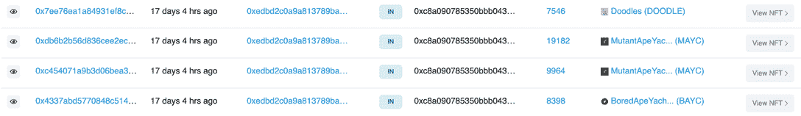
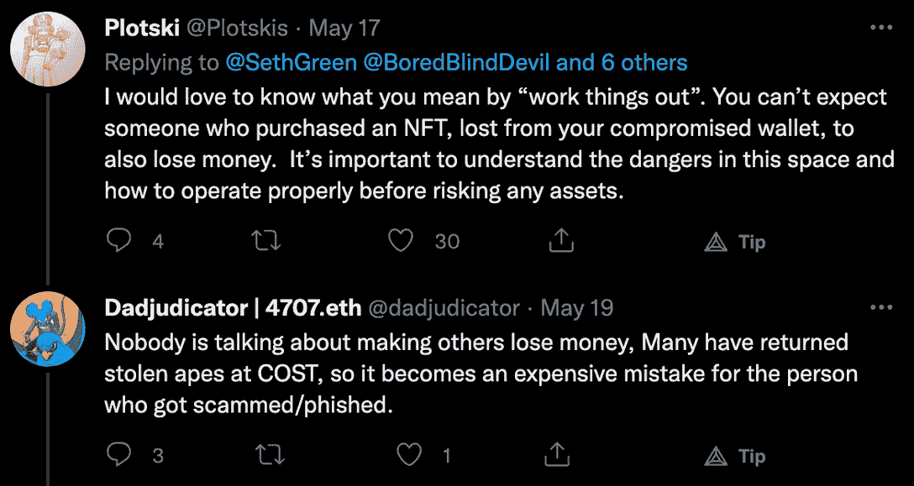
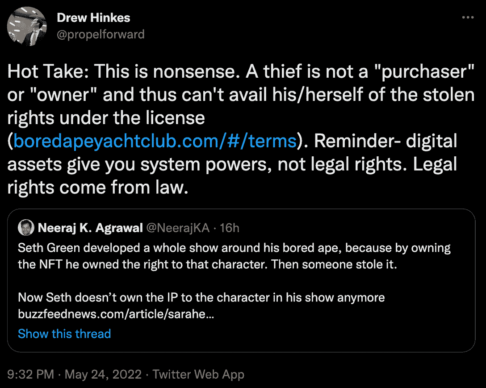
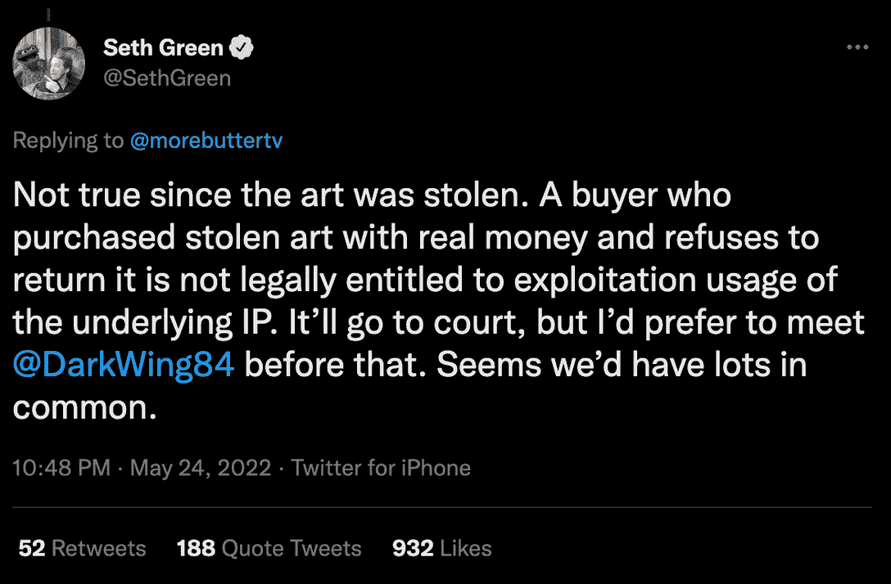
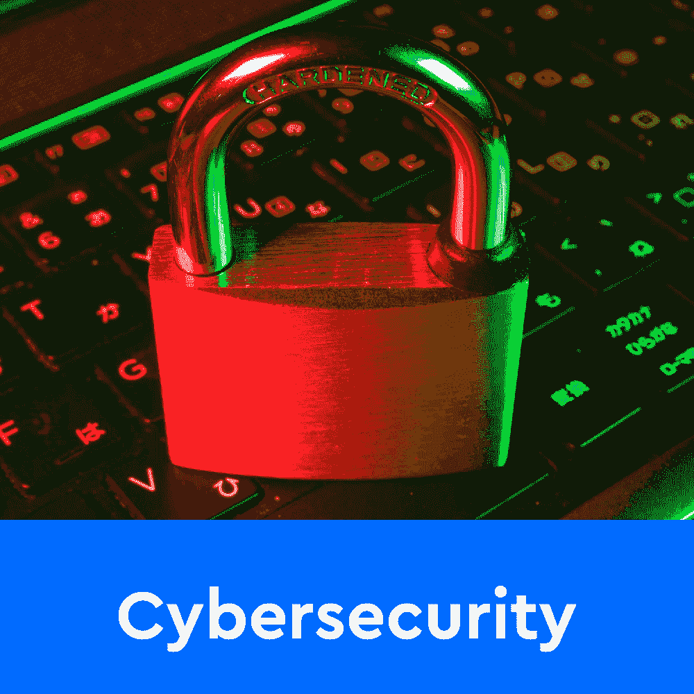
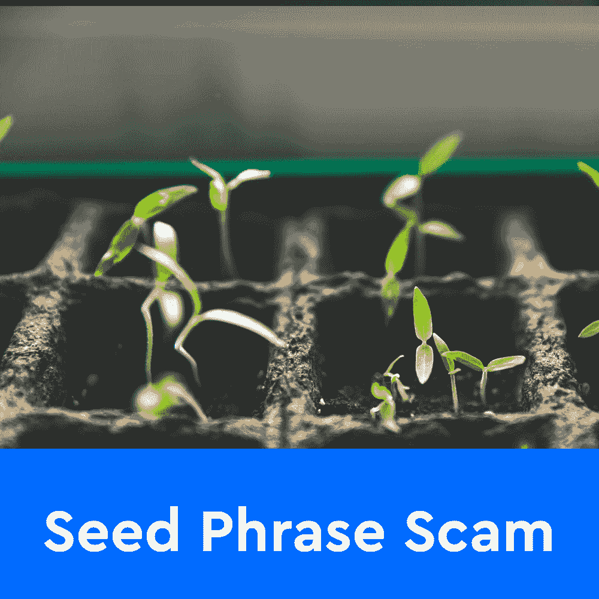

# 赛斯·格林在他无聊的猩猩被偷后暂停了电影制作

> 原文：<https://web.archive.org/web/https://dappradar.com/blog/seth-green-pauses-movie-production-after-his-bored-ape-got-stolen>

## BAYC #8398 应该是《白马酒馆》的主角

演员兼制片人赛斯·格林在被骗和失去他的无聊的猩猩#8398 后面临着一场严峻的斗争。NFT 本应在格林即将上映的作品《白马酒馆》中扮演重要角色。不幸的是，由于他不再是 NFT 的所有者，他也失去了知识产权，这意味着他不能免费使用这些图像。

## 总结:

*   赛斯·格林已经为“[白马酒馆](https://web.archive.org/web/20230210075621/https://dappradar.com/blog/seth-green-pauses-movie-production-after-his-bored-ape-got-stolen/#White)”工作了十个多月，BAYC #8398 是主角
*   不幸的是，[格林成了网络钓鱼骗局](https://web.archive.org/web/20230210075621/https://dappradar.com/blog/seth-green-pauses-movie-production-after-his-bored-ape-got-stolen/#scammed)的受害者。他失去了四个 NFT，包括即将上映的电影中的无聊猿
*   制片人现在面临着严峻的挑战。NFT 的新所有者没有回应他的聊天请求，以解决知识产权问题
*   一场关于所有权和法律程序的辩论在推特上引发，一些人说格林应该为自己的粗心负责

## 什么是“白马酒馆”项目？

赛斯·格林于去年 7 月加入了无聊猿游艇俱乐部大家庭。他收到了来自史蒂夫·青木的《无聊猿 8398 号》，并很快开始探索他的新 NFT 的知识产权。格林开始从事一项大制作，将 NFTs 的设计和艺术作品纳入他的作品集。

在最近发布的预告中，粉丝们可以看到 BAYC #8398 扮演了一个主要角色。猿猴扮演白马酒馆的酒保。预告视频还展示了来自其他系列的 NFT 客串，包括《猫友》、《天沟猫帮》和《朋友》。该片段还透露，加里·维本人也将在即将到来的制作中亮相。

> 。@SethGreen 他的新节目的新预告片，擦亮你的眼睛👀[@ BoredApeYC](https://web.archive.org/web/20230210075621/https://twitter.com/BoredApeYC?ref_src=twsrc%5Etfw)[@ GutterCatGang](https://web.archive.org/web/20230210075621/https://twitter.com/GutterCatGang?ref_src=twsrc%5Etfw)[@ vee friends](https://web.archive.org/web/20230210075621/https://twitter.com/veefriends?ref_src=twsrc%5Etfw)[pic.twitter.com/ZzYN87HYWA](https://web.archive.org/web/20230210075621/https://t.co/ZzYN87HYWA)
> 
> — FFVV1211.eth (@FFVV1211) [May 21, 2022](https://web.archive.org/web/20230210075621/https://twitter.com/FFVV1211/status/1528043201885442048?ref_src=twsrc%5Etfw)

## 赛斯·格林被骗了

在白马酒馆电影的制作过程中，赛斯·格林遇到了一个意想不到的障碍。他把自己的钱包连接到一个假的 Gutter Cat Gang 网站，被骗走了 4 个 NFT。格林失去了 BAYC #8398，两个 MAYC NFT，和涂鸦#7546。不幸的是，失去 BAYC #8398 意味着赛斯·格林不再拥有该设计的知识产权。这反过来意味着他不能再在白马酒馆使用 BAYC #8398。

这位演员兼制片人迅速转向 Twitter，试图与被盗 NFT 的新主人沟通。虽然这个钱包最初从[格林的钱包](https://web.archive.org/web/20230210075621/https://dappradar.com/hub/wallet/eth/0xedbd2c0a9a813789ba6f2ed5427f6c0bb9d2e906/nfts/1)中偷走了收藏品，但后来它以 106.5 ETH 的价格卖给了一个叫 [DarkWing84](https://web.archive.org/web/20230210075621/https://dappradar.com/hub/wallet/eth/0x94c8249a0cf419e5dd16526fda745c38f3a0ebea) 的用户。在撰写本文时，DarkWing84 尚未对赛斯·格林的主动接触做出回应。

因此，制片人现在正在寻找合法收回他的 NFT 的方法。然而，当涉及到盗窃时，监管不足的加密空间被证明是具有挑战性的。密码社区现在已经走到了一起，提出了关于这个主题的各种观点。

## 一场重要的法律辩论引发了

在赛斯·格林的痛苦经历和 BAYC #8398 失窃之后，许多 NFT 爱好者转向 Twitter 表达他们对此事的看法。虽然大多数用户都很有同情心并愿意分享，但一些人说这是格林缺乏个人安全和教育的主要例子。

其他用户指出，必须有一个合法的方法来解决这种情况，因为小偷不能被视为购买者或 BAYC #8398 的任何权利的所有者。

黑暗之翼是否会与赛斯·格林取得联系，在不诉诸法律的情况下解决问题，还有待观察。然而，如果这种情况没有发生，格林准备将此事诉诸法庭。

## 在加密中保持安全的一些有用的提示

赛斯·格林的案例只是另一个例子，说明知道如何在加密和 NFT 空间保持安全和保护你的资产是多么重要。查看以下有用的资源，了解保护您自己和您的加密钱包的最佳方法。

[<picture></picture>](https://web.archive.org/web/20230210075621/https://dappradar.com/blog/4-tips-on-blockchain-cybersecurity-stay-safe-in-crypto)[<picture></picture>](https://web.archive.org/web/20230210075621/https://dappradar.com/blog/store-your-crypto-nfts-safe-ledger-hardware-wallet)[<picture></picture>](https://web.archive.org/web/20230210075621/https://dappradar.com/blog/how-to-protect-yourself-from-seed-phrase-scam/)

达普拉达将继续关注 NFT 空间，为您带来最新的新闻和发展。如果你想密切关注你的投资组合，请使用 DappRadar 投资组合跟踪工具。此外，你可以在 [Twitter](https://web.archive.org/web/20230210075621/https://twitter.com/dappradar) 上关注 DappRadar，并首先获得所有加密和 NFT 更新。

 NewsletterUnsubscribe at any time. [T&Cs](https://web.archive.org/web/20230210075621/https://dappradar.com/terms) and [Privacy Policy](https://web.archive.org/web/20230210075621/https://dappradar.com/privacy-policy)