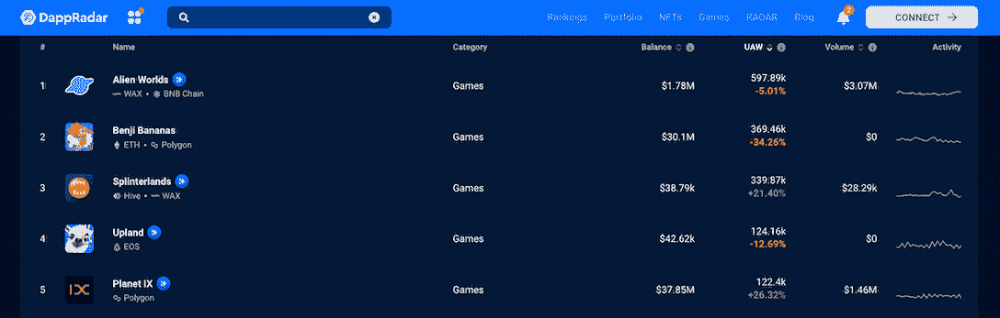
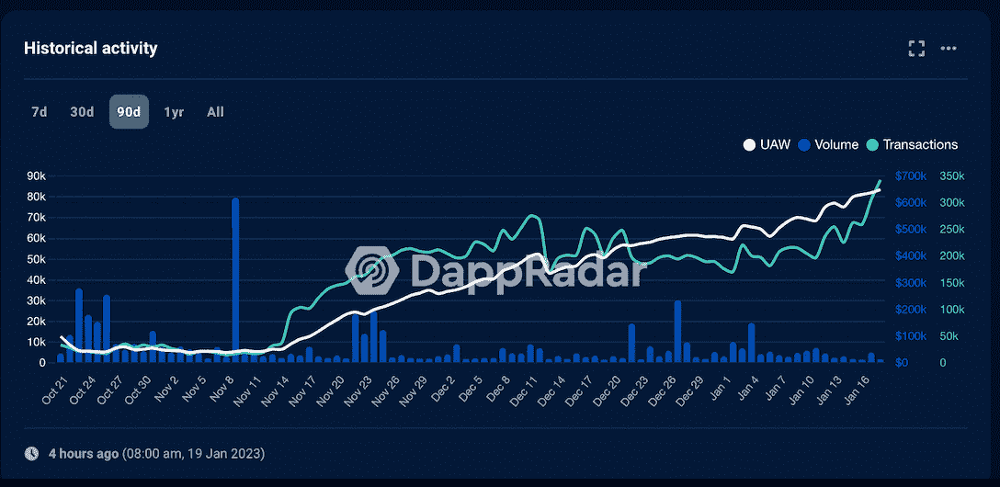
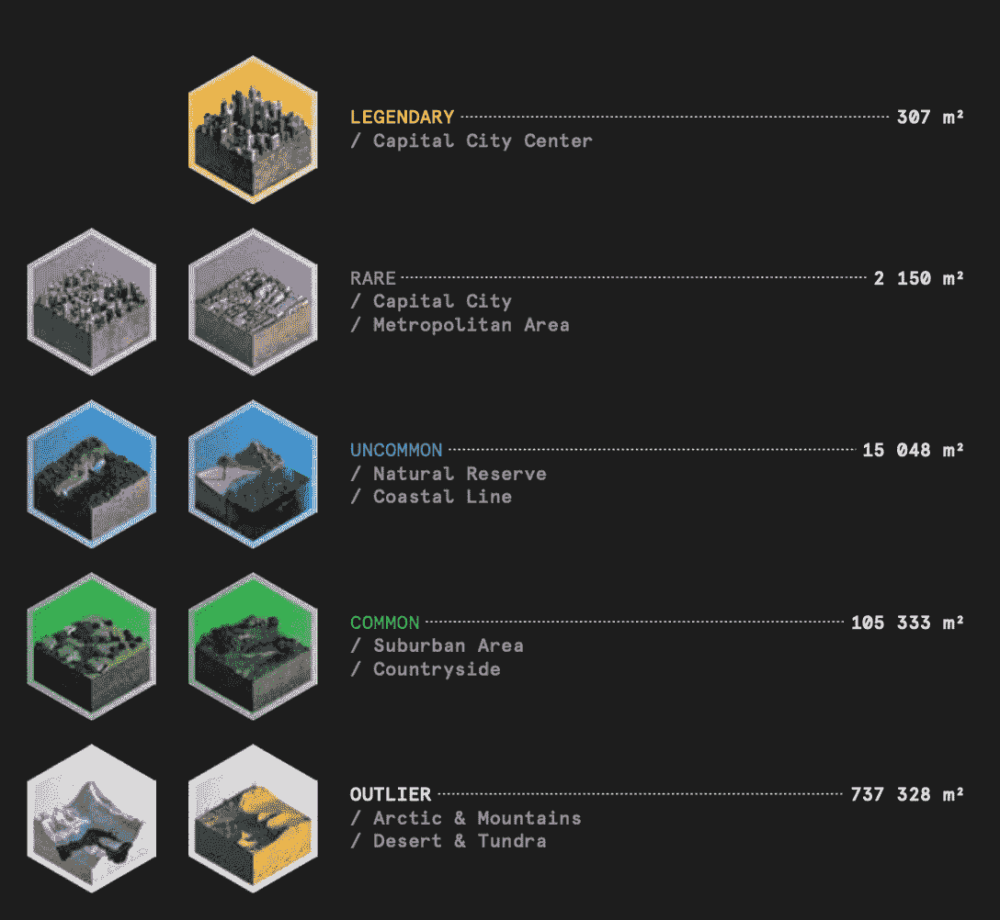
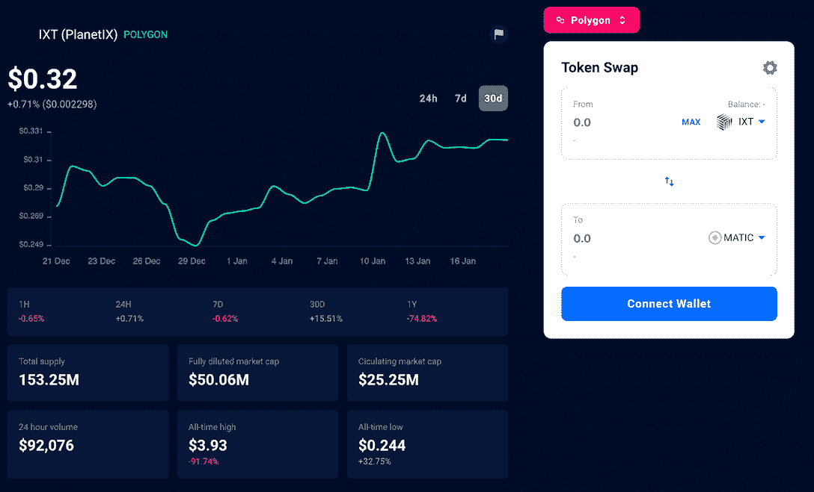
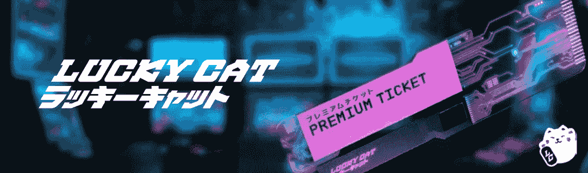
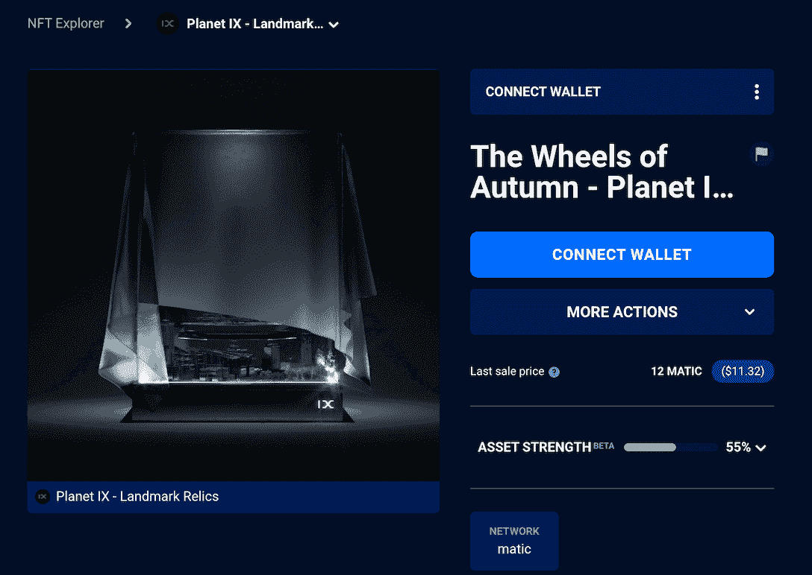
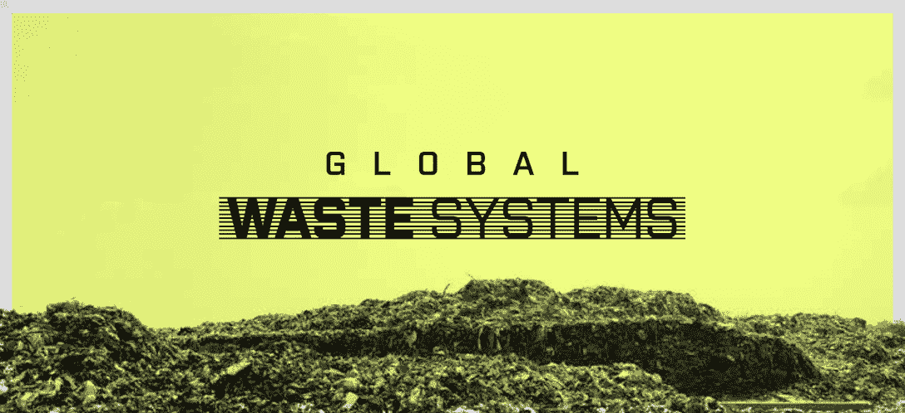
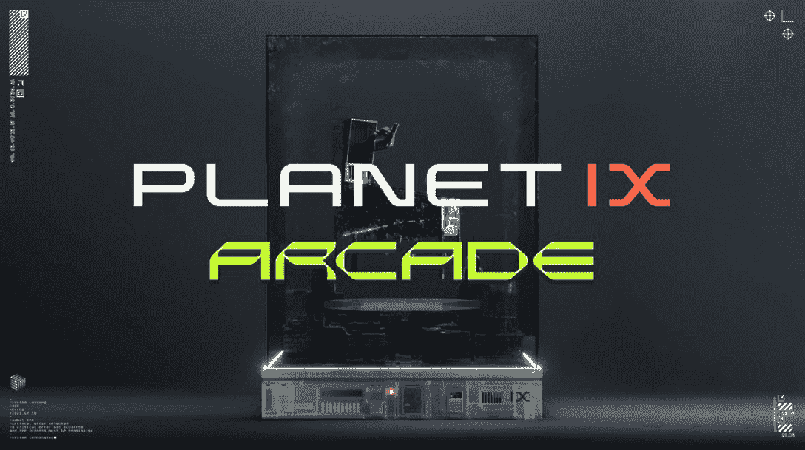
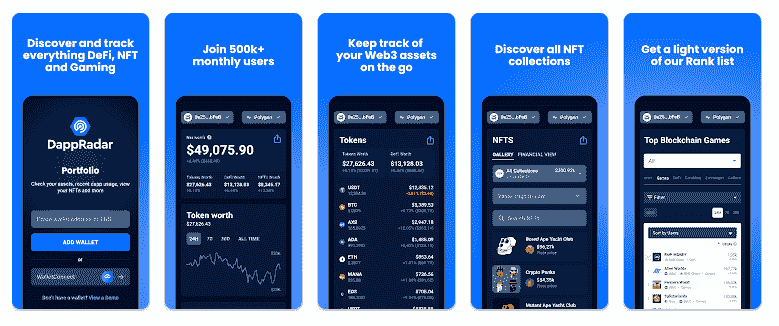

# 利用行星九提高商业和创业技能

> 原文：<https://web.archive.org/web/https://dappradar.com/blog/sharpen-business-and-entrepreneurial-skills-with-planet-ix>

## 获取 PIX，形成区域，收集废物并将其转化为宝贵的资源

《行星九号》是一款前 3 名的多边形游戏，以技能为中心的元素吸引了用户的注意力。坦率地说，行星九不具备简单的游戏性。但这正是这款游戏吸引人的地方，因为它邀请玩家考验他们的逻辑思维、企业家精神和管理技能，以超越竞争对手并获得丰厚的回报。在今天的文章中，我们将带给你一个清晰的画面，你需要的一切来搞定这个游戏。

**内容**

*   *[行星九有多受欢迎？](https://web.archive.org/web/20230124070613/https://dappradar.com/blog/sharpen-business-and-entrepreneurial-skills-with-planet-ix/#how)*
*   *[行星九是什么？](https://web.archive.org/web/20230124070613/https://dappradar.com/blog/sharpen-business-and-entrepreneurial-skills-with-planet-ix/#what-is)*
*   *[游戏内的基本资产有哪些？](https://web.archive.org/web/20230124070613/https://dappradar.com/blog/sharpen-business-and-entrepreneurial-skills-with-planet-ix/#what-are)*
    *   *[陆地 NFTs: PIX 和领地](https://web.archive.org/web/20230124070613/https://dappradar.com/blog/sharpen-business-and-entrepreneurial-skills-with-planet-ix/#land)*
    *   *[游戏内令牌:IXT](https://web.archive.org/web/20230124070613/https://dappradar.com/blog/sharpen-business-and-entrepreneurial-skills-with-planet-ix/#token)*
*   *[核心玩法讲解](https://web.archive.org/web/20230124070613/https://dappradar.com/blog/sharpen-business-and-entrepreneurial-skills-with-planet-ix/#core)*
*   *[最后，元共享](https://web.archive.org/web/20230124070613/https://dappradar.com/blog/sharpen-business-and-entrepreneurial-skills-with-planet-ix/#last)*
*   行星九的未来会怎样？

## 行星九有多受欢迎？

根据 DappRadar 的跟踪，Planet IX 在过去 30 天内有超过 122，000 个独特的活动钱包(UAW)与游戏互动，在所有游戏 dapps 中排名第五。这一数字比前 30 天增加了 26%以上。

看看下面的图表，由于对游戏玩法的一系列优化，这款游戏自去年 11 月以来进入了一波强劲的上升期。我们将在后面的章节中讨论它们。

[Check out more stats about Planet IX](https://web.archive.org/web/20230124070613/https://dappradar.com/polygon/games/planet-ix/)

没有刀片和子弹飞来飞去，但这并没有阻止行星九是一个深深吸引人的游戏。GameFi 和 DeFi 的结合，以及错综复杂的游戏内经济，让玩家在烧脑游戏中度过数小时，不计后果地探索未知。

这个游戏吊起你的胃口了吗？那我们现在就开始吧。

## 什么是行星九？

行星九是一个结合了 NFT、GameFi 和 DeFi 的战略游戏。游戏故事在一个没有生命、充满垃圾的星球上展开。玩家，或游戏中的变革代理人(AoC)，需要通过使用无人机、设施、能源、生物模型等来清理废物，使地球表面恢复活力。

最初的挑战是恢复地球的繁荣，让它再次适合居住。为此，玩家需要获得名为 PIX 的地块，并在其上建造其他资产。此外，游戏拥有 IXT 令牌来支持生态系统，并促进各种游戏内的交易和活动。

[Explore Planet IX](https://web.archive.org/web/20230124070613/https://dappradar.com/polygon/games/planet-ix/)

## 游戏内的基本资产有哪些？

在上一节中，我们已经触及了一点游戏内的资产，数字物品，以及在多边形区块链上创建的令牌。不同的游戏资产对游戏进度有不同的影响，增强游戏深度和可玩性。

值得注意的是，这些资产的持有者才是其真正的拥有者，即使是游戏的开发团队也无法将这些资产收回。另外，虽然是在游戏中产生的，但是这些资产是有经济价值的，是可以在玩家之间交易的。

### 土地 NFTs: PIX 和区域

行星 IX 由 16 亿个被称为 PIX 的六边形虚拟陆地组成。根据它们的位置和稀有程度，这些像素分为不同的类别和层次。

但是每张照片都是独一无二的 NFT。

然而，PIX 的单个地块本身并不是生产性资产。只有通过连接 PIX 来形成领土 NFT，玩家才能解锁更多的游戏机制来产生更多的奖励。例如，赌注领土可以给玩家带来 IXT(游戏内货币)的奖励。

有四种主要类型的区域 NFT:区域、部门、地带和领域，其中领域需要形成最多的总 PIX。

### 游戏内令牌 IXT

IX 代币(IXT)是游戏中的实用代币，玩家可以用它在行星 IX 市场购买 PIX。围绕 IXT，行星 IX 打造了一个强大的生态系统，由治理、奖励和赌注支撑；每个方面都是为了驱动行星九未来的可持续性和分散化。

说到治理，代币持有者将在塑造行星九的未来中扮演重要角色。通过链上投票机制，他们可以引导游戏的叙事，发展和成长。

IXT 形式的奖励有三种方式:作为完成游戏目标的奖励，通过在市场上出售 PIX，或者通过下注。

[根据 Polygonscan](https://web.archive.org/web/20230124070613/https://polygonscan.com/token/0xe06bd4f5aac8d0aa337d13ec88db6defc6eaeefe#tokenAnalytics) 的数据，IXT 由超过 200，000 个钱包地址持有，比活跃钱包的数量还多。这可能是因为有些用户不是游戏玩家，但他们看好游戏的生态系统并持有代币。

通过 DappRadar 的 Token Explore 工具，我们可以看到 IXT 价格在过去的一个月中一直呈上升趋势。单击下面的按钮转到 IXT 令牌页面，在这里您也可以直接交换令牌。

[View more stats about IXT](https://web.archive.org/web/20230124070613/https://dappradar.com/hub/token/polygon/IXT/MATIC?from=0xe06bd4f5aac8d0aa337d13ec88db6defc6eaeefe)

## 核心玩法讲解？

如果说简单地买卖和建设土地就足以吸引用户，这将是一个牵强的论点。考虑到这一点，行星九的强劲用户增长轨迹是由于它的创新游戏，其中土地管理只是基础层。除此之外，用户还需要参与一系列活动，比如清理垃圾、建设设施、整合资源等等。

值得注意的是，它们发生在与不同公司的互动中。

接下来，我们将通过介绍一些关键公司以及它们如何有机地融入游戏来揭示更多的游戏内 NFT。

### 重力等级

Grade 是星际快递公司，PIX 的一站式商店。包装投放是每周一次的投放，在这里 AoC 可以获得一批新的 PIX 到他们的库存中。这些包装有不同的尺寸，包含不同数量的 PIX。

例如，下面显示的一个标准递送大包包含 400 个稀有 PIX，价值 555 USDT。

### 招财猫

招财猫是一个允许 AOC 参与莱佛士的游戏内公司。在这些彩票中，中奖的彩票会获得具有里程碑意义的份额。Landmark 是一种 NFT，授予所有者赚取 PIX 交易费的权利。

市场费设定为 5%,根据 PIX 是否在地标区交易而有所不同。如果售出的 PIX 位于地标区域内，全部 5%的费用将由地标收取，并分配给该地标 NFT 的赌注者。

### 全球废物系统

全球废物系统(GWS)是一家变废为宝的公司。还记得玩家在行星九的任务之一是清理垃圾吗？他们可以把收集的垃圾带到 GWS 处理。该公司将废物转化为 Astro Credits，这是一种有价值的资产，可以帮助玩家升级他们的游戏体验。

### 拱廊

ArcadeNFT 是一个结合互动游戏和 NFT 收藏品的项目。它允许玩家参加 MMO PVE、PVP 和充满竞争元素的锦标赛，并因此获得奖励。目前，行星九和 ArcadeNFT 这两个项目已经合并，并在行星九生态系统内成立了 Arcade corporation。

这种合作关系将释放行星九在电子竞技和游戏方面的潜力。同时，它将为游戏开发者提供一个新的平台来实现他们的愿景。

[Explore Planet IX](https://web.archive.org/web/20230124070613/https://dappradar.com/polygon/games/planet-ix)

## 最后但同样重要的是，元共享

Planet IX 是一个以可伸缩性为核心的元宇宙平台。其独特的公司机制可以不断地给游戏添加新的玩法和元素，从而推动生态系统的扩张。Arcade 就是一个很好的例子，因为它使 Planet IX 能够提供电子竞技体验。

理论上，这个元宇宙平台还可以涉足其他领域，如教育、艺术、体育等。，如果其道成员认为有必要的话。

在这些结构之上，行星九还有另一个激励层。行星 IX 上的所有公司都有或将有元共享来促进公司治理。当玩家与公司互动时，例如，从 Gravity Grade 购买一个包，所有交易的一部分被分配给公司的金库。

元股持有者是这笔资金的受益者，就像任何传统公司的股东一样。

## 行星九的未来会怎样？

《行星九》的游戏设计就不用说了，精彩绝伦。其近期令人印象深刻的数据表现也印证了其魅力。那么，未来的九号行星会变成什么样呢？AOC 能让一个荒芜的星球复活吗？其他动物和生物会在陆地上出生吗？这些可能性正等待着所有的用户，因为 PlanetIX DAO 将带他们踏上探索之旅。

[Explore Planet IX](https://web.archive.org/web/20230124070613/https://dappradar.com/polygon/games/planet-ix)

## 随身携带您的 Web3 之旅

使用 DappRadar 移动应用程序，再也不会错过 Web3。查看最受欢迎的 dapps 的性能，并关注您投资组合中的 NFT。您在 DappRadar 上的帐户会与我们的移动应用程序同步，这样您很快就可以选择实时接收提醒。

[Download the DappRadar app now](https://web.archive.org/web/20230124070613/https://dappradar.app.link/blog)[<picture></picture>](https://web.archive.org/web/20230124070613/https://play.google.com/store/apps/details?id=com.portfolio.dappradar)